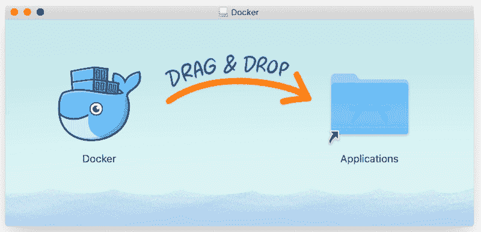
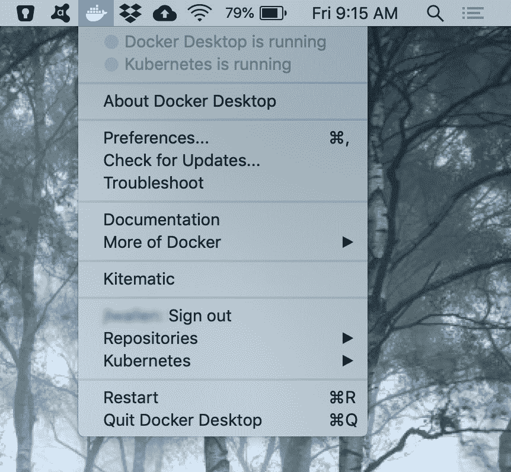
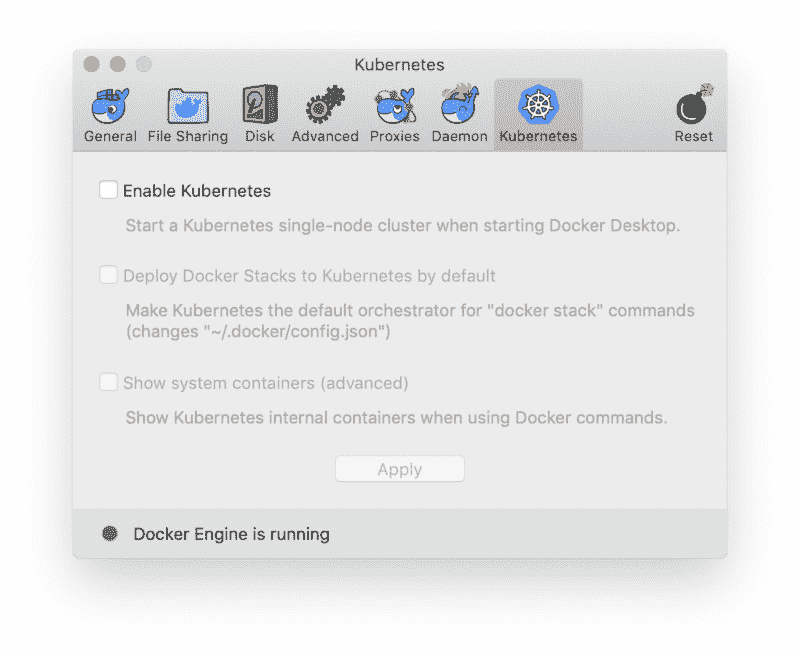
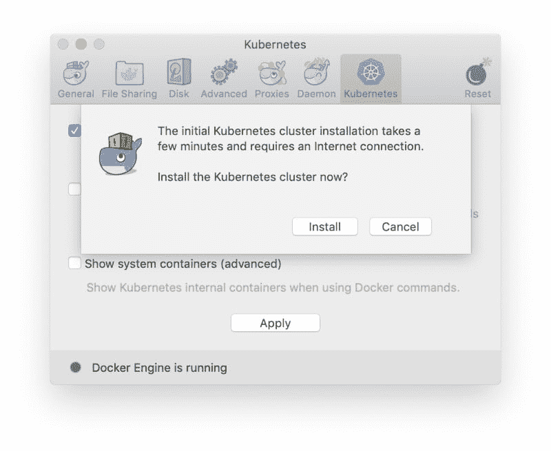
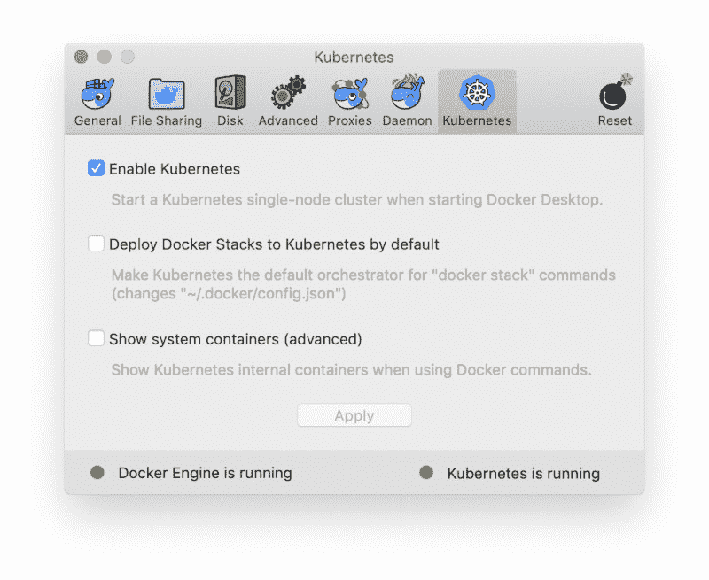
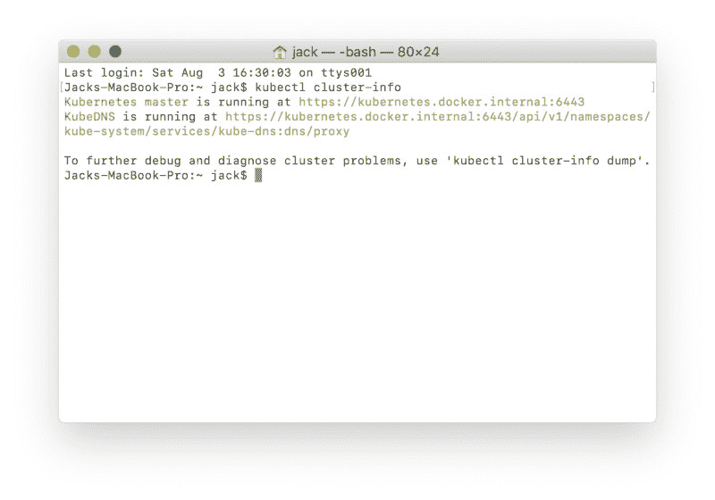
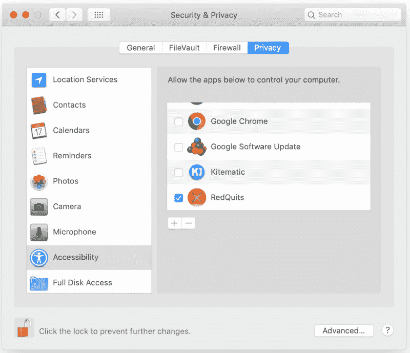
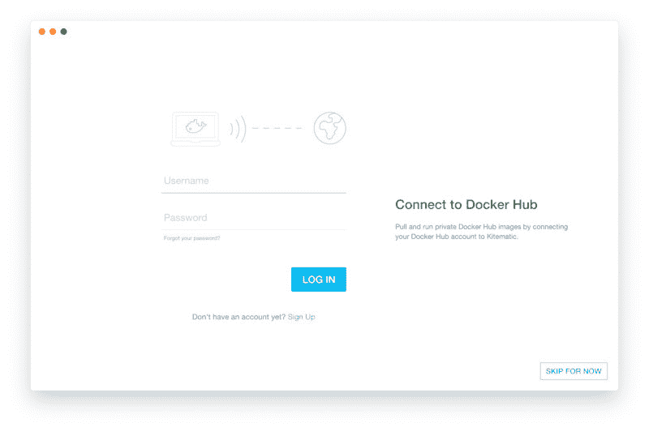
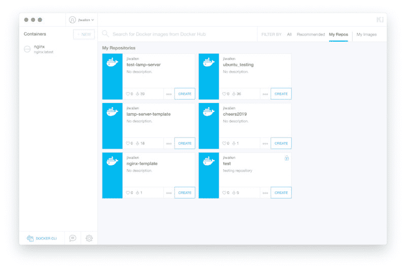

# 如何在 MacOS 上安装 Docker 桌面(带 Kubernetes)

> 原文：<https://thenewstack.io/how-to-install-docker-desktop-with-kubernetes-on-macos/>

尽管 Linux 可能是大多数企业级业务的基础，但它需要一个平台村来维持下去。苹果的 macOS 就是这样一个平台，通常被视为理想的开发者环境。它非常坚固，运行在市场上最好的硬件上，并且与外设和设备的集成是独一无二的。

但是对于许多 macOS 用户来说，安装 Docker 和 Kubernetes 的想法可能有点令人生畏。如果你曾经试图在 Linux 上安装 Kubernetes，你就会知道这不是一件简单的事情。但是 macOS 呢？安装这两个工具需要打开一个终端窗口并使用大量(有时很复杂)的命令吗？

你很幸运，因为有一个 macOS 图形用户界面专门用于这个目的。

多亏了 [Docker 桌面](https://www.docker.com/products/docker-desktop)的开发者，让 Docker 和 Kubernetes 在你选择的平台上运行变得异常简单。一旦安装完毕，你将可以快速访问 [Docker Hub](https://hub.docker.com/) 库，Docker 命令的完整补充，轻松安装 [Kitematic](https://kitematic.com/) (一个用于容器管理的 GUI)，甚至 [Kubernetes](https://thenewstack.io/category/kubernetes/) ，如果你想做一些测试或者只是学习 Kubernetes 是如何工作的。

下面我们来了解一下如何安装这个 macOS 容器开发者必备的工具。

## 装置

首先要做的是下载 Docker 桌面。dmg 文件。一旦该文件存储在您的驱动器上，打开 Finder 并导航到包含下载的文件夹。找到并双击 Docker.dmg 文件。当 Docker 窗口打开时(**图 A** ，点击 Docker 图标并将其拖至应用程序文件夹。

**图 A:** 将 Docker 桌面安装到 macOS。

一旦 Docker Desktop 安装完成，你会在顶部面板发现一个新图标。点击图标以显示 Docker 桌面菜单(**图 B** )。

**图 B:**Docker 桌面菜单。

现在，您可以安装更多的组件了。

### 安装 Kitematic

对于那些不喜欢完全依赖命令行的人来说，还有 Kitematic GUI。在安装 Kitematic 之前，必须先安装 Git。为了安装 Git，下载[安装程序](https://git-scm.com/download/mac)。下载完成后，打开 Finder，导航到包含该文件的文件夹，连按安装程序，然后按照简单易懂的说明进行操作。

一旦安装了 Git，就可以安装 Kitematic 了。虽然 Docker 桌面菜单中有一个 Kitematic 安装的条目，但是不要使用它，因为它不会导致成功的安装。而是从 [GitHub](https://github.com/docker/kitematic/releases) 下载最新版本的 Kitematic。下载该文件后，打开 Finder，导航到包含该文件的文件夹，连按安装程序，然后按照简单的说明进行操作。

此时，确保单击 Docker 桌面图标并单击登录条目。使用您的 Docker Hub 帐户凭证将 Docker Desktop 链接到您的存储库。

### 安装 Kubernetes

下一步，我们将为 Docker 桌面安装 Kubernetes 支持。为此，单击 Docker 桌面图标并选择首选项。在出现的窗口中(**图 C** ，点击 Kubernetes 选项卡。

**图 C:**Docker 桌面偏好设置窗口的 Kubernetes 标签。

点按与“启用 Kubernetes”相关联的复选框您还可以选择启用 Kubernetes 作为 Docker 栈和 show 系统容器的默认部署者。点击“应用”，将出现一个弹出窗口，通知您安装需要网络连接，需要一些时间(**图 D** )。

你已经被警告了。

单击安装，安装将开始并完成。一旦安装完成，您应该看到 Docker 引擎和 Kubernetes 都在运行(**图 E** )。

**图 E:** 两个系统都准备好了。

在我们继续之前，让我们进行测试以确保 Kubernetes 已经启动并运行。打开终端窗口，发出命令:

该命令将报告 Kubernetes 主机和 KubeDNS 都在运行(**图 F** )。

**图 F:** Kubernetes 启动并运行。

## 使用 Docker 桌面

这就是让人有点困惑的地方。你实际上并没有使用 Docker 桌面来处理你的容器。Docker Desktop 让您可以轻松访问允许您开发和部署容器的工具。例如，你现在可以打开一个终端窗口，像在 Linux 上一样使用 *docker* 命令。您可以下拉图像、修改图像、推送图像、部署容器等等。

或者，你可以选择与 Kitematic 合作。要打开 Kitematic，单击 Docker 桌面图标，然后单击 Kitematic。当您第一次运行该工具时，您需要为其提供辅助功能权限。在安全与隐私窗口(**图 G** )中，确保点击与 Kitematic 相关的复选框。

**图 G:** 给予 Kitematic 运行所需的特权。

GUI 将打开，请求您的 Docker Hub 凭证(**图 H** )。

**图 H:**kite matic 登录窗口。

登录后，您将看到一个选项卡，其中包含您的存储库(**图一**)，以及您的图像、推荐的图像等。

**图一:** Kitematic 准备上菜。

现在，您可以开始使用图像和部署容器，所有这些都可以通过一个方便的 GUI 工具来完成。下载您想要使用的映像，修改它以满足您的需求并进行部署。

至于 Kubernetes，都是通过命令行处理的，除非你安装了第三方工具(比如 [Kubernetic](https://kubernetic.com/) )。好消息是，既然你已经在 Mac 上运行了 Kubernetes，那么困难的部分就解决了。只需安装一个第三方 GUI 工具，就可以开始使用 Kubernetes 实例了。有了 Kubernetic 这样的工具，您可以轻松地创建 pod、服务、入口、部署等等，而无需打开终端窗口。当然，如果你对学习 Docker 和 Kubernetes 是*认真的*，你可能也应该熟悉命令行。

## Easy Docker 和 Kubernetes

多亏了 Docker Desktop，让 Docker 和 Kubernetes 都在你的 Mac 上运行并不一定是入门的障碍。有了这个方便的工具，您可以开始使用市场上最重要的两个技术构建模块。

<svg xmlns:xlink="http://www.w3.org/1999/xlink" viewBox="0 0 68 31" version="1.1"><title>Group</title> <desc>Created with Sketch.</desc></svg>