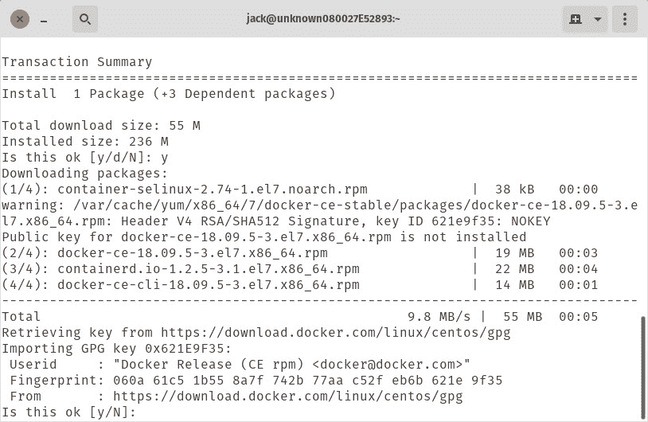
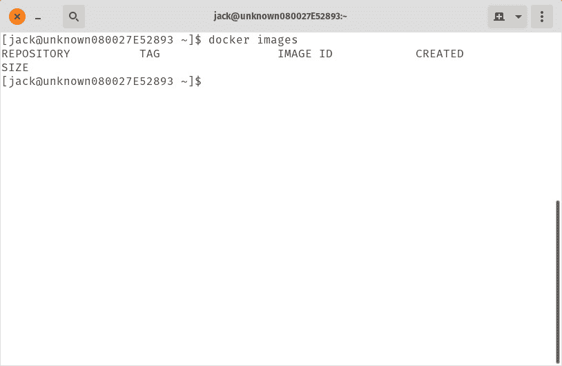

# 如何在 Ubuntu 和 CentOS 上安装 Docker

> 原文：<https://thenewstack.io/how-to-install-docker-on-ubuntu-and-centos/>

容器已经嵌入到 IT 领域中。事实上，应用程序和服务的容器化使得企业变得比以前更加敏捷成为可能。

谁不想让自己的公司更加灵活呢？

但是什么是容器呢？容器是一种将软件打包成小型独立软件包的方式，这些软件包包括软件运行所需的所有库和设置，就像通过标准方法安装一样。例如，如果您想要部署一个 [NGINX](https://www.nginx.com/) 服务器，而不是在标准或虚拟硬件上安装服务器及其所有依赖项，您可以简单地提取 NGINX 映像并基于该映像部署一个容器。几秒钟后，你就可以使用 NGINX web 服务器了。

您可能会想，“为什么不直接使用虚拟机呢？”与虚拟机不同，容器不需要成熟的操作系统来运行。事实上，容器是平台中立的。只要您有一个支持您的容器的系统，就可以部署它。更好的是，容器总是以相同的方式运行，不管它们部署在什么平台上。

但是用什么来部署容器呢？一个系统是[码头工人](https://www.docker.com/)。Docker 是推出容器化软件最简单的工具之一。它是免费的，可以在大多数平台上安装。

## 容器的优点是什么？

使用容器的优势(相对于传统方法或虚拟机)有很多。以下是几个例子:

*   快速部署:通过从 [Docker Hub](https://hub.docker.com/) 下载的映像，您可以用一个命令快速部署一个容器。
*   创建一个，部署多个:您可以从单个映像创建任意多个容器。
*   更少的开销:容器比传统方法需要更少的系统资源。
*   可移植性:作为容器运行的应用程序可以部署到不同的操作系统和硬件平台上。
*   更容易的应用程序开发:根据设计，容器支持敏捷开发周期。
*   近乎即时启动:容器几乎可以即时启动，而虚拟机可能需要一段时间才能启动。
*   模块化:复杂的应用程序可以分解成模块，比如数据库、web 服务器和前端。

现在您对什么是容器以及为什么应该使用容器有了更多的了解，让我们来看看如何在两个最流行的开源服务器操作系统上安装 Docker， [Ubuntu Server](https://www.ubuntu.com/download/server) (版本 18.04)和 [CentOS 7](https://www.centos.org/download/) 。

## 在 CentOS 7 上安装 Docker

首先，我们将在 CentOS 7 上安装 Docker CE(社区版)。安装是通过命令行完成的，所以登录 CentOS 7 服务器，准备输入。

第一步是为 Docker 安装任何必要的依赖项。为此，发出以下命令:

```
sudo yum install  -y  yum-utils device-mapper-persistent-data lvm2

```

该命令完成后，您需要使用命令添加 docker-ce 存储库:

```
sudo yum-config-manager  --add-repo https://download.docker.com/linux/centos/docker-ce.repo

```

存储库就绪后，使用命令安装 docker-ce:

```
sudo yum install docker-ce

```

您将被要求确认安装(及其 GPG 密钥的导入——图 A)。

[](https://cdn.thenewstack.io/media/2019/04/33eddba1-docker_a.jpg)

图 A

完成后，您需要将您的用户添加到 Docker 组。如果跳过这一步，您将只能使用 sudo 运行 Docker 命令，这是一个安全风险。要将您的用户添加到 Docker 组，发出命令:

```
sudo usermod  -aG docker  $(whoami)

```

退出 CentOS 7 并重新登录，以使更改生效。

最后，您需要启动 Docker 守护进程并启用它，这样它将在系统引导时启动。这可以通过以下两个命令来完成:

```
sudo systemctl enable docker

sudo systemctl start docker

```

如果您发出命令 *docker images* (该命令列出了系统中找到的任何可用映像)，您不仅会看到 docker 正在工作，而且当前没有可用的映像(图 B)。

[](https://cdn.thenewstack.io/media/2019/04/d6f923b6-docker_b.jpg)

docker_b.jpg

Docker 已启动并运行，但不包含任何图像。

如果您想从 Docker Hub 获取 NGINX 映像，发出命令:

再次发出 *docker images* 命令，您将看到新提取的图像可用(图 C)。

[](https://cdn.thenewstack.io/media/2019/04/2e84285c-docker_c.jpg)

图 C

NGINX 映像已经可以用于容器部署了。

## 在 Ubuntu Server 18.04 上安装 Docker

在 Ubuntu 服务器上安装 Docker 实际上要简单得多。因为 Docker 可以在标准库中找到，所以您所要做的就是登录到您的 Ubuntu 服务器并发出命令:

```
sudo apt-get install docker.io  -y

```

以上命令将安装 Docker 运行所需的所有依赖项。完成后，使用命令启用并启动 docker 服务:

```
sudo systemctl enable docker

sudo systemctl start docker

```

最后，使用命令将自己添加到 docker 组:

```
sudo usermod  -aG docker  $(whoami)

```

注销服务器，然后重新登录。现在，您可以像在 CentOS 7 上一样发出相同的命令。使用命令列出可用图像:

不出所料，您将看不到任何列出的图像(图 D)。

[](https://cdn.thenewstack.io/media/2019/04/7e8c2677-docker_d.jpg)

图 D

Ubuntu 服务器上还没有可用的图像。

使用命令
下拉 NGINX 图像

一旦图像下载完毕，再次发出 docker images 命令，查看其列表(图 E)。

[](https://cdn.thenewstack.io/media/2019/04/aaab0ab0-docker_e.jpg)

图 E

Ubuntu 服务器上可用的 NGINX 图像。

## 结论

这就是在 CentOS 7 和 Ubuntu Server 18.04 上安装 Docker 的方法。在本系列的下一次安装中，我们将学习如何使用来自 Docker Hub 的 NGINX 映像部署容器。

<svg xmlns:xlink="http://www.w3.org/1999/xlink" viewBox="0 0 68 31" version="1.1"><title>Group</title> <desc>Created with Sketch.</desc></svg>