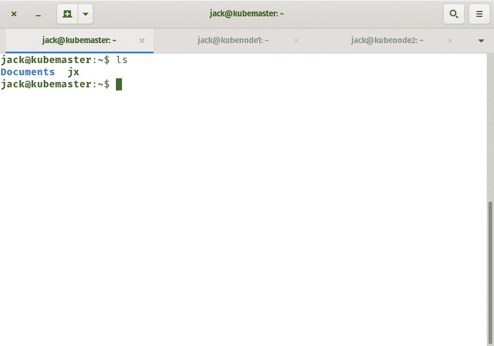
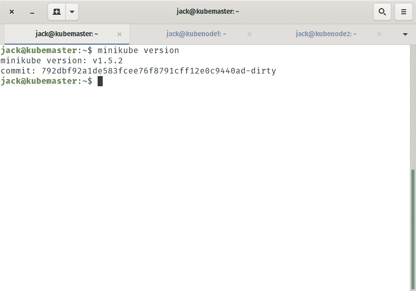
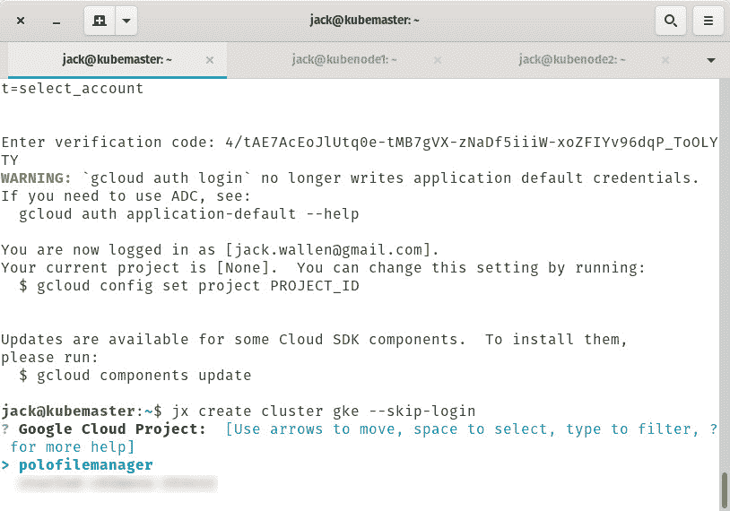
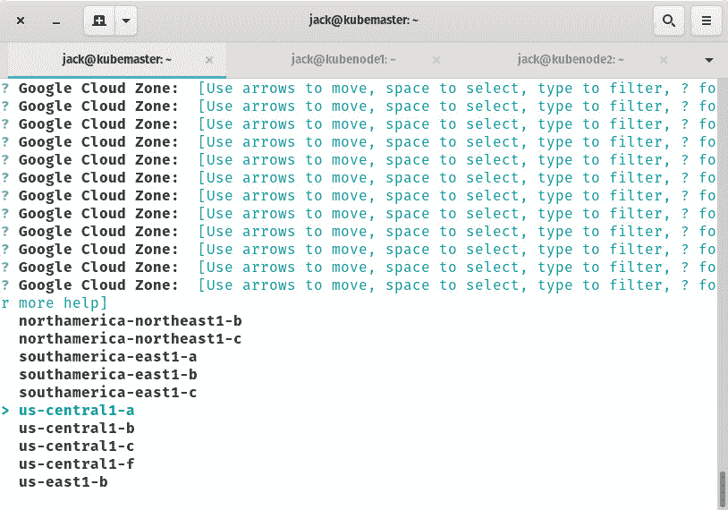

# 如何在现有的 Kubernetes 集群上安装 Jenkins X

> 原文：<https://thenewstack.io/how-to-install-jenkins-x-on-an-existing-kubernetes-cluster/>

Jenkins X 于 2018 年首次发布，由 Apache Groovy 语言的创造者 [James Strachan](https://github.com/jstrachan) 创建。目前由 CloudBees 管理，该工具的目的是成为一个云原生的 Kubernetes 应用程序，以支持 CI/CD 并简化 Kubernetes 部署。只需一个 Jenkins X 命令，管理员就可以创建一个 Kubernetes 集群，安装管理应用程序所需的工具，创建管道，并将应用程序部署到各种环境中。

Jenkins X 也是一个可扩展的自动化服务器，由插件配置，作为持续集成(CI)服务器、持续部署(CD)中心和自动化测试。

Jenkins X(也称为 JX)很容易安装在现有的云提供商上(如用于 Kubernetes 的亚马逊弹性容器服务、谷歌 Kubernetes 引擎或微软 Azure Kubernetes 服务)。或者，如果您有一个内部 Kubernetes 集群，您也可以利用 Jenkins X。通过 jx 命令，您可以快速地在本地部署集群或部署到远程云提供商(如 Google 云平台)。

我将向您介绍在现有的 Kubernetes 集群上安装 Jenkins X 的过程，该集群运行在 Ubuntu Server 18.04 上。

## 你需要什么

我将演示在本地和 Google 云平台上部署 Kubernetes 集群(使用 Jenkins X)。为此，您需要:

*   安装了 Kubernetes 的 Ubuntu Server 的运行实例。
*   一个谷歌云平台账号。
*   拥有 sudo 权限的用户。
*   网络连接。

除此之外，就一点时间。

让我们让事情发生。

## 安装 Jenkins X

在 Ubuntu 上安装 Jenkins X 其实挺简单的。可执行二进制文件可以从官方的 [Jenkins X GitHub 页面](https://github.com/jenkins-x/)下载，然后移动到正确的目录。为此，要么通过 SSH 登录到您的服务器，要么直接登录到控制台。一旦您的服务器出现 bash 提示符，发出命令:

```
curl  -L  "https://github.com/jenkins-x/jx/releases/download/$(curl --silent "https://github.com/jenkins-x/jx/releases/latest" | sed 's#.*tag/\(.*\)\".*#\1#')/jx-linux-amd64.tar.gz" | tar xzv "jx"

```

上面的命令会下载 Jenkins X 的最新版本，然后解包二进制。一旦命令完成，您应该在当前工作目录中看到一个可执行文件，名为 *jx* ( **图 1** )。



图 1:准备重新定位的 jx 二进制文件。

要移动 Jenkins X 二进制文件，发出命令:

```
sudo mv jx  /usr/local/bin

```

如果您选择使用虚拟机环境部署集群，您也必须安装虚拟机环境。为此，您可以随时安装 KVM、KVM-2 或 VirtualBox。为了简化这一过程，我们将安装 VirtualBox。这确实安装了一个 X 服务器，但是你不必使用它。

为了安装 VirtualBox，发出命令:

```
sudo apt-get install virtualbox  -y

```

这个安装需要一些时间。让它结束。接下来，你需要在你的 Ubuntu 服务器上安装 minikube(因为那将是我们的提供商)。为此，使用命令
下载必要的文件

```
wget https://storage.googleapis.com/minikube/releases/latest/minikube-linux-amd64

```

使用
命令更改下载文件的权限

```
chmod  +x  minikube-linux-amd64

```

使用命令:
将文件移动(并重命名)到适当的目录中

```
sudo mv minikube-linux-amd64  /usr/local/bin/minikube

```

您应该看到 minikube 现在已经用命令安装好了:

输出将显示 minikube 的发布号(**图 2** )。



图 2: Minikube 已经安装完毕，可以使用了。

### 使用 jx 命令部署集群

我们现在将部署一个群集。群集将使用 minikube 提供程序和 VirtualBox 作为驱动程序。部署集群的命令是:

```
jx create cluster minikube

```

您将会被问到以下问题:

*   应用于群集的内存量(默认值为 4096)。
*   应用于群集的核心数(默认值为 3)。
*   磁盘大小(默认为 150GB)。
*   选择驱动程序(从 kvm、kvm2、virtualbox、none 中选择)。

如果您选择以下选项:

*   内存 4096
*   核心 3
*   磁盘大小 20GB
*   驱动 virtualbox

有效的命令应该是:

```
minikube start  --memory  4096  --cpus  3  --disk-size  20GB  --vm-driver virtualbox  --bootstrapper=kubeadm

```

您还可以在不使用驱动程序的情况下在本地环境中部署集群(选择 *none* 选项)。为此，您必须使用 sudo 运行 jx 命令，如下所示:

```
sudo jx create cluster minikube  --local-cloud-environment=true

```

实际上，将要运行的命令是:

```
minikube start  --memory  4096  --cpus  3  --disk-size  20GB  --vm-driver none  --bootstrapper=kubeadm

```

*JX*命令将负责提取所有必要的映像并部署已配置的集群。

### 部署到谷歌云

假设您想要将您的集群部署到 Google 云平台。詹金斯 X 也使这成为可能。在此之前，您必须先安装 gcloud 应用程序。为此，返回到您的终端窗口，用命令下载源文件:

```
wget https://dl.google.com/dl/cloudsdk/channels/rapid/downloads/google-cloud-sdk-265.0.0-linux-x86_64.tar.gz

```

使用以下命令解压文件:

```
tar  -zxf google-cloud-sdk-*

```

使用命令:
切换到新创建的目录

最后，使用命令运行安装程序:

一旦你解决了这个问题，用下面的命令更新所有的 g cloud:

最后，您必须使用以下命令登录您的 Google 云平台帐户:

将打印出一个链接。在浏览器中打开那个链接，选择你想要使用的谷歌账户，然后复制你得到的验证码。将代码粘贴到命令提示符下，然后按 Enter 键。您现在登录到您的 Google 云平台帐户，可以发出命令:

```
jx create cluster gke  --skip-login

```

出现提示时，请确保选择您希望使用的谷歌云项目(**图 3** )。



图 3:选择一个谷歌云项目。

一旦你做出选择并按下回车键，你将被提示选择一个区域(**图 4** )。



图 4:为您的集群选择一个区域。

接下来，将询问您 Jenkins 安装类型(从带有 Tekton 的无服务器 Jenkins X 管道或带有 Jenkinsfiles 的静态 Jenks 服务器中选择)。请注意，使用 tekton 时，仅支持 kaniko 作为构建器。

然后你必须输入一个名字和电子邮件地址来使用 git，然后为你的 GitHub 帐户获取必要的 API 密匙。就是这样。集群将会部署并准备好为您工作。

这就是在现有的 Kubernetes 集群上安装和使用 Jenkins X 的要点。这个工具能做的事情太多了，所以我强烈推荐浏览一下官方文档。

<svg xmlns:xlink="http://www.w3.org/1999/xlink" viewBox="0 0 68 31" version="1.1"><title>Group</title> <desc>Created with Sketch.</desc></svg>