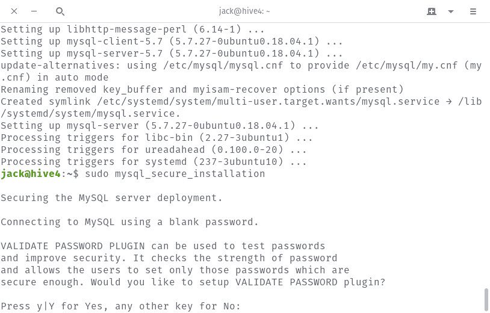
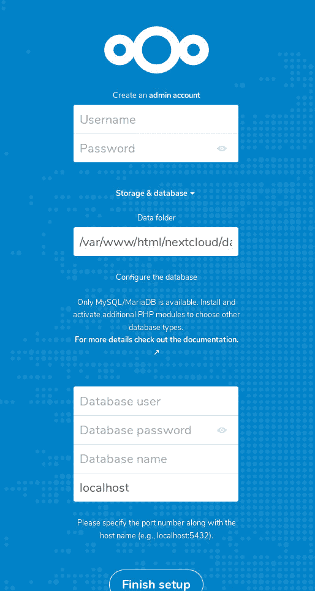
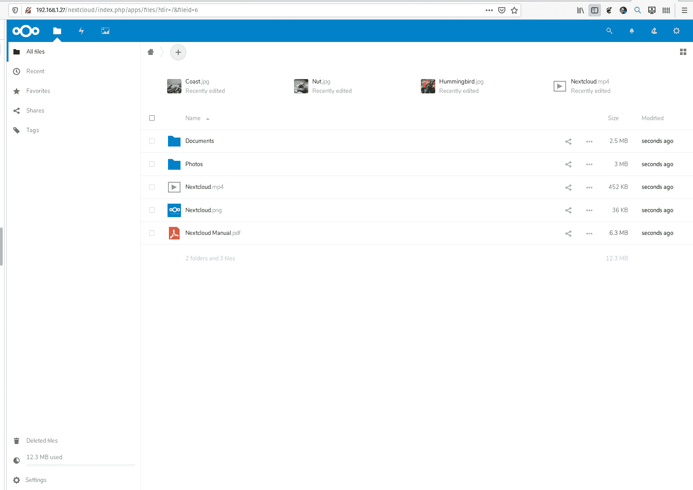

# 如何在 Ubuntu Server 18.04 上安装 Nextcloud 16

> 原文：<https://thenewstack.io/how-to-install-nextcloud-16-on-ubuntu-server-18-04/>

[Nextcloud](https://nextcloud.com/) 是市场上最强大、最灵活、最用户友好的内部云服务器之一。借助该平台，您可以获得企业级文件同步和共享、行业安全最佳实践、无缝协作、合规性就绪监控、跟踪更改(针对用户文件)、工作流管理、可访问性、安全在线会议、团队规划、GitHub 合并跟踪、大量可安装应用程序来扩展所提供的服务，等等。

所有这些都可以免费获得，并托管在您自己的 Linux 服务器上。这意味着私有云并不像您想象的那样遥不可及。

我想带你了解一下在 Ubuntu Server 18.04 平台上安装当前最新稳定版 next cloud(16 版)的过程。安装只需要几分钟时间，就可以启动并运行一个功能齐全的私有云服务器。

## 你需要什么

除了一些依赖项之外，安装 Nextcloud 几乎没什么需要。我要提醒你的是，我演示的是仅在内部局域网上安装 Nextcloud。为了通过 WAN 实现这一点，您还需要一个域和(可选的)一个 CA 证书(为了利用 SSL)。为了简单起见，我们将安装供内部使用的基本 Nextcloud。

为了做到这一点，您需要以下内容:

*   Ubuntu Server 18.04 的运行实例。
*   拥有 sudo 权限的用户帐户。

满足这些要求后，让我们安装。

## 更新/升级 Ubuntu

我们要做的第一件事是更新服务器。记住，在这个过程中内核可能会被更新。如果发生这种情况，您需要重新启动服务器。因此，最好在可能重启时运行更新/升级。

要更新/升级 Ubuntu，打开终端窗口并发出以下两个命令:

```
sudo apt-get update
sudo apt-get upgrade  -y

```

升级完成后，重启(如果需要)并继续。

## 安装依赖项

首先要做的是安装必要的依赖项。我们将在 Apache 和 MySQL 上安装 Nextcloud。您可以使用 NGINX 和 MariaDB 进行安装，但是我的偏好(至少在这个实例中)是使用 Apache/MySQL 组合。首先用下面的命令安装 Apache、PHP 和其他一些依赖项:

```
sudo apt-get install apache2 php7.2  bzip2 unzip  -y
sudo apt-get install libapache2-mod-php php-gd php-json php-mysql php-curl php-mbstring  -y
sudo apt-get install php-intl php-imagick php-xml php-zip  -y

```

接下来，用命令安装 MySQL:

```
sudo apt-get install mysql-server  -y

```

就是这样，依赖关系就不碍事了。

## 创建数据库

接下来，我们将创建必要的数据库。在此之前，我们必须使用以下命令保护 MySQL 安装:

```
sudo mysql_secure_installation

```

首先会询问您是否要使用验证密码插件(**图 1** )。这个插件只允许使用强密码，所以任何要求 MySQL 安装更高安全性的人都可以通过在提示时键入“y”(没有引号)来启用这个插件。

**图 1**



验证密码插件选项。

接下来，您将被要求设置 root 密码。确保为 MySQL root 用户使用一个强而唯一的密码，因为您不想让它对可能的黑客攻击敞开大门。之后，对剩下的问题回答“y”。一旦*MySQL _ secure _ installation*命令完成，就该创建我们的数据库了。使用命令
登录 MySQL

出现提示时，输入您在*MySQL _ secure _ installation*过程中设置的密码。在 MySQL 提示符下，键入以下命令:

```
CREATE DATABASE nextcloud;
CREATE USER  'nextcloud'@'localhost'  IDENTIFIED BY  'PASSWORD';
GRANT ALL PRIVILEGES ON nextcloud.*  TO  'nextcloud'@'localhost';
FLUSH PRIVILEGES;
exit

```

其中 PASSWORD 是一个强的、唯一的密码。

## 下载并解压缩 Nextcloud

现在我们可以下载并提取官方的 Nextcloud 文件。使用命令
下载最新版本

```
wget https://download.nextcloud.com/server/releases/latest.zip

```

用下面命令解压文件:

这将创建一个名为 *nextcloud* 的新目录。我们需要使用命令:
将该目录移动到 Apache 文档根目录中

```
sudo mv nextcloud  /var/www/html/

```

使用命令赋予目录适当的所有权:

```
sudo chown  -R  www-data:www-data  /var/www/html/nextcloud

```

## 配置 Apache

接下来，我们必须为 Nextcloud 创建一个新的虚拟主机文件。用命令创建这个新文件:

```
sudo nano  /etc/apache2/sites-available/nextcloud.conf

```

在新文件中粘贴以下内容:

```
Alias  /nextcloud  "/var/www/html/nextcloud/"
&lt;Directory  /var/www/html/nextcloud/&gt;
      Options  +FollowSymlinks
     AllowOverride All
       &lt;IfModule mod_dav.c&gt;
         Dav off
       &lt;/IfModule&gt;

      SetEnv HOME  /var/www/html/nextcloud
    SetEnv HTTP_HOME  /var/www/html/nextcloud
&lt;/Directory&gt;

```

保存并关闭新文件。

通过发出以下命令启用新的 Nextcloud 站点(以及必要的 Apache 模块):

```
sudo a2ensite nextcloud
sudo a2enmod rewrite headers env dir mime

```

最后，用下面的命令重启 Apache:

```
sudo systemctl restart apache2

```

## 完成安装

现在，安装的命令行部分已经完成，是时候启动一个浏览器(可以访问您的局域网的浏览器)并将其指向 http://SERVER_IP/nextcloud(其中 SERVER_IP 是托管 nextcloud 的服务器的 IP 地址)。您应该看到一个屏幕，要求您输入数据库的信息，并创建一个管理员用户(**图 2** )。

**图 2**



Nextcloud 安装的基于 web 的部分。

使用 MySQL 数据库创建过程中使用的信息填写所有必需的数据库选项，然后单击 Finish Setup。完成后，您将被自动带到 Nextcloud 主窗口(以新创建的管理员用户身份登录— **图 3** )。

**图 3**



Nextcloud 主页，准备工作。

恭喜您，您现在已经安装了一个正常工作的 Nextcloud 16。您的内部云服务器已经准备就绪。此时，您可能希望单击右上角的个人资料图标，单击应用程序，然后开始安装各种应用程序，以扩展为您的用户和管理员提供的服务。

<svg xmlns:xlink="http://www.w3.org/1999/xlink" viewBox="0 0 68 31" version="1.1"><title>Group</title> <desc>Created with Sketch.</desc></svg>