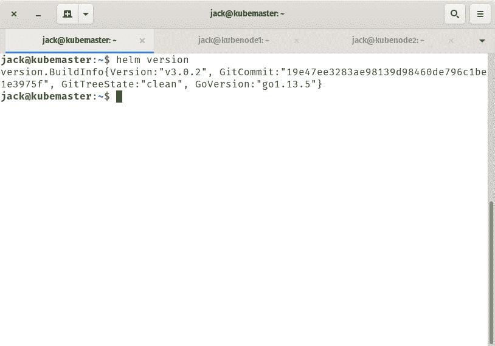

# 如何在 Ubuntu 服务器上安装 Helm Kubernetes 软件包管理器

> 原文：<https://thenewstack.io/how-to-install-the-helm-kubernetes-package-manager-on-ubuntu-server/>

Kubernetes 是一种有时会因其复杂性而令人望而生畏的技术。

支持 Kubernetes 的工具非常多。所以非常非常多的工具。其中一些工具甚至更加复杂。所以当你把一个挑战叠加到另一个挑战上时，事情开始变得有点沉重。这就是为什么当你发现一个工具可以让事情变得更简单时，你会欣然接受。

[舵](https://helm.sh/)就是这种情况。简而言之，Helm 是 Kubernetes 的应用程序管理器，负责简化应用程序的安装和管理。换句话说，Helm 之于 Kubernetes，就像 **apt** 、 **dnf** 和 **zypper** 分别之于 Ubuntu、RHEL 和 SUSE。

我们将重点关注 Helm 客户端的安装，特别是在 Ubuntu Server 18.04 上。

## 你需要什么

要成功安装 Helm，您需要一个正在运行的 Kubernetes 集群和一个拥有 **sudo** 访问权限的用户。就是这样。但是，在尝试安装和使用 Helm 之前，必须启动并运行 Kubernetes 集群。

如果您的 Kubernetes 集群已经准备好，让我们启动并运行吧。

## 安装舵

信不信由你，Helm 的安装相当容易。之所以这样做，是因为有现成的二进制可执行文件，除了下载文件并将其移动到正确的位置之外，它实际上不需要任何安装。

为此，请登录到 Kubernetes 集群的主节点，并使用以下命令下载 Helm 文件:

`wget https://get.helm.sh/helm-v3.0.2-linux-amd64.tar.gz`

文件下载完成后，使用以下命令将其解压缩:

`tar xvf helm-v3.0.2-linux-amd64.tar.gz`

解压文件后，使用以下命令将 helm 可执行文件移动到 */usr/local/bin* 目录中:

`sudo mv linux-amd64/helm /usr/local/bin/`

然后，您可以使用以下命令删除目录和下载的 helm 文件:

`rm helm-v3.0.2-linux-amd64.tar.gz`

`rm -rf linux-amd64`

清理完所有东西后，通过发出以下命令检查以确保 Helm 安装正常工作:

`helm version`

您应该看到显示的版本号，包括 BuildInfo、GitCommit、GitTreeState 和 GoVersion ( **图 1** )。



**图 1:** 头盔版回应，所以我们准备继续。

## 添加图表存储库

Helm 依赖于图表库来运行。图表存储库是一个远程服务器(使用 HTTP 协议),它保存 index.yaml 文件和(可选)打包的图表。图表是描述一组 Kubernetes 资源的文件集合。图表可用于部署简单的 pod 或包含复杂的应用程序和服务堆栈的 pod。

图表是放置在特定目录树中的文件，可以打包到版本化档案中并进行部署。典型的图表目录树可能如下所示:

```
AppName/

   Chart.yaml

   LICENSE

   README.md

   values.yaml

   values.schema.json

   charts/

   crds/

   templates/

   templates/NOTES.txt

```

整个树被打包成一个图表，使用 Helm 可以轻松部署。为此，您必须首先添加一个图表存储库。比方说，你想添加官方稳定舵图表。为此，回到 Kubernetes 主节点并发出命令:

`helm repo add stable https://kubernetes-charts.storage.googleapis.com/`

一旦添加了存储库，Helm 将报告任务完成(**图 2** )。


**图 2:** 添加了 Helm 存储库。

但是那个稳定的存储库包含什么呢？使用命令列出内容:

`helm search repo stable`

您应该会看到所有可用图表的列表(**图 3** )。


**图 3:** 可从舵稳定库获得的图表。

## 安装图表

让我们从舵手库安装一个图表。首先，让我们使用以下命令更新所有内容:

`helm repo update`

现在，我们将从存储库中安装一个图表。假设您想为 Nextcloud 安装图表。使用命令:
执行此操作

```
helm install stable/nextcloud  --generate-name

```

一旦图表安装完毕，您将得到如何完成部署的清晰指示(**图 4** )。


**图 4:** 添加了 Nextcloud 图表。

确保遵循 chart install 输出给出的说明，否则您将无法完成应用程序的部署。每个图表都有不同的说明，其中一些比其他的更复杂和要求更高。尽管如此，为了完成部署，您将确切地知道接下来必须采取什么步骤。

## 结论

如果 Kubernetes 的复杂性让你不知所措，你绝对应该把 helm 加入到这个组合中来，以平衡这个具有挑战性的竞技场。或者，即使你已经掌握了 Kubernetes，你也没有理由不添加一个工具来使这个过程更加有效。赫尔姆会帮你做的。

<svg xmlns:xlink="http://www.w3.org/1999/xlink" viewBox="0 0 68 31" version="1.1"><title>Group</title> <desc>Created with Sketch.</desc></svg>