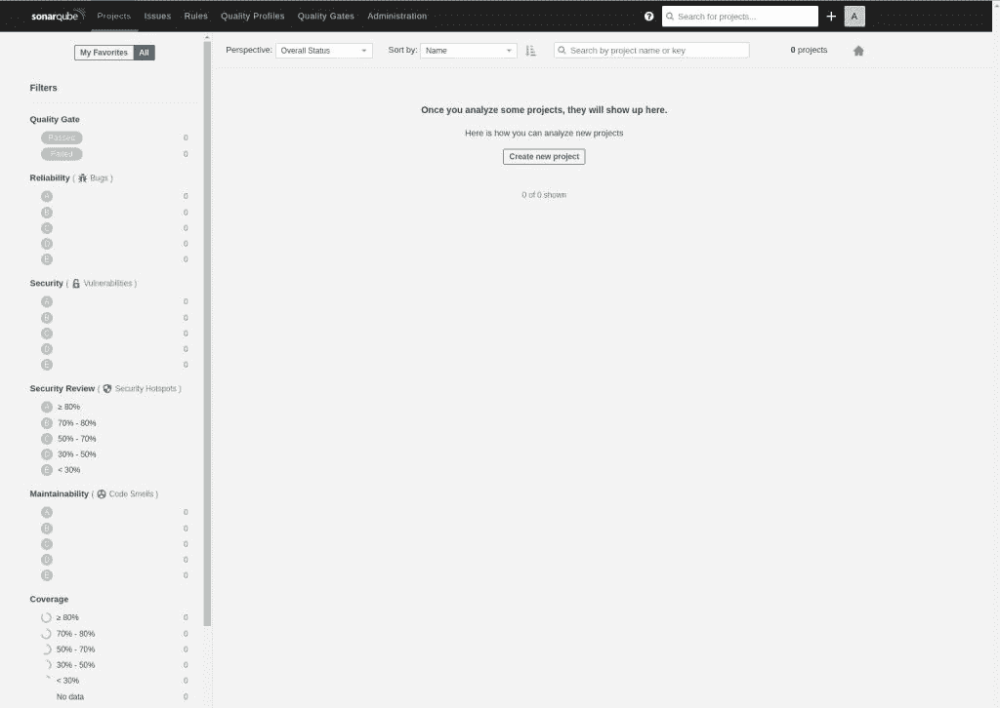

# 如何安装 SonarQube 安全分析平台

> 原文：<https://thenewstack.io/how-to-install-the-sonarqube-security-analysis-platform/>

SonarQube 是一个基于网络的软件分析平台，它有开源的根，可以帮助交付更干净、无问题的代码。SonarQube 包括 bug 和漏洞检测以及代码跟踪等功能。SonarQube 可以集成到 GitHub、Azure DevOps、Bitbucket、GitLab、Docker 中。

让我们安装 SonarQube。我将在 community edition 上演示(它包括 15 种语言的静态代码分析和许多其他特性)。如果您发现这个工具有价值，那么您可以考虑将自己升级到其他三个版本(开发人员、企业或数据中心)中的一个，每个版本都有相关的成本(在 [SonarQube 下载页面](https://www.sonarqube.org/downloads/)上找到更多信息)。

SonarQube 可以安装在 Linux、macOS 和 Windows 上。出于本教程的目的，我将演示在 Ubuntu Server 20.04 上的安装过程。

## 准备环境

我们必须做的第一件事是修改内核系统限制。为此，我们必须设置以下内容:

*   vm.max_map_count 必须大于或等于 524288
*   fs.file-max 必须大于或等于 131072
*   SonarQube 用户必须能够打开至少 131072 个文件描述符
*   SonarQube 用户必须能够打开至少 8192 个线程

这实际上比看起来容易。使用命令在 nano 编辑器中打开必要的文件:

`sudo nano /etc/sysctl.conf`

滚动到文件底部并粘贴以下内容:

```
vm.max_map_count=262144
fs.file-max=65536
ulimit  -n  65536
ulimit  -u  4096

```

使用[Ctrl]+[x]组合键保存并关闭文件。

接下来，使用以下命令打开 **limits.conf** 文件:

`sudo nano /etc/security/limits.conf`

滚动到该文件的底部并粘贴以下内容:

```
sonarqube     -     nofile     65536
sonarqube     -     nproc      4096

```

使用[Ctrl]+[x]组合键保存并关闭文件。

为了使这些更改生效，请使用以下命令重新启动系统:

`sudo reboot`

## 安装 OpenJDK 11

SonarQube 依赖于 Java。为此，我们将安装 OpenJDK 11，这可以通过以下命令完成:

`sudo apt-get install openjdk-11-jdk -y`

那很容易。我们继续吧。

## 安装和配置数据库

在 Linux 上，SonarQube 只适用于 PostgreSQL，这意味着我们必须采取一些额外的步骤来安装它。首先，使用以下命令下载 PostgreSQL GPG 密钥:

`wget -q https://www.postgresql.org/media/keys/ACCC4CF8.asc -O - | sudo apt-key add -`

接下来，通过运行以下命令添加 PostgreSQL apt 存储库:

`sudo sh -c 'echo "deb http://apt.postgresql.org/pub/repos/apt/ `lsb_release -cs`-pgdg main ">>/etc/apt/sources . list . d/pgdg . list '`

使用以下命令更新 apt:

`sudo apt-get update`

通过发出以下命令安装 PostgreSQL:

`sudo apt install postgresql postgresql-contrib -y`

安装完成后，使用以下命令启动 PostgreSQL 服务:

`sudo systemctl start postgresql`

使用以下命令使服务能够在引导时启动:

`sudo systemctl enable  postgresql`

现在，我们必须使用以下命令为 PostgreSQL 用户设置密码:

`sudo passwd postgres`

键入并验证新密码。

使用命令切换到 postgres 用户:

`su - postgres`

让我们创建一个新的数据库用户:

`createuser sonar`

我们现在可以创建我们的数据库。为此，首先登录 PostgreSQL 控制台:

`psql`

使用以下命令为 sonar 用户设置密码:

`ALTER USER sonar WITH ENCRYPTED PASSWORD 'PWORD';`

其中 PWORD 是一个强/唯一密码。

使用以下命令创建 SonarQube 数据库:

`CREATE DATABASE sonarqube OWNER sonar;`

修改权限，以便 sonar 用户可以使用以下命令访问/使用/修改数据:

`GRANT ALL PRIVILEGES ON DATABASE sonarqube to sonar;`

使用以下命令退出数据库控制台:

`\q`

键入 exit 退出 postres 用户。

## 下载并解压 SonarQube

在本教程中，我们将安装 sonar cube 8 . 6 . 1 . 40680。你需要查看官方 SonarQube 下载页面以确保你安装的是最新版本。

使用以下命令下载 SonarQube:

`wget https://binaries.sonarsource.com/Distribution/sonarqube/sonarqube-8.6.1.40680.zip`

使用以下命令安装 zip:

`sudo apt-get install zip -y`

使用以下命令解压下载的文件:

`unzip sonarqube*.zip`

使用以下命令移动(并重命名)新创建的文件:

`sudo mv sonarqube-XXX /opt/sonarqube`

其中 XXX 是 SonarQube 的发布号。

## 创建新的用户和组

对于我们的下一个技巧，我们将创建一个新的组和用户。首先，使用以下命令创建组:

`sudo groupadd sonar`

现在，我们可以创建用户，将用户的主目录设置为/opt/sonar cube，并使用以下命令将他们添加到新组中:

`sudo useradd -c "SonarQube - User" -d /opt/sonarqube/ -g sonar sonar`

使用以下命令更改 sonarqube 目录的所有权:

`sudo chown -R sonar:sonar /opt/sonarqube/`

## 配置 SonarQube 立方体

我们准备好配置 SonarQube 了。使用命令打开配置文件:

`sudo nano /opt/sonarqube/conf/sonar.properties`

删除#字符并修改以下行，使它们反映以下更改:

*   `sonar.jdbc.username=sonar`
*   `sonar.jdbc.password=PASSWORD`
*   `sonar.jdbc.url=jdbc:postgresql://localhost/sonarqube`
*   `sonar.search.javaOpts=-Xmx512m -Xms512m -XX:MaxDirectMemorySize=256m -XX:+HeapDumpOnOutOfMemoryError`

其中 PASSWORD 是 PostgreSQL 用户密码。

最后，确保编辑以下几行，使它们看起来像您在这里看到的:

*   `sonar.web.host=SERVER`
*   `sonar.web.port=9000`
*   `sonar.web.javaAdditionalOpts=-server`
*   `sonar.search.javaOpts=-Xmx512m -Xms512m -XX:+HeapDumpOnOutOfMemoryError`
*   `sonar.log.level=INFO`
*   `sonar.path.logs=logs`

其中 SERVER 是托管服务器的 IP 地址或域。

如果你的线条和上面看到的不一样，一定要修改它们。

保存并关闭 sonar.properties 文件。

接下来，我们需要更改运行 SonarQube 服务器的用户。发出命令:

`sudo nano /opt/sonarqube/bin/linux-x86-64/sonar.sh`

在该文件的底部，确保 RUN_AS_USER 行类似于:

保存并关闭文件。

## 创建启动文件

按照现在的情况，系统无法知道如何启动 SonarQube。要解决这个问题，我们必须创建一个 systemd 启动文件。使用以下命令执行此操作:

`sudo nano /etc/systemd/system/sonarqube.service`

在这个新文件中，粘贴以下内容:

```
[Unit]
Description=SonarQube service
After=syslog.target network.target

```

```
[Service]
Type=forking
ExecStart=/opt/sonarqube/bin/linux-x86-64/sonar.sh start
ExecStop=/opt/sonarqube/bin/linux-x86-64/sonar.sh stop
User=sonar
Group=sonar
Restart=always
LimitNOFILE=65536
LimitNPROC=4096

```

```
[Install]
WantedBy=multi-user.target

```

使用键盘快捷键[Ctrl]+[x]保存并关闭文件。

现在，您可以使用以下两个命令启动和启用 SonarQube 服务:

`sudo systemctl start sonarqube`

`sudo systemctl enable sonarqube`

## 安装和配置 NGINX

我们还没完呢。记住，SonarQube 是一个基于网络的工具，所以我们需要一个网络服务器。为此，我们将使用 NGINX。要安装 NGINX web 服务器，发出命令:

`sudo apt-get install nginx -y`

使用以下命令启动 NGINX web 服务器:

`sudo systemctl start nginx`

使用以下命令使 NGINX 在系统启动时运行:

`sudo systemctl enable nginx`

为了让 NGINX 了解 SonarQube，我们必须使用以下命令创建一个配置文件:

`sudo nano /etc/nginx/sites-enabled/sonarqube.conf`

在新的配置文件中，粘贴以下内容:

```
server{

listen         80;
server_name sonarqube.da.com;
access_log   /var/log/nginx/sonar.access.log;
error_log     /var/log/nginx/sonar.error.log;
proxy_buffers  16  64k;
proxy_buffer_size  128k;

location  /  {
proxy_pass   http://127.0.0.1:9000;
proxy_next_upstream error timeout invalid_header http_500 http_502 http_503 http_504;
proxy_redirect off;
proxy_set_header      Host                  $host;
proxy_set_header      X-Real-IP           $remote_addr;
proxy_set_header      X-Forwarded-For  $proxy_add_x_forwarded_for;
proxy_set_header      X-Forwarded-Proto http;
}
}

```

使用[Ctrl]+[x]组合键保存并关闭文件。

使用以下命令重新启动 NGINX:

`sudo systemctl restart nginx`

## 访问 SonarQube

您的 SonarQube 安装现在可以访问了。打开 web 浏览器，将其指向`http://SERVER:9000`(其中 SERVER 是托管服务器的 IP 地址或域)。如果出现错误，请在刷新之前等待一段时间，因为 SonarQube 服务需要一段时间才能启动。

您最终应该会看到一个登录屏幕，在这里您将使用 admin/admin 的默认凭证。验证成功后，您需要更改默认密码。一旦你做好了这些，你会发现自己在 SonarQube 主页上:



图 SonarQube 主窗口已经准备就绪。

恭喜你！现在，您可以开始检查代码中的问题和漏洞，而不必手动执行。请留意后面的帖子，在那里我将演示如何使用 SonarQube 来检查您的代码。

<svg xmlns:xlink="http://www.w3.org/1999/xlink" viewBox="0 0 68 31" version="1.1"><title>Group</title> <desc>Created with Sketch.</desc></svg>