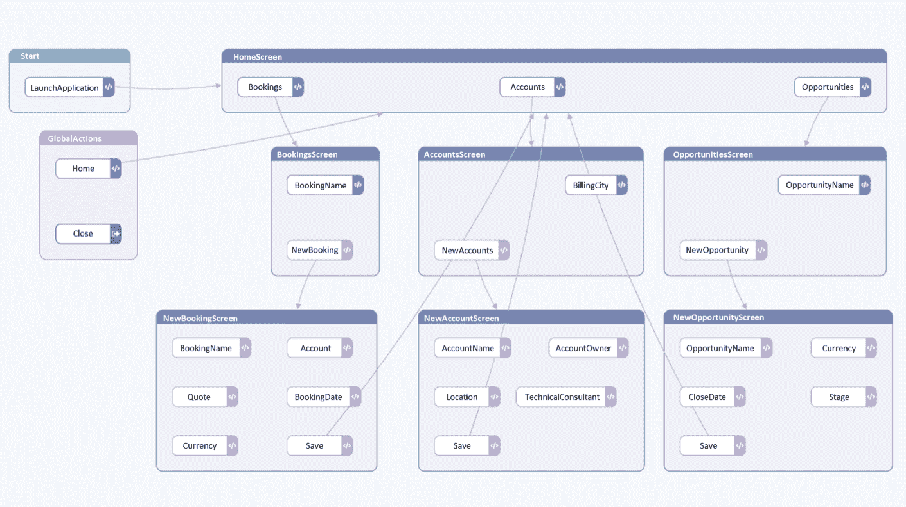
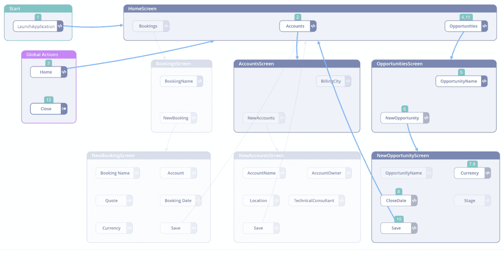
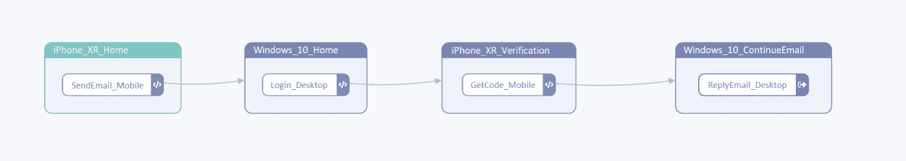

# 如何集成和测试您的技术堆栈

> 原文：<https://thenewstack.io/how-to-integrate-and-test-your-tech-stack/>

构建技术栈不仅仅是选择最新的技术，整合它们，并期望你的组织、部门或团队改进它们的运作方式。

在投资新软件或应用程序之前，企业领导应考虑以下事项:

### 1.先评估结果，再评估工具。

 [安娜·麦科万

Anna McCowan 拥有北加州索诺玛州立大学的物理学学士学位。她在是德科技担任软件解决方案经理，这是一家领先的技术公司，致力于今天提供明天的测试技术，使客户能够通过他们的创新连接和保护世界。](https://www.linkedin.com/in/annamccowan/) 

在知道什么需要改进之前实施一套工具是一种肯定会产生阻碍而不是帮助的技术堆栈的方式。

首先，组织需要问自己，“我们试图实现什么？期望的结果是什么？是什么阻碍了这些成果的实现？”

例如，如果客户体验低于预期，那么实施一个全新的 CRM 系统就不是一个全面的解决方案。首先，领导者必须调查**为什么**客户体验表现不佳。

订单履行的延迟、无效的客户沟通或缓慢的系统通知都会导致不愉快的客户体验。客户订单详细信息可能输入不正确，或者可能无法送达物流中心。也许软件交付团队花了太多时间手工检查代码缺陷，没有时间开发新功能。

了解性能问题的根本原因对于解决这些问题至关重要。工具应该仅仅是一个促进者。构建技术堆栈的直接和主要目的是使流程与业务目标保持一致，以交付尽可能多的价值。

### 2.协作是关键。【T2

在创建一个全功能的技术堆栈时，必须打破组织孤岛以改进决策。不管正在构建的技术堆栈是什么类型，跨部门使用咨询方法都是必要的。

例如，如果一个 CRM 平台被孤立地实施来解决客户体验问题，但是一个配送中心没有意识到，一个订单执行工作流程可能会完全中断。尽早与相关利益相关者进行讨论可以标记任何瓶颈，并确定是否需要其他技术来弥补任何差距。

有了相关团队和部门的代表，识别问题和设定明确的目标就变得更加容易。一旦建立，创建适当的工作流来简化和自动化流程就变得非常简单。

### 3.请教专家。

任何应用程序或系统都可以开箱即用，但很少有组织需要这种简单性。为了满足独特的业务需求，并确保任何技术堆栈都可以提供价值，不同程度的定制是必要的。

一个主要领域是实现业务逻辑来创建定制的工作流。任何技术堆栈中的定制工作流通常都遵循一步一步的流程，并包含复杂的规则。将实施诸如强制字段、业务规则和“if/then”语句等功能，以确保每个应用程序和工作流正常运行。

尽管许多应用程序的用户界面是可变的，但是用户可以采取的潜在动作、路径和路线的数量是很多的——不能保证它们会按照 A 点、B 点、C 点、D 点的顺序进行。与软件团队协商以确保业务规则被正确实现并且各种用户路径被充分测试是至关重要的。

另一个需要考虑的技术领域是平台或软件在与不同技术集成时是如何工作的。IT 团队应该参与这些对话。软件专家最能理解使用一种编程语言相对于另一种编程语言的优缺点。理解将应用程序与不同的代码库集成时所涉及的内容是至关重要的。组织不想投资一个技术堆栈，最终发现没有人能够自动化工作流。

咨询软件开发团队是必要的，因为端到端测试将不得不连续进行。除了不同的代码库之外，更新、新功能和维护工作也会定期发生，需要严格的测试来维护每个平台的功能。

## 测试您的技术堆栈势在必行

设定明确的目标，在全公司范围内合作，找到合适的工具并实施这些工具仅仅是个开始。为了让技术栈正常运行，持续测试是必不可少的——这意味着利用自动化。

### 测试和监控用户体验。

一个未使用的技术栈会破坏它的整个目的。为了保证可用性，最好从用户的角度进行测试。然而，并不是所有的测试自动化工具都有这种能力。大多数测试工具只是查看代码，并从后端验证用户体验，但对于大多数现代应用程序来说，这还不够。

今天的应用程序有复杂的 ui，使用 iFrames、下拉和弹出窗口等功能来提供更好的体验。这些对用户来说很好，但是很难用只验证代码的工具来测试。

从用户的角度进行测试意味着专注于用户所看到的。例如，可能会出现一个弹出窗口，遮住了必须单击才能完成对工作流至关重要的操作的按钮。特定的基于对象的工具不会认为这是一个问题，因为它的职责只是验证代码，而不是验证 UI。

图一。创建应用程序的数字版本允许你从用户的角度进行测试。(是德科技茄子戴图片)

### 用人工智能测试用户旅程。

对于任何技术堆栈来说，定制都是必不可少的，尤其是工作流。业务逻辑驱动这些定制工作流，增加了需要测试的用户旅程的数量。

用户不一定要按顺序沿着一条直线路径移动。流程中的一个步骤可能可以从不同的路径访问。用户可能会忘记输入必要的数据，这意味着他们必须后退一步或刷新页面。

期望一个人工测试人员预测每一个可能的用户旅程和行为是不可行的。使用测试自动化解决方案，通过利用人工智能(AI)进行智能探索性测试，通过为所有可能的用户旅程自动生成测试用例来增加覆盖率。

图二。通过使用人工智能的全面探索性测试确定的可能用户旅程的示例。(是德科技茄子戴图片)

### 测试任何技术。

由于每个技术堆栈都涉及复杂的系统、设备和代码库，组织需要一种解决方案，无论采用何种技术，只需一次测试就能自动进行真正的端到端测试。

另一种选择是利用多种手动或自动测试工具，为构成技术堆栈的每项技术、系统和应用程序创建测试用例。

考虑到大多数技术栈都是基于云的，用户将在不同的网络浏览器上、在多种设备上访问基于各种编程语言构建的平台。在某些情况下，仅仅登录一个应用程序就需要双因素身份验证，这涉及到在一系列计算机和移动设备上测试用户的旅程。

手动测试这些场景或使用多种工具需要时间——你的竞争对手比你更快地向市场推出新功能和数字产品。

图 3。跨多个设备测试双因素身份认证的数字孪生模型。(是德科技茄子戴形象)。

## 摘要

借助合适的技术堆栈，企业领导者可以跨团队和部门连接数字工作流，改善协作并实现共同的业务目标。为了确保长期的业务成功，必须优先考虑技术堆栈的持续测试。

要了解更多关于人工智能驱动的测试自动化，请访问 eggplantsoftware.com。

<svg xmlns:xlink="http://www.w3.org/1999/xlink" viewBox="0 0 68 31" version="1.1"><title>Group</title> <desc>Created with Sketch.</desc></svg>