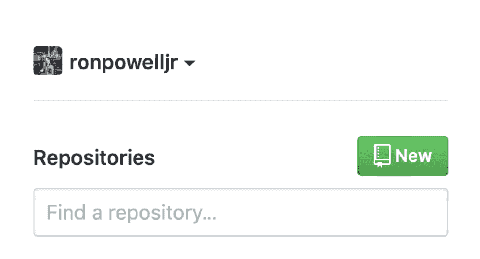
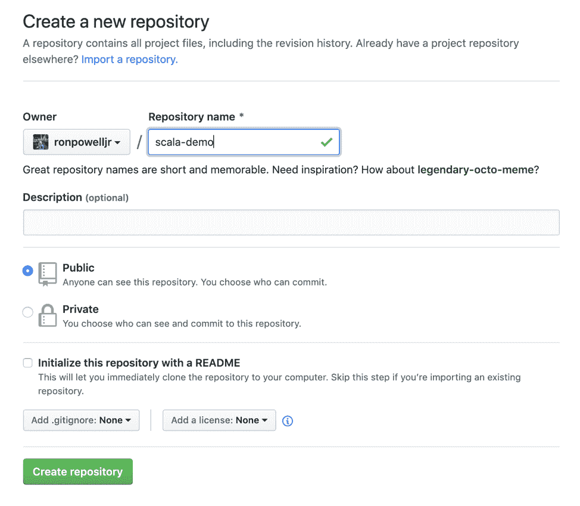
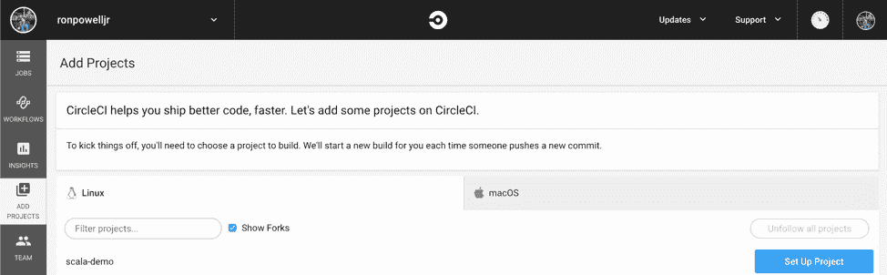
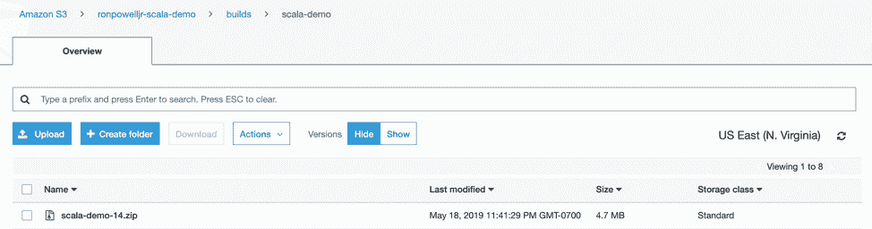

# 如何将 RESTful APIs 集成到 CI/CD 管道中

> 原文：<https://thenewstack.io/how-to-integrate-restful-apis-into-ci-cd-pipelines/>

[](https://circleci.com/)

 [罗恩·鲍威尔

罗恩拥有空间物理学背景，曾作为卡西尼小组成员分析土星磁层中的等离子体。他现在在加州旧金山的 CircleCI 公司工作，作为一名开发人员，倡导开发内容，使开发人员能够更快地构建、测试和部署他们的项目。此前，他是美国三星电子的开发人员，专门从事 360 度视频制作和虚拟现实硬件、可穿戴设备和物联网应用的开发。](https://circleci.com/) [](https://circleci.com/)

为了完全自动化现代应用程序的构建、测试和部署， [RESTful API](https://restfulapi.net/) 调用对于服务间的信息传输至关重要。在这篇初级教程中，我们将探索这些 API 的真实用法。

现代应用程序严重依赖对外部服务的 HTTP 请求来获取、发布、放置和删除数据。这种信息传输是通过 RESTful 或 REST APIs 完成的，以减少与传统 API 相关的带宽。REST APIs 对于分布式计算和基于云的技术是必不可少的。一个例子是使用亚马逊 S3 REST API 将包发布到 AWS S3 桶。另一种方法是使用 cURL 从网上下载一个要安装的包。

有了这些例子，很明显需要将这些 API 调用集成到他们的 [CI/CD](https://thenewstack.io/category/ci-cd/) 管道中，以实现完全自动化的构建和部署。在本教程中，我们将构建一个使用这两种 API 的应用程序。这是一个简单的 Scala 应用程序，我们将构建并部署到 S3 桶。这篇文章的目标是展示 REST API 使用的真实例子。不需要大量的 Scala 知识。

## 构建应用程序

首先，让我们创建一个目录并将 *cd* 放入其中，方法是在您的终端中键入以下命令:

```
mkdir scala-demo  &amp;&amp;  cd  $_

```

这是我们为应用程序添加文件的地方。现在，我们需要在/src/main/文件夹中添加一个 HelloWorld.scala 文件。通过键入以下两个命令添加文件:

```
mkdir  -p  src/main/  &amp;&amp;  cd  $_  
touch HelloWorld.scala

```

打开您最喜欢的编辑器，将这些行保存到 HelloWorld.scala:

```
object  HelloWorld  {
  def main(args:  Array[String]):  Unit  =  {
    println("Hello, World! I'm the Sample Scala App!")
  }
}

```

在我们有一个工作应用程序之前，我们还需要一些文件。让我们定义几个使用 sbt 的文件。第一个是 build.sbt，它需要在项目的根目录下。在您的终端中键入以下行:

```
cd  ../..  &amp;&amp;  touch build.sbt

```

返回编辑器，将这几行保存到文件:

```
name  :=  "scala-demo"

version  :=  "0.1"

scalaVersion  :=  "2.12.5"

lazy val root  =  (project in file(".")).enablePlugins(JavaAppPackaging)

//rename zip file created from dist command
packageName in Universal  :=  "scala-demo"

```

接下来，让我们将几个文件添加到一个项目文件夹中，它将为 sbt 定义变量。首先，在你的终端上输入这个:

```
mkdir project  &amp;&amp;  cd  $_
touch build.properties

```

返回编辑器，将这一行保存到文件:

最后一个文件将添加这一行:

返回编辑器，将这一行保存到文件:

```
addSbtPlugin("com.typesafe.sbt"  %  "sbt-native-packager"  %  "1.3.4")

```

## 推送至 GitHub

为了将我们的代码提交给 Git，我们需要返回到项目的根目录，并在终端中键入以下几行:

```
$  git init
$  git add  .
$  git commit  -m  “Initial commit”

```

在浏览器中打开 GitHub，点击浏览器左上角的 new 创建一个新的存储库。如果你没有 [GitHub 账号](https://circleci.com/docs/2.0/gh-bb-integration/)，你可以在这里创建一个[。](https://github.com/)



添加存储库的名称，然后单击创建存储库。



下一页提供了入门说明。我们将使用第三种方法。在您的终端中键入行。在我的例子中，这些行如下:

```
$  git remote add origin https://github.com/ronpowelljr/scala-demo.git
$  git push  -u  origin master

```

## 在管道中使用 REST APIs

您可能已经使用 REST APIs 在本地构建应用程序、手动编写脚本和/或进行调试。像 Wget 和 cURL 这样的工具是工程师常用的工具，所以让我们探讨一下在 CI/CD 管道中使用这些工具的好处。接下来，我们将使用 CircleCI 构建我们的应用程序包，并将其部署到 AWS S3 存储桶。如果你没有 CircleCI 账号，可以在这里注册一个[。](https://circleci.com/)

登录到您的帐户，并从左侧导航栏中选择“添加项目”。然后单击新项目右侧的“设置项目”。



如果我们单击立即开始构建，我们的项目将不会运行。我们还没有配置文件。

回到你的终端，在你的项目的根目录下输入这些行:

```
$  mkdir  .circleci  &amp;&amp;  cd  $_
$  touch config.yml

```

返回编辑器，将这些行保存到文件:

```
yaml
version:  2
jobs:
  build:
    working_directory:  ~/scala-demo
    docker:
      -  image:  openjdk:8
    environment:
      -  SBT_VERSION:  1.0.4
    steps:
      -  run:  echo  'export ARTIFACT_BUILD=$CIRCLE_PROJECT_REPONAME-$CIRCLE_BUILD_NUM.zip'  &gt;&gt;  $BASH_ENV
      -  run:
          name:  Get sbt binary
          command:  |
                    apt update  &amp;&amp;  apt install  -y  curl
                    curl  -L  -o  sbt-$SBT_VERSION.deb https://dl.bintray.com/sbt/debian/sbt-$SBT_VERSION.deb
                    dpkg  -i  sbt-$SBT_VERSION.deb
                    rm sbt-$SBT_VERSION.deb
                    apt-get update
                    apt-get install  -y  sbt python-pip git
                    pip install awscli
                    apt-get clean  &amp;&amp;  apt-get autoclean
      -  checkout
      -  restore_cache:
          key:  sbt-cache
      -  run:
          name:  Compile scala-demo dist package
          command:  cat  /dev/null  |  sbt clean update dist
      -  store_artifacts:
          path:  target/universal/scala-demo.zip
          destination:  scala-demo
      -  save_cache:
          key:  sbt-cache
          paths:
            -  "~/.ivy2/cache"
            -  "~/.sbt"
            -  "~/.m2"
      -  deploy:
          command:  |
              mv target/universal/scala-demo.zip  $CIRCLE_ARTIFACTS/$ARTIFACT_BUILD
              aws s3 cp  $CIRCLE_ARTIFACTS/$ARTIFACT_BUILD s3://ronpowelljr-scala-demo/builds/scala-demo/ --metadata {\"git_sha1\":\"$CIRCLE_SHA1\"}

```

注意:你需要用你的位置替换我的 S3 铲斗位置。

构建作业的 Get sbt 二进制步骤有一个 cURL 的常见用法:从 web 上抓取要安装的包。部署步骤显示了上传工件的 S3 API 调用。让我们将这些代码提交给我们的 repo，这样我们就可以开始用 CircleCI 构建了。回到你的终端，在你的项目的根目录下输入这些行:

```
$  git add  .
$  git commit  -m  “added circleci”
$  git push origin

```

回到 CircleCI，点击开始建造。第一次运行将会失败，因为我们没有将 AWS 凭证添加为环境变量。您可以按照这里的说明添加您的 AWS 信用。如果您没有 AWS 帐户，请在此注册一个。然后，您需要添加一个 S3 桶来上传您的应用程序包。可以在这里找到相关说明。创建具有公共访问权限的默认存储桶。

设置好之后，让我们向项目添加一个 README.md 文件，开始一个新的构建。我们将添加一个标题，应用程序的描述和状态徽章。回到你的终端，在你的项目的根目录下输入这些行:

返回编辑器，将这几行保存到文件:

```
# Demo Scala app [](https://circleci.com/gh/ronpowelljr/scala-demo)

```

这个项目是一个 Helloworld 应用程序，我喜欢用于演示、博客和示例。这是 Scala 项目的一个很好的起点。
注意:您需要将我的 CircleCI 项目的 URL 替换为您的。

几分钟后，你的构建将通过，你的包将被上传到你的 S3 桶。去你的 S3 仪表板以确保包裹到达。



## 提前退出

现在让我们探索一种新颖的方法，将 cURL 包含在您的管道中，以便与 Bintray REST API 进行通信。由于外部服务关闭而导致构建失败是很常见的。在管道中使用 REST APIs 的一个好方法是在继续构建之前检查这些服务是否可以运行。这为您提供了一个为这种特定的失败方法定制消息的机会，并消除了开发人员花费时间调试失败的任何需要。

让我们在构建之前在另一个任务中使用 cURL，它将检查 Bintray 是否可以为您提供下载的包。返回到您的编辑器，将配置文件中构建作业上面的行替换为这些行:

```
workflows:
  version:  2
  check-and-build:
    jobs:
      -  check
      -  build:
          requires:
            -  check

version:  2.1
jobs:
  check:
    docker:
      -  image:  circleci/python:2.7.14
    steps:
      -  run:
          name:  Get Bintray API status
          command:  |
                    BT_STATUS=$(curl  -s  https://status.bintray.com/api/v2/status.json |  jq --raw-output '.status.description')
                    echo  “Bintray API Status:  $BT_STATUS”
                    if  [  “$BT_STATUS”  !=  “All Systems Operational”  ];  then
                      echo  “Error  [Bintray API Status:  $BT_STATUS]”
                      exit  1
                    fi 
  build:
...

```

我们将检查作业的 Get Bintray API status 步骤设置为首先运行，构建作业现在依赖于它。它检查状态，然后如果状态不是“所有系统运行正常”，就使用逻辑使我们的作业失败并退出。这可以限制您的成本，并为您的工程师节省时间，因为如果 Bintray 不可用，作业不会等待 cURL 超时，您的工程师也不需要花费太多时间来调查故障。

最后，提交变更:

```
$  git add  .
$  git commit  -m  “check”
$  git push origin

```

## 包扎

REST APIs 只会越来越受欢迎，越来越受欢迎。您最需要的服务将拥有 REST APIs，用于通过 web 与它们进行通信。开始考虑在管道中使用它们的不同方式。您可能希望检查一些服务的状态，上面的示例可以扩展为进行更多的检查。你可能需要从网上为你的应用程序安装更多的包，你也可以在上面看到是怎么做的。现在，您有了一个工作管道，可以在每次新推送时将应用程序包推送到 S3 桶。

本教程中的所有代码都可以在这个 [repo](https://github.com/ronpowelljr/scala-demo) 中找到。

<svg xmlns:xlink="http://www.w3.org/1999/xlink" viewBox="0 0 68 31" version="1.1"><title>Group</title> <desc>Created with Sketch.</desc></svg>