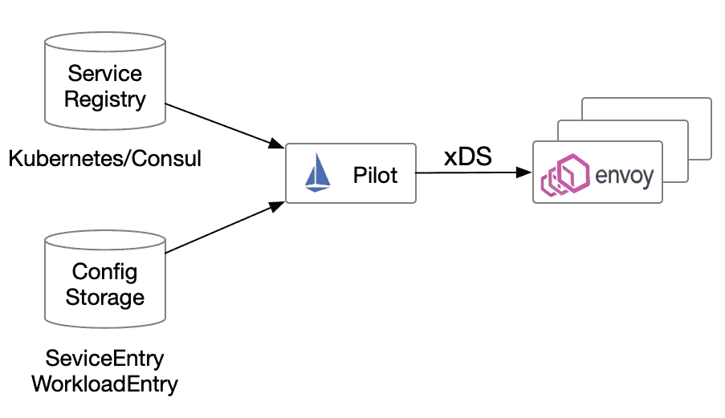

# 如何将虚拟机集成到 Istio 服务网格中

> 原文：<https://thenewstack.io/how-to-integrate-virtual-machines-into-istio-service-mesh/>

[Tetrate](https://www.tetrate.io/) 赞助本帖。

 [吉米·宋

Jimmy 是 Tetrate 的开发者倡导者，CNCF 大使，ServiceMesher 和 Cloud Native Community(中国)的联合创始人。他主要关注 Kubernetes、Istio 和云原生架构。](https://www.linkedin.com/in/jimmysongio/) 

[Istio](https://istio.io) 是一个流行的服务网格，用于连接、保护、控制和观察服务。当它在 2017 年首次作为开源产品推出时，Kubernetes 正在赢得容器编排之战，Istio 回答了组织迁移到微服务的需求。虽然 Istio 宣称支持 Nomad、Consul、Eureka、Cloud Foundry、Mesos 等异构环境。实际上，它总是与 Kubernetes 合作得最好 Kubernetes 是其服务发现的基础。

Istio 在其开发早期因许多问题受到批评，包括组件数量多、安装和维护复杂、调试困难、由于引入太多新概念和对象(多达 50 个 CRD)而导致的陡峭学习曲线，以及混频器组件对性能的影响。但是这些问题正在被 Istio 团队逐渐克服。从 2020 年初发布的[路线图](https://istio.io/latest/zh/blog/2020/tradewinds-2020/)中可以看出，Istio 已经取得了很大的进步。

将基于虚拟机的工作负载更好地集成到网格中是 Istio 团队今年的主要关注点。Tetrate 还通过其产品 [Tetrate 服务桥](https://www.tetrate.io/tetrate-service-bridge/)提供无缝的多云连接、安全性和可观察性，包括针对虚拟机。本文将带您了解为什么 Istio 需要与虚拟机集成，以及如何集成。

## Istio 为什么要支持虚拟机？

尽管容器和 Kubernetes 现在被广泛使用，但仍然有许多服务部署在 Kubernetes 集群之外的虚拟机和 API 上，需要由 Istio mesh 来管理。将棕色地带和绿色地带的环境管理统一起来是一个巨大的挑战。

## 向网格添加虚拟机需要什么？

在“如何做”之前，我将描述向网格添加虚拟机需要什么样的。在支持虚拟机流量时，Istio 必须了解几件事情:哪些虚拟机拥有应该成为网格一部分的服务，以及如何到达虚拟机。每个虚拟机还需要一个身份，以便与网格的其余部分安全地通信。这些需求可以与 Kubernetes CRDs 以及 Consul 等成熟的服务注册中心一起工作。并且基于服务账户的身份引导可以作为一种机制，用于将工作负载身份分配给不具有平台身份的 VM。对于拥有平台身份(如 EC2、GCP、Azure 等)的虚拟机。)，Istio 正在进行将平台身份与 Kubernetes 身份进行交换的工作，以便于建立 mTLS 通信。

## Istio 如何支持虚拟机？

Istio 对虚拟机的支持始于其服务注册机制。关于 Istio 网格中的服务和实例的信息来自 Istio 的服务注册中心，到目前为止，这些注册中心只查看或跟踪 pod。在较新的版本中，Istio 现在有资源类型来跟踪和监视虚拟机。网状网络内的侧柜无法观察和控制网状网络外服务的流量，因为它们没有关于它们的任何信息。

Istio 社区和 [Tetrate](https://www.tetrate.io/) 在 Istio 对虚拟机的支持上做了很多[的工作](https://www.tetrate.io/blog/istio-bringing-vms-into-the-mesh-with-cynthia-coan/)。1.6 版本增加了 WorkloadEntry，允许您像描述运行在 Kubernetes 中的主机一样描述虚拟机。在 1.7 中，该版本开始添加通过令牌将虚拟机自动引导到网格中的基础，由 Istio 完成繁重的工作。Istio 1.8 将推出另一个名为 WorkloadGroup 的抽象，它类似于 Kubernetes 部署对象，但用于虚拟机。

下图显示了 Istio 如何在网格中对服务建模。信息的主要来源来自 Kubernetes 这样的平台服务注册中心，或者 Consul 这样的系统。此外，ServiceEntry 充当用户定义的服务注册中心，对虚拟机上的服务或组织外部的外部服务进行建模。

Istio 中的服务注册模型

**当您可以使用 ServiceEntry 在虚拟机中引入服务时，为什么要在虚拟机中安装 Istio？**

使用 ServiceEntry，可以使网格内部的服务发现和访问外部服务；此外，管理这些外部服务的流量。结合 VirtualService，您还可以为相应的外部服务配置访问规则，例如请求超时、故障注入等。—启用对指定外部服务的受控访问。

尽管如此，它只控制客户端的流量，而不控制引入外部服务的其他服务的访问。也就是说，它不能控制作为调用发起者的服务的行为。在虚拟机中部署 sidecars 并通过 workload selector 引入虚拟机工作负载，可以对虚拟机进行无差别管理，就像 Kubernetes 中的 pod 一样。

## 将来的

从 bookinfo 演示中可以看出，这个过程涉及到太多的手工，很容易出错。在未来，Istio 将改进 VM 测试以使其更加真实，基于平台身份自动引导，改进 DNS 支持和 istioctl 调试，等等。您可以关注 Istio 环境工作组,了解关于虚拟机支持的更多详细信息。

## 参考

通过 Pixabay 的特征图像。

<svg xmlns:xlink="http://www.w3.org/1999/xlink" viewBox="0 0 68 31" version="1.1"><title>Group</title> <desc>Created with Sketch.</desc></svg>