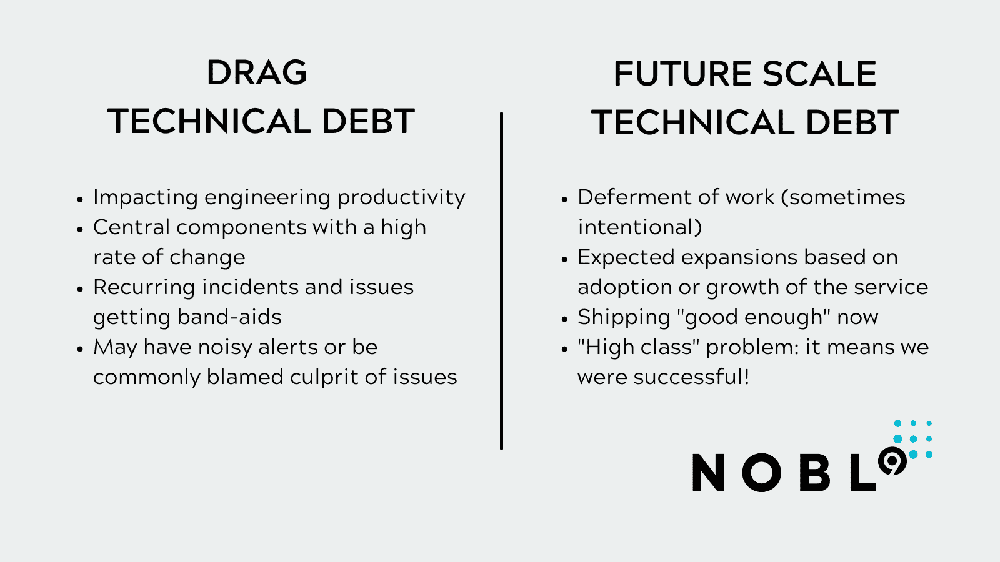

# 如何让你的开发者免于陷入技术债务

> 原文：<https://thenewstack.io/how-to-keep-your-developers-from-idling-in-tech-debt/>

 [亚历克斯·诺达

亚历克斯是 Nobl9 的首席技术官，他正在帮助组织提高其云原生应用的可靠性和性能。他的职业生涯始于磁存储和背板时代的数据仓库性能管理。自网络时代以来，他一直专注于媒体和公共云领域的产品开发。亚历克斯住在波士顿，他在 led 下种植蔬菜，并在一所非营利性社区马戏团学校教授杂耍。](https://twitter.com/alexnauda) 

开发人员希望从事有意义的项目。他们还想要自主权和工作与生活的平衡，以及使用最好的语言、框架和工具。没有这些基础，你就无法吸引到你的团队所需要的优秀人才。

雇佣没有合适工具的优秀开发人员就像三轮车上有一个职业赛车手。然而，开发人员的生产力不仅仅是给他们最快的汽车。这也是关于你让他们开的路。技术债务就像开发过程中的坑洞:所有代码库中最丑陋的部分和未完成的业务，以及即使是最聪明、最敬业的开发人员也不愿遇到的各种障碍。根据 Stepsize 最近的一项民意调查，超过一半(51%)的工程师由于大量的技术债务已经离开一家公司或考虑辞职。

坏消息是每个公司都有科技债务。它是不完善的航运法规不可避免的副产品。(注意:所有代码都有缺陷，修复通常比 2.56 美元更有价值。)

好消息是，随着软件可靠性实践的成熟，服务级别目标(SLO)和错误预算的新约定为组织提供了更好的信号，以识别何时该偿还技术债务。这些是你应该利用的现代优化策略，为你的科技债务提供更好的可见性、背景和紧迫性。

在本文中，我们将探讨两种常见的技术债务:“拖沓”债务和“未来规模”债务。我将讨论如何应用现代可靠性技术来识别何时暂停特性，何时集中精力偿还债务，希望是在您的团队寻找新工作之前。

## **拖债:认识到什么时候该拆路重铺**

当我们在相同的代码库中工作时，表面变得布满补丁和坑洼，失去了光滑度。开发人员因此受到阻碍。bug 多，修复 bug 回归风险高。代码杂乱无章——太多的条件语句、if 语句、函数占据了一个屏幕，太多不同的开发人员接触了太多行代码。

拖欠款发生在最常走的路——你最常换的部件，没人愿意开，因为太可怕了！这对开发人员的士气有真正的负面影响。

开发人员往往知道分页器关闭时的原因:又是那个问题组件，又是那个有噪音的组件。当在一个特定的十字路口发生事故时，救护车知道他们将要做出什么反应，因为他们最近到过那个十字路口。

管理层听不到轮子吱吱响，是因为轮子太多了。不仅仅是一条路或者一个路口；所有的路都通向整个城市。那么，你怎么知道什么时候该付出关闭道路、拆除道路、重铺路面和重铺路面的高昂代价呢？

错误预算将允许您看到堆栈中的组件或架构中的整个服务何时开始衰退。他们变得轻浮，开始在运营和开发中行为不端。

错误预算提供了一个量化债务影响的好方法。在尝试走每条路的人当中，有多少人成功了？对于一个服务，您可以测量一些简单的目标，比如总的正常运行时间、总的成功请求与总的不成功请求、服务请求的延迟、API 是否错过了它们的目标。服务水平目标(SLO)允许您为所有服务和 API 的预期性能创建低水位线，这样您就可以知道什么时候债务已经产生了足够大的影响，是时候偿还债务了。

## **未来规模的债务:给自己一些信号，知道什么时候该偿还了**

某些形式的科技债务是有意延期的。SSL 证书过期是一个很好的例子。你的证书有效期为 12 个月。提前还清是没办法的；这得等到更新换代的时候。如果到时候不还清，你的加密和认证就有风险了。这种类型的科技债务没有任何主观性。如果你不按时付款，这将直接导致将来可能的停电。

细看一般公司的科技债务积压，许多问题都与未来规模的问题有关，在何时适合解决这些问题上，时间表要模糊得多。

作为一个全新的 SaaS 产品，你的第一波产品建设将强调功能，以吸引你的第一批成千上万的客户。在某个时间点，您意识到您需要扩展服务，比方说，在全球多个地理区域运行，以便您的服务速度极快。

您预计到了未来的需求，但是您如何知道什么时候应该在欧洲、亚太地区或中东北非地区拓展业务呢？你必须插入触发器，提醒你需要工作，是时候偿还这笔技术债务了。

首先，您应该设置延迟指标，表明现在有超过 5%的流量来自这些不同的区域。违反这一目标会触发您的计划周期，因此您可以将您的产品团队拉到一边，说:“还记得一年前我们决定将我们的产品快速推向市场，并推迟技术债务以在地理上扩展服务吗？现在是还债的时候了。”

## **结论**

我们可能愿意相信技术债务是由糟糕的工程决策造成的。在现实中，工程团队就像这个比喻中的银行。为了现在出货，他们发行科技债。产品团队受益于更快的发货，但是有一个附加的贷款。

你的支付方式是在技术债务还清的同时推迟功能。今天，SLO 和错误预算为开发人员提供了与他们的业务涉众进行讨论的手段。

没有人会在半夜被叫醒讨论科技债务。不要把紧急警报附加到科技债务指标上，但是一定要跟踪你已经发放的贷款，这样你就可以在下一次冲刺之前提前还款。

<svg xmlns:xlink="http://www.w3.org/1999/xlink" viewBox="0 0 68 31" version="1.1"><title>Group</title> <desc>Created with Sketch.</desc></svg>