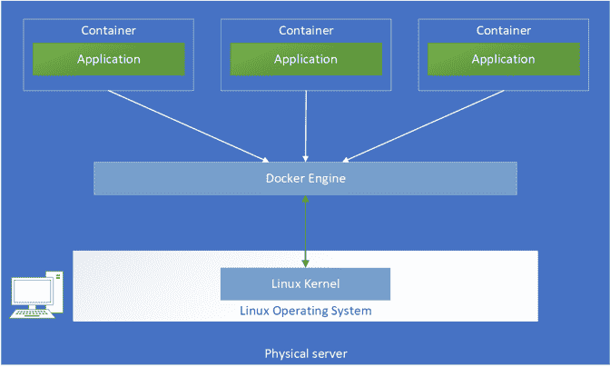

# 如何锁定内核来保护容器

> 原文：<https://thenewstack.io/how-to-lock-down-the-kernel-to-secure-the-container/>

[Twistlock](https://www.paloaltonetworks.com/prisma/cloud) 赞助本帖。

 [西奥·德斯普迪斯

Theo 是 Twistlock 的高级软件工程师、经验丰富的导师和客座博主。他对开源架构、云计算、最佳实践和函数式编程有浓厚的兴趣。他偶尔会在几个发布平台上写博客，并喜欢从灵感中创造项目。](https://github.com/theodesp) 

集装箱安全显然是一个多层次的事情。您需要保护和监控的许多层存在于容器本身之外。其中之一是主机操作系统和驱动它的内核。最终结果是，[整个堆栈都是安全的，](https://www.twistlock.com/container-security/)包括注册中心和协调器。

在本文中，我将研究如何保护容器主机，重点是内核级安全性。

我还应该指出，我将特别关注 [Linux 容器主机](https://www.twistlock.com/resources/securely-configure-linux-host-run-containers/)。(抱歉，Windows 容器爱好者——如果您在 Windows 上运行容器，主机安全性也很重要，但鉴于 Windows 的可定制性比 Linux 差得多，从主机角度来看，您无法做太多事情来强化 Windows 容器主机系统)。

## 你的内核和容器

[容器](https://www.twistlock.com/container-security/)当然不提供主机和容器应用程序之间的完全隔离。相反，容器与主机系统以及相互之间“共享”内核和其他主机资源。与虚拟机不同，容器不运行自己的内核。



容器如何工作(来源:Medium)。

从安全的角度来看，我们可以通过这个模型进行一些重要的观察:

*   危及操作系统将允许所有容器也被危及；
*   我们可以在每个容器上分别应用基于主机的控制和安全策略；
*   通过应用程序代码中的错误发生的容器溢出可以绕过引擎，访问主机操作系统和控制所有其他应用程序的内核。

基于此，我们应该为主机操作系统环境和位于容器之间的内核精心设计一个安全策略，以降低特权提升攻击的影响。这个过程包括大量的试验和错误，以及查阅文档的时间。

在我们开始修改托管容器的内核之前，最好是在一个安全的沙箱中工作，这样我们就可以在配置错误的情况下回滚我们的更改。我们不想破坏我们自己的内核或擦除数据。一个建议是使用 [VirtualBox](https://www.virtualbox.org/) 和一个最小的 Linux 发行版，比如 [Alpine](https://wiki.alpinelinux.org/wiki/Install_Alpine_on_VirtualBox) 。最小发行版是有用的，因为你运行的越少，你潜在的攻击面就越小(尽管，请记住，即使是小发行版也会不时出现安全问题，就像[最近用 Alpine](https://www.alpinelinux.org/posts/Docker-image-vulnerability-CVE-2019-5021.html) 发生的那样)。加载后，请确保创建了快照，以便以后可以恢复。

## 保护内核的最佳实践

因此，让我们看看如何通过遵循这些简单的规则来强化内核:

*   **获取最新的内核:**创建主机后，立即将内核更新到最新版本。虽然内核本身是一个稳定的软件，但有许多与容器相关的漏洞会被发现并修复。另外，一些已知的错误在[解决](https://lwn.net/Articles/410606/)之前会持续足够长的时间。通过保持内核更新，我们可以控制这些风险类别。检查当前内核版本就像执行以下命令一样简单:

```
$  uname  -a
Linux tserver  4.15.0-48-generic  …

```

截至 2019 年 5 月，最新稳定的[内核](https://www.kernel.org/)版本为 5.0.13，我们可以通过运行:
进行升级

```
$  sudo apt-get dist-upgrade

```

*   **删除 root 用户，只使用 SSH 认证:**这两条规则应该是每个新服务器部署的一部分。当容器脱离隔离时，我们不需要将我们的主机暴露给根用户的超级特权。此外，SSH 验证的密码在设计上是不安全的。我们可以通过设置以下行在 ssh.config 中禁用它们:

```
PasswordAuthentication no

```

但是，确保您首先[配置了基于 SSH 的](https://www.digitalocean.com/community/tutorials/how-to-configure-ssh-key-based-authentication-on-a-linux-server)认证，这样您就能够使用您的 SSH 密钥登录。

*   **运行 docker-bench-security 等集装箱安全工具:**有几个值得信赖的工具可以对机器进行自动扫描，并为您提供关于在生产中保护集装箱的最佳实践的报告。例如，对于 Docker，我们有 [docker-bench-security](https://github.com/docker/docker-bench-security) 工具，您可以像这样运行它:

```
$  docker run  -it  --net host  --pid host  --userns host  --cap-add audit_control  \
    -e  DOCKER_CONTENT_TRUST=$DOCKER_CONTENT_TRUST  \
    -v  /etc:/etc  \
    -v  /usr/bin/docker-containerd:/usr/bin/docker-containerd  \
    -v  /usr/bin/docker-runc:/usr/bin/docker-runc  \
    -v  /usr/lib/systemd:/usr/lib/systemd  \
    -v  /var/lib:/var/lib  \
    -v  /var/run/docker.sock:/var/run/docker.sock  \
    --label docker_bench_security  \
    docker/docker-bench-security

```

请仔细关注**主机配置**部分，因为它提到了几项改进，这些改进可用于保护其在容器中的使用。

*   **不运行*–特权*容器**

有许多安全配置文件和控制，如 AppArmor、Seccomp 等，我们可以在运行容器中实施。但是如果我们在**–***-特权*模式下运行它们，那么我们就给了它们超能力。这些能力是有害的，足以影响主机操作系统。我们可以擦除主机磁盘空间或者从容器内部安装模块，或者做其他不安全的事情(但是这显然是非常不安全和不鼓励的)；

*   **加载最小内核模块:**内核模块是不需要重启就可以动态加载到内核中的插件。它们使内核可扩展并提供各种服务。要列出所有内核模块，您需要运行:

并不是所有的模块在容器化的环境中都有用，因为它们暴露了可能被利用的服务。部署的容器具有来自该内核的相同模块列表，但是如果没有特权访问，它们不能安装新的模块。重要的是只保留必要的内核模块，尤其是那些负责执行安全角色和权限的模块(比如 AppArmor 或大道寺知世)。

*   内核加固补丁:您可以利用专门的框架来加固 Linux 内核，并提供额外的安全控制，同时进行一些向后兼容的权衡，例如 grsecurity 和 SELinux。然而，这里有一些注意事项。这些框架以不同的方式工作，对于如何最好地强化内核，每个框架都有自己的“观点”。内核加固框架的比较超出了本文的范围，但是做一些研究来决定哪一个最适合您，并应用它；
*   保持自我更新:你需要关注新的方法和技术，这些方法和技术允许在主机和容器层之间实施严格的隔离和控制——例如，内核服务在沙箱中运行的 [nabla-containers](https://nabla-containers.github.io/) 项目或 [Google 的 gVisor](https://gvisor.dev/) 项目。要走的路不止一条。

## **最后一句话**

无论在主机级别进行多少调整或定制，都不能保证您的容器免受攻击。监控环境中的安全问题也很重要。但是主机安全性是一个很好的起点。关于这个主题的更多提示，请查看 Twistlock 的[主机保护指南](https://www.twistlock.com/resources/securely-configure-linux-host-run-containers/)。

通过 Pixabay 的特征图像。

<svg xmlns:xlink="http://www.w3.org/1999/xlink" viewBox="0 0 68 31" version="1.1"><title>Group</title> <desc>Created with Sketch.</desc></svg>