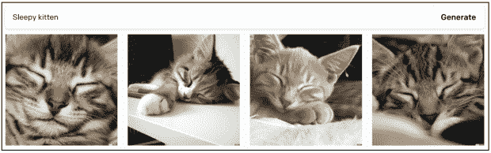
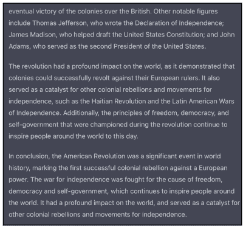
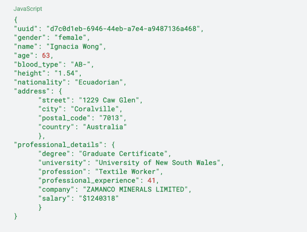
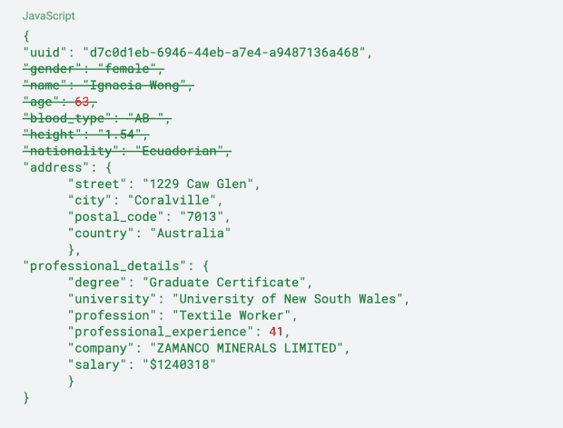
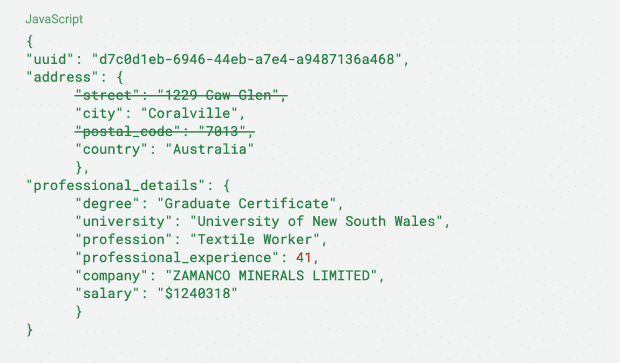
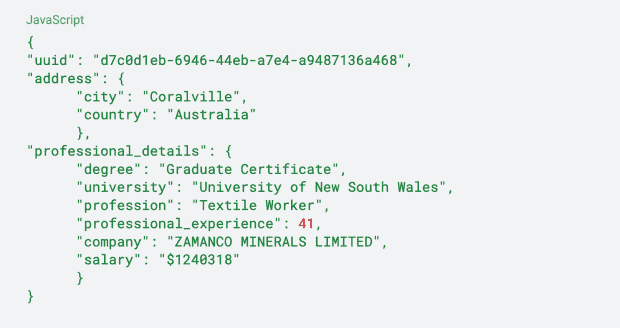
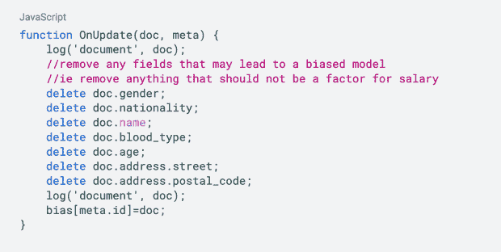

# 如何在 2023 年降低贵公司的人工智能风险

> 原文：<https://thenewstack.io/how-to-lower-your-companys-ai-risk-in-2023/>

随着去年 OpenAI 里程碑式的发布 [DALL E 2](https://openai.com/dall-e-2/) 和 [ChatGPT](https://openai.com/blog/chatgpt/) ，人们一直在与人工智能互动，并看到了它的第一手(一点点)潜力。

这些工具就像魔术一样。每一个都有一个文本提示，然后给你一个回复。DALL E 将你的文本转换成图像，ChatGPT 将与你进行一次完整的[对话](https://thenewstack.io/just-out-of-the-box-chatgpt-causing-waves-of-talk-concern/)。例如，向 DALL E 索要一只困倦的小猫，你会得到一系列令人惊艳的化身。请 ChatGPT[写一篇关于美国革命的文章](https://thenewstack.io/how-open-ai-ruined-my-homework-assignment/)，你会得到一篇强有力的论文。

然而，这些工具(以及类似的工具)绝对不是魔法，它们当然也不是绝对可靠的。看得太仔细，你会开始发现问题。你有没有用手或者文字向 DALL E 要东西？你可能会对字母的“手”和无意义的排列感到失望。你要的关于美国革命的论文？嗯，它可能有一些事实不准确或奇怪的措辞。

注意这个“现实主义者挥手”中奇怪的手或者美国革命随笔中重复的段落。

这两种工具的[病毒式传播](https://thenewstack.io/ai-moves-to-the-web/)让我们努力应对人工智能工具民主化带来的复杂的社会和法律后果。

例如，人工智能将如何影响版权法？人工智能制作的图片和人类制作的图片一样有价值吗？艺术家职业和创作者经济的未来是什么？你应该把美国革命论文交给你的大学教授吗？大概不会。

这些问题不在本文的讨论范围之内，相反我们会问:为什么 Google 没有实现像 ChatGPT 这样的搜索产品？

## AI 可信吗？

对于 ChatGPT 的发布，最初的一些反应是谷歌有麻烦了。当你可以问 ChatGPT 的时候，为什么要搜索 Google 并点击链接来寻找你的问题的答案呢？谷歌对此的回应在哪里？当然，谷歌在人工智能方面的巨大投资，可能已经产生了这一点？

可能是的。事实上，它已经公开展示了名为 LaMDA AI 的自然语言引擎的[演示](https://www.theverge.com/2021/5/18/22442328/google-io-2021-ai-language-model-lamda-pluto)，用户可以与冥王星对话，并向其提出任何他们想要的问题。不过谷歌从未公开发布过这一消息。为什么不呢？

在最近的一次公司“全体会议”上，谷歌首席执行官桑德尔·皮帅[引用这种产品的声誉风险来回答这个问题。他指出，客户天生信任谷歌的搜索结果，“你可以想象，对于类似搜索的应用程序，真实性问题非常重要，而对于其他应用程序，偏见、毒性和安全问题也非常重要。”](https://www.cnbc.com/2022/12/13/google-execs-warn-of-reputational-risk-with-chatgbt-like-tool.html)

是的，不准确的搜索结果会损害谷歌的形象，但该回应的第二部分揭示了真正的风险。如果你用一种特定的方式表达这个问题，你可以让 ChatGPT 告诉你一些可怕的错误或非常冒犯的事情。例如，加州大学的 Steven Piantadosi[透露【ChatGPT 根据种族和性别对人类大脑的价值进行了排名。](https://twitter.com/spiantado/status/1599462405225881600)

当谷歌缓慢而有条不紊地描绘其人工智能未来时，其他人正在抓住机会打破现状。随着微软最近宣布打算将自己的一些核心产品( [Office](https://www.theverge.com/2023/1/9/23546144/microsoft-openai-word-powerpoint-outlook-gpt-integration-rumor) 和 [Bing](https://www.theverge.com/2023/1/9/23546144/microsoft-openai-word-powerpoint-outlook-gpt-integration-rumor) )与 OpenAI 的技术进行整合，我们必须更仔细地了解为什么 AI 引擎有贬义的潜力。不幸的是，这不是人工智能的错。要理解为什么，我们需要看一看幕后。

## 人工智能大脑内部

DALL E 和 ChatGPT 都是机器学习模型。他们使用经过充分研究的建模技术来创建预测系统，该系统接受输入并返回输出。DALL E 从互联网上获得了数十亿对图片和说明，并学会了它们之间的关系，因此当给定一个新的说明时，它可以生成一个匹配的图像。

[ChatGPT](https://www.sciencefocus.com/future-technology/gpt-3/) 基于 GPT3 语言模型，它从互联网上获取文本，这样当给出提示时，它可以预测下一个单词应该是什么。然后在一个对话框架中实现它，产生 ChatGPT。

像 ChatGPT 这样的模型可以产生攻击性、种族主义或性别歧视的结果，原因是它是在包含数百万高度攻击性内容的数据集上训练的。互联网上充斥着人们说的未经过滤的可怕的事情，因此使用它作为数据源来训练一个模型无疑会教它说同样的事情。想象一下，只通过说脏话来教婴儿说话——你可以想象婴儿的第一句话可能是什么。

这解释了为什么像谷歌这样的公司害怕发布这些庞大复杂的人工智能模型。一旦模型的所有复杂训练都完成了，你就只剩下一个概率黑盒了。你不能确定给定一个特定的输入，黑盒不会输出特别淫秽的东西。

这个问题并不新鲜。这被称为人工智能偏差，当人工智能模型反映了数据集隐含的人类作者的固有偏差时，就会出现这种偏差。垃圾进，垃圾出。

那么，在产品套件中使用人工智能的公司如何减少人工智能偏见以及将有害、令人不快、不安全的人工智能模型投入生产的风险？微软、谷歌和其他公司能做些什么来降低客户和品牌的风险？

## 右移:ChatGPT 方法

OpenAI 在发布 ChatGPT 之前就敏锐地意识到了这个问题，以至于建造了针对它的护栏。方法很简单。不要让 ChatGPT 回复可能引发不恰当反应的问题。ChatGPT 有一个禁止关键字和短语的列表，它要么不会回应，要么已经被教会如何具体回应。

这意味着在大多数情况下，OpenAI 已经阻止了 ChatGPT 说一些偏执的话。然而，用户可以操纵 ChatGPT 说出偏执的事情，这意味着底层的 AI 模型正在遭受 AI 偏见，并从其数据集学习到了固有的有害语言。是的，OpenAI 将继续建立更多的过滤器和策略，以避免那些固有的偏见蔓延开来，但偏见仍然存在。

这是一种向右转移的策略——在流程的末端设置一道门，试图阻止风险通过。这显然不是万无一失的。

## 左移:声誉安全的方法

一个更长期的策略是着眼于过程的开始。如果在模型有机会学习它之前，你就从数据集中删除了偏见，你就有效地消除了构建有偏见的人工智能的可能性。

虽然 OpenAI 确实试图限制 GPT3 和 DALL E 接触低俗文本和图像，但并不是 100%有效。当查看互联网大小的数据集时，对于 OpenAI 这样的研究小组来说，这样的解决方案过于昂贵和复杂。忘记互联网的广阔范围，网上种族主义和性别歧视的细微差别是很难识别和消除的，即使是手动的。

并非所有的人工智能项目都是如此，尤其是针对较小的用例时。大多数企业并没有试图构建一个通用的人工智能产品，这种策略是更具可扩展性的方法。

让我们以一个虚构的公司“SalaryAdvise”为例。它试图建立一个人工智能模型，该模型可以获取给定员工的详细信息，并提出合理的工资建议。SalaryAdvise 煞费苦心地获得了一个包含成千上万人的数据集，包括他们的个人详细信息、工作经历和当前工资。以下是单个数据点的理论示例:

*注意:本例中使用的所有数据完全是虚构的，并且是使用拟态随机创建的* [*。*](https://mimesis.name/en/master/)

虽然这个数据集是全面的，但使用它来训练模型将产生一个考虑性别、年龄、血型和国籍作为计算工资的输入的模型。这些都是受保护的信息，无论如何都不应该成为道德或法律上的考虑因素。还有一些与确定薪资无关的信息，比如姓名、身高等。为了解决这个问题，我们可以删除这些数据点:

在寻找数据集中的偏差时，我们还需要考虑代理——可能破坏受保护值排除的数据点。地址信息很有用，因为地理信息可能会告知工资，但特定人群可能生活在相似的地区，因此使用完整的地址(和邮政编码)可能意味着其他人口统计信息。因此，我们应该去除它。

我们现在剩下的数据集不包含任何可能导致 AI 模型有偏差的受保护值或信息。SalaryAdvise 现在应该可以放心地使用这个数据集来训练模型，因为它知道人工智能不会有偏见，而且公司已经保护了自己的声誉。

完全清理的数据点

## 自动消除偏差:Couchbase 方法

作为数据的保管人，并按照我们公司的价值观，Couchbase 寻求让用户能够建立不带偏见的人工智能模型。这就是为什么我们为我们的云数据库平台创建了 [Couchbase 事件服务](https://www.couchbase.com/products/eventing)，让研究人员能够自动从人工智能数据集中删除受保护的信息。

使用事件，您可以触发 Javascript 函数对数据集中的文档(和所有现有数据)进行任何更新，因此每当添加新文档时，您都会自动删除受保护的信息。上面的例子可以通过下面的简单函数来实现:

通过使用 Couchbase，您还可以访问其内存优先的架构，为您提供无与伦比的性能和使用 SQL++查询数据集的能力。在你的下一个人工智能项目中释放这个 NoSQL 文档数据库的潜力。

今天就开始免费的[试用](https://cloud.couchbase.com/sign-up/)。

<svg xmlns:xlink="http://www.w3.org/1999/xlink" viewBox="0 0 68 31" version="1.1"><title>Group</title> <desc>Created with Sketch.</desc></svg>