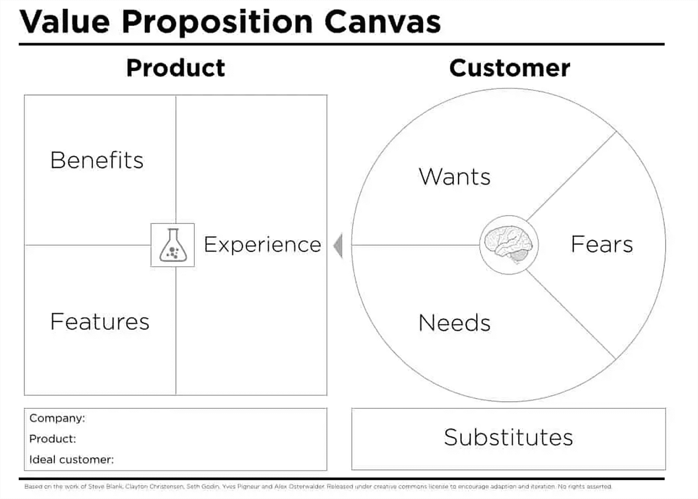

# 如何在扩展时保持 API 的一致性

> 原文：<https://thenewstack.io/how-to-maintain-api-consistency-as-you-scale/>

API 一致性是指一个 API 在不同环境和场景中的可预测和可靠的程度。当[一个 API 是一致的，](https://thenewstack.io/api-rating-agency-brings-consistency-to-api-measurements/)开发者可以相信它在不同的上下文中以相同的方式运行，使得它更容易使用和集成到他们的应用中。

扩展 API 包括增加其处理更大量请求或更高负载的能力；当你这样做的时候，你需要记住 API 的一致性。

如果一个 API 在不同的规模下表现不同，就会给使用它的开发人员带来问题，并导致应用程序的整体性能和可靠性出现问题。

请继续阅读，了解如何一致地设计 API。

## 为什么一致性对 API 设计很重要

API 设计的一致性对于今天的软件工程前景是至关重要的。它可以保证可靠性，改善用户体验，减少在维护和调试上花费时间和资源的需要，并鼓励良好的实践。

构建 API 时，首先要在命名变量和函数时使用一致的大小写。这有助于提高 API 的可读性和可用性，允许开发人员更容易地将其与其他系统集成。

任何高度依赖 API 的应用程序都应该确保它能够一致可靠地运行，不管使用规模如何。以下是在扩展时确保 API 一致性的一些技巧:

**设计用于缩放的 API。**设计 API 时，要确保它能够从一开始就处理大量请求，而不会降低性能。这可能涉及使用高效算法、缓存数据和负载平衡技术。

**不同尺度的试验。**分析不同规模的 API，确保其在不同负载下表现一致。这有助于识别在不同规模下使用 API 时可能出现的任何潜在问题。

**监控性能。**定期监控 API，以识别任何可能出现的不一致或问题。这将允许及时解决问题，并有助于维护 API 的一致性。

**与开发者沟通。向正在或将要使用 API 的开发人员传达对 API 所做的任何更改。这将使他们了解情况，并允许他们根据需要调整他们的应用程序。**

## 创建内聚的 API

开发一个成功的 API 需要深思熟虑的计划。这里有一些设计一致和直观的 API 需要考虑的因素。

**命名:**为资源、方法和参数建立一致的命名约定对于使 API 易于使用至关重要。这包括对资源和参数名使用 camel 大小写，对方法名使用全部大写的动作动词。

下面是 GraphQL 中一个使用 camel 大小写的资源和参数名的例子:

```
type  UserProfile  {

    userId:  ID

    firstName:  String

    lastName:  String

}

```

以及一个使用全大写动作动词的方法名的例子:

```
type  Query  {

    GET_USER(userId:  ID):  UserProfile

    UPDATE_USER(userId:  ID,  firstName:  String,  lastName:  String):  UserProfile

}

```

注意，在 [GraphQL 中，](https://thenewstack.io/the-unlikely-journey-of-graphql/)查询字段的命名约定是全部使用大写字符，用下划线分隔单词，就像上面的例子一样。但是，在命名类型、字段和输入类型时，推荐的命名约定是使用 camel case，就像在 UserProfile 类型中一样。

**资源结构:**保持资源结构的一致性是开发人员轻松访问和修改数据的关键。这包括资源 URL 的结构、资源中数据的组织以及不同资源之间的关系。

**HTTP 方法:**在 API 中统一使用正确的 HTTP 方法(比如 GET、POST、PUT 和 DELETE)对于开发人员理解如何与资源交互以及允许哪些操作是必要的。

**响应代码:**一致地使用 HTTP 响应代码有助于开发人员了解他们请求的状态以及可能发生的任何错误。

**响应格式:**跨 API 使用一致的响应格式，如 [JSON](https://thenewstack.io/an-introduction-to-json/) 或 XML，对于开发人员理解返回的数据非常重要。

## 将消费者放在心上

主题专家对 API 的评审可能是 API 评审过程中非常有益的一步，因为它提供了一种从了解 API 用户需求的人那里获得相关反馈和建议的方式。有几种方法可以成功地对您的 API 执行主题专家评审:

**阐明审计应涵盖的内容。**明确说明原料药设计审核的范围，包括哪些原料药和相关文件将被纳入。

全面的原料药设计审核应当包括以下几个方面:

*   **API 功能:**审核应评估 API 的功能，包括可用的资源、方法和参数。它还应该评估 API 满足客户需求和提供市场价值的程度。
*   **API 设计:**审核应审查 API 的设计，包括用于资源、方法和参数的命名约定，以及 API 文档的一致性和清晰性。
*   **性能:**审核应评估 API 的性能，包括其速度、可靠性、可伸缩性、处理大量数据的能力以及处理高流量的能力。
*   **安全性:**审计应当审查 API 的安全性，包括其认证和授权机制，以评估与其使用相关的风险。
*   **集成:**审计应该评估 API 与其他系统集成的难易程度，例如客户端库和 API 的可用性，以及 API 文档的质量。
*   **支持:**审核应当评估原料药的支持水平，包括技术文档、用户论坛和支持渠道的可用性。

**确定合适的专家。**找到最有资格审查你的 API 的主题专家。这些人可以是对您的 API 所服务的领域有全面了解的人，也可以是相关领域的专业人士。

这些专家可以帮助您识别 API 的潜在问题或限制，提出改进其功能和性能的方法，并确保它满足客户的需求。他们还可以提供关于行业最佳实践和标准的有价值的见解，帮助您创建一个在市场上有竞争力并提供价值的 API。

要找到合适的主题专家，你可以联系行业协会，参加相关会议或活动，与相关领域的专业人士建立联系。确保选择的专家不仅在他们的领域知识渊博，而且愿意合作并提供建设性的反馈来帮助你改进 API。

**收集反馈**。让专家参与对你的 API 的评估，可以亲自参与，也可以通过在线评审过程。询问他们对你的 API 的设计和功能的想法，包括任何改进的想法。

**研究并整合反馈。仔细研究专家给出的反馈，思考如何将他们的建议应用到你的 API 设计中。这可能需要改变你的 API 的操作或结构，或者额外的文档或例子。**

**测试并验证变更。**在吸收了专家的反馈后，测试并验证你的 API，以保证它按预期运行。这可能包括运行手动或自动测试，以确保您的 API 可靠且性能良好。

**审核并签署。**审查最终的 API 设计和文件，确保其符合所有要求和标准。如有必要，在继续部署之前，寻求相关利益相关方的额外审查或签准。

## 使用 API 值画布

当谈到从 API 中获得最大收益时，API 值画布是一个无价的工具。它是影响 API 价值的关键元素的可视化表示。填写画布的过程可以帮助您确定 API 最有价值的特性和功能，并对其进行优先排序，同时向利益相关者传达其价值。



您可以修改并填写这个价值主张画布模板，以确定和优先考虑您的 API 的最有价值的功能，并向您的利益相关者展示其价值。

使用 API 值画布，您可以从识别您的 API 打算服务的客户群开始。这可以帮助您更好地了解客户群的需求，从而创建满足这些需求的 API。

接下来，您应该定义您的 API 正在解决的问题或机会，并描述它提供的解决方案。这可以帮助你在市场上定位你的 API，并确保它满足你的客户的需求。

最后，确定将用于衡量 API 价值的关键指标，如采用率、使用水平或产生的收入。这可以帮助您随着时间的推移跟踪 API 的性能和影响，并了解它为您的客户服务以及为您的业务目标做出贡献的程度。

## 建立 DevEx 连接

使用 DevEX API value canvas 可以更容易地设计和改进 API 的开发人员体验。该工具基于价值主张画布，用于描绘产品或服务为客户提供的价值。因此，团队可以以结构化和有效的方式设计和改进他们的 API 的开发人员体验。

DevEX API 价值画布可以帮助您确定您正在创建的 API 的两个重要组成部分:它的价值主张和它的难点。前者包括 API 为开发人员提供的独特优势和价值，例如便利性、性能和对有用数据或功能的访问。

同时，后者概述了开发人员在使用 API 时可能会遇到的挑战和挫折，例如严格的身份验证、有缺陷的文档或缓慢的响应时间。

通过在画布上绘制这两个组件，团队可以识别 API 在哪里交付价值，以及在哪里造成困难。这可以帮助您和您的团队优先考虑改进，并专注于创建更好的开发人员体验。

DevEX API 值画布中可以包含的元素包括易于集成、文档、安全性、性能、功能和支持。

比方说，一家公司开发了一个自动驾驶汽车 API，可以提供自动驾驶车辆的实时信息和控制。该公司希望评估其 API 提供的开发人员体验，并在必要时做出改进。

团队可以使用 DevEX API 价值画布来评估 API 的价值主张。

*   **易于集成:**团队应该评估 API 的文档，以确保提供了关于如何将 API 集成到应用程序中的清晰说明。样本代码，库和工具也应该是可用的，以促进集成过程。
*   **文档:**团队可以评估 API 文档的质量和可访问性，例如教程、参考资料和示例，以确保它易于理解，并为开发人员有效使用 API 提供所有必要的信息。
*   **安全性:**团队可以评估 API 的安全特性，如认证、加密和访问控制，以确保 API 为开发人员和最终用户提供安全的体验。
*   **性能:**团队可以评估 API 的速度、可靠性和可伸缩性，以保证开发人员和最终用户的无缝响应体验。
*   **功能:**团队可以评估 API 的特性和能力，以保证它为开发者提供必要的工具，包括实时车辆监控、路线图和自主控制。
*   **支持:**团队可以评估支持资源的可用性和质量，例如论坛、电子邮件和电话支持，以确保开发人员在使用 API 时可以获得他们需要的帮助。

记住这些组件，团队可以很容易地评估他们的 API 的有效性，并进行必要的修改以提供更好的 UX。

<svg xmlns:xlink="http://www.w3.org/1999/xlink" viewBox="0 0 68 31" version="1.1"><title>Group</title> <desc>Created with Sketch.</desc></svg>