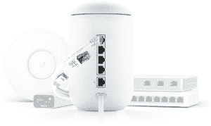
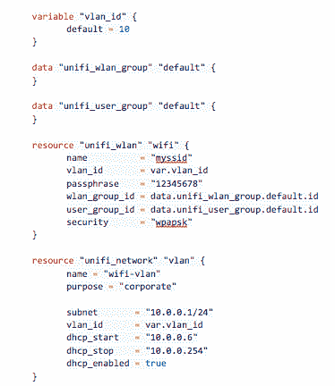
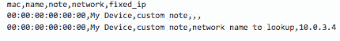
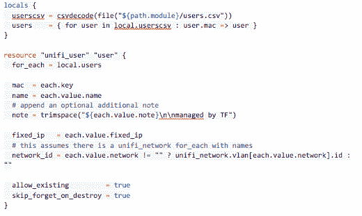

# 如何以基础设施为代码管理家庭网络

> 原文：<https://thenewstack.io/how-to-manage-a-home-network-with-infrastructure-as-code/>

[Paul Tyng](https://www.linkedin.com/in/ptyng/)

[Paul 是 HashiCorp 的一名工程经理，总部位于马里兰州的 Baltimore。他从事软件工程工作已有 20 多年，但仍然搞不懂打印机。](https://www.linkedin.com/in/ptyng/)

我决定利用假期休息的时间来检修我的家庭网络。当我开始我的项目时，我买了一个 [Unifi Dream Machine](https://store.ui.com/products/unifi-dream-machine) 家庭管理设备，因为除了我个人和客人的 SSIDs 之外，我的房子里还有一个公寓，我想对其流量进行分段。我还想在一些家庭自动化和物联网设备周围增加额外的安全层，这些设备通过第四个 SSID 添加到我们的家庭网络中。

我开始配置新的网络，我已经开始了 VLANs、子网 CIDRs 以及这些到 SSIDs 的映射的电子表格。此外，我需要跟踪防火墙规则、端口转发以及其他设置和配置。不用说，这需要维护和管理大量信息。

我的日常工作是开发基础设施即代码(IaC)产品 [HashiCorp Terraform，这是一款用于自动化和编纂基础设施供应的开源工具](https://www.terraform.io)。通过在我的浏览器中点击来将电子表格数据同步到 web 用户界面只是感觉乏味且容易出错——我肯定会犯一些错误。一定有更好的方法，所以我决定这是 Terraform 的自动化和版本控制功能可以帮助的一个领域。

## 我对地形整合的探索

我的第一步只是想看看有什么解决方案。别人也得有这个问题吧？他们是怎么解决的？也许已经有一个平台提供商了！

我第一次搜索“terraform unifi”带来了一些潜在的有希望的结果。一个在谷歌云上旋转控制器的模块和一个名为“terraform-provider-unifi”的存储库。开始了。不幸的是，当我点击进入时，看起来这个库只有自述文件和许可文件，还没有代码，所以其他人也有同样的想法，但是还没有取得太大的进展。

如果没有 Terraform 提供者，也许至少有一个 Go SDK，它将为我提供一种用 Go 编程语言与 API 对话的方式。我想，Go 是 Terraform 提供者通常使用的语言，也是我加入 HashiCorp 以来主要使用的语言。我确实在 GitHub 上找到了几个[，但是它们完全是](https://github.com/search?utf8=%E2%9C%93&q=unifi+language%3AGo&type=Repositories&ref=advsearch&l=Go&l=)[只读的](https://godoc.org/github.com/mdlayher/unifi)，而其他的似乎只是没有太多[创建、更新或删除](https://github.com/dim13/unifi)方法，或者在其他方面[缺乏功能](https://github.com/dsymonds/unifi)。

还有其他语言的 SDK，也就是看起来最流行的 PHP SDK。Ubiquiti 社区 Wiki 也有一些关于 Unifi 控制器 API 的文档，但是没有链接到现有的 SDK 包，所以看起来我不得不自己写一个 SDK。

## 编写 SDK

在调查现有的 SDK 时，我确实找到了一些对编写自己的 SDK 有用的信息。具体来说，我发现了认证流程的一个先例，但是为了发现创建、更新和删除方法是如何工作的，我需要通过浏览器中的开发工具开始收集示例。

我从我想在提供者中管理的三种 Unifi 数据类型开始:

1.  无线网络(在 API 中称为 WLANs)。
2.  网络(用于实现 VLANs)。
3.  客户端(在 API 中称为用户。)

一旦我获得了示例列表、get、create、update 和 delete 方法，我就能够找到 JSON 消息的结构、HTTP 方法和请求的 URL 模式。有了这些数据，我可以使用标准库的 net/http 包在 Go 中编写 SDK。

然而，我很快意识到为每个 API 端点手动这样做是非常乏味的。在之前的一份工作中，我曾经尝试从. jar 文件和 Java 中提取消息类型的信息。类文件，然后为 JSON 序列化生成 Go 结构。由于 Unifi 控制器是用 Java 编写的，我很好奇这种策略是否可行。

不幸的是。jar 文件是模糊的，我还没有找到一种方法从它的。类文件。然而在。jar 文件。json 文件(这里是一个 WLANs 的例子)列出了每个端点的所有字段。因此，我可以使用它来至少帮助确保我的 SDK 实现拥有服务器可以接受的所有数据元素。

## 编写提供程序

现在我有了 SDK，是时候编写(和测试)[提供者](https://github.com/paultyng/terraform-provider-unifi)了。Terraform 提供者是 Terraform 和另一个库或应用程序之间的集成，最常见的是像 AWS、Azure 或 Google Cloud 这样的云 API，但它可以为任何 API 编写(甚至为[订购披萨](https://github.com/ndmckinley/terraform-provider-dominos))。代码相对简单——我在 HashiCorp 工作时负责 Terraform，过去创建过多个集成([像 New Relic one](https://github.com/terraform-providers/terraform-provider-newrelic) )。

我从 HashiCorp 维护的[模板库](https://github.com/terraform-providers/terraform-provider-scaffolding)开始。除了模板之外，Terraform docs 网站上还有一大部分专门用于编写定制的 Terraform 提供程序。我们的网站上还有一些视频和其他资源来讲述这个过程。

我通常从创建 Terraform 配置文件开始，这些文件是我希望如何与 API 交互的示例，然后从那里创建支持这些文件的资源，但有许多方法可以实现这一点。在某些情况下，当我们细粒度地公开一个上游 API 时，我们从 API 定义开始，并试图尽可能忠实地翻译它们。

## 测试提供者

一旦我有了提供商，我需要能够端到端地测试它。一开始，我只是在我自己的网络控制器上测试了一下。然而，这也有一些缺点:

*   在我自己的网络上配置一些设备导致接入点重置它们的无线电，这导致我的笔记本电脑与 WiFi 断开连接，中断了测试，迫使我切换到硬连线。
*   如果你在上面计算，你会注意到我有四个 SSIDs，当时我认为每个控制器的最大值是四(我后来发现这是每个 WLAN 组的最大值)，但有一段时间，我只是删除了一个，并确保我的测试并发不超过一个。
*   它已经过生产测试，还会有什么问题呢？

根据我自己的网络进行测试也有一些其他的缺点，我们在其他 Terraform 提供商那里也遇到过，例如，它会使根据拉请求运行测试变得非常困难，或者使贡献者很难运行他们自己的测试。我挖了一会儿，找到了一些内部带有控制器的 docker 容器，在设置了一个 GitHub 动作后，我现在可以在 GitHub 上对我的所有代码进行端到端测试。

## 为我的网络编写配置

在我有了一个功能性的、经过测试的提供商之后，在 Terraform 中描述我的 VLANs、SSIDs、固定 IP 和其他网络配置选项就相对简单了。这是为您的 Unifi 控制器创建 VLAN 并将其映射到 SSID 的外观:

这是一个利用去年 Terraform [0.12 版本](https://www.hashicorp.com/blog/announcing-terraform-0-12/)中发布的几个新功能的好机会。有两个我特别想尝试的:csvdecode 和 resource for _each。当将 MAC 地址映射到 notes 和 fixed IPs 时，我认为这在 CSV 中更容易描述:

要将其映射到 unifi_client 资源中，代码如下所示:

您可以看到，我使用了 [locals](https://www.terraform.io/docs/configuration/locals.html) 来简化 CSV 解码，并将数据转换为以 MAC 地址为关键字的映射。这使得用 for_each 进行迭代更加简单，因为每个项目都有一个惟一的键来标识它的资源。

## 导入现有基础设施

既然我已经编写了描述我的网络的所有配置，我不想再从头开始创建它。相反，我想在我现有的基础设施上测试它，以确保我捕获了所有必要的东西。当我实现 provider 时，如果您从 Unifi 指定 ID，我还为每个资源实现了 terraform 导入功能。这有点棘手，因为 id 有时在 web UI 中并不明显。偶尔你可以从网址上找到它们。例如，在此 URL 中:

`https://unifi.ubnt.com/5.12.22.0/unifi/site/default/v2/settings/wifi/manage/edit/700cc880b9d3a0b50aab0636`

ID 是最后一个看起来像 24 位十六进制数的路径段。如果它们在 URL 中不可用，您必须直接从开发工具中的 API 请求中获取它们。

## 下一步是什么？

那么，提供商和我的家庭网络的下一步是什么？我想做的一件事是给提供者添加对 WebRTC 的支持。这就是 Unifi web 门户能够与您的本地控制器通信而无需在防火墙中打开端口的方式。可能不太可能，但我想调查一下。此外，我希望通过 Terraform 为供应商提供全面的服务，以管理 Unifi 控制器的所有部分。当然，我还需要购买更多的 Unifi 网络设备来进行测试。

<svg xmlns:xlink="http://www.w3.org/1999/xlink" viewBox="0 0 68 31" version="1.1"><title>Group</title> <desc>Created with Sketch.</desc></svg>