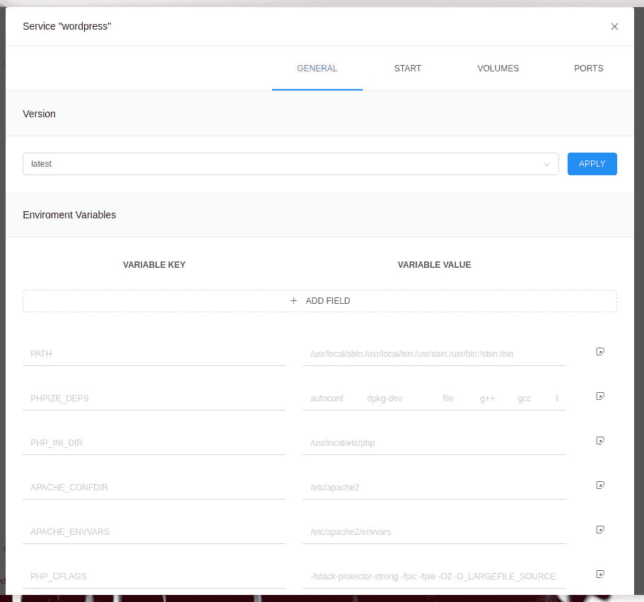

# 如何使用 DockStation 管理 Docker 容器

> 原文：<https://thenewstack.io/containers/how-to-manage-your-docker-containers-with-dockstation/>

当你去找一个 GUI 工具来管理你的 Docker [容器](https://thenewstack.io/containers/)时，你会发现比你想象的更多的选项。这些工具的范围从过于简单到非常复杂，以及介于两者之间的一切。然而，偶尔你会发现一个桌面客户端出色地简化了[容器管理](https://thenewstack.io/containers-microservices-two-peas-devops-pod/)。

一个这样的 GUI 是 [DockStation](https://dockstation.io/) ，它适用于 Linux、macOS 和 Windows，可以免费用于个人和启动使用。使用 DockStation，您会发现如下功能:

*   管理服务和容器
*   向后兼容性
*   统计、端口和日志监控
*   项目创建
*   内置解析器
*   观察者
*   将图像拖放到项目中
*   Docker 编写支持

对 DockStation 唯一的一个警告是，虽然它确实允许您在 localhost(安装应用程序的机器)上构建和管理项目，但您不能在远程主机上构建。但是，您可以使用远程连接的 Docker 服务器做很多事情。

让我们首先安装 DockStation，在本地机器上构建我们的第一个项目，然后将其连接到远程机器。我将在 [Pop 上演示！_OS Linux](https://pop.system76.com/) 并连接到安装了 Docker 的 Ubuntu Server 的远程实例。

## 如何安装 DockStation

DockStation 的安装非常简单。您需要做的第一件事是下载与您的操作系统兼容的安装程序文件。因为我使用的是基于 Debian 的发行版，所以我将下载。来自 [DockStation 下载页面](https://dockstation.io/)的 deb 文件。将文件存储到~/Downloads 目录，然后打开一个终端窗口。

在终端上，使用以下命令安装 DockStation:

`sudo dpkg -i ~/Downloads/dockstation*.deb`

如果出现安装错误，请使用以下方法解决问题:

`sudo apt-get install -f`

安装完成后，您就可以启动应用程序了。

## 启动 DockStation 并登录

启动 DockStation，在登录窗口(**图 1** )中，向 Google 或 GitHub 注册，或者点击立即注册并按照提示创建一个帐户。

**图 1:** 为 DockStation 创建一个帐户。

成功认证后，您将看到一个空的项目选项卡(**图 2** )。

**图 2:** DockStation 已经为您创建第一个项目做好了准备。

单击+创建新项目。在出现的窗口中(**图 3** ，给项目命名，然后设置一个存放项目文件和文件夹的路径。

**图 3** :在 DockStation 中创建新项目。

填写完所需信息后，单击 CREATE 添加新项目。

让我们构建一个 WordPress 项目。在搜索文件中键入 WordPress，然后当官方图片出现时(**图 4** ，将其从中间栏拖到右边。

**图 4** : WordPress 图片可以在 DockStation 中使用。

等待版本填充，然后从下拉列表中选择标有 *latest 的图像。*点击确定，图像将被添加。接下来，单击与图像相关联的齿轮图标，您可以编辑服务以完全满足您的需求(**图 5** )。

**图 5** :您可以在这里编辑常规、启动、音量和端口选项。

完成配置后，单击 OK，返回到项目窗口。点击与 WordPress 服务相关的 start 按钮来部署容器。

这就是在您的本地机器上使用 DockStation 创建一个非常基本的容器部署。

## 将 DockStation 连接到远程主机

这部分有点棘手，因为它隐藏在众目睽睽之下。我们将使用 SSH 作为连接到远程机器的方法。在此之前，我们需要生成一个 SSH 密钥，并将其复制到我们的远程主机。

要生成 SSH 密钥，请打开终端窗口并发出命令:

`ssh-keygen`

继续接受缺省值，当出现提示时，确保给密匙一个强密码。

生成密钥后，您必须使用以下命令将其复制到远程服务器:

`ssh-copy-id USER@SERVER`

其中，USER 是远程服务器上的用户名，server 是远程服务器的 IP 地址。

复制密钥后，现在可以将 DockStation 连接到远程服务器。为此，单击 Containers 选项卡，然后单击左上角 localhost 左侧的 edit 按钮(**图 6** )。

**图 6**:dock station 容器选项卡不仅显示所有正在运行的容器，还允许您连接到远程主机。

在出现的窗口中(**图 7** ，点击添加。

**图 7** :添加一个新的远程连接到 DockStation。

在出现的窗口中点击 SSH 选项卡，并填写必要的信息(**图 8** )。

**图 8:** 添加到远程主机的 SSH 连接的细节。

单击 OK，当出现提示时，键入您之前生成的 SSH 密钥的密码。现在，从 localhost 下拉列表(左上角)中选择您刚刚创建的新连接，然后单击 CONNECT。再次提示您输入 SSH 密钥密码。成功认证后，您将看到所有的容器都在您的远程服务器上运行(**图 9** )。

**图 9** :成功，我们现在可以管理远程服务器上的容器了。

给你。还有一个 Docker 贵由可以用来管理你的[容器部署](https://thenewstack.io/ci-cd-devops-and-containers-a-winning-trio/)。我承认我是 DockStation 的粉丝，但我真的希望它们能让从 GUI 中部署到远程服务器成为可能。即使有这样的警告，DockStation 仍然是一个很好的容器管理工具。

<svg xmlns:xlink="http://www.w3.org/1999/xlink" viewBox="0 0 68 31" version="1.1"><title>Group</title> <desc>Created with Sketch.</desc></svg>