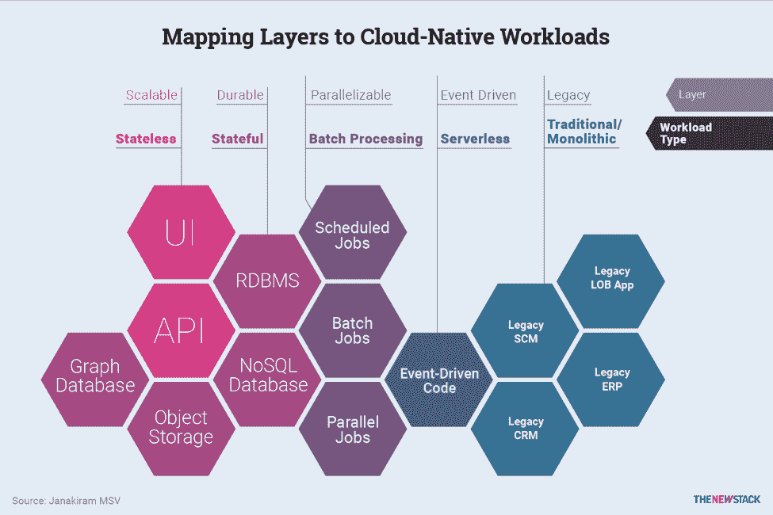

# 如何将应用层映射到云原生工作负载

> 原文：<https://thenewstack.io/how-to-map-application-layers-to-cloud-native-workloads/>

[云原生应用](https://thenewstack.io/10-key-attributes-of-cloud-native-applications/)由各种逻辑层组成，根据功能和部署模式进行分组。每一层都运行特定的微服务，用于执行细粒度的任务。这些微服务有的是无状态的，有的是有状态的，持久的。应用程序的某些部分可能作为批处理运行。代码片段可以被部署为响应事件和警报的功能。

这里的描述试图识别云原生应用的层。虽然它们被组合在一起表示，但每一层都是独立的。与分层堆叠的传统三层应用不同，云原生应用以扁平结构运行，每个服务公开一个 API。

图 2.1:今天的现代应用架构与单一的遗留系统相连接。

**可伸缩层**运行无状态服务，公开 API 和用户体验。该层可以根据运行时的使用情况动态扩展和收缩。在横向扩展操作期间，运行更多的服务实例，底层基础设施也可以横向扩展以满足 CPU 和内存需求。实施自动扩展策略是为了评估执行扩大和缩小操作的需求。

**耐久层**拥有由多语言持久性支持的有状态服务。它是多语言的，因为有各种各样的数据库可用于持久性。有状态服务依赖于传统的关系数据库、NoSQL 数据库、图形数据库和对象存储。每个服务选择一个与存储的数据结构一致的理想数据存储。这些有状态的服务公开了两者都使用的高级 APIs 来自可伸缩层和持久层的服务。

[cyclone slider id = " kubernetes-series-book-3-赞助商"]

除了无状态和有状态层，还有被分类为**可并行化层**的调度作业、批处理作业和并行作业。例如，计划作业可以每天运行一次提取、转换、加载(ETL)任务，以从对象存储中存储的数据中提取元数据，并填充 NoSQL 数据库中的集合。对于需要科学计算来执行机器学习训练的服务，计算是并行运行的。这些作业与底层基础设施公开的 GPU 进行交互。

为了触发平台中任何服务引发的事件和警报所导致的动作，云原生应用可以使用部署在**事件驱动层**中的一组代码片段。与其他服务不同，在这一层运行的代码没有打包成容器。而是直接部署 Node.js、Python 等语言编写的函数。这一层承载事件驱动的无状态函数。

云原生应用程序还可以在**遗留层与现有应用程序进行互操作。**传统的整体应用程序(如企业资源规划、客户关系管理、供应链管理、人力资源和内部业务线应用程序)通过服务进行访问。

企业将采用微服务来构建 API 层和用户界面(UI)前端，它们将与现有的应用程序进行互操作。在这种情况下，微服务增强并扩展了现有应用程序的功能。例如，他们可能必须与支持业务线应用程序的关系数据库进行对话，同时交付部署为微服务的弹性前端。

## 下一步:将工作负载映射到 Kubernetes 原语

云原生应用程序的每个服务都公开了一个定义良好的 API，供其他服务使用。对于服务内通信，gRPC 或 NATS 等协议因其高效的压缩和二进制兼容性而成为首选。REST 协议用于公开与外部世界交互的服务。

DevOps 团队将部署和通信模式与云原生平台(如 Kubernetes)公开的原语对应起来。他们需要打包、部署和管理这些在生产环境中运行的服务。本系列的下一篇文章将帮助用 Kubernetes 原语对齐和映射工作负载模式。

通过 Pixabay 的特征图像。

<svg xmlns:xlink="http://www.w3.org/1999/xlink" viewBox="0 0 68 31" version="1.1"><title>Group</title> <desc>Created with Sketch.</desc></svg>