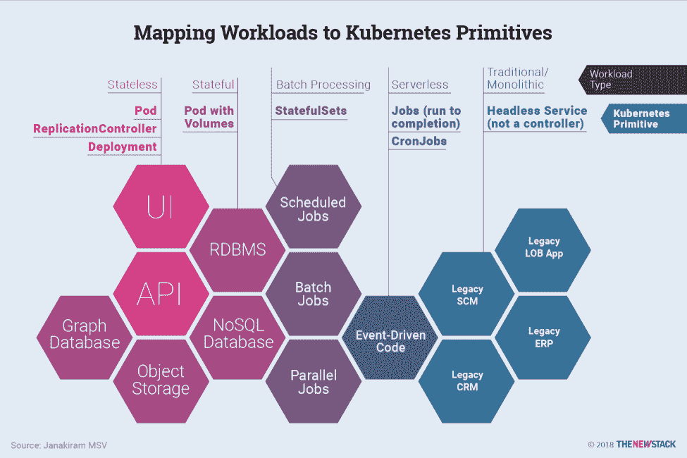

# 如何将云本地工作负载映射到 Kubernetes 控制器

> 原文：<https://thenewstack.io/how-to-map-cloud-native-workloads-to-kubernetes-controllers/>

[CloudBees](https://www.cloudbees.com/) 赞助了这篇文章。

Kubernetes 不仅仅是一个集装箱管理者[。这是一个旨在处理打包在任意数量的容器和组合中的各种工作负载的平台。Kubernetes 内置了多个控制器，可以映射到云原生架构的各个层。](https://thenewstack.io/how-kubernetes-is-transforming-into-a-universal-scheduler/)

DevOps 工程师可以将 Kubernetes 控制器视为一种手段，用于规定您的团队正在运行的各种工作负载的基础架构需求。他们可以通过声明性方法定义所需的配置状态。例如，作为 ReplicationController 的一部分部署的容器/pod 保证始终可用。打包成 DaemonSet 的容器保证可以在集群的每个节点上运行。声明性方法使 DevOps 团队能够利用诸如基础设施作为代码的范例。下面讨论的一些部署模式遵循不可变基础设施的原则，其中每个新的部署都会导致原子部署。

DevOps 工程师可以通过声明式方法定义所需的配置状态——每个工作负载映射到一个控制器。

## 了解云本机使用案例

Kubernetes 的控制平面持续跟踪部署，以确保它们符合 DevOps 定义的所需配置状态。

Kubernetes 的基本部署单位是一个单元。它是 Kubernetes 的基本构建块，是 Kubernetes 对象模型中最小和最简单的单元。一个 pod 表示集群上正在运行的进程。不管服务是有状态的还是无状态的，它总是作为一个 pod 打包和部署。

控制器可以在集群内创建和管理多个 pod，处理在集群范围内提供自我修复功能的复制。例如，如果一个节点出现故障，控制器可以通过在不同的节点上安排相同的更换来自动更换 pod。

Kubernetes 带有多个控制器来处理 pod 的期望状态。ReplicationController、Deployment、DaemonSet 和 StatefulSet 是控制器的几个例子。Kubernetes 控制器使用一个 pod 模板来创建它负责维护所需状态的 pod。像其他 Kubernetes 对象一样，pod 在 YAML 文件中定义并提交给控制平面。

在 Kubernetes 中运行[云原生应用](https://thenewstack.io/kubernetes-and-the-cloud-native-community/)时，运营商需要了解控制器解决的用例，以充分利用平台。这有助于他们定义和维护应用程序所需的配置状态。

上一节中解释的每个模式都映射到特定的 Kubernetes 控制器，这些控制器允许对 Kubernetes 上的工作负载进行更精确、更细粒度的控制，但是是以自动化的方式。

Kubernetes 的声明式配置鼓励不可变的基础设施。控制面板跟踪和管理部署，以确保在整个应用生命周期中保持所需的配置状态。与基于虚拟机的传统部署相比，DevOps 工程师维护工作负载所需的时间将大大减少。利用 Kubernetes 原语和部署模式的有效 CI/CD 策略将操作员从执行日常任务中解放出来。

### 可扩展层:无状态工作负载

在 Kubernetes 中，无状态工作负载被打包并部署为一个副本集。ReplicationController 构成了复制集的基础，它确保指定数量的 pod 副本在任何给定的时间总是运行。换句话说，复制控制器确保一个 pod 或一组同类的 pod 总是可用的。

如果有太多的 pod，复制控制器可能会终止多余的 pod。如果太少，复制控制器会继续发射额外的吊舱。与手动创建的 pod 不同，由 ReplicationController 维护的 pod 在失败、被删除或终止时会被自动替换。在中断性维护(如内核升级)后，会在节点上重新创建 pod。因此，即使应用程序只需要一个 pod，也建议使用 ReplicationController。

一个简单的用例是创建一个 ReplicationController 对象来可靠地无限期运行 pod 的一个实例。一个更复杂的用例是运行一个扩展服务的多个相同副本，如 web 服务器。在 Kubernetes 中部署时，DevOps 团队和操作员将无状态工作负载打包为复制控制器。

在 Kubernetes 的最新版本中，复制集取代了复制控制器。两者都处理相同的场景，但是 ReplicaSets 使用基于集合的标签选择器,这使得使用基于注释的复杂查询成为可能。此外，Kubernetes 中的部署依赖于副本集。

[cyclone slider id = " kubernetes-series-book-3-赞助商"]

部署是副本集的抽象。当在部署对象中声明了所需状态时，部署控制器以受控的速率将实际状态更改为所需状态。

强烈建议部署来管理云原生应用程序的无状态服务。尽管服务可以部署为单元和副本集，但是部署使得升级和修补应用程序更加容易。开发运维团队可以使用部署就地升级 pod，而使用复制集无法做到这一点。这使得在最短的停机时间内推出新版本的应用程序成为可能。部署为应用程序管理带来了类似平台即服务(PaaS)的功能。

### 耐久层:有状态工作负载

有状态工作负载可以分为两类:需要持久存储的服务(单实例)和需要以高度可靠和可用的模式运行的服务(复制多实例)。需要访问持久存储后端的 pod 与为关系数据库运行集群的一组 pod 非常不同。前者需要长期持久的持久性，而后者需要工作负载的高可用性。Kubernetes 解决了这两种情况。

单个 pod 可以由向服务公开底层存储的卷提供支持。卷可以被映射到 pod 被调度的任意节点。如果跨集群的不同节点调度多个 pod，并且需要共享后端，则在部署应用程序之前，需要手动配置分布式文件系统，如网络文件系统(NFS)或 Gluster。云原生生态系统中可用的现代存储驱动程序提供了容器原生存储，其中文件系统本身通过容器公开。当 pod 只需要持久性和耐用性时，使用此配置。

对于期望高可用性的场景，Kubernetes 提供了 stateful sets——一组专门的 pod，可以保证 pod 的有序性和唯一性。这在运行数据库集群的主/次配置(以前称为主/从配置)时特别有用。

像部署一样，StatefulSet 管理基于相同容器规范的 pod。与部署不同，StatefulSet 为其每个 pod 维护一个唯一的标识。这些 pod 是根据相同的规范创建的，但是不可互换:每个 pod 都有一个永久的标识符，它在任何重新调度中都保持这个标识符。

StatefulSets 适用于需要以下一项或多项功能的工作负荷:

*   稳定、唯一的网络标识符。
*   稳定持久的存储。
*   有序、优雅的部署和扩展。
*   有序、优雅的删除和终止。
*   有序的自动滚动更新。

Kubernetes 对待有状态集合的方式不同于其他控制器。当一个 StatefulSet 中的单元被安排有 N 个副本时，它们是按从 0 到 N-1 的顺序创建的。删除 StatefulSet 中的单元时，它们以相反的顺序终止，从 N-1 到 0。在对 pod 应用缩放操作之前，其所有前置任务都必须正在运行并准备就绪。Kubernetes 确保在一个 pod 终止之前，它的所有后继者都被完全关闭。

当服务需要运行 Cassandra、MongoDB、MySQL、PostgreSQL 或任何具有高可用性要求的数据库工作负载的集群时，建议使用 StatefulSets。

并不是每个持久工作负载都需要是有状态的集合。某些容器依赖持久存储后端来存储数据。为了给这些类型的应用程序添加持久性，pod 可能依赖于由基于主机的存储或容器本地存储后端支持的卷。

### 可并行化层:批处理

Kubernetes 具有用于批处理的内置原语，这对于执行从运行到完成的作业或调度作业非常有用。

“运行到完成”作业通常用于运行需要执行操作并退出的流程。一直运行到数据处理完毕的大数据工作负载就是这种工作的一个例子。另一个例子是处理队列中的每条消息直到队列变空的作业。

作业是一个控制器，它创建一个或多个 pod，并确保指定数量的 pod 成功终止。当 pod 成功完成时，作业会跟踪成功的完成。当达到指定的成功完成次数时，作业本身就完成了。删除作业将清理它创建的窗格。

一个作业还可以用来并行运行多个 pod，这使得它非常适合于机器学习培训作业。作业还支持并行处理一组独立但相关的工作项目。

当 Kubernetes 在配有 GPU 的硬件上运行时，机器学习训练可以利用乔布斯。新兴项目如 kube flow——一个致力于使机器学习在 Kubernetes 上的部署简单、可移植和可扩展的项目——将暴露原语，以将机器学习培训打包为作业。

除了运行并行作业之外，可能还需要运行计划作业。Kubernetes 公开的 CronJobs 可以在指定的时间点运行一次，也可以在指定的时间点定期运行。Kubernetes 中的 CronJob 对象类似于 Unix 中 crontab (cron 表)文件的一行。它以 cron 格式编写，按照给定的时间表定期运行作业。

Cron 作业对于安排数据库备份或发送电子邮件等定期作业特别有用。

### 事件驱动层:无服务器

无服务器计算是指构建和运行不需要服务器管理的应用程序的概念。它描述了一个更细粒度的部署模型，在该模型中，被捆绑为一个或多个功能的应用被上传到一个平台，然后被执行、扩展和计费，以响应当前所需的确切需求。

功能即服务(FaaS)在无服务器计算环境中运行，以提供事件驱动的计算。开发人员使用由事件或 HTTP 请求触发的函数来运行和管理应用程序代码。开发人员将小代码单元部署到 FaaS，这些代码单元根据需要作为离散的动作来执行，无需管理服务器或任何其他底层基础设施即可进行扩展。

虽然 Kubernetes 没有一个集成的事件驱动原语来响应其他服务引发的警报和事件，但人们努力引入事件驱动功能。Kubernetes 的保管人,[云本地计算基金会](https://www.cncf.io/)有一个专注于这些工作的无服务器工作组。开源项目如 [Apache OpenWhisk](https://openwhisk.apache.org/) 、[裂变](https://github.com/fission/fission)、 [Kubeless](https://github.com/kubeless/kubeless) 、 [OpenFaaS](https://github.com/openfaas/faas) 和 [Oracle 的 Fn](https://github.com/fnproject/fn) 可以在 Kubernetes 集群中运行，作为事件驱动的无服务器层。

部署在无服务器环境中的代码与打包成 pods 的代码有根本的不同。它由自治功能组成，这些功能可以连接到一个或多个可能触发代码的事件。

当事件驱动计算——无服务器计算——成为 Kubernetes 不可或缺的一部分时，开发人员将能够部署响应 Kubernetes 控制平面生成的内部事件以及应用服务引发的自定义事件的功能。

### 遗留层:无头服务

即使您的组织定期使用微服务架构在云容器中构建和部署应用程序，也可能有应用程序继续存在于 Kubernetes 之外。云原生应用和服务将不得不与这些传统的整体应用进行交互。

遗留层的存在是为了实现互操作性，公开一组指向单一应用程序的无头服务。无头服务允许开发人员以自己的方式自由发现，从而减少了与 Kubernetes 系统的耦合。Kubernetes 中的无头服务不同于 ClusterIP、NodePort 和 LoadBalancer 类型的服务。它们没有分配给它们的互联网协议(IP)地址，但有一个域名系统(DNS)条目指向外部端点，如 API 服务器、web 服务器和数据库。遗留层是一个逻辑互用性层，它维护对众所周知的外部端点的 DNS 记录。

微服务应用程序的每一层都可以映射到 Kubernetes 的一个控制器。根据他们希望部署的模式，DevOps 团队可以选择合适的选项。在我们的下一篇文章中，我们将讨论一些将云原生应用程序部署到 Kubernetes 的最佳实践。

云计算原生计算基金会是新堆栈的赞助商。

通过 Pixabay 的特征图像。

<svg xmlns:xlink="http://www.w3.org/1999/xlink" viewBox="0 0 68 31" version="1.1"><title>Group</title> <desc>Created with Sketch.</desc></svg>