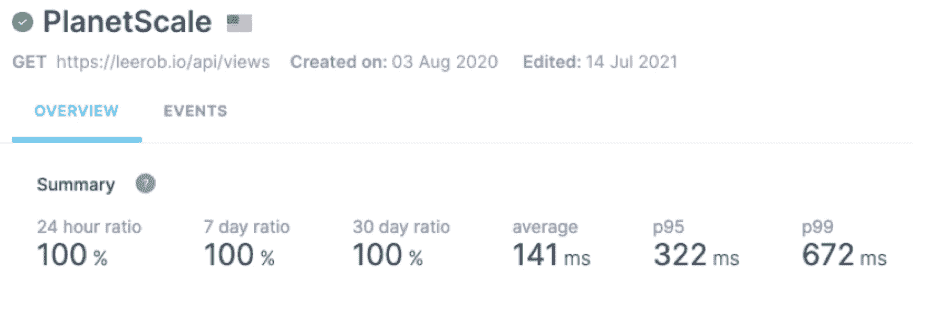
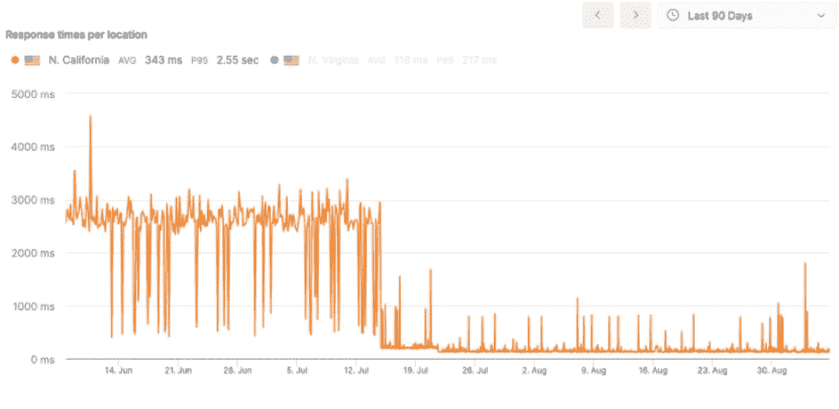

# 如何迁移到 PlanetScale 的无服务器数据库

> 原文：<https://thenewstack.io/how-to-migrate-to-planetscales-serverless-database/>

[](https://www.linkedin.com/in/leeerob/)

[Lee Robinson](https://www.linkedin.com/in/leeerob/)

[Lee Robinson 是一名开发人员、作家和创作者，他与 Vercel 的客户密切合作，并通过教育和培训来帮助发展 Next.js 社区。在加入 Vercel 之前，他在一家市值 100 亿美元的零售商那里负责网络开发。在空闲时间，他喜欢播放音乐、摄影/录像，并拥有自己的 YouTube 频道，拥有超过 16，000 名订户。](https://www.linkedin.com/in/leeerob/)

[](https://www.linkedin.com/in/leeerob/)[](https://www.linkedin.com/in/leeerob/)

作为一名开发人员，我总是试图通过实验和构建来学习新技术。我最近对无服务器数据库很感兴趣，它有望实现更快的部署、更高的可伸缩性和改进的开发人员体验。在测试了多种产品后，我决定将我的个人网站从使用 Firebase 和 [Redis](https://redis.com/?utm_content=inline-mention) 转移到 [PlanetScale](https://planetscale.com/) ，这是一个基于 MySQL 和 Vitess 的新的无服务器数据库平台，Vitess 是一个为 YouTube 提供支持的开源平台。

这就是我选择 PlanetScale 的原因:

*   **数据库分支:**我能够使用与 Git 相同的心智模型来使用我的数据库。对于我的数据库模式的每次更改，我都会打开一个部署请求。然后，我可以将这些更改合并回我的主数据库分支。
*   **Prisma 支持:**与 Prisma 结合使用，处理数据库迁移变得非常容易。
*   **无连接:**因为 PlanetScale 是无服务器的，所以它可以承受数千个同时连接。你几乎可以认为这是无连接的，因为我不需要担心合用或其他常见的异议 。
*   **10 秒内部署:**在测试了 13 个数据库后，PlanetScale 是部署 最快的 [。在使用它几个星期并监控性能后，我看到 API 平均在~ 150 毫秒内解决(见下面的结果)。](https://www.youtube.com/watch?v=0zmYHn82cY8)

## **Firebase 和 Redis**

我的网站以前使用 Google Firebase 和 Redis 来实时浏览博客文章和我的留言簿。选择这些技术的主要决定是学习。Firebase 和 Redis(通过 Upstash)都易于上手，无需思考即可扩展，并且在[无服务器环境](https://thenewstack.io/category/serverless/)中运行良好。然而，我想转向基于 SQL 的东西(MySQL 或 PostgreSQL)来获得新的学习体验。

## **重建 SQL**

我发现自己在 SQL 具有内置功能的地方编写 JavaScript。例如，我使用 Firebase 获取 JSON 对象视图，然后将这些值相加，得出视图总数。

```
const snapshot  =  await db.ref('views').once('value');

const views  =  snapshot.val();

const allViews  =  Object.values(views).reduce((total,  value)  =&gt;  total  +  value);

With SQL,  you can use SUM()  instead. 

SELECT SUM(count)  as total

FROM views;

```

排序也是如此。以前我使用 JavaScript `sort`，现在我可以使用`ORDER BY`。虽然 Firebase 确实有类似的东西，但是我没有用过。

```
SELECT *  FROM guestbook

ORDER BY updated_at DESC;

```

SQL 很无聊，是经过验证的技术。它已经存在了很多年，并将继续存在很多年。我在以前的工作中使用过它，但仍然觉得我可以更好地理解它。我也喜欢使用 PostgreSQL(并推荐 Supabase ),也强烈考虑过这个解决方案。

我也坚信应该使用我推荐的工具。如果没有亲自动手编写代码并在生产环境中运行应用程序，很难自信地向他人推荐一款产品。在使用 PlanetScale Vercel 集成后，我被震惊了。只需点击几下鼠标，我就可以部署整个全栈应用。正如我在开始时提到的，数据库迁移符合我的思维模式。

## 迁移现有数据

可能有更好的方法来做到这一点，但我将数据迁移到 PlanetScale 的黑客解决方案如下:

*   从我的 Firebase 实时数据库导出 JSON 数据
*   使用`HVALS`和 TablePlus 从我的 Redis 集群导出 JSON 数据
*   在 PlanetScale 中为模式迁移创建一个新的数据库分支，添加表
*   创建两个新的 API 路径，加载 JSON 数据和`INSERT INTO` MySQL
*   验证数据库分支上的 API 是否正确处理和迁移数据
*   用新的模式变更创建一个部署请求，并将其合并到`main`
*   最后，点击 API 将 JSON 数据迁移到`main`
*   搞定了。

下面是我用过的两个脚本，供参考。

```
import db from  'lib/planetscale';

import guestbookData from  'data/guestbook';

export default async function handler(req,  res)  {

   const toISOString  =  (unixTimestampInMs)  =&gt;

      new Date(unixTimestampInMs).toJSON().slice(0,  19).replace('T',  ' ');

   let query  =  `INSERT INTO guestbook  (email,  updated_at,  body,  created_by)

      VALUES  `;

   const escapeStr  =  (str)  =&gt;

      str

         .replace(/\\/g,  '\\\\')

         .replace(/\$/g,  '\\$')

         .replace(/'/g, "\\'")

      .replace(/"/g,  '\\"');

   guestbookData.forEach((item,  key)  =&gt;  {

      var value  =  JSON.parse(item['value']);

      query  +=  `("${

      value.email ? `${value.email}` : 'not@provided.com'

    }",  "${toISOString(value.updated_at)}",  "${escapeStr(value.body)}",  "${

      value.created_by

    }")`;

      if  (key  ===  guestbookData.length  -  1)  {

         query  +=  ';';

      }  else  {

         query  +=  ', ';

      }

   });

   const  [rows]  =  await db.query(query);

   return res.status(201).json(rows[0]);

}

import db from  'lib/planetscale';

import viewsData from  'data/views';

export default async function handler(req,  res)  {

   let query  =  `INSERT INTO views  (slug,  count)

      VALUES  `;

   const slugs  =  Object.keys(viewsData['views']);

   slugs.forEach((slug,  key)  =&gt;  {

      const count  =  viewsData['views'][slug];

      query  +=  `("${slug}",  ${count})`;

      if  (key  ===  slugs.length  -  1)  {

         query  +=  ';';

      }  else  {

         query  +=  ', ';

      }

   });

   const  [rows]  =  await db.query(query);

   return res.status(201).json(rows[0]);

}

```

这是我用来跟踪帖子浏览量和留言簿条目的 PlanetScale 模式。

```
CREATE TABLE  `views`  (

   `slug`  varchar(128)  NOT NULL,

   `count`  bigint NOT NULL DEFAULT  '1',

   PRIMARY KEY  (`slug`)

)

CREATE TABLE  `guestbook`  (

   `id`  bigint NOT NULL AUTO_INCREMENT,

   `email`  varchar(256)  NOT NULL,

   `body`  varchar(500)  NOT NULL,

   `created_by`  varchar(256)  NOT NULL,

   `created_at`  datetime(6)  NOT NULL DEFAULT CURRENT_TIMESTAMP(6),

   `updated_at`  datetime(6)  NOT NULL DEFAULT CURRENT_TIMESTAMP(6),

   PRIMARY KEY  (`id`)

)

```

## 结果

我一直在用 [Checkly](https://www.checklyhq.com/) 监控我的生产 API 连接到 PlanetScale 的性能。Checkly 允许我在出现停机或性能下降到我可接受的阈值以下时设置警报。到目前为止，我已经看到我的 Next.js API 路由有大约 150 毫秒的延迟，部署为美国东部 [Vercel](https://vercel.com/) 上的无服务器函数。



正如您在下图中看到的，这比我以前的 Firebase 实现产生了显著更快的响应时间(请注意我何时进行了切换)。此外，使用一个服务而不是两个服务清理了代码，并且需要更少的环境变量来连接每个服务。



<svg xmlns:xlink="http://www.w3.org/1999/xlink" viewBox="0 0 68 31" version="1.1"><title>Group</title> <desc>Created with Sketch.</desc></svg>