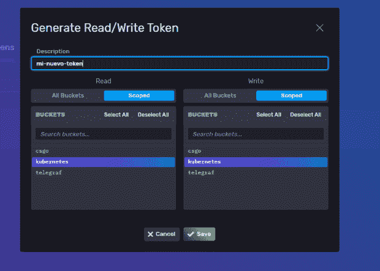

# 如何使用 Telegraf 和 InfluxDB 云监控 Kubernetes K3s

> 原文：<https://thenewstack.io/how-to-monitor-kubernetes-k3s-using-telegraf-and-influxdb-cloud/>

轻量级的 Kubernetes，被称为 [K3s](https://github.com/k3s-io/k3s) ，是 Kubernetes 在内存占用方面的一半大小。

您需要监控运行 K3s 的节点以了解集群的状态吗？您是否还需要了解您的 pod 的性能、它们消耗的资源以及网络流量？在本文中，我将向您展示如何使用 Telegraf 和 InfluxDB Cloud 监控 K3s。

我在 [Kubernetes](https://www.influxdata.com/solutions/kubernetes-monitoring-solution/?utm_source=vendor&utm_medium=referral&utm_campaign=2022-10_k8-demo_global&utm_content=tns) 上运营一个博客和一些其他资源。具体来说，这些运行在 DigitalOcean 中运行 K3s 的三个节点的集群中，我使用 Telegraf 和 InfluxDB 来监控一切。

我将演示如何监控集群以确保一切都按预期运行，以及如何识别不符合预期的情况。

为了监控集群，我使用了两个组件:

[InfluxDB Cloud](https://www.influxdata.com/products/influxdb-cloud/?utm_source=vendor&utm_medium=referral&utm_campaign=2022-10_k8-demo_global&utm_content=tns) :从外部进行监控是最理想的，因为如果我们从内部进行监控，并且节点出现故障，那么监控解决方案也会出现故障，这没有任何意义。你可以在这里获得一个免费的 InfluxDB 账号:[https://cloud2.influxdata.com/signup/](https://cloud2.influxdata.com/signup)

接下来，我们需要安装一个来自 [Telegraf](https://www.influxdata.com/time-series-platform/telegraf/?utm_source=vendor&utm_medium=referral&utm_campaign=2022-10_k8-demo_global&utm_content=tns) 的舵图，特别是[这个](https://artifacthub.io/packages/helm/telegraf-ds-k3s/telegraf-ds-k3s)，因为它没有 Docker 引擎支持，如果你运行 K3s，就不需要它。

让我们开始吧…

# 配置 InfluxDB 云

我们必须做的第一件事是在 InfluxDB Cloud 中创建一个帐户。接下来，我们转到数据部分，单击**存储桶**，然后单击**创建存储桶**。


命名存储桶并点击**创建**。


这就是我们的桶列表应该看起来的样子。成功创建存储桶后，我们创建一个访问令牌，以便能够将数据写入该存储桶。为此，我们转到**代币**选项卡。


在这一部分，我们点击**生成令牌**并选择**读/写令牌**选项。


我们指定一个名称，选择我们希望与这个令牌相关联的 bucket，然后单击 **Save** 。



完成后，新令牌将出现在令牌列表中。


要完成这一部分，我们需要我们的组织 ID 和指向我们的 Telegraf 的 URL。

组织 ID 是您用来注册 InfluxDB Cloud 的电子邮件。我从地址栏得到了网址。以我为例，当我设置我的 InfluxDB 云帐户时，我选择了美国西部。所以我的网址是这样的:

https://us-west-2-1.aws.cloud2.influxdata.com

现在我们已经配置了 InfluxDB Cloud，我们需要配置节点。

正如我上面提到的，我们将使用舵图。我修改了这个头盔图以适应 K3s，因为默认情况下它试图监控 Docker，而这个 Docker 在这个 Kubernetes 发行版中没有使用。

如果您没有安装 Helm，可以通过运行以下命令进行安装:

`$ curl https://raw.githubusercontent.com/helm/helm/master/scripts/get-helm-3 |bash`

安装完成后，在这里下载 values.yaml 文件。

还可以抓取原始文件，用`wget`直接下载到主节点。

`$ wget https://raw.githubusercontent.com/xe-nvdk/awesome-helm-charts/main/telegraf-ds-k3s/values.yaml`

现在，我们必须稍微修改一下这个文件。我们需要打开它并修改输出部分。默认情况下，文件如下:

```
...

## Exposed telegraf configuration
## ref: https://docs.influxdata.com/telegraf/v1.13/administration/configuration/
config:
  # global_tags:
  #   cluster: "mycluster"
  agent:
    interval:  "10s"
    round_interval:  true
    metric_batch_size:  1000
    metric_buffer_limit:  10000
    collection_jitter:  "0s"
    flush_interval:  "10s"
    flush_jitter:  "0s"
    precision:  ""
    debug:  false
    quiet:  false
    logfile:  ""
    hostname:  "$HOSTNAME"
    omit_hostname:  false
  outputs:
    -  influxdb:
        urls:
          -  "http://influxdb.monitoring.svc:8086"
        database:  "telegraf"
        retention_policy:  ""
        timeout:  "5s"
        username:  ""
        password:  ""
        user_agent:  "telegraf"
        insecure_skip_verify:  false
  monitor_self:  false

```

但是既然要用 InfluxDB 云，就必须做一些调整。修改后的版本看起来会像这样:

```
...

## Exposed telegraf configuration
## ref: https://docs.influxdata.com/telegraf/v1.13/administration/configuration/
config:
  # global_tags:
  #   cluster: "mycluster"
  agent:
    interval:  "1m"
    round_interval:  true
    metric_batch_size:  1000
    metric_buffer_limit:  10000
    collection_jitter:  "0s"
    flush_interval:  "10s"
    flush_jitter:  "0s"
    precision:  ""
    debug:  false
    quiet:  false
    logfile:  ""
    hostname:  "$HOSTNAME"
    omit_hostname:  false
  outputs:
    -  influxdb_v2:
        urls:
          -  "https://us-west-2-1.aws.cloud2.influxdata.com"
        bucket:  "kubernetes"
        organization:  "miemail@midominio.com"
        token:  "WIX6Fy-v10zUIag_dslfjasfljadsflasdfjasdlñjfasdlkñfj=="
        timeout:  "5s"
        insecure_skip_verify:  false
  monitor_self:  false

```

如果我们需要调整其他值，如收集间隔，您可以通过更改间隔值来实现。比如我不需要 10 秒一次的数据，就改成 1 分钟一次。

现在我们到了关键时刻！我们要安装舵轮图，看看是否一切如预期般运作。根据您的 K3s 配置，您可能需要将集群配置作为一个`KUBECONFIG`环境变量来传递。

`$ exportKUBECONFIG=/etc/rancher/k3s/k3s.yaml`

一旦完成，我们将添加[牛逼掌舵图](https://github.com/influxdata/helm-charts/tree/gh-pages)回购。

`$ helm repo add awesome-helm-charts https://xe-nvdk.github.io/awesome-helm-charts/`

然后我们更新我们配置的 repos 的内容。

`$ helm repo update`

最后，我们将安装 repo，将我们刚刚在`values.yaml`*文件中修改的配置传递给它。*

 *`$ helm upgrade --install telegraf-ds-k3s -f values.yaml awesome-helm-charts/telegraf-ds-k3s`

终端应该返回类似这样的内容:

```
Release  "telegraf-ds-k3s"  does not exist.  Installing it now.
NAME:  telegraf-ds-k3s
LAST DEPLOYED:  Fri Jun  25  22:47:22  2021
NAMESPACE:  default
STATUS:  deployed
REVISION:  1
TEST SUITE:  None
NOTES:
To open  a  shell session in the container running Telegraf run the following:

-  kubectl exec  -i  -t  --namespace default  $(kubectl get pods  --namespace default  -l  app.kubernetes.io/name=telegraf-ds  -o  jsonpath='{.items[0].metadata.name}')  /bin/sh

To tail the logs for  a  Telegraf pod in the Daemonset run the following:

-  kubectl logs  -f  --namespace default  $(kubectl get pods  --namespace default  -l  app.kubernetes.io/name=telegraf-ds  -o  jsonpath='{ .items[0].metadata.name }')

To list the running Telegraf instances run the following:

-  kubectl get pods  --namespace default  -l  app.kubernetes.io/name=telegraf-ds  -w

```

此输出表明舵图部署成功。请记住，这是一个 DaemonSet，它会自动在集群中的每个节点上安装 Helm Chart。

要检查一切是否正常运行，请使用以下命令:

`$ kubectl get pods`

我们看到我们的豆荚还活着。

```
AME                    READY STATUS    RESTARTS AGE
telegraf-ds-k3s-w8qhc 1/1 Running 0          2m29s

```

如果您想确保日志按预期运行，那么运行:

`$ kubectl logs -f telegraf-ds-k3s-w8qhc`

终端应该输出如下内容:

```
2021-06-26T02:55:22Z  I!  Starting Telegraf  1.18.3
2021-06-26T02:55:22Z  I!  Using config file:  /etc/telegraf/telegraf.conf
2021-06-26T02:55:22Z  I!  Loaded inputs:  cpu disk diskio kernel kubernetes mem net processes swap system
2021-06-26T02:55:22Z  I!  Loaded aggregators:
2021-06-26T02:55:22Z  I!  Loaded processors:
2021-06-26T02:55:22Z  I!  Loaded outputs:  influxdb_v2
2021-06-26T02:55:22Z  I!  Tags enabled:  host=k3s-master
2021-06-26T02:55:22Z  I!  [agent]  Config:  Interval:10s,  Quiet:false,  Hostname:"k3s-master",  Flush Interval:10s

```

一切似乎都很好，但现在是关键时刻了。我们转到我们的 InfluxDB 云帐户，导航到 **Explore** 部分，我们应该会看到一些测量结果，当然，还有一些选择存储桶时的数据。


如您所见，这个过程并不像看起来那么复杂。舵图简化了我们的生活，从现在开始，我们可以使用外部系统来查看我们的集群发生了什么。

<svg xmlns:xlink="http://www.w3.org/1999/xlink" viewBox="0 0 68 31" version="1.1"><title>Group</title> <desc>Created with Sketch.</desc></svg>*