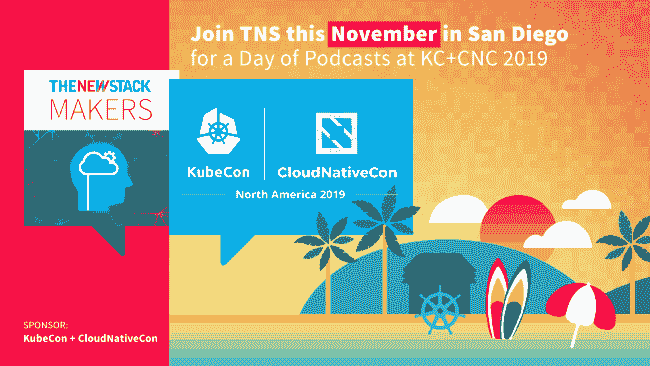

# 如何为 Kubernetes 工作负载导航多个网络

> 原文：<https://thenewstack.io/how-to-navigate-multiple-networks-for-kubernetes-workloads/>

依靠多个网络来管理您的 Kubernetes pods 通常没什么大不了的。对于 webscale 应用程序，这个过程通常包括向多个网络发送流量，这就是故事的结尾。但是对于网络密集型工作负载，您可能需要不止一条路才能到达目的地。


高性能网络应用通常需要将控制平面与数据平面分开。这种类型的体系结构通常用于考虑安全因素(或者不将数据暴露给另一个网络)以及考虑不同网络之间的数据速度。这是我们需要多个网络来处理 Kubernetes 工作负载的原因之一——因为我们的工作负载本身就是网络应用程序，需要找到一种方法来实现这种架构。

## 在 Kubernetes 中调用多个 CNI 插件

 [道格·史密斯

Doug 是 Red Hat 首席技术官办公室的首席软件工程师。Doug 专注于网络功能虚拟化和容器技术，他将新的网络技术与 Kubernetes 和 OpenShift 等容器系统集成在一起。他是网络管道工作组的成员，也是 OpenShift、Multus CNI 和 NFV 相关项目的贡献者。](https://www.linkedin.com/in/dougsmithvt/) 

在 Kubernetes 中，我们假设每个 pod 有一个网络接口。这个特殊的接口是由 [CNI(集装箱网络接口)](https://github.com/containernetworking)创建的，这是一个用于你的 pod 到 pod 连接的插件(如法兰绒、印花布、编织等)。CNI 是一种 CNCF 标准，Kubernetes 利用它有很多原因，包括它的简单性和使网络设置可扩展的能力。这让 Kubernetes 不必对所有可能的网络场景都很聪明，CNI 让你(或你的供应商，或你最喜欢的开源社区)很容易创建 CNI 插件。CNI 为你打开了那扇门，并简化了你如何将 pod 连接到你的网络(或其他容器编排系统，因为 CNI 是平台无关的)。作为一名开发人员，很容易理解 CNI 规范。

但是 CNI 本身并不局限于每个 pod 只有一个网络接口。相反，标准本身早就支持多种接口。社区一直在努力在 Kubernetes 中公开这一功能。现在在 Kubernetes 中，你可以使用的一种方法是使用“CNI 元插件”一个 CNI 元插件是一个 CNI 插件，也可以调用其他 CNI 插件。我可以想象艾勒比说:“我听说你喜欢 CNI 插件，所以，我把你的 CNI 插件放到了 CNI 插件里。”


通过使用一个 CNI 元插件，你可以调用多个 CNI 插件。这些 CNI 插件中的每一个都在你的 pod 中创建了一个额外的网络接口。假设您执行了`ip`命令来查看 pod 中的界面，例如:

```
kubectl exec  -it mypod  --  ip  a

```

通常，您只会看到两个接口，一个环回接口和“eth0”(通过 CNI 连接到默认的集群范围的点对点网络)。

当您对 Kubernetes 集群中提供的元插件发出相同的命令时，您可能会看到许多其他插件列在那里——当然，通常您仍会看到“eth0 ”,这是您默认的集群式 pod 到 pod 连接，但除此之外，您可能会看到“net0”和“net1 ”,它们可能会被其他 CNI 插件探测到——例如，它可以使用像 macvlan 或 ipvlan 这样的[参考 CNI 插件](https://github.com/containernetworking/plugins)(等等！).一种流行的用法是使用 [SR-IOV 设备插件](https://github.com/intel/sriov-network-device-plugin)和 [SR-IOV CNI 插件](https://github.com/intel/sriov-network-device-plugin)，以便利用 SR-IOV 的能力来加速数据平面流量。

## 多个网络的自定义资源定义

Kubernetes [网络管道工作组](https://github.com/K8sNetworkPlumbingWG/community)一直致力于正式制定一个标准化的 CRD(自定义资源定义),以定义如何在 Kubernetes 中表达您将多个网络连接到您的 pod 的意图。CRDs 是一种扩展 Kubernetes API 的方法，它为 Kubernetes 应用程序提供了一种通用语言来查询来自 Kubernetes API 的数据。该组织在北美的 KubeCon + CloudNativeCon 2017 上成立，它已经[发布了 CRD](https://github.com/K8sNetworkPlumbingWG/multi-net-spec) 的规范。对此有一个规范有助于使 Kubernetes 用户的用户体验正常化，他们可能希望在幕后改变技术，但仍然暴露相同的旋钮。

值得注意的是，工作组编写的标准包括 CNI 元插件，但并不严格限于元插件——所以其他方法也可以实现该标准。

网络管道工作组实际上是一个社区的努力，欢迎所有希望参与这项工作的人，他们正在精心制定规范，以适应更多的情况，从而使 Kubernetes 在您额外连接的网络上提供的所有功能变得有用。

网络管道工作组的成员也一直致力于将[木尔图斯 CNI](https://github.com/intel/multus-cni) 作为标准化 CRD 的参考实现。标准化的 CRD 被称为“NetworkAttachmentDefinition”，Multus 允许用户使用 NetworkAttachmentDefinition 指定其他网络。每当创建或删除一个 pod 时，Multus 就会采取行动(通过 CNI ),并向 Kubernetes API 查询 NetworkAttachmentDefinitions，以确定除了集群范围的默认网络之外还应该调用哪些插件，以便在 pod 中创建额外的网络接口供您的工作负载使用。


自然，作为一个铁杆网络用户，你可能会问这样一个问题，“如果网络不使用传统的基于内核的接口，就像你在发出`ip a`时看到的那样，比如用户空间网络，那该怎么办？”答案是网络管道工作组的规范也考虑到了这些因素。甚至还有一个[用户空间 CNI 插件](https://github.com/intel/userspace-cni-network-plugin)可以帮助你利用用户空间网络技术。

还存在其他 CNI 元插件，其中一些采用了稍微不同的方法，可能存在于 CNI 元插件的严格定义范围内，但所有这些都值得你花时间去评估。这些工具包括 [DANM](https://github.com/nokia/danm) 、[针织机](https://github.com/ZTE/Knitter)、 [CNI 精灵](https://github.com/cni-genie/CNI-Genie)，如果你是一个使用 Kubernetes 平台的虚拟机用户，请务必看看 [kuryr-kubernetes](https://github.com/openstack/kuryr-kubernetes) 。

想了解更多？加入我在圣地亚哥 KubeCon 的[演讲](https://sched.co/UabS)，开始一次将多个网络接口连接到豆荚的旅程。



<svg xmlns:xlink="http://www.w3.org/1999/xlink" viewBox="0 0 68 31" version="1.1"><title>Group</title> <desc>Created with Sketch.</desc></svg>