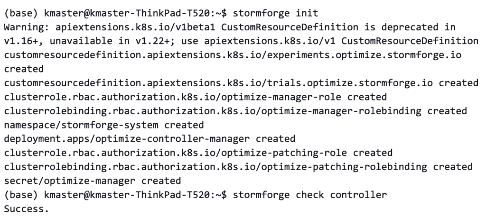
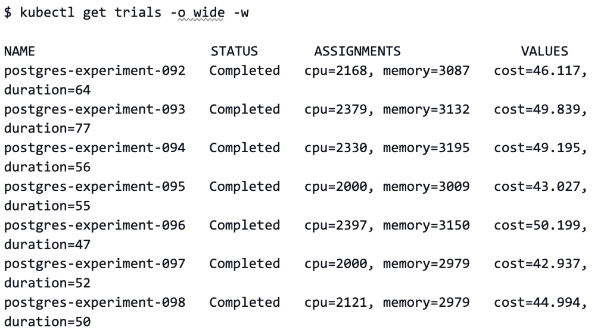
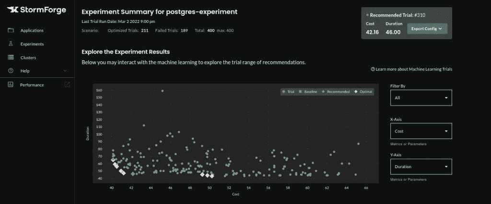

# 如何在 Kubernetes 中优化数据库效率

> 原文：<https://thenewstack.io/how-to-optimize-database-efficiency-in-kubernetes/>

这是包含 Kubernetes 资源管理和优化的五部分系列的最后一部分。在本文中，我们将带您逐步了解 Kubernetes 最棘手的优化挑战之一——数据库。本系列之前的文章 *解释了* [*Kubernetes 资源类型*](https://thenewstack.io/understanding-kubernetes-resource-types/)*[*请求和限制*](https://thenewstack.io/kubernetes-requests-and-limits-demystified/)*[*使用机器学习来自动化优化*](https://thenewstack.io/using-machine-learning-to-automate-kubernetes-optimization/)*[*优化 Java 应用*](https://thenewstack.io/how-to-optimize-java-apps-on-kubernetes/) *。****

 **[布莱恩·利科萨

Brian 是一名开源极客，热衷于在人和技术的交叉点上工作。在他的职业生涯中，他一直参与开源，无论是在 Red Hat 时参与 Linux、Ansible 和 OpenShift/Kubernetes，还是在 Confluent 时参与 Apache Kafka，或者在 AWS 时参与 Apache Flink。他目前是 StormForge 的高级解决方案架构师，住在芝加哥地区，喜欢恐怖、体育、现场音乐和主题公园。](https://www.linkedin.com/in/brianlikosar/) 

从一开始，Kubernetes 中自动化的使用就大大简化了容器管理。尽管最初设计时考虑的是无状态应用程序，但 Kubernetes 环境已经成为各种数据库技术的家园。由于其可伸缩性和灵活性，数据库管理员可以使用 Kubernetes 来支持 SQL 数据库集群的可用性。

然而，在 Kubernetes 环境中运行数据库面临一些独特的挑战。在 Kubernetes 中优化数据库的性能需要权衡集群的资源。

本文讨论了在 Kubernetes 集群中优化数据库性能和有效权衡资源使用的一些最佳实践。然后演示如何在 Kubernetes 上运行数据库，并展示如何查看对集群性能的影响。

## 数据库性能和 Kubernetes 资源权衡

当在 Kubernetes 上运行数据库等有状态组件时，我们可以采取几个步骤来平衡和优化性能和资源使用之间的权衡:

1.  了解所需的组件。
2.  选择 Kubernetes 友好的数据库类型。
3.  使用负载平衡器。
4.  了解复制模式。

## 了解所需的组件

由于 Kubernetes 容器更适合无状态工作负载，运行有状态资源需要调整一些元素，以防止容器失败时数据丢失。这些组件是 StatefulSets、PersistentVolumes 和 PersistentVolumeClaims。

StatefulSets 的功能是确保 pod 的有序性和唯一性。它们是一组处理有状态应用程序的对象资源 API。在有状态应用程序中部署 pod 的过程中，每个 pod 都有一个唯一的 ID，当 pod 出现故障时，可以将 pod 重新连接到持久性存储。

在 Kubernetes，存储管理是一个相当大的压力。为了减少这种情况，我们可以使用 PersistentVolume (PV ),它是连接到 pod 的群集中的独立资源存储。我们可以使用存储类手动或动态地临时配置 PVs。使用 PV 会创建一个 PersistentVolumeClaim (PVC)，它允许特定用户提取和使用 PV 资源。

## 选择 Kubernetes 友好的数据库类型

如果您的组织在 Kubernetes 中运行它的有状态工作负载，那么您必须确定运行哪种类型的数据库来获得最佳的性能和资源使用。由于 pod 是暂时的，因此故障转移的可能性比传统管理的数据库更大。选择一个具有水平分片、复制(如 MongoDB 或 Cassandra)和故障转移选择等功能的数据库是至关重要的。

对 Kubernetes 不友好的数据库(如 MySQL 和 PostgreSQL)可以使用 Kubernetes 操作符来执行数据库性能和维护任务，如备份和复制。MySQL 操作符包括 PostgreSQL 的 [CrunchyData](https://github.com/CrunchyData/postgres-operator) 和 Oracle MySQL 的。运营商添加了一层功能，如分片和领导者选举，以成功部署在 Kubernetes 上。

## 使用负载平衡器

如果应用程序在不同的 Kubernetes 集群中，负载平衡器会很有帮助。向外部公开数据库的能力为用户增加了应用程序的可靠性。您可以在各种公共云提供商上使用网络负载平衡器(NLB)。

## 了解复制模式

最后，请确保您了解组件和数据库中可用的复制模式。同步模式使用更多资源，而如果 pod 在数据复制之前终止，异步模式可能会导致数据丢失。

## 优化数据库性能和资源使用

在 Kubernetes 中，数据库性能和资源使用(CPU 和内存)之间有直接的关联。数据库性能可以用不同的方法来衡量，包括响应时间、吞吐量和持续时间。在进一步探讨这个概念之前，让我们回顾一下这些指标之间的区别。

*   **响应时间**是从发送请求到收到请求的总时间。响应时间越短，Kubernetes 集群的性能就越好。
*   **吞吐量**是对存储设备传输的数据量的估计。它通常以每秒比特数(bps)、每秒兆比特数(Mbps)或每秒千兆比特数(Gbps)来度量。
*   **持续时间**是处理一个给定事件所花费的时间，以秒为单位。

一般来说，分配给应用程序的资源越多，它执行得越好越快。然而，要找到合适的资源设置来最大限度地降低成本，同时仍能实现合适的性能水平，这是一项挑战。幸运的是，基于机器学习的优化解决方案可以让这个过程变得更容易。

在本文的剩余部分，我们将使用 [StormForge Optimize Pro](https://www.stormforge.io/how-stormforge-optimize-pro-works/) 一步步地优化一个示例数据库。请注意，如果您使用不同的优化解决方案，这个过程会有所不同。

## 数据库优化演示

优化过程的第一步是定义要优化的指标。在这个例子中，我们将尝试最小化成本和持续时间，认识到这两个指标之间存在权衡。

这些优化指标定义如下。

```
  metrics:
  -  name:  cost
    minimize:  true
    query:  '{{ resourceRequests .Target "cpu=0.017,memory=0.000000000003" }}'
    target:
      apiVersion:  v1
      kind:  PodList
      matchLabels:
        app.kubernetes.io/instance:  postgres-stormforge-example
        app.kubernetes.io/name:  postgres
  -  name:  duration
    minimize:  true
    query:  '{{ duration .StartTime .CompletionTime }}'

```

这里我们声明了两个指标——成本和持续时间——并将这两个指标的 minimize 值设置为 true。这确保了我们的配置被调整为最小化这两个指标。

您可能已经注意到，我们将使用 PostgreSQL 作为示例数据库。大多数数据库都提供了一个性能测量基准实用程序，可以提供一致的结果(比如 PostgreSQL 的 [pgbench](https://www.postgresql.org/docs/9.1/pgbench.html) )。在 Kubernetes 中运行 PostgreSQL 数据库更容易使用带有操作符的 pgbench。

pgbench 基准测试工具执行 PostgreSQL 测试。为了优化基准持续时间，我们在相对较长的时间内运行测试。这将过滤掉多余的噪音。在某些情况下，测试必须额外运行几次，以找到最佳的可重现数字。

此外，在测试许多会话时，pgbench 是一个瓶颈。您可以通过在 Kubernetes 集群上并发运行 pgbench 的几个实例来缓解这个问题。

## 在 Kubernetes 运行数据库

在我们继续优化流程之前，您需要:

*   当前集群中的一个正在运行的 Kubernetes 集群和一个 kubectl 命令行。如果你还没有集群，你可以试试 [minikube](https://minikube.sigs.k8s.io/docs/tutorials/multi_node/) 。要为您的虚拟机(VM)分配足够的资源，您可以使用以下命令:

`minikube start --memory 5120 --cpus=4 --kubernetes-version=v1.20.1`

如果您的集群正在运行并且已经创建了 StormForge 帐户，您可以在**集群**选项卡上的**管理集群**下看到您的集群。

## 初始化 StormForge 控制器

现在，首先使用命令行登录，初始化 StormForge 控制器:

`stormforge login`

如果这不起作用，请使用:

`stormforge login --force`

认证之后，使用`stormforge init`初始化集群中的 StormForge 控制器，使用`stormforge check controller`验证您的控制器正在运行。

输出应该如下所示:



## 创造实验

我们将使用一个 [Postgres 示例](https://github.com/thestormforge/examples/tree/main/postgres)来创建一个数据库并进行实验。

最好的方法是在本地环境中克隆存储库，并将目录更改为 postgres。在命令行上，运行以下命令:

```
cd examples/postgres
kubectl create ns postgres

kubectl apply  -f

```

输出应该是:

```
experiment.optimize.stormforge.io/pg created
secret/postgres-secret created
service/postgres created
deployment.apps/postgres created

```

现在，使用`kubectl get deployments -n postgres`检查部署。您应该看到您的部署正在运行:


我们刚刚运行的命令部署 Postgres 并为我们的 Postgres 应用程序配置 CPU 和内存限制。StormForge 控制器使用 pgbench 调度试验，以启动 Postgres 实例上的工作负载。

您可以使用 kubectl 通过以下命令查看试运行:



让我们进一步检查这个输出。

我们的实验包括[三个主要部分](https://docs.stormforge.io/optimize-pro/concepts/):试验、参数和指标。试验是实验的单独运行，而参数是我们可以在实验中从一次试验到另一次试验进行调整的赋值。在我们的应用程序中，CPU 和内存是我们在 experiment.yaml 文件中分配的参数。在定义我们的参数时，我们还必须声明参数的最小值、最大值和基线值。experiment.yaml 文件对此的描述如下:

```
  parameters:
  -  name:  cpu
  baseline:  4000
  min:  2000
  max:  4000
  -  name:  memory
  baseline:  4096
  min:  2048
  max:  4295

```

指标是实验中的试验结果，在我们的例子中是持续时间和成本。

基于这些指标，您可以很容易地比较哪些试运行提供了成本和持续时间之间的最佳平衡。在为数据库确定最佳集群配置时，这些信息可以节省宝贵的时间，如下图所示。

[](https://cdn.thenewstack.io/media/2022/08/33a4258c-image1.jpg)

## 结论

本文介绍了 Kubernetes 中数据库性能和资源使用的权衡。它研究了优化集群中数据库性能的一些最佳实践，包括了解所需的组件、确定数据库和函数的适用性，以及最有效地使用同步和异步模式来确保高效的数据库性能和最小化数据丢失。

然后，本文描述了 Kubernetes 集群中数据库性能优化和资源使用之间的权衡。响应时间、基准持续时间和吞吐量等指标是需要考虑的重要因素。最后，它展示了如何使用像 [StormForge](https://www.stormforge.io/) 这样的机器学习优化解决方案来提高集群性能，同时最小化 Kubernetes 中运行的数据库的资源使用。

<svg xmlns:xlink="http://www.w3.org/1999/xlink" viewBox="0 0 68 31" version="1.1"><title>Group</title> <desc>Created with Sketch.</desc></svg>**