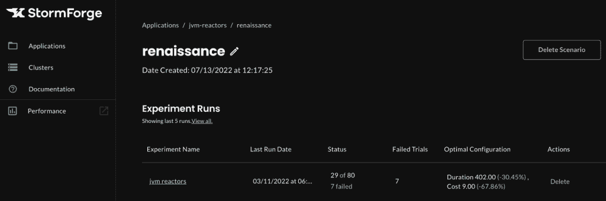
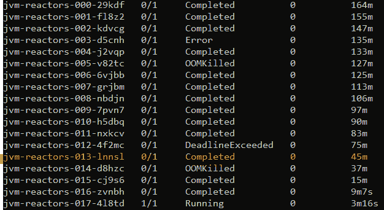

# 如何优化 Kubernetes 上的 Java 应用

> 原文：<https://thenewstack.io/how-to-optimize-java-apps-on-kubernetes/>

[Patrick Tavares](https://www.linkedin.com/in/patrick-tavares-6a33119/)

[Patrick 是 StormForge 的高级解决方案架构师。他在系统工程、架构、开发和咨询方面拥有 20 多年的经验，曾供职于 Red Hat、威瑞森商业和 Deloitte 等公司。](https://www.linkedin.com/in/patrick-tavares-6a33119/)

Java 是一种面向对象的语言，自 20 世纪 90 年代就已经出现了。最初的设计是为了使应用程序开发更容易，多年来的持续升级使 Java 保持最新，并增加了它的跨平台能力。因此，即使在容器和 Kubernetes 的现代世界中，Java 仍然是许多开发人员的最爱。

尽管 Java 因为许多原因而受到青睐，但也存在与资源管理相关的重大挑战，例如资源争用。Kubernetes 通过解决资源争用问题解决了部分资源管理问题。

在使用容器之前，我们会将进程部署到一台机器上，并允许它们访问所有的内存和 CPU 处理时间。这意味着每个进程都将未使用的 CPU 时间和内存视为自己的。这就像有一群孩子都相信他们拥有操场。每当一个以上的进程要求更多的资源来保持运行时，就会频繁地发生冲突。

快进到今天。

Kubernetes 允许我们将容器部署到一台机器上，并限制容器可以看到和使用的资源。你可以把它想象成用墙分割游戏室，以确保每个孩子只能进入他们自己分配的游戏区。这使得 Kubernetes 能够更好地控制集群中的资源使用。但是在 Kubernetes 上高效运行 Java 应用程序的关键挑战仍然存在。

本文将深入探讨这些问题，并介绍在 Kubernetes 上优化 Java 应用程序的最佳实践。

## 为什么优化 Java 应用程序是痛苦的

虽然您可以针对成本或性能来调优 Java 应用程序，但是优化就是要在这些目标之间提供最佳的折衷，以满足您特定的业务目标。换句话说，就是以尽可能低的成本提供适当的性能级别来满足服务级别协议(SLA)的要求。没有放之四海而皆准的解决方案。例如，以事务为中心的应用程序会重视吞吐量，而计算密集型应用程序可能更重视完成时间。因此，有必要了解您的应用程序的优先级，以便在成本和性能之间找到合适的平衡点。

另一个需要考虑的因素是，Java 应用程序运行在 Java 虚拟机(JVM)上，部署会向该虚拟机分配内存堆大小。我们将在本教程的后面看到这是如何工作的。

当部署一个 Java 应用程序作为微服务而没有指定请求和限制时，Kubernetes 确定要分配的资源。这里的挑战是，它通常对分配的资源非常慷慨，这使得我们的集群运行起来非常昂贵。假设我们决定手动分配资源。那么我们必须从这三个选项中选择一个:

*   过度调配资源，以确保我们不会经常面临内存不足或 CPU 节流的情况
*   缩减资源并接受内存不足错误和 CPU 节流的风险
*   花费大量的时间和精力，通过人工试错来确定资源的正确平衡

资源不太高也不太低，性能刚刚好的那个点呢？是的，有这么一点。然而，手动到达那个“最佳点”就像大海捞针。这是一项漫长的、几乎不可能完成的任务。我们需要配置 CPU 限制/请求、内存限制/请求、副本、JVM 堆、垃圾收集和许多其他参数。任何这些参数的变化都会影响整体资源使用和应用程序性能。这是一种平衡行为，可能会很快失控。

但我们不必冒险或猜测。基于机器学习的优化解决方案可供我们在基于 Kubernetes 的 Java 应用程序上运行实验，并以尽可能低的成本推荐具有最佳性能的配置。

在本文的剩余部分，我们将使用这样一个解决方案 [StormForge Optimize Pro](https://www.stormforge.io/how-stormforge-optimize-pro-works/) 一步步地优化一个示例 Java 应用程序。请注意，如果您使用不同的优化解决方案，这个过程会有所不同。

## Java 微服务优化演示

这个演示解释了如何优化 Kubernetes 中运行的 Java 应用程序，以尽可能低的资源成本获得最佳性能。我们在非生产环境中通过实验过程来实现这一点。

例如，让我们创建一个实验，用不同的参数模拟 80 次不同的试验，计算成本和性能水平，然后推荐最佳配置。

在我们开始之前，我们需要:

## 创建集群并配置必要的工具

要使用 1.21 版创建 Kubernetes 集群，请运行以下命令:

`$ minikube start --kubernetes-version v1.21.0`

通过分别运行以下三个命令来设置环境变量:

`$ mkdir -p $HOME/.kube
$ sudo cp -i /etc/kubernetes/admin.conf $HOME/.kube/config
$ sudo chown $(id -u):$(id -g) $HOME/.kube/config`

检查配置:

`$ kubectl get nodes`

从[安装文档](https://docs.stormforge.io/optimize-pro/getting-started/install/)中下载并安装 StormForge CLI。

登录您的 StormForge 帐户:

`$ stormforge login --url`

验证 API 连接:

`$ stormforge ping`

通过运行以下命令初始化 StormForge:

`$ stormforge init`

验证是否正确配置了 StormForge 控制器:

`$ stormforge check controller`

## 创建和运行我们的实验

在本节中，我们将下载演示项目，创建一个部署，并创建和运行一个由 80 个试验组成的实验。实验完成后，我们将查看推荐的配置并应用其中一个。

你可以在这里找到我们使用[的例子](https://github.com/thestormforge/examples/tree/main/jvm)。我们的初始配置在`[experiment.yaml](https://github.com/thestormforge/examples/blob/main/jvm/experiment.yaml)`文件中。

在开始我们的实验之前，让我们做最后一次检查。

跳转到您的 [StormForge 应用](https://app.stormforge.io/optimize/clusters)并确认您添加了一个集群。它应该出现在群集页面上，如下所示:

如果集群在那里，你就准备好起飞了！如果看不到，刷新网页。

克隆示例实验报告:

`$ git clone [https://github.com/thestormforge/examples.git](https://github.com/thestormforge/examples.git)
$ cd examples`

创建并启动 Java 调优实验:

`$ kubectl apply -f jvm/experiment.yaml`

通过运行以下命令检查实验的当前状态:

`$ kubectl get trials -o wide -w`

您现在应该会看到类似于下面截图的实验状态。

完成后，回到 StormForge 应用程序，首先点击 jvm-reactors 应用程序，导航到实验。

单击与文艺复兴相关的场景。

单击 jvm.reactors 实验运行。

从实验结果屏幕中，选择突出显示的推荐试验。它应该是这样的:

运行以下命令以获取试验的 pod 名称:

`$ kubectl get pods`

它应该是这样的:

获取单元名称后，运行以下命令查看单元配置:

`$ kubectl describe pod <pod name>`

下面截图中的蓝框向我们展示了推荐的配置:

下表总结了能够以尽可能低的成本提供最佳性能的变化。

点击**导出配置**下载包含最优配置的 YAML 文件。就是这样。现在，您已经通过基于 ML 的实验为您的 Java 微服务发现了配置，该配置通过调整内存、CPU、堆大小和垃圾收集针对持续时间和成本进行了优化。

## 结论

Java 编程语言已经存在很多年了，并被用来构建强大的应用程序。然而，在 Kubernetes 上运行 Java 应用程序是一个独特的挑战，因为每个独特的应用程序都需要考虑大量的配置设置。如果配置不正确，应用程序可能无法按预期运行，从而大幅增加成本。

StormForge 使用机器学习来帮助您找到问题的答案，例如“什么配置会以尽可能低的价格获得最佳性能？*"*Java 之外， [StormForge](https://www.stormforge.io/) 可以优化 Kubernetes 上的任何工作负载。使用它来最大化您的 Kubernetes 集群的价值。

*请继续关注 Kubernetes 资源管理和优化系列的最后一篇文章，其中涵盖了数据库优化。*

<svg xmlns:xlink="http://www.w3.org/1999/xlink" viewBox="0 0 68 31" version="1.1"><title>Group</title> <desc>Created with Sketch.</desc></svg>