# 如何利用时序索引克服内存使用挑战

> 原文：<https://thenewstack.io/how-to-overcome-memory-usage-challenges-with-the-time-series-index/>

InfluxDB 是领先的开源[时间序列数据库](https://www.influxdata.com/time-series-database/)。如果您不熟悉 InfluxDB，它的设计速度很快，但它使用内存索引，随着数据集的增长，这是以 RAM 使用为代价的。因此，为了优化性能和 RAM 使用，InfluxData 为 InfluxDB 引入了一种特殊的索引机制，称为[时间序列索引(TSI)](https://docs.influxdata.com/influxdb/v1.7/concepts/tsi-details/#sidebar) 。TSI 优化了较大数据集的 RAM 使用饱和度。

InfluxData 支持客户使用具有数千万时间序列数据点的 InfluxDB。然而，InfluxData 的目标是将这种能力扩展到数亿，最终数十亿个数据点。这就是为什么 InfluxData 增加了新的 TSI。目标是支持大量的时间序列(在数据库存储的唯一时间序列的数量上有很高的基数)。基数是对数据库中唯一系列的度量。

## 上下文中的时间序列指数(TSI)

 [赛亚姆·帕塔克

Saiyam 是大型多云 Kubernetes 项目的软件工程师，在沃尔玛实验室从事 Kubernetes 工作，重点是创建和管理项目生态系统。Saiyam 之前在惠普和甲骨文工作过，从事过 kubernetes 的许多方面的工作，包括扩展、多云、托管 Kubernetes 服务、K8s 文档和测试。他还在不同组织中实施主要的托管服务(GKE/AKS/OKE)方面发挥了重要作用。](https://www.linkedin.com/in/saiyam-pathak-97685a64/) 

借助 InfluxData 的 TSI 存储引擎，用户能够拥有数百万个独特的时间序列。正如 [文档](https://docs.influxdata.com/influxdb/v1.7/concepts/time-series-index/) 所述，目标是系列的数量不受服务器硬件拥有的内存量的影响。重要的是，理想情况下，数据库中存在的系列数量对数据库启动时间的影响应该可以忽略不计。因此，TSI 的开发代表了自 InfluxData 在 2016 年发布 TSM 存储引擎以来，数据库中最重要的技术进步。

如前所述，当 InfluxDB 接收数据时，它不仅存储值，还索引测量和标记信息，以便可以快速查询。在早期版本中，索引—数据只能存储在内存中—同样，这需要大量的 RAM，并对机器可以容纳的系列数设置了上限。TSI 的开发就是为了让它超越这个上限。TSI 将索引数据存储在磁盘上，这样我们就不再受 RAM 的限制了。TSI 使用操作系统的页面缓存将热数据拉入内存，让冷数据留在磁盘上。

在本文中，我们重点关注将 TSM 存储引擎内存索引转换为时序索引(TSI)索引。这种转换提高了性能并减少了内存问题。我们还将提供一些技巧来减少 InfluxDB 的内存过载。容器用于该物品。

让我们从讨论 InfluxData 开源平台的默认安装开始， [TICK Stack](https://www.influxdata.com/products/) (平台组件 Telegraf、InfluxDB、Chronograf 和 Kapacitor 的首字母缩写)。

先决条件:

*   **安装了 Docker 的虚拟机:**如果你之前没有安装 Docker，你可以用官方 Docker [文档](https://docs.docker.com/install/)来安装。
*   **TICK Stack 安装:**在我们解释从 TSM 到 TSI 指数的转换之前，我们首先需要安装 TICK Stack。TICK Stack 是 InfluxData 的一个开源平台，由 Telegraf、InfluxDB、Chronograf 和 Kapacitor 组成。

## 平台组件定义和安装

**InfluxDB:** InfluxDB 是一个全新构建的时序数据库，用于处理高写入和查询负载。InfluxDB 旨在用作任何涉及大量时间戳数据的用例的后备存储，包括 DevOps 监控、应用程序指标、物联网传感器数据和实时分析。

**安装:**
> docker 网络创建 influxdb

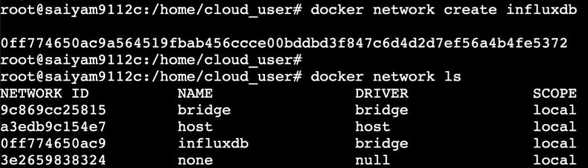

Docker 网络创建。

> docker run-d–name = influx db-p 8086:8086-v $ PWD:/var/lib/influx db–net = influx db–restart = always influx db

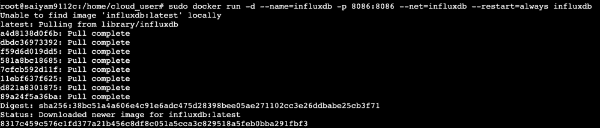

InfluxDB 正在运行。

**Telegraf:** Telegraf 是一个用 Go 编写的开源代理，用于在运行它的系统上或从其他服务收集指标和数据。Telegraf 将其收集的数据以正确的格式写入 InfluxDB。

## 装置

转储 **telegraf.conf** 文件以启用 docker 监控并更改流入端点。

`> docker run --rm telegraf telegraf config > telegraf.conf`

编辑 telegraf.conf 文件，将 InfluxDB 容器名“influxdb”作为 URL 更新的主机。要启用 docker 监控，请取消 docker 端点的注释。

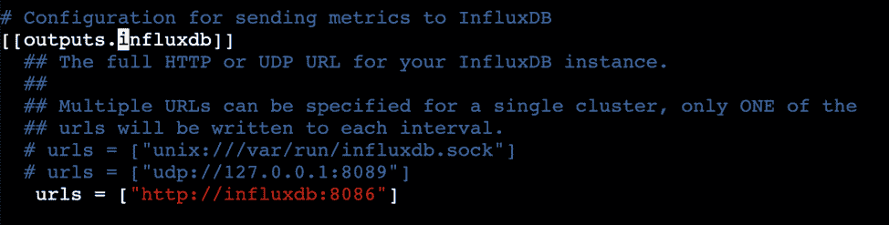

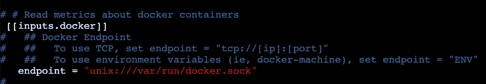

取消端点的注释。

**运行 Telegraf 容器:**

`> docker run -d --name=telegraf --net=influxdb -v /var/run/docker.sock:/var/run/docker.sock -v $PWD/telegraf.conf:/etc/telegraf/telegraf.conf:ro telegraf`

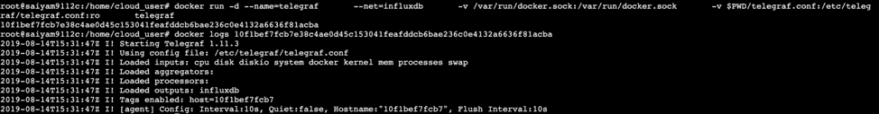

Telegraf 正在运行。

**Chronograf** : Chronograf 是 InfluxData 的开源 web 应用。将 Chronograf 与 TICK Stack 的其他组件配合使用，进行警报管理、数据可视化和数据库管理。

**安装:**

`> docker run -d --name=chronograf -p 8000:8888 --net=influxdb --restart=always chronograf --influxdb-url`

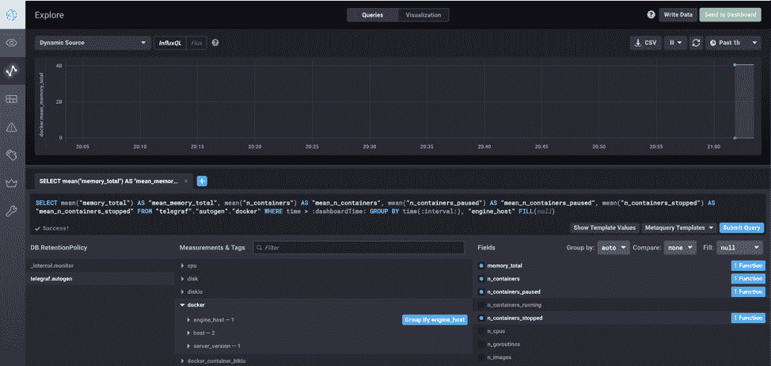

现在我们已经运行了 TICK 堆栈，我们如何看到 TSM 或 TSI 是否正在被使用？要检查 intrusion 的索引版本是在内存中还是在 TSI 中，我们可以简单地运行以下命令:

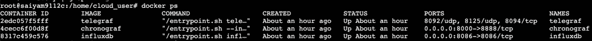

TICK 堆栈正在运行。

`> docker logs influxdb | grep index_version`

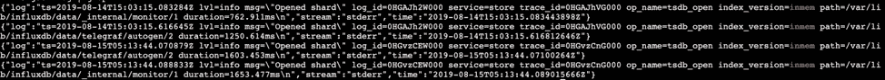

正如您在上面看到的，“index_version=inmem”显示 InfluxDB 没有启用 TSI。

**启用 TSI 指数的五个步骤**

为 InfluxDB 容器启用 TSI 索引有五个步骤。

步骤 1:停止容器:

`docker stop influxdb`

`docker rm influxdb`

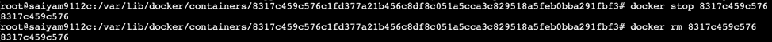

移除容器。

步骤 2:再次启动 container，但是使用 entrypoint 作为 Bash，并传递环境变量来启用 TSI 索引版本。

`> sudo docker run -it --name influx-db --restart unless-stopped \`

`-e INFLUXDB_DATA_INDEX_VERSION="tsi1" \`

`-v $PWD:/var/lib/influxdb \`

`--entrypoint=bash -it \`

`-p 8086:8086 -p 8083:8083 \`

`influxdb`

步骤 3:运行从 TSM 到 TSI 的转换:

`> influx_inspect buildtsi -datadir=/var/lib/influxdb/data -waldir=/var/lib/influxdb/wal`

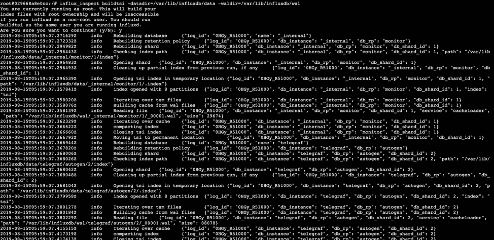

TSM 至 TSI。

如果只想转换一个数据库或一次转换一个数据库，还可以添加-database 标志。

如您所见，所有碎片都已被索引，您还可以看到索引文件夹已创建:

`find /var/lib/influxdb -type d -name index`

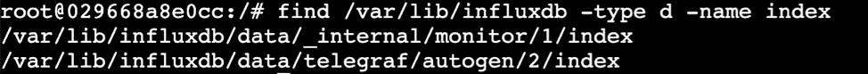

将为这两个数据库创建索引文件夹。

第四步: 退出并取出容器。

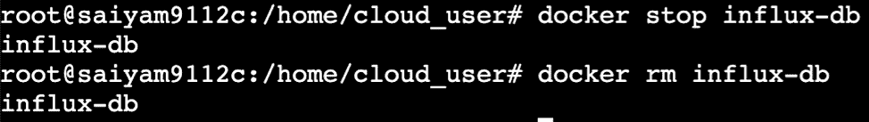

移除容器。

步骤 5:启动不带入口点标志的 InfluxDB 容器。

`sudo docker run -itd --name influx-db --restart unless-stopped \`

`-e INFLUXDB_DATA_INDEX_VERSION="tsi1" \-v $PWD:/var/lib/influxdb \-p 8086:8086 -p 8083:8083 \influxdb`

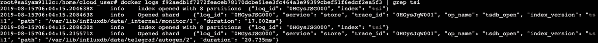

TSI 检查。

正如您在上面看到的，TSM 成功地更改为 TSI。

关于 TSI 的几个要点:

*   当前数据没有变化。
*   当一个碎片被索引时，一个临时文件(.索引)被创建。如果由于任何原因，这个过程崩溃或失败，部分被删除，并再次尝试。完整的索引保持不变。如果虚拟机或容器在执行转换操作时崩溃，这将有助于防止数据损坏。
*   -database 标志可用于转换特定数据库或一次转换一个数据库。如果不指定，则将转换所有数据库。
*   在启动 INFLUXDB 容器时，应传递-e influx db _ DATA _ INDEX _ VERSION = " TSI 1"。
*   或者，也可以使用 conf 文件更改转换:
    *   docker run–RM influx db influx d config > influx db . conf
    *   编辑 conf 并更改 index-version = " inmem " > index-version = " TSI 1 "
    *   用这个配置文件启动容器:

`docker run -p 8086:8086 \`

`-v $PWD/influxdb.conf:/etc/influxdb/influxdb.conf:ro \`

`influxdb -config /etc/influxdb/influxdb.conf`

*   索引仍然随着级数的增加而增加，但是内存不需要随着这些索引线性增加。这就是 TSI 的帮助所在。
*   一般行为:InfluxDB 将使用尽可能多的可用内存来维护内存中的索引，并退回到磁盘来处理其他任何事情。
*   如果没有 TSI，每个数据库只有一个索引，它会消耗现有的所有内存，并且不能做任何其他事情。现在，在 TSI 之后，当达到内存限制时，InfluxDB 开始引用这些索引。此外，它加载内存，索引根据需要分页。

如果你面临任何问题或有任何关于 TSM 到 TSI 转换的疑问，请前往 InfluxDB 的 [Slack channel](https://influxcommunity.slack.com/) 并开始讨论。TSI 正在开辟新的领域，帮助 InfluxDB 引领超过 10 亿的系列。

<svg xmlns:xlink="http://www.w3.org/1999/xlink" viewBox="0 0 68 31" version="1.1"><title>Group</title> <desc>Created with Sketch.</desc></svg>