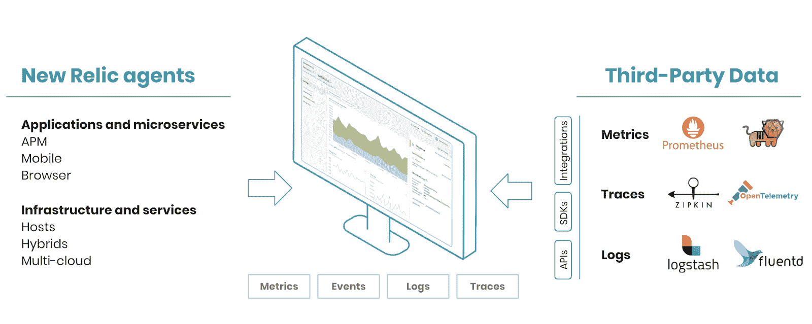

# 如何克服现代监控的三大挑战

> 原文：<https://thenewstack.io/how-to-overcome-the-top-3-modern-monitoring-challenges/>

[新遗迹](https://newrelic.com/)赞助本帖。

 [奥古斯丁·马修

Augustine 是 New Relic 的首席产品经理，在软件行业领先的数据产品和平台领域拥有 20 多年的经验。他热衷于让组织做出数据驱动的决策，并更快更便宜地交付软件。](https://www.linkedin.com/in/augustinemathewpdx/) 

您的业务依赖于提供一流的客户体验，而这样做需要更快、更便宜地交付软件，并实现持续改进。要做到这一点，你的团队必须超越仅仅“监控”性能，转而理解*为什么*你的系统会有现在的表现。为了达到这种理解水平，您需要能够收集和分析整个技术体系中的运营数据。换句话说，你需要全栈可观测性。只有这样，您才能开始优化您的系统，缩短平均检测时间(MTTD)和平均解决时间(MTTR)。

在本文中，我们将讨论如何克服三大监控挑战，以便您的企业能够获得必要的可观察性，从而在竞争中保持领先。

## **1。数据碎片**

监控工具前景广阔。有许多优秀的单点解决方案，包括适用于无数用例的开源工具，但是使用不同的数据存储来运行多个分散的单点解决方案会导致数据孤岛，这使得关联数据变得极其困难(有时甚至不可能)。这反过来增加了检测和解决问题的时间。

我们以普罗米修斯为例。如果你是众多运营 Kubernetes 的公司之一，使用 Prometheus 是显而易见的。作为 Kubernetes 事实上的度量工具，它拥有一个充满活力的开源社区。但是您还需要监控其他系统、您的应用程序以及您的客户体验的性能；每个场景产生不同类型的遥测数据，需要不同的监控工具。商业监控解决方案只专注于环境的一个子集(云、本地、混合)，并且通常只针对遥测数据的一个子集(指标、事件、日志或跟踪)。类似地，流行的开源解决方案堆栈，如 Elastic Stack、TICK (Telegraf、InfluxDB、Chronograf 和 Kapacitor)和 TIG (Telegraf、InfluxDB 和 Grafana)往往最适合日志或指标。

为了了解你的*整个*系统是如何运行的，你可能会使用多种工具的组合，其中每一种都需要学习新的 UI、新的查询语言和新的操作模型。这样做的结果是产生跨团队的依赖性，从而延迟解决影响客户的问题。不幸的是，这降低了客户满意度、收入，甚至员工士气。

### **在一个地方查看您的所有数据**

一流的可观测性解决方案使您能够在一个地方收集和分析*所有的*遥测数据，消除数据孤岛以减少 MTTD 和 MTTR。将您的所有数据放在一个地方，您就能够获得上下文感知的洞察力，并关联您的数据，以了解您的系统为什么会以这样的方式运行。关联交易(销售、用户转化等。)和运营数据缩短了 MTTD，实现了端到端的数字体验和业务绩效监控。

回到我们的普罗米修斯示例，公司可以将普罗米修斯度量数据发送到中央数据平台，该平台将其与来自其整个技术堆栈的其他遥测数据整合在一起。今天，一些现有的解决方案甚至提供了创建他们自己的有价值的定制洞察力的能力；对通用查询语言的支持允许用户在他们已经熟悉的范式中操作。好消息是，尽管很少，这种类型的解决方案已经开始出现。

## **2。更多的工具意味着更多的辛劳**

开源软件监控工具需要自托管，无论是在内部还是在公共云环境中。这要求组织采购和安装硬件(如果在内部)，配置、配置和升级其计算资源(CPU、内存、存储)、网络和软件。这可能意味着处理多个供应商和合同，可能还有资本支出。大规模管理此类环境(横向扩展、预测需求、管理支出等。)使其具有挑战性。公司必须雇佣和培训专家来维护这些解决方案。最重要的是，公司必须保护这些系统，并满足公司及其团队的合规性和服务水平目标(SLO)。

例如，大规模运行 Prometheus 需要复杂的设置，包括用于分片和高可用性的联合和副本。此外，为了克服普罗米修斯数据保留限制，用户必须设置和操作额外的工具，如皮层和灭霸。鉴于 Prometheus 的制图功能还很初级，大多数用户选择部署 Grafana 来构建仪表板。这些附加解决方案的后果是增加了复杂性、额外的资源需求、增加了培训需求和降低了安全合规性，所有这些都增加了成本。生态系统中的这些额外工具暴露了更多的攻击面，并且与任何开源软件一样，增加了来自定制软件开发、测试/QA 覆盖和缺乏产品管理的安全风险和漏洞。

Gartner 的研究表明:

*“…几乎每个开源采用者都希望与自主开发或获得许可的专有第三方解决方案相比节省成本。然而，Gartner 的研究一直表明，开源努力并不总是能节省成本。这一结果取决于许多因素，但从历史上看，开源投资(超过 50%)通常不会产生比其他替代方案更大的 TCO 优势。”*

监控工具的可扩展和可靠的自托管部署通常需要长达 6 个月的时间和许多具有不同技能的专家来操作(构建、部署、配置、维护)。通常，部署交付时间、维护开销和机会成本会导致超过其他方法的总体拥有成本。如果团队在管理和维护他们的监控工具上花费更少的时间和资源，他们就能够花更多的时间为他们的客户创新和创造更好的产品。

### **DIY 不值得你浪费时间**

软件即服务(SaaS)监控和可观察性解决方案可按需扩展，消除了预测此类需求、配置资源和操作部署工具的负担。通过消除获取、设置、培训员工以及实际操作额外系统的负担，您可以快速提高交付软件的能力。此外，通过减少花费在不必要的基础设施上的资本支出，并且不必寻找和雇佣专家来操作这样的系统，您可以将这笔钱重新投资到您的业务中。

商业可观测性解决方案支持关于数据摄取、数据管理、存储选项和性能的无限规模；其中最好的能产生毫秒级的响应和搜索万亿字节数据的能力。真正的大规模性能来自于分布式查询和并行执行等创新方法。例如，同类最佳的解决方案提供了快速灵活的数据管道，允许大规模的高可用性数据接收、流传输和转换。分布式缓存和存储通过将作业分解成更小的块并在靠近目标的地方并行执行，实现了高效的查询。此外，全面管理的解决方案提供现成的合规性和服务级别协议(SLA ),有助于公司满足其 SLO。

## **3。高成本导致盲点**

管理多点解决方案监控工具，包括自托管开源工具，会导致更高的成本。高成本带来的不幸影响是，您必须决定您的技术堆栈有多少，以及您能够负担得起的数据类型和采样速率。较高成本的影响通常会导致只监控数据的一部分，或者只监控生产环境，而忽略生产前环境。如果您的所有开发都发生在生产前环境中，而您又缺乏观察这些环境的性能的能力，那么最终不必要数量的错误会传播到生产环境中，从而增加客户问题和停机时间。使问题更为复杂的是，不频繁的数据采样意味着用户缺乏有效解决问题或审计交易所需的数据，从而导致收入损失或处罚。

### **仪器一切**

商业 SaaS 监控解决方案提供商，拥有专门构建的平台和预构建应用程序、数据收集器、导出器、刮刀等。，通常可以让公司更快地实现价值(部署交付周期的六分之一)，并且管理解决方案的员工更少(资源的四分之一)。因此，公司需要价格合理的解决方案，即使是在高数据速率(每分钟的数据点数)和基数(唯一的时间序列数据)的情况下。为摄取的遥测数据提供每 GB 几分钱的定价模式使公司能够在开发、试运行和生产环境中经济地捕获全栈数据。这些模型进一步支持多种软件部署策略，如金丝雀、蓝/绿、红/黑、综合测试等。通过为公司提供经济实惠的价格和灵活的数据保留选项，他们可以执行不同时期和不同季节的比较，以便更好地规划和管理他们的软件，并满足数据治理和合规性要求。

公司应该寻找可以使用流行的开源代理收集数据的可观测性解决方案，并支持本地工具，以便他们可以获得更大的观测数据覆盖率。例如，New Relic 为受欢迎的代理提供了一系列[插件，并为 OpenTelemetry 标准和协议提供了软件开发套件，允许其客户从几乎任何来源获取数据。](https://docs.newrelic.com/docs/data-ingest-apis/get-data-new-relic/new-relic-sdks/telemetry-sdks-send-custom-telemetry-data-new-relic)

## **为您的企业选择正确的解决方案**

全栈可观察性和监控是公司在当今竞争激烈的市场中取得成功的必要条件。组织必须分析构建和管理自己的监控实践的总成本和收益，确保它们涵盖其堆栈的所有部分。团队应该感到被授权在不超出预算的情况下测试一切，以避免性能盲点。正确的可观察性解决方案应该允许团队在一个地方看到他们所有的数据，这样他们就可以创建一个完整的生态系统。他们应该选择能够从任何来源(开放、内部或云中)接收数据、能够根据业务需求轻松扩展并为您的底线提供价值的解决方案。这经常导致团队选择健壮的 SaaS 可观测性平台而不是简单的监控工具。这些 Saas 平台能够更好地帮助用户全面了解他们的软件架构，消除数小时的辛劳，最终实现客户满意度和收入的最大化。

New Relic 等流行平台继续创新其企业级可观测性解决方案，通过一个位置提供全栈可见性，以分析您的整个栈。New Relic 的平台专注于互操作性和对开放标准和 OSS 工具的支持，能够满足您所有运营数据的广泛需求。该平台还提供了[高级人工智能功能](https://thenewstack.io/new-relics-ambitious-plan-to-apply-ai-and-ml-to-incident-responses/)来自动化事件响应、管理和补救，以减少公司 IT 生产力损失的主要来源。

新遗迹的可观测性和监测堆栈

建立有效的监控实践需要深思熟虑的决策，要求团队决定什么样的能力是为他们的业务交付最佳价值所必需的。本质上，团队需要确保他们选择满足他们独特需求的解决方案。

通过 Pixabay 的特征图像。

目前，新堆栈不允许直接在该网站上发表评论。我们邀请所有希望讨论故事的读者通过[推特](https://twitter.com/thenewstack)或[脸书](https://www.facebook.com/thenewstack/)访问我们。我们也欢迎您通过电子邮件发送新闻提示和反馈: [feedback@thenewstack.io](mailto:feedback@thenewstack.io) 。

<svg xmlns:xlink="http://www.w3.org/1999/xlink" viewBox="0 0 68 31" version="1.1"><title>Group</title> <desc>Created with Sketch.</desc></svg>