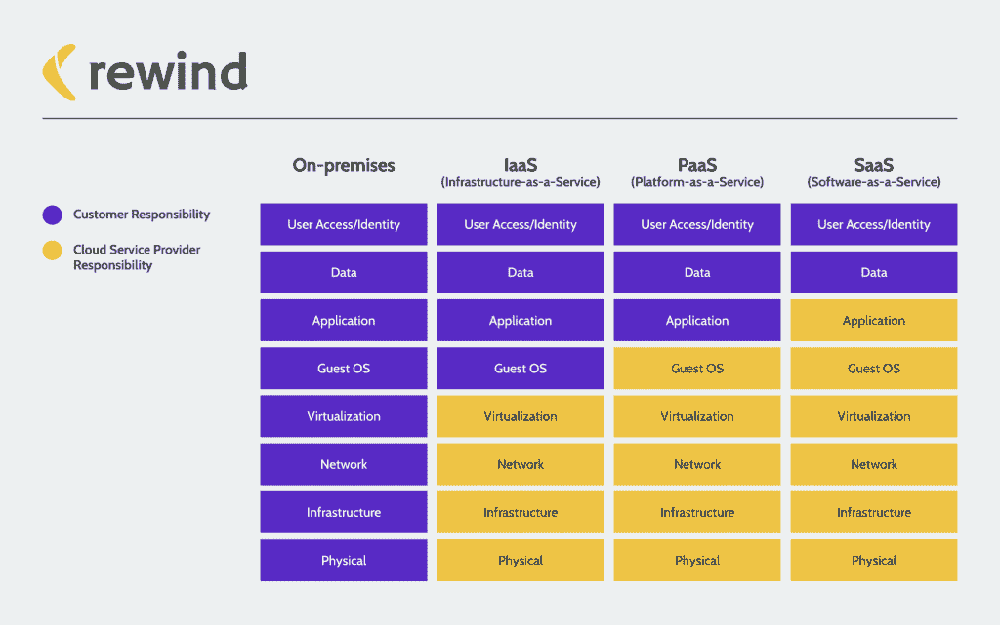

# 如何立即永久丢失云数据

> 原文：<https://thenewstack.io/how-to-permanently-lose-cloud-data-instantly/>

没有回头路了。云，尤其是软件即服务(SaaS)，已经成为我们工作方式的默认。在全球疫情之前，从内部迁移到网络的趋势已经在快速发展。新冠肺炎只是加快了采用的速度。在一个物理位置工作了几十年的公司现在可以让员工从他们能找到 Wi-Fi 的任何地方登录。

然而，这种新获得的自由是有代价的。开发人员和 IT 人员并未广泛讨论这一成本，但这是大多数 SaaS 应用程序固有的常见风险。

不了解这种风险以及如何降低风险，意味着公司很容易丢失他们委托给在线软件解决方案的所有关键数据。

## 共同责任模式和 SaaS

 [戴夫·诺斯

Dave North 已经在技术领域工作了 25 年，担任过从企业支持到产品经理的各种角色。2011 年，作为产品经理，Dave 构思并向市场推出了 Signiant Media Shuttle SaaS 服务，全球媒体和娱乐行业有数百万人使用该服务。Dave 在 2013 年转到了 DevOps 的职位，此后一直是使用 AWS 的 SaaS 公司的领导者。现在在 Rewind，Dave 领导着技术运营团队(开发运维/安全/IT)。当他不在当地 AWS 会议上发言或参加 AWS UX 研究时，戴夫痴迷于一级方程式赛车形式的其他技术。](https://www.linkedin.com/in/dnorth98) 

IT 人员和数据保护专业人员过去常说一句话:这个世界上有两种人——已经丢失数据的人和即将丢失数据的人。在我们的个人或职业生活中，不可避免地会出现某种数据丢失。

如果你至少使用过一次亚马逊网络服务,你可能对共享责任模型很熟悉。但事实是，这个模型实际上控制了所有的云计算。无论您使用的是 IaaS、Paas 还是 SaaS 工具，用户都有一定程度的责任来保护他们创建的数据。

> 这里有一个关键问题要问:你从这个应用程序获得的价值是否值得这个应用程序拥有的数据访问级别？

自从 SaaS 出生以来，我已经在技术运营部门工作了 25 年。分担责任模式不是讨论的内容。在很大程度上，它仍然不是。该模型基本上是这样工作的:SaaS 提供商通常保证他们的基础设施和网络将始终启动和运行。这意味着每次用户登录时，软件都可以使用。他们还保证在灾难性故障的情况下可以恢复服务，例如流星撞击数据中心。这是 SaaS 公司责任的终结。

作为 SaaS 工具的用户，您有责任确保只有授权用户才能访问，并且创建的任何数据或元数据都得到正确备份。相信我，你的 SaaS 数据会消失的。网络攻击、人为错误甚至其他软件集成都会对您的专有信息造成严重破坏。重要的是要记住，公司只是租用 SaaS 基础设施的访问权限，并通过 API 访问一切。除了你创造的数据和知识产权，你不拥有任何东西。

SaaS 运营商能够恢复您的数据的可能性微乎其微，但这些数据很可能已经过时且不完整。大多数 SaaS 工具都不具备特定数据的数据恢复功能。他们可以恢复整个平台，但通常不能恢复您的数据。如果你对此持怀疑态度(我知道我是)，请阅读任何主要 SaaS 工具的条款和条件。这里是世界上最大的代码库 GitHub 的目录。它明确声明他们不会受到数据丢失的困扰。

那么 DevOps 或 IT 团队应该做些什么呢？与他们几十年来对内部或其他云应用程序所做的一样:制定备份策略。

## SaaS 的备份和数据连续性战略

第一步是许多组织中常见的做法:限制人们在各种应用程序中的访问权限。换句话说，你的客户成功经理可能不需要访问 GitHub。基于用户资格，使用最低特权方法限制对这些平台的访问，并确保每个人都有唯一的登录密码或短语。别忘了双因素认证(2FA)！

接下来，始终审核连接到您选择的 SaaS 工具的第三方应用程序。他们通常可以覆盖或更改现有数据。这里有一个关键问题要问:你从这个应用程序获得的价值是否值得这个应用程序拥有的数据访问级别？如果没有，你可能要找到一个替代或卸载它。像 [SOC2](https://us.aicpa.org/interestareas/frc/assuranceadvisoryservices/socforserviceorganizations) 这样的合规标准有一个“供应商评估”组件是有原因的:第三方供应商或应用程序通常是最常见的意外数据丢失形式。

最后，您需要一个备份和恢复丢失数据的过程。基本上有两种方法可以做到这一点:自己管理流程或使用备份即服务解决方案。根据您使用的 SaaS 类型，自己管理流程看起来会有所不同。对于 Shopify 来说，这可能需要导出无限量的图像和 CSV 文件。对于 GitHub，这可能涉及到运行备份脚本。并确保定期这样做。两个月前在高流量电子商务商店上的 CSV 转储有多大帮助？

无论使用哪种 SaaS 工具，这都将涉及大量的手动工作。这里的危险是团队经常认为这将是一个更具成本效益的选择。现实情况是，持续的人工和维护往往会很快增加。周期花在非核心业务的任务上。

外包这个过程无疑会增加财务成本，但是自动化解放了团队的时间。BaaS 提供者还管理平台做出的所有 API 更改，这些更改可能经常发生。只要确保你做了尽职调查。许多备份和恢复解决方案很快出现，它们如何访问和保护您的数据几乎没有透明度。寻找具有强大安全计划的供应商，理想情况下，寻找具有外部审计合规证书(如 SOC2 或 ISO27001)的供应商。

无论你选择哪条路，我希望现在不言而喻的是，SaaS 工具的便利是有代价的。它们让事情变得更快、更好、更便宜，但它们也有一个突出的数据连续性问题，让您的日常运营面临风险。确保只有合适的人才能访问，并实施备份策略将有助于确保您的业务始终正常运行。

<svg xmlns:xlink="http://www.w3.org/1999/xlink" viewBox="0 0 68 31" version="1.1"><title>Group</title> <desc>Created with Sketch.</desc></svg>