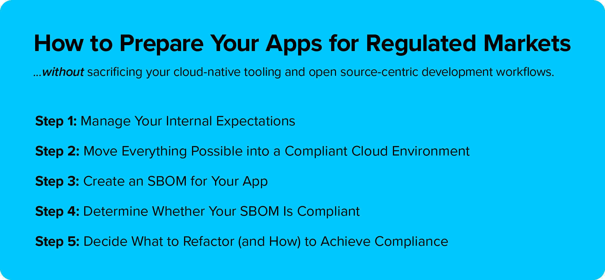

# 如何为监管市场准备您的应用

> 原文：<https://thenewstack.io/how-to-prepare-your-apps-for-regulated-markets/>

[Jenn Gile](https://www.linkedin.com/in/jenngile/)

[Jenn 是 F5 旗下 NGINX 的产品营销经理。她专门研究使用云原生技术(包括 Kubernetes 和微服务)的现代应用程序开发和安全性。她来自俄勒冈州，现在住在西雅图。](https://www.linkedin.com/in/jenngile/)

许多成功的初创公司和 SaaS 公司都是以云为先，建立 it 文化，将解决问题和速度放在首位。随着他们的成长，这些初创公司不可避免地寻求向金融、医疗保健或政府等受监管的市场销售产品。由于审计人员告知他们，他们的服务将违反多项合规性要求，他们常常会猛然醒悟。在这一点上，组织担心满足法规遵从性需求会破坏他们的构建 it 文化，更糟糕的是，适应法规遵从性需求将意味着他们的产品无法在[云原生](https://www.nginx.com/resources/glossary/cloud-native-app-delivery/)环境中工作。

幸运的是，您可以拥有自己的云原生蛋糕，并在上面覆盖一些监管行业的糖霜，而不会引发危机。此外，您的应用程序和基础架构将变得更加安全和灵活。

这里有一个在监管市场中为客户检查重要盒子的高级方法，而不会牺牲您灵活的、以开源为中心的开发工作流。

## 第一步:管理你的内在期望

为受监管的环境服务需要在运营的关键方面做出改变。例如:在合规环境中，您可能会被要求在特定时间内对安全风险或[危害指标(IOCs)](https://en.wikipedia.org/wiki/Indicator_of_compromise) 做出响应，这通常被称为 [CVE](https://cve.mitre.org/) (常见漏洞和暴露 *)* 缓解 SLA(服务级别协议) [FedRAMP](https://www.fedramp.gov/) 数据中心。您还需要准备详细的安全计划，解释您将如何监控和观察您的服务。监管机构对此非常重视，你的团队也必须做好准备。这可能意味着思维方式的改变，需要一个专门的“所有者”来监管行业项目/运营(监管，有人知道吗？).

## 步骤 2:将一切可能的东西转移到一个兼容的云环境中

这听起来似乎是显而易见的，但是迁移到由大型云提供商维护的环境将会立即消除许多令人头疼的问题。保持操作系统完全合规是一项艰巨的任务，但您可以通过使用云提供商的默认操作系统和容器映像，将大部分合规负担(硬件级 [FIPS](https://www.nist.gov/itl/publications-0/federal-information-processing-standards-fips) 、SOC 2、HIPAA、GDPR)转移到云提供商身上。如果你已经是云原生的，那么这个迁移应该很容易，因为你的应用是为云设计的。但是，如果您是在传统企业中运行的云原生服务，依赖于您组织的计算堆栈的其他部分，无论是专有的还是其他的，那么您将需要设计一个计划来使这些元素符合法规，或者“提升和转移”该功能以在受监管的云中运行。

## 步骤 3:为你的应用程序创建一个 SBOM

简而言之，[软件材料清单(SBOM)](https://en.wikipedia.org/wiki/Software_bill_of_materials) 是组成应用程序的所有软件组件的详细清单，包括商业软件和开源软件。SBOM 被认为是最佳实践，事实上，它甚至早于 2021 年美国关于改善国家网络安全的[行政命令](https://www.whitehouse.gov/briefing-room/presidential-actions/2021/05/12/executive-order-on-improving-the-nations-cybersecurity/)，该命令将 sbom 确定为增强软件供应链安全的关键组件。

SBOM 有两个好处:

*   **好处#1:识别潜在的法规遵从性风险**
    本练习帮助您识别您的应用中可能对受监管用例造成问题的组件，这将在步骤 4 中介绍。此外，它还使查看依赖关系变得容易。管理依赖关系是至关重要的，因为每个依赖关系都必须是独立兼容的，这样整个服务才能被认为是兼容的。
*   **好处#2:提高你的声誉**
    SBOM 在销售过程中很有用，因为它向潜在客户表明你对安全的重视。事实上，受监管行业的许多客户会要求 SBOM 来评估您的产品带来的潜在风险。

要了解更多关于 SBOMs 的信息，请阅读"[为您的操作系统创建软件材料清单](https://thenewstack.io/create-a-software-bill-of-materials-for-your-operating-system/)"然后查看国家电信和信息管理局的 SBOM 模板和资源的一站式商店。

## 步骤 4:确定您的 SBOM 是否合规

由于 SBOM 的存在，现在您已经有了软件栈的全貌，是时候标记不合规的项目了。

当最初以 build-it 模式设计应用程序时，公司很少提前考虑他们可能面临的合规性检查。当然，从一开始就服务于受监管行业的应用程序，如医疗保健应用程序，可以也应该在设计时考虑合规性。公司通常使用云提供商提供的默认工具——如[负载平衡器](https://www.nginx.com/resources/glossary/load-balancing/)、消息队列或前端组件——因为默认工具易于快速启动和运行。但是，这些选项中有许多并不是为了完全符合所有受监管的行业需求而设计的，并且可能是使用开源软件构建的，这些软件缺乏实现合规性所需的特定功能。

例如，大多数默认负载平衡器无法充分定制以实现符合 [FIPS 140-2](https://csrc.nist.gov/publications/detail/fips/140/2/final) 的 SSL/TLS 密码。此外，应用度量的可观察性工具可能没有适当的安全过程。在技术栈中也可能有嵌入式开源工具，如 API 网关或 web 应用防火墙(WAFs)。最后，许多主要的开源项目，如 Envoy，都不是商业实体，所以他们可能不会发布关于漏洞披露或有保证的补丁时间的 SLA，这使您更容易受到 CVE 的攻击。反过来，这可能会无意中使您的服务不符合所需的标准。出于这些原因，您需要验证 SBOM 中的每个组件是否都符合要求。

## 步骤 5:决定重构什么(以及如何重构)来实现合规性

一旦您知道技术堆栈中的哪些组件面临合规性挑战，您就知道需要在哪里确定替换部件。这可能需要对您的应用程序堆栈进行一些重大的重构，这不一定是一件坏事。当您构建规模和法规遵从性时，您需要能够根据您的监管市场法规遵从性要求，在最大程度上定制和配置技术。

### **多云注意事项**

通常采用[多云化](https://www.nginx.com/resources/glossary/multi-hybrid-cloud-strategy/)策略来提高灵活性和性能。例如，一些大型组织选择构建三个版本的应用程序架构——每个版本都定制为在不同的云中运行——尽可能减少更改，以减轻生产中的意外问题。

但是，多云带来了额外的复杂性，因为应用程序和技术往往在不同的云中具有不同的功能。例如，每个公共云都提供自己的负载平衡器和 WAF，每个都有不同的功能来公开和保护服务的底层组件。在多云策略中选择使用默认工具会导致工具蔓延和所有相关问题:不一致的策略、浪费资金和安全性挑战。对于多云部署，更好的选择是可以在所有环境中使用的云无关工具。

雪花在[的这篇文章中描述了一个由云无关工具实现的多云策略的很好的例子。](https://www.snowflake.com/blog/how-snowflake-delivers-a-single-data-experience-across-multiple-clouds-and-regions/)

虽然现在追求像雪花一样的多云策略比过去容易，但由于容器和云原生开发，这仍然是一个很大的提升。通常，这种策略是通过混合成熟的企业开源发行版来实现的，这些发行版与其他成熟的云服务产品相集成，例如用于可视化的 [Grafana Enterprise](https://grafana.com/products/enterprise/) ，用于秘密管理的 [HashiCorp Vault](https://www.vaultproject.io/) ，以及作为灵活负载平衡器/API 网关的 [NGINX Plus](https://www.nginx.com/products/nginx/) 。大多数组织在受监管市场的云实施中使用这些工具作为非托管软件包或二进制文件。在某些情况下，他们会将其云架构的重构版本发布到内部托管或数据中心，在那里工作负载将更持久地运行，或者出于数据治理的原因绝对有必要运行。

### **外包选项**

也有越来越多的第三方公司将功能作为已经合规的服务来提供，这实际上是一种外包选择。在大多数情况下，这些服务用于受监管环境的内部功能。云本机或第一方云服务之外的托管服务很少用于 FedRAMP 数据中心的实时流量。然而，随着时间的推移，这可能会是一个高增长领域。确定你的技术堆栈中哪些部分你可以改变然后拥有，哪些部分更容易更换，这将有助于指导你的决策。

## 结论:调控是一种心态，也是一个过程

上述步骤描述了您的应用程序架构中的文化演变，以及一个新的成熟阶段的起点。受监管市场受到监管是有充分理由的:这些市场中的公司提供的服务对社会至关重要。从这个意义上说，寻求进入该市场的公司必须与第三方利益相关者打交道:公共部门。幸运的是，在云世界中有足够多的选择来确保为受监管的市场扫清障碍不太可能导致过大的破坏或费用。是的，这可能会导致应用程序和技术选择的一些变化，但鉴于更多的应用程序由通过 API 链接的连接服务组成，现代应用程序更容易进行重构以满足监管需求。

最好的方法是提前考虑进入一个受监管的市场。通过在游戏早期采取一种受控制的心态来为它做计划。一旦你有了这种心态，你会发现做必要的改变只是推动应用程序性能和安全性真正提高的一个小提升。

<svg xmlns:xlink="http://www.w3.org/1999/xlink" viewBox="0 0 68 31" version="1.1"><title>Group</title> <desc>Created with Sketch.</desc></svg>