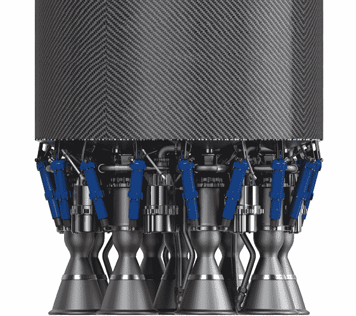
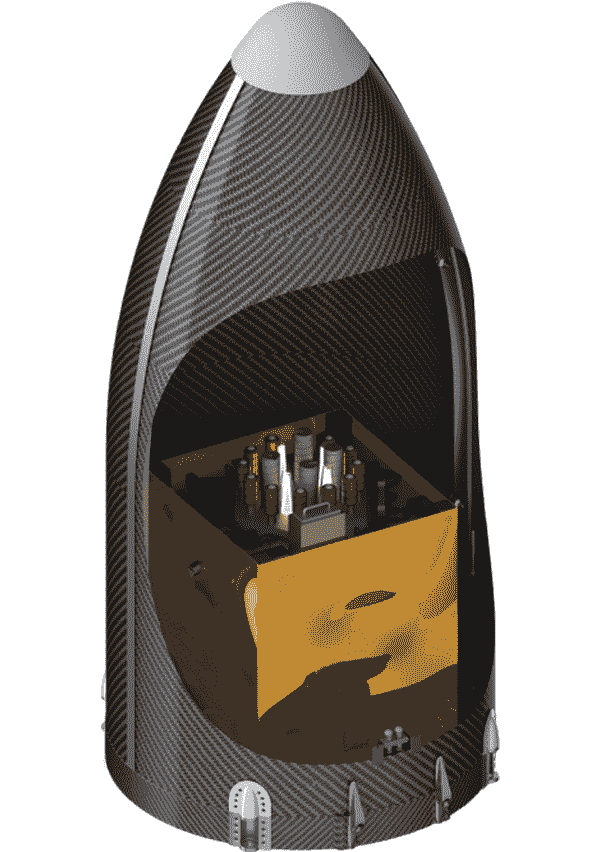
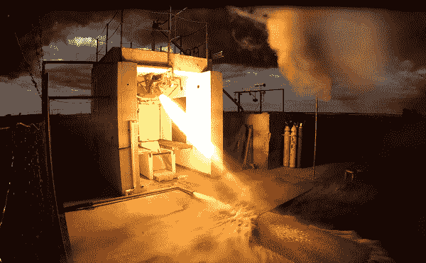

# 如何打印一个火箭发动机，让太空业务变得负担得起

> 原文：<https://thenewstack.io/how-to-print-a-rocket-engine-and-make-business-in-space-affordable/>

航空航天初创公司正在使用增材制造来改变公司在太空开展业务的方式。

向太空发射火箭是一项极其昂贵的努力，每次发射都要花费数百万美元。但随着商业和政府部门对小型卫星市场的不断增长，相应地需要更便宜、更频繁的火箭飞行，能够将这些“小型卫星”送入轨道。

近年来的技术飞跃使得像 SpaceX 这样的私营公司能够开发 T2 可重复使用的火箭，而其他公司甚至正在开发全新的引擎，这将降低成本，增加私人太空飞行的频率。美新太空初创公司[火箭实验室](http://www.rocketlabusa.com/)属于后一种类型，他们转向 3D 打印来制造其轻质、高效和可大规模生产的卢瑟福火箭发动机，该发动机使用电池为 20 米长的碳复合材料火箭提供动力，他们将其称为“电子”

## 一种更简单、更高效的火箭发动机，可以在三天内 3D 打印出来

以新西兰出生的科学家欧内斯特·卢瑟福的名字命名，Rocket Lab 的发动机与传统发动机不同，传统发动机使用气体动力涡轮泵将燃料推进燃烧室。[火箭实验室首席执行官彼得·贝克解释说:](http://www.forbes.com/sites/alexknapp/2015/04/14/rocket-lab-unveils-a-3d-printed-battery-powered-rocket-engine/)卢瑟福发动机采用了一种完全不同的方法，而不是这种复杂的定时过程，即燃烧必须与发动机的运行同时进行。

> 使用无刷 DC 马达和锂电池，卢瑟福的涡轮泵立即解决了热力学问题。我们能够做以前在推进系统中做不到的事情。它把复杂的机器变得简单。

发动机中的推力室、喷射器、涡轮泵和主推进剂阀都是用[电子束熔化](https://en.wikipedia.org/wiki/Electron_beam_melting)制成的，这是一种先进的 3D 打印形式，其中金属粉末在高真空中用电子束一层一层地完全熔化。增材制造意味着这些发动机可以在几天内制造出来，而不是几个月，这意味着火箭有可能每周被送入太空，每次发射的成本相对较低，为 490 万美元，而专门任务的成本为 5600 万美元。

## 一种轻质碳复合材料火箭

除了这个突破性的火箭发动机，火箭本身也是为流线型操作而设计的。电子火箭是一种两级火箭，直径为 1 米(3.2 英尺)，高 20 米(65.6 英尺)。它的碳复合材料车身意味着它比小型汽车更轻，在第一阶段，将由 9 台卢瑟福发动机提供动力，产生 34，500 至 41，500 磅(153，464 至 184，602 牛顿)的推力。在第二阶段，火箭将由类似设计的卢瑟福发动机推进，该发动机配备了一个不同的喷嘴，在太空真空中性能更好。

该公司预计，该电子将能够将 100 公斤(220 磅)的有效载荷送入 500 公里(310 英里)的太阳同步轨道，或将 400 公斤的有效载荷送入较低的地球轨道。电子发射器将实现一种更快的、“即插即用”的集装箱化方法来处理来自客户的有效载荷——客户的有效载荷将被放置在火箭实验室提供的[整流罩](https://en.wikipedia.org/wiki/Payload_fairing)中，以减少可能的延迟。电子还具有双轴推力矢量控制系统，即使在强风中也能发射，并拥有高性能的微型航空电子系统，重量仅为 19 磅(8.6 千克)。

据该公司称，这些创新将优化电子的有效载荷，使其能够飞向太空，“比从旧金山飞往洛杉矶的[波音 737]航班使用更少的燃料。”

## 填补传统航天工业空白的新创空间公司

像卢瑟福这样的创新火箭的影响是巨大的，火箭实验室这样的公司表面上预示着一个“太空(将)为商业开放”的新时代，特别是给那些需要小型卫星(有些还没有午餐盒大)在特定时间内可靠部署的公司带来了提振。行业观察家[注意到](http://trajectorymagazine.com/business-and-technology/item/1677-the-maturation-of-smallsats.html)“小卫星”市场的革命时机已经成熟，迫使所谓的“[新闻空间](https://en.wikipedia.org/wiki/NewSpace)”创业公司彻底改变传统航天和国防工业的工作方式。小卫星替换起来更便宜，重访率更高，尽管代价是图像分辨率更低。然而，小卫星的“星座”可以联网在一起，以克服这一限制——而且成本仍然低于大型卫星。

地理空间情报、气候建模和电信等行业将从降低进入太空的壁垒中受益匪浅。分析这些数据的方式也必须改变，因为小卫星可以从单纯的测绘转变为更加实时的监测。“如今这个世界充斥着像素，”[天空盒成像](http://trajectorymagazine.com/business-and-technology/item/1677-the-maturation-of-smallsats.html)[公司飞行运营副总裁](http://www.skyboximaging.com)约翰·芬威克说。“让某人检查并手动查看每一个是不可能的。为了真正从测绘转向监测，在如何看待数据方面必须有创造性。”

所有这些发展将取决于进入太空变得更加负担得起和可靠。已经到了一个临界点，曾经对投资新空间企业持怀疑态度的私人投资者现在开始注意到了。据《福布斯》报道，火箭实验室自己从 K1W1、Khosla Ventures 和 Bessemer Venture Partners 等投资者那里获得了资金，现在正计划从 2016 年开始进行至少 30 次商业发射，如果今年晚些时候测试发射顺利的话。看来，很快，太空很可能成为更多公司可以涉足的领域，至少是这样。更多在[火箭实验室](http://www.rocketlabusa.com/)。

图片:火箭实验室。

<svg xmlns:xlink="http://www.w3.org/1999/xlink" viewBox="0 0 68 31" version="1.1"><title>Group</title> <desc>Created with Sketch.</desc></svg>