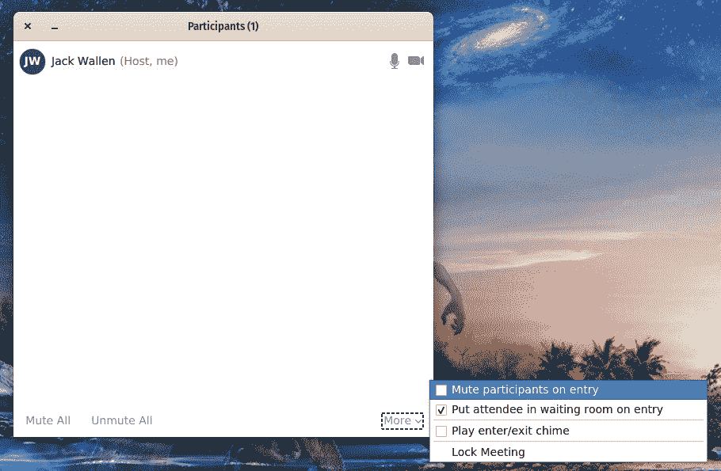
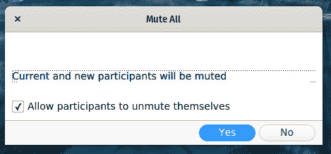
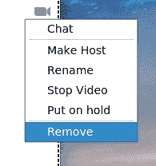
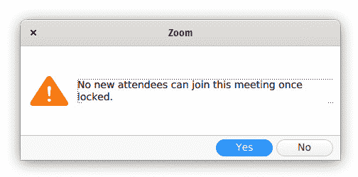
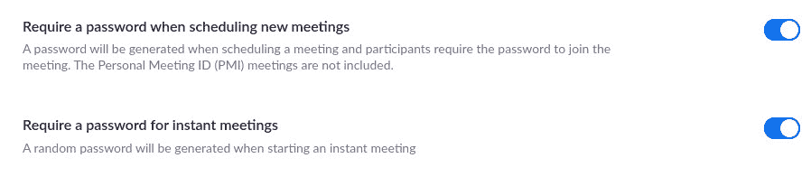

# 如何保护你的虚拟会议不被合并

> 原文：<https://thenewstack.io/how-to-protect-your-virtual-meetings-from-zoombombing/>

想象一下，如果你愿意，你正在参加一个 [Zoom](https://zoom.us/) 会议，突然，一个与会者开始大喊大叫，展示令人不快的内容，并扰乱你的会议。我不知道你怎么想，但对我来说，这听起来像是大学恶作剧手册里的东西。

虽然这可能是真的，但这种情况现在也发生在 Zoom 会议上。这种趋势被称为“Zoombombing ”,它已经变得相当流行。事实上，新的互联网社区已经开始涌现，用户可以在那里分享缩放会议代码，并要求其他人与会议联系，并辱骂，播放色情材料，甚至对与会者发出死亡威胁。

这个问题变得如此猖獗，以至于 Zoom 首席执行官 Eric Yuan 冻结了功能更新，以解决安全问题。Zoom 的承诺是在接下来的 90 天内解决问题，当时袁说:“在接下来的 90 天里，我们致力于投入所需的资源，以更好地主动识别、解决和修复问题。我们还承诺在整个过程中保持透明。我们希望尽一切努力保持您的信任。”

《新书库》的另一位作者，[詹妮弗·里金斯](https://thenewstack.io/author/jennifer-riggins/)，亲身经历了这种现象。她五年前开始做远程舞会，最近，因为当前的形势，修改了活动。她最近创建了一个 Zoom 会议，并邀请了一些她所在的科技和育儿社区的女性。她使用保存日期工具来创建一个有趣的，愉快的活动。

然而，她一打开活动，就不知所措，不知所措。许多歌曲和噪音同时从她的电脑扬声器中涌出。她无法控制屏幕份额(尽管这是她的活动),屏幕上不断显示纳粹随身用品、色情搜索和对残疾人的嘲笑。为了避免冲击，她只有一个选择——结束会议。

Zoom [承诺在四月初保证其网络视频会议](https://blog.zoom.us/wordpress/2020/04/01/a-message-to-our-users/)的安全。然而，在此期间，将会召开无数次 Zoom 会议，其中一些会议可能会讨论敏感的公司信息。人数的急剧增加主要是由于新冠肺炎疫情和全球各级领导人下达的“呆在家里”的命令。这意味着，在 Zoom 找到解决方案之前，你主持或参加的每个会议都有被 Zoombombed 的风险。

你是做什么的？

显然，您可以使用不同的平台来满足您的电话会议需求。例如，你可以随时迁移到开源的 [Nextcloud Hub](https://www.nextcloud.com) ，使用他们内置的对话功能。另一个开源的选择是 [Discord](https://discordapp.com/) 。

尽管一个替代方案看起来很吸引人，但你会发现自己在某些时候不得不使用 Zoom。毕竟，它是市场上使用最广泛的电话会议平台之一。所以当你的手被迫时，你能做些什么来防止 Zoombombing？

在某些情况下，不多。如果您的会议信息泄露出去，您几乎无法阻止 neer do wells 访问您的活动。

然而，如果你小心地管理你的会议，你可以在此刻尽可能地减轻 Zoombombing。

让我告诉你能做什么。

## 管理您的参与者

你需要做的第一件事是控制你的与会者。如果你的会议足够小，这很简单——你可能知道每个登录的人。然而，如果会议很大，你至少应该采取一个步骤来防止不良行为。

当您设置会议时，有一个配置选项允许您在所有参与者进入时将其静音。这意味着他们可以查看会议，但不能发言。这将至少防止他们的声音中断。若要设置此选项，请开始会议，然后单击“管理参与者”按钮。在出现的窗口(**图 1** )中，点击更多下拉菜单，然后点击参与者进入时静音复选框。

**图 1:** 参赛选手入场时静音。

您也可以单击参与者管理窗口中的全部静音按钮。为了使这实际有效，您需要取消选中允许参与者取消静音的复选框(**图 2** )。

**图 2:** 如果您不取消选中此框，任何人都可以取消自己的静音并打断您的会议。

但是，如果一个与会者开始通过图片分享有问题或粗俗的内容，会发生什么呢？你可以随时删除它们。为此，在参与者管理窗口中找到有问题的与会者，单击他们的条目，单击更多按钮，然后单击删除(**图 3** )。

**图 3:** 从会议中删除与会者。

管理与会者的另一种方式是通过等候室。由于 Zoombombing 的兴起，该公司在推特上宣布[将默认启用等候室。什么是等候室？简单。当与会者进入会议时，他们被隔离在一个与实际会议分开的房间里。这些与会者在房间里等待，直到组织者允许他们进入。这是防止不受欢迎的用户出现并造成破坏的简单方法。](https://twitter.com/zoom_us/status/1246551271546343424?ref_src=twsrc%5Etfw%7Ctwcamp%5Etweetembed%7Ctwterm%5E1246551271546343424&ref_url=https%3A%2F%2Fwww.inc.com%2Fjason-aten%2Fzoom-meetings-just-got-safer-heres-why-that-also-means-itll-be-harder-to-use.html)

## 封锁会议

确保会议安全的最佳方法是锁定会议。一旦会议被锁定，任何新的与会者都不能加入。如果你选择走这条路，你首先要确保所有出席的人都在那里。如果是你不认识的用户，你可以给他们发一封电子邮件，让他们在会议中与你分享他们唯一的代码。在确认所有与会者都已到场后，打开参与者管理窗口，单击更多(右下角)，然后单击锁定会议。系统会提示您确认会议锁定(**图 4** )。

**图 4:** 锁定缩放会议。

锁定会议后，您可以通过再次单击更多按钮并单击解锁会议来解锁会议。

## 设置会议密码

缩放还允许您设置会议密码。您可以将此功能用于即时会议和预定会议，但您必须从基于 web 的门户网站[进行配置。登录您的 Zoom 帐户，单击您的个人资料图标(右上角)，然后单击您的电子邮件地址。在结果窗口中，单击设置，然后向下滚动，直到您看到安排新会议时**需要密码**和即时会议**需要密码**的条目。点击开/关滑块，直到它们处于开位置(**图 5** )。](https://us04web.zoom.us/profile/setting?mid=&from=client)

**图 5:** 启用会议密码。

为了更加安全，取消选择**在一键加入的会议链接中嵌入密码**。这意味着用户将不得不手动键入会议密码，但安全比方便好。

当您随后创建事件并邀请他人参加会议时，您会在邀请窗口的右下角看到会议密码。

密码的一个注意事项(这是一个很大的注意事项)是，当您安排会议时，密码会以明文形式在会议邀请中发出。因此，在 Zoom 解决这个问题之前，你最好的选择是只创建即时会议，然后以更安全的方式分享信息(例如在单独或加密的电子邮件中发送会议 id 和密码)。

没有什么是 100%的，Zoom 会议也远非如此。但是只要小心谨慎，你就可以避免被 Zoombombed。无论如何想象，这些建议都不是万无一失的，但它们比什么都不做要好得多。

来自 Pixabay 的矢量。

<svg xmlns:xlink="http://www.w3.org/1999/xlink" viewBox="0 0 68 31" version="1.1"><title>Group</title> <desc>Created with Sketch.</desc></svg>