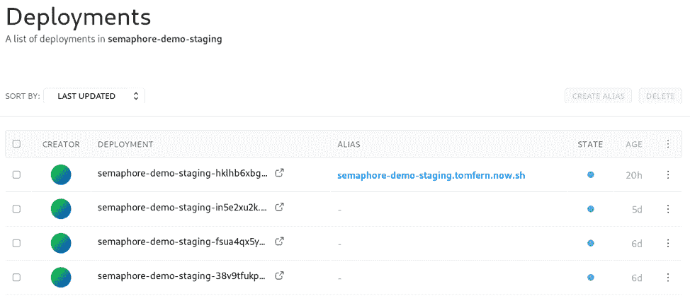
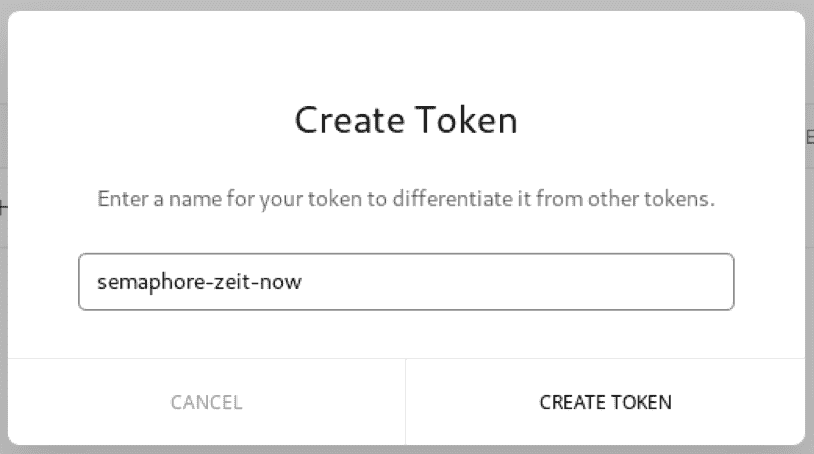
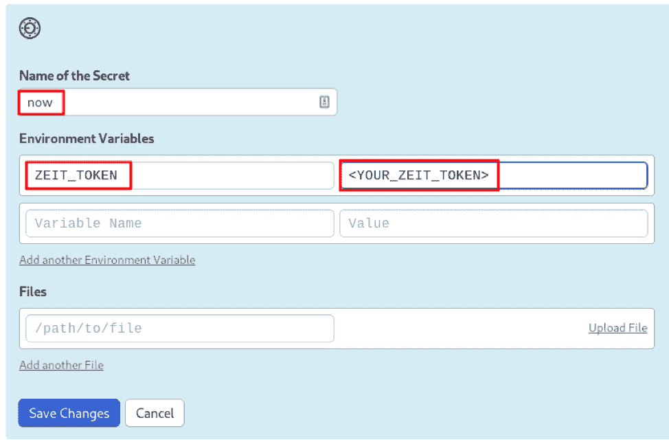
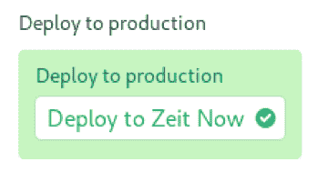
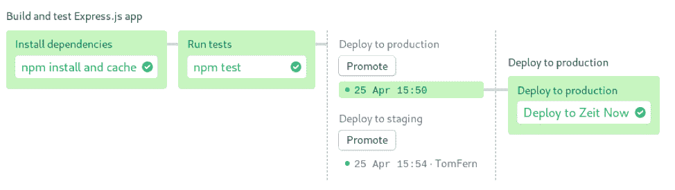
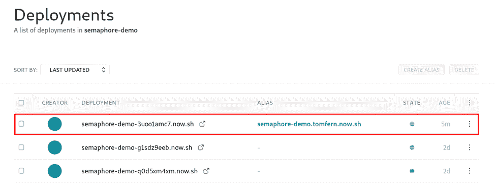

# 如何用信号量和 ZEIT 推送代码(忘记服务器管理)

> 原文：<https://thenewstack.io/how-to-push-code-with-semaphore-and-zeit-and-forget-about-server-management/>

[旗语](https://semaphoreci.com/)赞助本帖。

 [托马斯·费尔南德斯

托马斯是 Semaphore 的独立开发人员和作家。他在布宜诺斯艾利斯大学学习电子工程。在加入 Semaphore 之前，他做过 18 年的 web 开发人员、系统管理员和数据库管理员。当他不工作时，他喜欢阅读、游泳和航海。](https://semaphoreci.com/) 

无服务器是那些事后看来显而易见的概念之一，它让你想知道为什么没有人更早提出它。其核心是将应用程序分解成更小的代码单元，称为 lambdas，并将它们分布在云中。

在内部，[现在在](https://zeit.co/docs/v2/deployments/concepts/lambdas) [AWS Lambdas](https://aws.amazon.com/lambda/) 之上工作。ZEIT 现在也支持其他[云提供商](https://zeit.co/docs/v2/platform/regions-and-providers/)——但仅限于缓存和路由。正如我们接下来将看到的，我们不需要配置或设置任何 AWS 服务来运行我们的应用程序。

兰姆达斯，就其本质而言，规模；这是因为它们只在需要时运行，资源按需分配。此外，由于没有浪费资源，它们的运行往往比成熟的服务器甚至容器更便宜。

服务器在项目开发过程中也会露出丑陋的嘴脸。应用程序必须在某个地方进行测试——通常是运行一些陈旧集成产品的备用机器。我们再一次找到了维护和扩展问题的相同答案:使用无服务器的持续集成和交付平台。

在本文中，我们将使用两个优秀的平台来测试和部署应用程序；ZEIT Now ，一个运行无服务器功能的平台，来构建和托管它和[信号量](https://semaphoreci.com/)来驱动持续集成和交付管道。

无服务器可以采取多种形式:我们可以为不同的云提供商编写无服务器功能，我们可以使用一体化的解决方案平台，或者我们可以从近年来出现的许多无服务器框架中选择一个——其中大多数都需要某种程度的重新培训，并且有供应商锁定的风险。

然而，ZEIT Now 部署是无缝的。ZEIT 并没有要求我们学习一个新的无服务器框架。我们可以部署现有的应用程序，无需修改。

在本文中，我们将学习使用[信号量](https://semaphoreci.com/)来持续测试并有条件地将我们的应用程序部署到 ZEIT Now。

## 满足应用

在这篇文章的过程中，我们将使用[信号量演示应用](https://github.com/semaphoreci-demos/semaphore-demo-zeit-now)。一步一步，我们将看到如何让它上线，以及如何使一个连续的交付过程的一部分。

该项目由一个简单的 API 服务器组成，其功能相当于一个 [Hello World！](https://en.wikipedia.org/wiki/%22Hello,_World!%22_program)程序。API 是应用程序通过 web 相互通信的方式，因此掌握它们至关重要。

服务器是为 [Node.js](https://nodejs.org/) 编写的，并且使用了一些额外的模块:

Express 是一个为构建网站和 API 而设计的框架。它的流行使它成为 web 开发不可或缺的一部分。

与其他框架不同，Express 并不强迫我们采用任何特定的设计模式。相反，它只提供最基本的功能，可以用中间件来扩展。

头盔是为 Express 提供增强安全性的中间件。它可以通过在 HTTP 消息中添加特殊标题来防止诸如跨站脚本(XSS)和点击劫持之类的攻击。

在任何开发项目中，测试都是至关重要的，不仅是为了发现 bug，也是为了验证代码是否完全按照设计意图运行。Jest 实现了单元测试，这是一种运行小段代码并检查结果的技术。

## 设置您的开发环境

在我们继续之前，您可能需要在您的机器上安装一些工具。您应该检查是否已经安装了 Node.js 和 npm 包:

如果你需要安装它们，可以在 [Node.js](https://nodejs.org/en/download/) 网站找到说明。

为了处理代码，你还需要 Git。检查您是否已经安装了它:

最后，虽然不是绝对必要，但拥有 [curl](https://curl.haxx.se/) 这种人际关系网的瑞士军刀是个好主意。查看服务器的响应非常方便。

## 分叉并运行演示

要获得您自己的项目副本，请在 GitHub 上获取存储库:

1.  1.  创建一个 GitHub 账户。
    2.  去[演示应用](https://github.com/semaphoreci-demos/semaphore-demo-zeit-now)库。
    3.  点击右上角的叉按钮。
    4.  点击克隆或下载按钮，复制网址。
    5.  获取代码:

        ```
        $  git clone https://github.com/&lt;YOUR_REPOSITORY_URL&gt; 
        ```

下一步是构建和测试应用程序:

1.  安装所需的软件包:

2.  并运行测试套件:

```
&gt;  express-ziet-now-semaphore-ci@1.0.0  test semaphore-demo-zeit-now
&gt;  NODE_ENV=test PORT=3000  jest  --coverage  --bail

PASS  test/integration/index.test.js
  :index
    ✓  [GET  /]  Should get server is running response  (54ms)

  console.log test/index.js:12
    Server running on port  3000.

  console.info test/_testUtils/ApiClient.js:20
    ---REQUEST.BODY---

  console.info test/_testUtils/ApiClient.js:21
    {}

  console.info test/_testUtils/ApiClient.js:22
    ---RESPONSE.BODY---

  console.info test/_testUtils/ApiClient.js:23
    {
      "text":  "Hello from express server."
    }

---------------------|----------|----------|----------|----------|-------------------|
File |  %  Stmts  |  %  Branch  |  %  Funcs  |  %  Lines  |  Uncovered Line  #s |
---------------------|----------|----------|----------|----------|-------------------|
All files            |      100  |      100  |      100  |      100  | |
index.controller.js  |      100  |      100  |      100  |      100  | |
---------------------|----------|----------|----------|----------|-------------------|
Test Suites:  1  passed,  1  total
Tests: 1  passed,  1  total
Snapshots: 1  passed,  1  total
Time:        1.591s
Ran all test suites.

```

Jest 打印了相当多的输出。第一部分是单元测试的结果。我们只有一个测试:检查服务器的响应是否是有效的 JSON。第二部分是覆盖率报告，它告诉我们是否有任何代码部分没有被执行。没有发现问题？到目前为止，一切顺利。

剩下唯一要做的就是启动应用:

您可以使用 curl 查看服务器的响应，也可以打开浏览器查看 http://127.0.0.1:3000:

```
$  curl  -w  "\n"  http://127.0.0.1:3000

{"text":"Hello from express server."}

```

你让它工作了。好样的。

## 现在时代

有了 ZEIT Now，我们只需几个按键就可以进行全球无服务器部署(说真的，只需要一个命令)。神奇之处在于它们的构建器，它获取您现有的应用程序代码，并将其转换成 lambdafunctions。你有很多静态文件吗？

没问题。随着缩小和智能内置的全球 CDN，他们有你涵盖。

在 ZEIT Now 中，不需要管理服务器，也不需要构建容器。它可以很好地与任何工作流集成，并与 CI/CD 平台配合良好。凭借即时、自动部署，ZEIT Now 非常适合我们的微服务应用。

ZEIT 中的应用程序现在是不可变的，这意味着它们一旦部署就不能更改。每个新发布的版本都有一个唯一的部署 URL。事实证明，如果有任何问题，这个聪明的方法允许我们在任何时候回滚到任何以前的版本。

ZEIT 现在的地址遵循这种格式:

```
●  https://APP_NAME.USERNAME.now.sh: Public-facing URL that points to the latest version.
●  https://APP_NAME-UUID.now.sh: Deployment URL. UUID is a unique, automatically generated string for each release.

```

## 从您的计算机部署

理论够了。本 app 上线时间:
1。创建一个 ZEIT Now 帐户。
2。安装官方 now 工具:

3。现在将您的机器连接到 ZEIT:

4。遵循屏幕上的说明。该项目已经提供了两个部署文件:production.json 和 staging . JSON。Production 是我们面向公众的站点，而 staging 将充当我们的试验品和游乐场。

看看 staging.json:

```
{
  "version":  2,
  "name":  "semaphore-demo-staging",
  "builds":  [
      {  "src":  "**/*.js",  "use":  "@now/node"  }
  ]
}

```

这是现在进行部署所需的最少信息。配置定义了应用程序的名称以及在构建中包含哪些文件。
尝试部署中转站点:

```
$  now  --local-config staging.json

&gt;  Deploying  ~/semaphore-demo-zeit-now under myname
&gt;  Using project semaphore-demo-staging
&gt;  Synced  1  file  (37B)  [2s]
&gt;  https://semaphore-demo-staging-hklhb6xbg.now.sh [v2] [3s]
┌  index.js Ready [29s]
└──  λ  index.js  (473.97KB)  [iad1]
┌  controllers/index.controller.js        Ready [26s]
└──  λ  controllers/index.controller.js  (33.96KB)  [iad1]
&gt;  Ready!  Aliased to https://semaphore-demo-staging.myname.now.sh [in clipboard] [37s]

```

现在，所有繁重的工作都由他来做:

*   现在把代码上传到 ZEIT。
*   下载软件包，构建并启动应用程序。
*   分配部署和公共 URL。

检查您的新服务器。ZEIT Now 仪表盘显示所有部署:



## 持续集成的所有热门话题是什么

在这篇文章的这一点上，你可能会问:我已经把应用程序上线了，我们还没有完成吗？差远了，最精彩的部分还在后面。想想我们做了多少事情才走到这一步。第一次总是有趣和好玩的，但是一遍又一遍地重复，会很快变老。如果我们可以自动化处理这一切，那不是很好吗？这正是持续集成(CI)和持续交付(CD)所要解决的问题。CI/CD 负责所有的测试、构建和部署。他们将此作为一个可重复的、久经沙场的过程。

在团队中工作时，CI/CD 甚至更为重要。大量的手工编码速度更快，但是引入冲突的几率更高。减轻这种情况最可靠的方法是尽可能频繁地构建和测试应用程序。然后，一旦一切正常，我们就可以更早地发布高质量的版本。

## 关于信号量

旧的持续集成和交付平台，如 Jenkins 的独立版本，妨碍了开发人员管理基础设施。在 Semaphore 中，不需要维护后端，不需要安装服务器，也不需要对任何 Java 版本进行故障排除。我们只以一种清晰、易读的格式定义管道，并根据需要进行多次 Git 推送。Semaphore 将静默地提供一切，以驱动任何规模的管道。

在深入研究信号量之前，我们需要了解一些关键概念。信号量管道是用 [YAML](https://yaml.org/) 编写的，这是一种人类和计算机都容易阅读的文本格式。使用 YAML 时，重要的是要注意缩进，因为与 Python 一样，空格也很重要。

对于我们的项目，我们只需要了解一些属性，如果好奇，您也可以查看[完整管道规格](https://docs.semaphoreci.com/article/50-pipeline-yaml):

管道的名称显示在信号量的仪表板上。我们还必须设置配置版本号。目前稳定的版本是“v 1.0”。

```
version:  v1.0
name:  Build and test Express.js app

```

Semaphore 提供了几种不同规格的[机型](https://docs.semaphoreci.com/article/20-machine-types)。机器和操作系统的组合在代理属性下定义。Semaphore 提供了一个 [Ubuntu 18.04](https://docs.semaphoreci.com/article/32-ubuntu-1804-image) 镜像，正好满足我们的需求:
代理:

```
  machine:
    type:  e1-standard-2
    os_image:  ubuntu1804

```

块、任务和作业定义了流水线的每一步要做什么。每个块必须有一个任务，每个任务定义一个或多个作业。作业包含要执行的命令列表。在一个块内，作业同时运行；每一个都在一个完全隔离的虚拟机中运行。一个块中的所有作业完成后，下一个块就开始了。

这是一个有两个任务的程序块的样子:

```
blocks:
  -  name:  Block name
    task:
      jobs:
      -  name:  My Job
        commands:
          -  command  1
          -  command  2
      -  name:  Another Job
        commands:
          -  command  1
          -  command  2

```

促销将管道连接在一起，构建复杂的工作流程。因为它们可以由用户定义的条件触发，所以它们可以用来适度地管理故障，或者在管道成功运行时进行释放。

```
promotions:
  -  name:  Deploy
    pipeline_file:  deploy.yml
    auto_promote_on:
      -  result:  passed

```

## 持续集成管道

在这一部分，我们将详细回顾我们的 CI 渠道。下面是完整的带注释的配置:

```
# Use the latest stable version of Semaphore 2.0 YML syntax:
version:  v1.0

# Name your pipeline. In case you connect multiple pipelines with promotions,
# the name will help you differentiate between, for example, a CI build phase
# and delivery phases.
name:  Build and test Express.js app

# An agent defines the environment in which your code runs.
# It is a combination of one of the available machine types and operating
# system images.
# See https://docs.semaphoreci.com/article/20-machine-types
# and https://docs.semaphoreci.com/article/32-ubuntu-1804-image
agent:
  machine:
    type:  e1-standard-2
    os_image:  ubuntu1804

# Blocks are the heart of a pipeline and are executed sequentially.
# Each block has a task that defines one or more jobs. Jobs define the
# commands to execute.
# See https://docs.semaphoreci.com/article/62-concepts
blocks:
  -  name:  Install dependencies
    task:
      jobs:
        -  name:  npm install and cache
          commands:
            # Get the latest version of our source code from GitHub:
            -  checkout

            # Use the version of Node.js specified in .nvmrc.
            # Semaphore provides nvm preinstalled.
            -  nvm use
            -  node  --version
            -  npm  --version

            # Restore dependencies from cache. This command will not fail in
            # case of a cache miss. In case of a cache hit, npm install will
            # run very fast.
            # For more info on caching, see https://docs.semaphoreci.com/article/68-caching-dependencies
            -  cache restore client-node-modules-$SEMAPHORE_GIT_BRANCH-$(checksum package-lock.json),client-node-modules-$SEMAPHORE_GIT_BRANCH,client-node-modules-master
            -  npm install

            # Store the latest version of node modules in cache to reuse in
            # further blocks:
            -  cache store client-node-modules-$SEMAPHORE_GIT_BRANCH-$(checksum package-lock.json)  node_modules

  -  name:  Run tests
    task:
      jobs:
        -  name:  npm test
          commands:
            -  checkout
            -  nvm use
            -  cache restore client-node-modules-$SEMAPHORE_GIT_BRANCH-$(checksum package-lock.json),client-node-modules-$SEMAPHORE_GIT_BRANCH,client-node-modules-master
            -  npm test

promotions:
  # Deployment to staging can be triggered manually:
  -  name:  Deploy to staging
    pipeline_file:  deploy-staging.yml

  # Automatically deploy to production on successful builds on master branch:
  -  name:  Deploy to production
    pipeline_file:  deploy-production.yml
    auto_promote_on:
      -  result:  passed
        branch:
          -  master

```

## 安装依赖项

```
blocks:
  -  name:  Install dependencies
    task:
      jobs:
        -  name:  npm install and cache
          commands:
            -  checkout
            -  nvm use
            -  node  --version
            -  npm  --version
            -  cache restore client-node-modules-$SEMAPHORE_GIT_BRANCH-$(checksum package-lock.json),client-node-modules-$SEMAPHORE_GIT_BRANCH,client-node-modules-master
            -  npm install
            -  cache store client-node-modules-$SEMAPHORE_GIT_BRANCH-$(checksum package-lock.json)  node_modules

```

第一个模块下载并安装所有需要的软件包:

*   [checkout](https://docs.semaphoreci.com/article/54-toolbox-reference#checkout) 从 GitHub 克隆代码。
*   [nvm 和 npm](https://docs.semaphoreci.com/article/82-language-javascript-and-nodejs#supported-node-js-versions) 用于设置 Node.js 版本和安装包。
*   [缓存](https://docs.semaphoreci.com/article/54-toolbox-reference#cache)用于在作业之间共享节点模块。

## npm 测试

```
-  name:  Run tests
  task:
    jobs:
      -  name:  npm test
        commands:
          -  checkout
          -  nvm use
          -  cache restore client-node-modules-$SEMAPHORE_GIT_BRANCH-$(checksum package-lock.json),client-node-modules-$SEMAPHORE_GIT_BRANCH,client-node-modules-master
          -  npm test

```

这是单元测试块。由于每个作业都生活在一个隔离的环境中，我们需要获得代码和包。npm 测试运行 Jest 测试。

## 部署

```
promotions:
  -  name:  Deploy to staging
    pipeline_file:  deploy-staging.yml
  -  name:  Deploy to production
    pipeline_file:  deploy-production.yml
    auto_promote_on:
      -  result:  passed
        branch:
          -  master

```

两项[促销](https://docs.semaphoreci.com/article/50-pipeline-yaml#promotions)从 CI 渠道中分出:

*   部署到生产:一旦主分支的所有测试都通过，就自动开始。
*   部署到登台:可以从任何分支上的信号量工作流中手动启动。

## 把所有的放在一起

现在我们已经解决了所有的难题，您将亲眼看到 CI/CD 的强大功能和便利性。

### 共享的秘密

现在为了连接 Semaphore 和 ZEIT，我们需要得到一个令牌:

1.  登录您的 [ZEIT Now](https://zeit.co/) 账户；
2.  转到设置；
3.  转至“令牌”选项卡；
4.  点击创建按钮；
5.  输入令牌的名称，可能是描述性的名称，如:semaphore-zeit-now。



令牌是私有信息，不属于存储库中。信号量有一个安全的机制来处理秘密:

1.  用你的 GitHub 登录为[信号量](https://semaphoreci.com/)创建一个账户；
2.  在左侧导航栏的“配置”下，单击“机密”;
3.  点击创建新密码按钮；
4.  创建如下所示的密码:



## 连续输送管道

我们有两条几乎相同的连续输送管道。除了名称之外，唯一实际的区别是他们使用的本地配置:

```
# ~.semaphore/deploy-staging.yml

version:  v1.0
name:  Deploy to staging
agent:
  machine:
    type:  e1-standard-2
    os_image:  ubuntu1804
blocks:
  -  name:  Deploy to staging
    task:
      secrets:
        -  name:  now
      jobs:
      -  name:  Deploy to ZEIT Now
        commands:
          -  checkout
          -  nvm use
          -  npm install now  -g
          -  now  --token  $ZEIT_TOKEN  --local-config staging.json

```

部署本身再简单不过了:

*   令牌被解密并作为$ZEIT_TOKEN 导入；
*   npm 现在安装；
*   现在由 deployment 负责部署。
    

## 启动管道

这就是我们所有努力的回报:

1.  去你的信号量账户。
2.  按照边栏上的链接创建一个新项目。
3.  信号量会显示你的 GitHub 资源库，点击添加资源库。
4.  只要存储库中的任何文件被修改，管道就会启动:

```
$  touch any_file
$  git add any_file
$  git commit  -m  "start semaphore pipeline"
$  git push origin master

```



完成所有模块后，您应该使生产站点在线:



## 你做到了！

干得好！一旦你尝到了无服务器架构和 CI/CD 的威力，你就会想在你所有的项目中使用它。我希望你今天学到的东西能帮助你更好、更聪明地建设。

来自 Pixabay 的特征图像。

<svg xmlns:xlink="http://www.w3.org/1999/xlink" viewBox="0 0 68 31" version="1.1"><title>Group</title> <desc>Created with Sketch.</desc></svg>