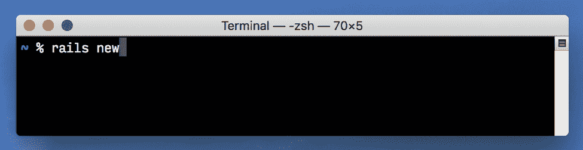

# 如何重写您的基础应用程序，同时保持可操作性

> 原文：<https://thenewstack.io/how-to-rewrite-your-bedrock-application-while-remaining-operational/>

2016 年 1 月， [Chargify](https://www.chargify.com/) 决定做一次代码重写。我们的应用程序已经有六年了。我们觉得我们已经学到了足够多的东西——并且受到了现有架构的足够多的限制——通过重新开始，我们实际上会走在前面。

我愿意相信我们并不幼稚。我们做了调查，意识到了这些警告。我们知道乔尔·斯波尔斯基说这是一个“[永远不要做的事情](https://www.joelonsoftware.com/2000/04/06/things-you-should-never-do-part-i/)”但是也有像大卫·海涅梅尔·汉森这样的声音，他建议[有一个重写的时间和地点。这一观点引起了我们的共鸣。](https://signalvnoise.com/posts/3856-the-big-rewrite-revisited)

所以，我们把队伍分成两队。团队中有一半人被指派维护“Chargify Classic ”,因为它是我们的收入来源，也是一个很棒的应用程序，不会很快消失。团队的另一半着手开发代号为“彗星”的新应用程序。

## 大改写

进入 Comet 几个月后，Chargify 开始与 Scaleworks 进行收购谈判。Scaleworks 的合作伙伴正确地将 Comet 确定为业务的最大风险之一，我们共同决定将重写的内容束之高阁，重新专注于 Classic。

我们在 Comet 上取得了良好的进展，并有机会探索一些真正伟大的想法，但它几乎肯定会比我们希望的时间长。我们才出生四个月，这已经变得很明显了。

## 基础代码

 [迈克尔·克莱特

2009 年，Michael Klett 在 Grasshopper 的实验室部门孵化时，与人共同创立了 Chargify。在过去的 10 年里，他指导了所有 Chargify 产品的技术和架构方向，同时帮助团队成长并培育其核心价值观。在 Chargify 之前，他在 IBM 为最初的 Xbox 360 主机设计了一部分中央处理器。Michael 拥有北卡罗来纳州立大学的计算机工程学士和硕士学位。他与妻子和两个孩子住在北卡罗来纳州的卡里。在业余时间，他喜欢和家人一起玩棋盘游戏，通过跑步和足球保持活跃，并酿造家酿啤酒。](https://www.chargify.com/) 

为什么重写的时间几乎总是比所有人预期的要长？我相信这是因为我称之为“基础代码”的东西每个应用程序都是建立在我们通常认为理所当然的基础代码之上的。这是没有太大变化的旧代码，支撑着你的架构。基岩代码既是福也是祸。这通常是您感到受约束的原因，因为它设定了一个方向，并影响代码和随后的决策。

你的基础代码是很久以前写的，要么是已经不在你公司的开发人员写的，要么是你现在的开发人员经验不足的版本。就像地质基岩一样，很难改变或移动。但是，也像地质基岩一样，它巨大而重要。而且，它通常并不真的需要改变。

哪个代码是基岩代码？

*   您的用户和身份验证系统是基础代码。您可能不喜欢它的工作方式，但是您不希望必须更改或重写它，这样您就可以做出最初推动重写的高价值更改。
*   你的“观察者”系统是基础代码。无论你是有意观察你的观察者，还是含蓄观察，几乎每个应用都有某种形式的观察者——它们确保当“A”发生时，其他地方的“B”也应该发生。

这些不是你想要考虑的互联，因为你可能已经忘记了其中的大部分，但是当你错过了一个连接，你的用户可能会立即注意到。

基岩的好处是它通常被一层容易改变的肥沃土壤所覆盖。你可以把它推平或堆起来。你可以在里面种些东西，它们会随着时间的推移长得更大更好。这片沃土是你的团队大部分时间建设的地方，也可能是你希望他们待的地方。即使您感觉受到约束，想要重写，也可以使用沃土来实现与重写相同的结果，本文的其余部分将介绍一些策略来实现这一点。

## 在行驶的公共汽车上更换车轮

在 Chargify，彗星项目激励着我们，因为它向我们展示了什么是可能的。它让我们可以自由地打破现有的惯例，发现更可持续和以用户为中心的做事方式。我知道我们需要将这些想法融入经典。因此，我们决定在汽车行驶时更换车轮，而不是重写。

这样的项目比重写需要更多的纪律和约束驱动的工作，但它允许你留在肥沃的土地上，而不是陷入基岩。与重写相比，你更有可能成功地完成这类项目，而且是在你可以实际估计的时间范围内。

我们遵循一些简单的成功策略:

1.双重写入:同时以“旧方式”和“新方式”计算和存储数据
2。双重检查:在双重书写
3 的基础上，比较你前后的结果。缓慢推出:不要将重写的部分一次暴露给所有人

## 双重书写

对于 Chargify 来说，我们希望做出的一个基本改变是摆脱“滚动余额”交易系统，转而使用更加灵活的发票系统来提交账单。当我在 2009 年开始构建 Chargify 时，我认为“最重要”的概念之一是订阅的“当前到期余额”。因此，我设计了一个系统，其中每个余额变化条目(在我们的应用程序中称为事务)存储两个重要的数据:

1.  余额增量(余额的增加或减少)
2.  当前余额

这基本上是财务日记账或 T2 分类账的概念，在会计领域已经存在了数百年。对于准确的数据来说，这是一个可靠的选择，但对于帮助客户了解他们的 SaaS 账单来说，这并不总是最佳选择。(不幸的是，我天真地建立了一个单分录分类账，而不是双分录分类账，这造成了限制，并使报告变得困难。但那是另一个时间的话题……)

分类账的问题在于，根据定义，分录是不可变的。如果你犯了一个错误或需要作出改变，你必须作出另一项“纠正”平衡。您最终得到的是技术上正确的事件历史，但对客户来说却是一个潜在的混乱视图。SaaS 的顾客会考虑“这个月的账单”和“上个月的账单”如果你需要为他们修改上个月的账单(也许你不小心多收了他们的钱)，他们希望清楚地看到账单被修改了，而不是你在包含这个月账单的清单末尾加上了另一个日志条目。对我们来说，交易系统是人类理解的障碍。但它也是我们系统的基石——一切都依赖于它。

我敢打赌，随着应用程序的增长，这在大多数应用程序中都很常见——您存储的数据很重要，但还不够。而且，仅仅存储额外的数据是没有意义的——您想要捕获完全不同的数据或以全新的方式对其进行排列。对于这个场景，我建议双写。

双写作品是这样的:

1.  不要改变你已经存储的数据——继续做你已经在做的事情。(目标是不要破坏任何已经存在的东西！)
2.  此外，决定什么数据是你真正想要的。完全按照您想要方式设计数据(模式、收集方法等)，就好像旧系统根本不存在一样。
3.  最后，解决如何同时存储旧数据和新数据的问题。

通常，您的新数据不能静态地从旧数据中派生出来，否则您已经这样做了。通常，有一些关键的即时信息会影响您的新数据，这些信息在事后不容易重建。

我们案例中的一个例子是定价信息。我们的旧分类帐条目可以准确地反映某个项目的总费用，但是如果该项目的价格实际上是由分层定价数据组成的呢？那一天，该用户的每一层成本是多少？我们的新数据为每个“行项目”存储了这些元数据在可能的情况下，我们的新行项目数据与旧的交易数据相关联，但通常更加丰富和准确，讲述更完整的故事。

获取新数据的最佳方式是什么？

对我们来说，我们希望尽可能少地改变现有的代码路径。相反，我们在现有代码的特定位置“接入”,并在内存中建立一个数据“注册表”。相比之下，旧的代码路径本质上使用数据库作为“注册表”；许多开发人员迭代构建的应用程序中的一个常见问题。随着逻辑的展开，这些代码路径多次保存和重新保存同一行数据。

尽管这种方式效率很低，但我发现随着时间的推移，随着新特性的加入，这种情况在成熟的应用程序中经常发生。虽然改变很有诱惑力，但通常是有风险且困难的…因此，我们现在采取的方法是尽可能高效地使用新数据。在下一节中，我将展示新数据将如何为我们提供一个回头改进旧代码路径的机会。

一旦通过旧的代码路径(有时跨类或应用程序的非常不同的部分)构建了数据注册中心，新数据就尽可能高效地持久化(即尽可能少地写入数据库)。我们在“带内”执行写入，但是如果您希望对性能产生较小的影响，也可以考虑在带外(即在后台作业中)执行写入。

最后，您应该拥有的是与以前完全一样的代码，但是添加了新的数据，可能是新的格式，它位于旧数据的旁边。这会给你以前没有的洞察力。编写和存储数据是有益的，即使您还没有编写代码来使用它，如下面几节所示。

## 双重检查

信不信由你，你的双写是要出错的！无论你写了多少测试，你都会在生产中遇到你在双写策略中没有考虑到的场景。好消息是，有一种可扩展的方法来发现它——您可以找到一些方法来比较或关联您的旧数据和新数据。

对我们来说，找到比较点相当容易:对于我们系统中的每个订阅，可以将(旧数据)滚动当前余额与(新数据)计算的未付发票余额进行比较。当出现不匹配时，我们知道我们在挂钩点或数据转换中错过了一个场景。

我们设置了一项日常工作来查找这些差异，并在发现差异时提出问题。

这也是重构代码路径的常用策略。Github 的[科学家](https://github.com/github/scientist)允许你运行重构代码和旧代码，然后比较结果。唯一的区别是双写侧重于重构数据而不是代码。

## 缓慢推出

将所有用户从旧的稳定的东西转移到新的不稳定的东西是一个有风险的提议。这样的招式还是慢慢来比较好。双重书写和双重检查给了你一个很好的缓慢展示的平台。事实上，您甚至可以在将数据用于除双重检查之外的任何事情之前就开始双重写入数据。

一旦使用了新数据，双重写入就意味着系统会在旧数据存在的情况下继续工作。这使得 Chargify 能够以渐进的方式添加我们丰富的新[关系发票](https://www.chargify.com/blog/relationship-invoicing/)功能(例如[客户层级和谁付款](https://www.chargify.com/blog/introducing-whopays/)),而不必一下子改变一切。一些功能(例如向用户显示账单)被更新以使用新的发票，而其他功能(例如我们的催款系统试图自动收集过期帐户)则保留使用旧的交易。由于数字匹配，我们能够等待以后更新催款代码，使新功能的开发不那么引人注目，因为不是代码库的每个区域都需要更改。

我还建议允许用户选择加入由你的双写启用的新功能。这为双重检查系统提供了一个缓慢扩展的数据集。比起淹没双重检查系统和用补丁淹没你的团队，bug 变得更容易管理，更少的用户受到它们的负面影响。

请记住，在某些时候，您可能需要编写一个翻译，将历史数据转换为新数据。此时，您需要决定—我需要历史数据有多真实？如前所述，通常很难重建历史并获得与通过重复写入获得的完全相同的新数据。对我们来说，权衡的结果是，历史上较旧的发票将是准确的，但与通过重复书写创建的新发票相比，其洞察力和丰富性较少。

在 Chargify，我们的关系发票推广计划分为四个阶段:

1.  首先，新用户可以选择加入新的数据/特性(导致用户的减少)
2.  后来，新用户默认获得新数据/特性(导致稳定的用户流)
3.  之后，现有用户可以选择加入新数据/功能(需要翻译历史数据，导致高用户流量)
4.  最后，现有用户都获得了新的数据/特性(打开了闸门)

要知道，在你进行到第三步或第四步之前，会有一些用户想知道为什么他们不能接触到“新东西”。我们肯定经历过这种情况，这对用户和支持他们的团队来说都是令人沮丧的。我的建议是清楚地传达你的推理:你重视安装基础的正确性和可靠性。你已经赢得了他们的信任，这是你保持信任的方法之一。我们认为，一个缓慢而顺利的推广计划比一个伤害用户和破坏信任的快速计划要好。

## 结论

在行驶中更换公共汽车上的车轮需要仔细的计划，但这是可以做到的。而且，它不需要完全停止公共汽车，这是大多数用户会欣赏的。

通过使用双重编写、双重检查和缓慢推出，您可以在不需要重写的情况下更改应用程序的基本内容。有时候你会希望你已经重写了整件事，但是要坚强！想想所有你没有重写的代码，因为你留在了肥沃的土地上。想想这些策略提供的安全网。

对于 Chargify 来说，Comet 最大的创意来自于一个只有重写团队一半大小的开发团队。最重要的是，我估计我们已经在不到一半的重写时间内改变了轮子。这个结果应该给那些考虑用这些策略代替重写的人信心。

通过 Pixabay 的特征图像。

<svg xmlns:xlink="http://www.w3.org/1999/xlink" viewBox="0 0 68 31" version="1.1"><title>Group</title> <desc>Created with Sketch.</desc></svg>