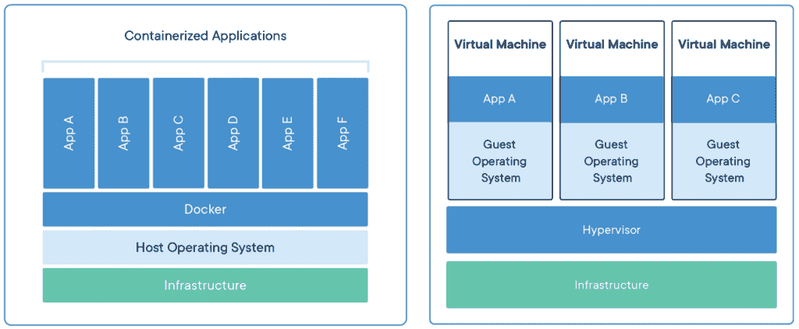
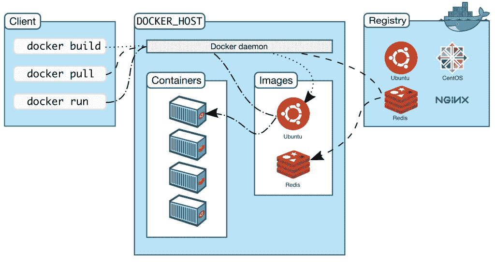

# 如何在 Docker 中运行 Cassandra 操作

> 原文：<https://thenewstack.io/how-to-run-a-cassandra-operation-in-docker/>

 [钟志文

钟志文在 DataStax 负责企业教育。他在嵌入式/实时系统、移动开发、企业应用和大数据领域拥有 30 多年的行业经验。](https://www.linkedin.com/in/drchung) 

现代应用要求更快的交付、更好的可移植性和无缝的可伸缩性，容器在这样的世界里蓬勃发展。 [Gartner 预测](https://www.gartner.com/en/newsroom/press-releases/2020-06-25-gartner-forecasts-strong-revenue-growth-for-global-co)到 2022 年，超过 75%的全球组织将在生产中运行容器化应用。

这种增长趋势背后的动力不是别人，正是 Docker。Docker 是一个开源的容器化平台，它让开发者将应用打包到容器中，容器中包含了他们在不同环境中运行所需的一切。然而，对于企业来说，大规模管理单个 Docker 容器可能会很棘手，这就让位于流行的容器编排平台: [Kubernetes](https://kubernetes.io/) (K8s)。

简而言之，Kubernetes 使容器的部署、管理和扩展变得容易，并且是当今企业中使用的主要编排平台。这使得[学习 Kubernetes](https://medium.com/building-the-open-data-stack/deploy-a-sample-application-with-cassandra-in-kubernetes-d39c7bb95cd4) 成为每个初露头角的应用程序开发人员的必修课；但是首先，你需要了解容器和 Docker。

在 Docker 工作坊的 [Cassandra Operations 中，您将熟悉 Docker，并了解如何在容器中部署云原生应用。您还将涉猎一些使应用程序开发更容易的其他技术:](https://dtsx.io/3g01TKu)

*   **Spring Boot** 从 Docker 中提取后端应用程序映像。
*   **Angular** web 应用运行 Docker 中的前端 app。
*   Apache Cassandra 作为您的分布式 NoSQL 数据库。

最后，我们将为您提供一个动手练习，让您在一个互动的培训环境中，完成在 Docker 中部署基于 Cassandra 的应用程序的每个步骤。

我们开始吧。

## **了解码头工人**

让我们从头开始。容器是一个轻量级软件包，它捆绑了运行应用程序所需的一切:代码、运行时、系统工具、系统库和设置。这使得开发人员可以在不同的生产环境中快速可靠地运行应用程序。

但是等一下，容器和虚拟机有什么不同？

容器虚拟化操作系统，而虚拟机模拟硬件，如 CPU、磁盘和网络设备，以避开有限的基础设施。简单地说，容器比虚拟机更轻、更高效、更便携。

图一。容器(左)和虚拟机(右)。([来源](https://www.docker.com/resources/what-container))

现在清楚了，我们可以深入 Docker 了。

概括地说，Docker 平台允许您将应用打包到一个一体化的容器中，使您能够:

*   更快、更一致地开发、交付和运行软件。
*   轻松扩展或缩减，以动态管理工作负载。
*   在相同硬件上运行更多工作负载。
*   在本地、内部、云中或环境组合中部署应用。

Docker 使用客户机-服务器架构，Docker 客户机与 Docker 守护进程对话。守护进程监听 API 请求，管理 Docker 对象(比如图像、容器、网络、插件)，并负责构建和运行您的容器。

以下是所有这些是如何组合在一起的。

图二。Docker 架构。([来源](https://docs.docker.com/get-started/overview/)

为了让您快速了解不同的部分，我们将简要介绍一些概念以及您将在本次研讨会中使用的 Docker 对象和客户端。

### **码头工人图片**

Docker 映像是一个只读文件，它结合了应用程序和运行它所需的环境(库、工具、文件等)。)，并作为构建 Docker 容器的一组指令。

它就像一个模板，通常基于另一个图像进行一些定制。例如，您可以从 Node.js 映像构建一个映像，它会带来运行应用程序所需的一切。

这些图像通常存储在一个 [Docker 注册表](https://www.aquasec.com/cloud-native-academy/docker-container/docker-registry/)中，它可以是私人的，供您自己使用，或者您可以使用公共的 Docker Hub，在那里您可以找到并重用其他人存储的图像。

### **Dockerfiles**

docker 文件定义了构建映像的步骤。它列出了构建应用程序所需的命令，甚至可以下载、安装和运行应用程序所需的软件。

要创建自己的映像，可以从 Docker 命令行界面(CLI)使用 *build* 命令。您可以对 docker 文件中的特定图像层进行更改，当您重建图像时，只有该层会更新。这也是图像如此轻便和高效的原因之一。

### **Docker 网络**

简而言之，映像在容器中运行，容器通过 Docker 网络进行通信。

Docker 网络的强大之处在于，你可以将运行在 Docker 容器中的应用程序与其他应用程序连接起来，即使它们没有部署在 Docker 上或者在不同的操作系统上。它通过为容器创建一个平台无关的网络来实现这一点，因此它们可以相互通信，无论它们是在 Linux、Windows、iOS 上还是混合使用，您都可以管理它们。

### **Docker 撰写**

Docker Compose 是一个让您管理多容器应用程序的客户端。你可以使用一个 *docker-compose.yaml* 文件，通过简单的命令来配置你的应用程序的所有服务。您可以在生产、试运行、开发和测试环境中使用该工具。

所以这是理论上的一部分，但现在好的部分来了:自己使用它。

## **场景:在 Docker 上部署一个示例应用**

准备好试试了吗？我们设置了一个交互式 Katacoda 场景，这样您就可以在学习如何在 Docker 中运行基于 Cassandra 的应用程序的同时，安全地将理论付诸实践。

在这个场景中，您将在 Docker 容器中部署一个 Angular 前端应用程序、一个 Spring Boot 后端应用程序和一个 Cassandra 集群。这只需要 15 分钟，您将学会如何:

*   创建码头工人网络。
*   从 Docker Hub 提取图像，并在容器中运行它们。
*   部署 Cassandra 集群。
*   部署 Spring Boot 微服务。
*   测试微服务到数据库的连接。
*   部署 Angular web 应用程序。
*   测试 web 应用程序。
*   关闭容器。
*   使用 Docker Compose 重新创建应用程序。

这听起来可能很多，但是不要担心，我们会一步一步地指导你。所以，卷起袖子，弯曲手指，在 Docker 页面中滚动到[运行 Cassandra 应用程序的底部，点击“开始场景”](https://dtsx.io/3g01TKu)

一旦你完成了它，你就可以进入 Kubernetes 的世界，学习所有关于大规模管理容器的知识——这是任何企业都必须知道的。一个很好的起点是我们关于在 Kubernetes 中使用 Cassandra 部署示例应用程序的第一次研讨会。保持势头！

*本文是* [*学习系列*](https://dtsx.io/3r7PLgI) *DataStax 的一部分，旨在向您展示如何在 Kubernetes 中成功运行 Apache Cassandra***。每个工作坊都帮助你提升一项新技能，并向你介绍通过* [*K8ssandra 认证考试*](https://dtsx.io/34cHOOC) *所需的所有概念。**

*<svg xmlns:xlink="http://www.w3.org/1999/xlink" viewBox="0 0 68 31" version="1.1"><title>Group</title> <desc>Created with Sketch.</desc></svg>*