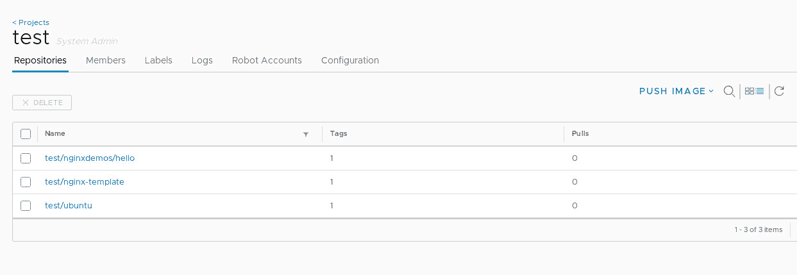
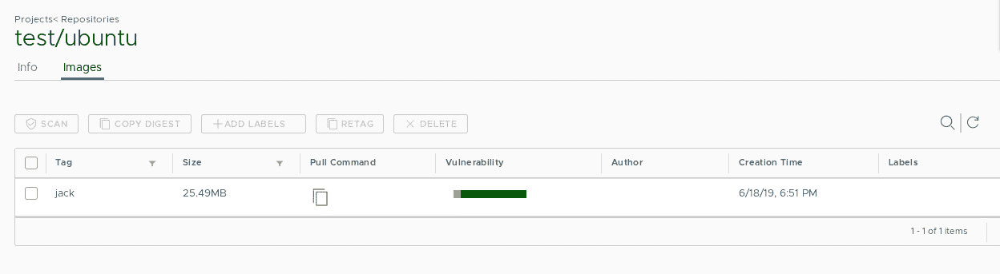
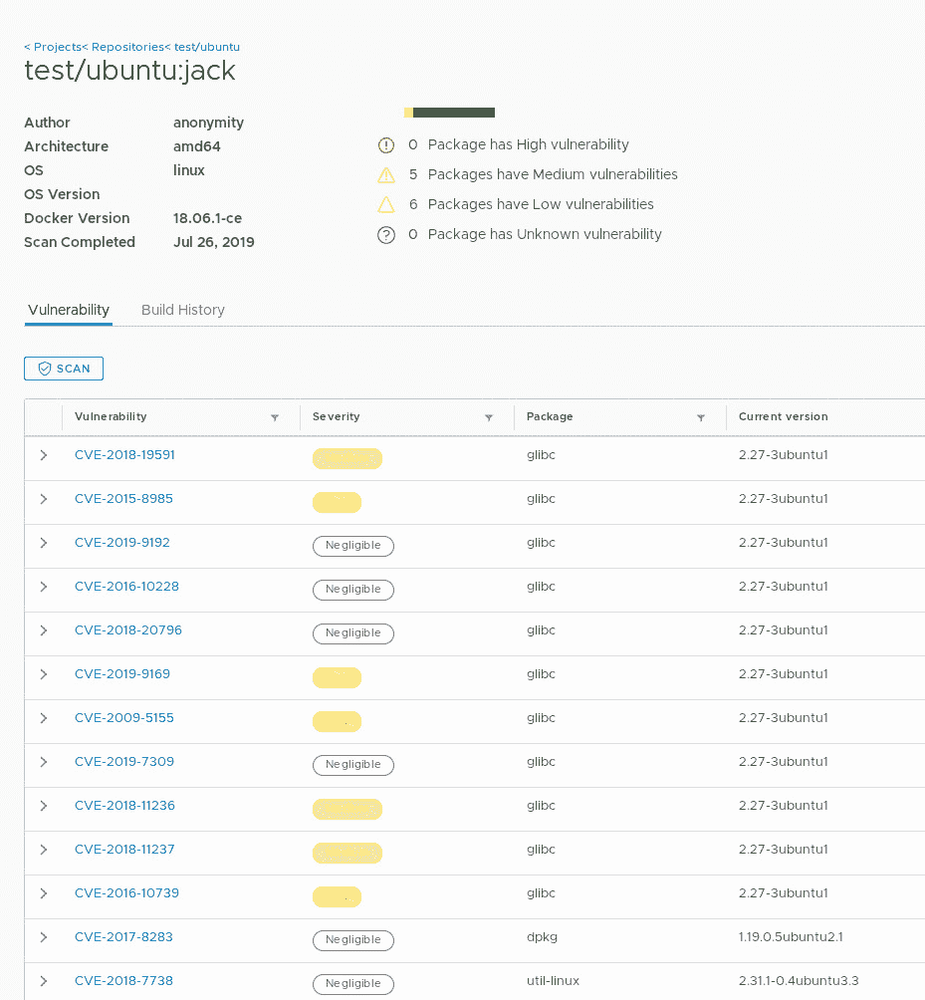

# 如何使用 Harbor 扫描 Docker 图像中的漏洞

> 原文：<https://thenewstack.io/how-to-scan-docker-images-for-vulnerabilities-with-harbor/>

您的集装箱已经成为您公司的绝对必需品。没有它们，您就无法像需要的那样敏捷，以跟上不断增长的业务需求。因此，您可能会通过容器部署越来越多的服务。

这意味着你可能会从各种来源下载越来越多的图片。随着今天在图像中发现的漏洞数量的增加，您很容易成为可能给公司带来问题的漏洞的牺牲品。在某些情况下…大问题。

你如何避免这种情况？你可以利用 Docker 注册表来扫描这些图像。Harbor 就是这样一个注册中心。在本系列的第一部分中，我向您介绍了在 Ubuntu 18.04 上安装 Harbor 的过程。(阅读:“[在 Ubuntu 18.04](/tutorial-install-the-docker-harbor-registry-server-on-ubuntu-18-04/) 上安装 Docker Harbor 注册服务器”)。这一次，我将向您展示如何成功地将图像上传并扫描到 Harbor。

## 你需要什么

你唯一需要做的就是:

*   克莱尔支持下的[港](https://goharbor.io/)的运行实例。
*   要上传和扫描的图像。
*   Harbor 服务器上的用户帐户。

要上传的图片可以是你自己创建的，也可以是你从各种注册中心下载的(比如 [Docker Hub](https://hub.docker.com/) )。

这些东西准备好了，让我们开始工作吧。

### 安装证书

为了将图像从网络上的机器推送到 Harbor registry，每台机器都必须有 Harbor server SSL 证书的副本。在我在原始文章中概述的测试案例中，我使用了自签名证书。我将在这里继续这个例子。如果您从受信任的 CA 购买了证书，您只需修改证书副本的名称。

以下是复制证书的步骤:

1.  将 shell 安全地安装到您的 Harbor 服务器中(或者，如果您有物理访问权限，请登录)。
2.  使用命令 *sudo -s* 获得 root 访问权限。
3.  使用命令*CD/etc/docker/certs . d/SERVER_IP*进入证书目录(其中 SERVER _ IP 是您的服务器的 IP 地址)。
4.  使用命令*scp ca.cert USER @ CLIENT_IP:/home/USER*将 ca . cert 密钥复制到客户端(其中 USER 是客户端机器上的用户名，CLIENT _ IP 是客户端机器的 IP 地址)。
5.  使用命令*scp ca.crt USER @ CLIENT_IP:/home/USER*将 ca . CRT 密钥复制到客户端(其中 USER 是客户端机器上的用户名，CLIENT _ IP 是客户端机器的 IP 地址)。
6.  使用命令*scp ca.key USER @ CLIENT_IP:/home/USER*将 ca . key 密钥复制到客户端(其中 USER 是客户端机器上的用户名，CLIENT _ IP 是客户端机器的 IP 地址)。
7.  使用 ssh USER@CLIENT_IP 命令对客户端计算机执行 SSH(其中 USER 是客户端计算机上的用户名，CLIENT_IP 是客户端计算机的 IP 地址)。
8.  使用命令*sudo mkdir-p/etc/docker/certs . d/SERVER_IP*创建新的证书目录(其中 SERVER _ IP 是 Harbor 服务器的 IP 地址)。
9.  使用命令 sudo cp ca 复制文件。* /etc/docker/certs.d/SERVER_IP(其中 SERVER_IP 是港湾服务器的 IP 地址)。

您的客户端现在已经准备好将图像上传到 harbor 服务器。确保为网络上需要将图像上传到 Harbor 服务器的任何客户端执行此操作。

### 标记图像

在将图像推送到 Harbor 服务器之前，必须先对其进行标记。Docker 图像标签是一段附加数据，传达关于图像的有用信息。比方说，你有不同的开发人员从一个图像开始工作，但是每个人都创建了完全不同的东西。每个开发人员都可以用他们的用户名标记他们的图像，所以每个图像的目的都很清楚。或者，您可能出于不同的目的(如安全、开发、web、数据库等)创建类似的映像。).通过标记这些图像，您不必猜测它们的用途。

要标记一个图像，这样它就可以被推送到 Harbor registry，您可以发出这样的命令:

```
<strong>docker tag IMAGE SERVER_IP/PROJECT_NAME/IMAGE:TAG </strong>

```

其中:

*   IMAGE 是正在使用的基本映像的名称。
*   SERVER_IP 是港口服务器的 IP 地址。
*   项目名称是 Harbor 服务器上项目的名称。
*   TAG:是要添加的标记的名称。

举例来说，开发人员 *jack* 正在使用官方的 ubuntu 映像，并希望对其进行标记，以便将其发送到 IP 地址为 192.168.1.75 的 Harbor 服务器上的*测试*项目。这个命令应该是:

```
docker tag ubuntu  192.168.1.75/test/ubuntu:jack

```

标记好图像后，它就可以被推送到 Harbor 服务器了。

### 推送图像

现在是时候将标记的图像推送到港口服务器了。在成功完成此操作之前，您必须从客户端登录到 Harbor 服务器。为此，在客户机上打开一个终端窗口，发出命令:

`docker login SERVER_IP`

其中，服务器 IP 是港口服务器的 IP 地址。

系统将提示您输入 Harbor 用户帐户凭据。如果您还没有用户帐户，请让 Harbor server admin 为您创建一个。成功认证后，您就可以推送您的映像了。使用以下命令执行此操作:

`docker push SERVER_IP/PROJECT_NAME/IMAGE:TAG`

*   SERVER_IP 是港口服务器的 IP 地址。
*   项目名称是 Harbor 服务器上项目的名称。
*   IMAGE 是图像的名称。
*   TAG:是与图像相关联的标签。

要从上面推送我们的示例标记图像，命令应该是:

`docker push 192.168.1.75/test/ubuntu:jack`

推送完成后，就可以扫描图像了。

### 扫描图像

登录到 Harbor registry，找到存放新推送图像的项目。您应该会看到列出的标记图像(**图 A** )。



图 A:我们的测试图像已经准备好了。

单击图像名称。这将显示标记的图像(**图 B** )。



我们的标记图像。

单击与标记图像相关联的复选框，然后单击扫描。单击“扫描”后，图像将被排队，然后进行扫描。根据图像的大小和复杂程度，扫描可能需要一些时间。

扫描完成后，单击标签名称以显示扫描结果。您应该会看到所有相关 CVE 条目的列表，以及它们的严重性、相关的软件包以及软件包的当前版本(**图 C** )。



图像扫描的结果。

有了结果，您就可以确定该图像是否足够安全，可以使用。如果不是，您可以采取相应的措施(废弃映像或解决漏洞)。

这就是如何使用 Harbor Registry 扫描 Docker 图像的漏洞。如果您真的想在业务中使用 Docker 容器，那么您应该谨慎对待这些图像的安全性。

<svg xmlns:xlink="http://www.w3.org/1999/xlink" viewBox="0 0 68 31" version="1.1"><title>Group</title> <desc>Created with Sketch.</desc></svg>