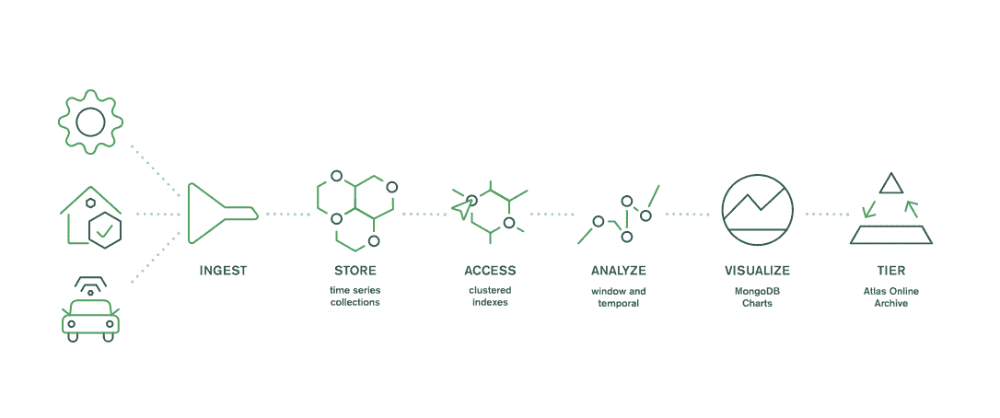

# 如何为时序数据选择合适的数据库

> 原文：<https://thenewstack.io/how-to-select-the-right-database-for-time-series-data/>

 [简·费恩

简是 MongoDB 的主管，她在那里监管开发人员体验团队。作为一名职业开发人员，Jane 于 2016 年从 Teradata Aster 加入 MongoDB，在那里她经营着一家大数据公司，在电子商务、游戏和金融服务行业提供高级分析和机器学习项目。](https://www.linkedin.com/in/jane-fine-a798451/) 

时序数据库是当今增长最快的数据库类别。随着物联网(IoT)传感器的爆炸式增长，组织需要存储和分析海量时序数据的方法，这些数据可以包括几乎任何类型的时间间隔测量。

股票报价机、水温传感器、血糖监测器、智能手表、智能仪表和联网汽车都是快速扩展的产生时间序列数据的设备和系统。

随着可能的物联网、金融科技和电子商务用例数量的增加，处理时序数据的应用程序开发人员的数量也在增加。2020 年，埃文斯数据公司[预测](https://evansdata.com/reports/viewRelease.php?reportID=9)64%的开发者将在未来 12 个月内开发物联网应用。

对于所有这些应用程序开发人员来说，找到合适的数据库至关重要。最终，您需要一个解决方案来帮助您为应用程序用户最大化时间序列数据的价值，而不需要您花费过多的时间来集成数据存储或管理数据库。

## **是什么产生了所有这些时间序列数据？**

小型廉价的物联网传感器和快速可靠的无线网络使组织比以往任何时候都更容易生成和收集时序数据。在各行各业，这些数据正被广泛用于各种用例。

**零售店:**沃尔玛管理着[其门店中超过](https://corporate.walmart.com/newsroom/2021/01/14/how-walmart-leverages-iot-to-keep-your-ice-cream-frozen)700 万个独特的数据点。一个产生时间序列数据的物联网应用程序会通知技术人员某个特定的冰箱是否难以保持合适的温度。另一个物联网应用程序使零售商能够根据不断变化的需求远程监控和调整商店的暖通空调和能源使用。在疫情期间，当时间表改变时，沃尔玛使用该应用程序有效地修改了许多商店的暖通空调使用情况。

**车辆:**如今的普通汽车可能有 100 个传感器。但更先进的电动汽车可能会超过 1000 辆，其中许多会生成时间序列数据。除了在下雨时自动启动雨刷或告诉司机该换油了的传感器之外，传感器还可以让车队经理跟踪他们行驶的卡车，并帮助保险公司确定应该享受折扣费率的司机。

**金融市场:**纽约证券交易所和纳斯达克加起来每天可以产生[300 亿到 750 亿的市场事件](https://technology.finra.org/articles/how-finra-processes-75-billion-market-events-daily.html)。分析部分时间序列数据(例如，特定股票在一段时间内的表现)使投资者能够预测未来的变化，并做出重要的数据驱动的财务决策。

鉴于物联网传感器和应用的使用越来越多，物联网数据量快速增长也就不足为奇了。[根据 IDC](https://www.idc.com/getdoc.jsp?containerId=prAP46737220) 的数据，物联网设备的数据将从 2019 年的 18.3 兆字节增长到 2025 年的 73.1 兆字节，增长近 4 倍。这些大量的传感器数据(可能以多种格式生成，频率很高)必须存储在正确的数据库中。

## **选择合适数据库的标准**

一些组织试图优化他们现有的数据库来容纳时间序列数据。这可能是一项复杂、昂贵且耗时的任务。它可能需要大量的试验和错误来支持时间序列数据的规模，同时仍然提供足够的性能。开发人员可能还需要在应用中实现分析功能，这对于发现一段时间内的趋势和异常是必不可少的，但如果不内置于数据库层，可能会产生巨大的性能影响。

存档陈旧数据带来了另一个挑战:时间序列数据增长迅速，但信噪比通常较低，因此您希望快速提取有价值的见解，然后将其发送到成本较低的冷存储中，这可能需要构建一个定制的数据管道来进行存档。

其他组织选择专门为时序数据设计的利基点解决方案。这些时间序列数据库不会遇到与改造后的通用数据库相同的问题。特别是，它们可以更好地处理物联网传感器以非常高的频率生成的大量数据，并且通常具有内置的分析功能。但是这些数据库也会带来新的挑战。例如，开发人员可能需要使用一种新的查询语言，并获得新的技能来操作、保护和集成数据库与企业应用程序。同时，使用这些数据库的组织可能仍然需要构建定制的 ETL(提取、转换、加载)管道，并集成一个归档来处理历史数据。

对于大多数组织来说，最好的解决方案可能是一个将对时序数据的内置支持与完整的数据生命周期管理相结合的数据库。一个将时间序列数据与企业数据和分析功能集成在一起的数据库，使您能够快速生成情境化的见解，而无需进行复杂的优化工作。同时，在整个数据生命周期(从接收和初始存储到访问、分析、可视化和归档)中提供数据分层的数据库可以帮助您简化管理并降低存储成本。

有效的数据分层策略可以简化陈旧数据的分析，同时简化数据管理并降低存储成本。

## **使用 MongoDB 解决真实世界的用例**

Digitread Connect 需要一个能够实现简单性、灵活性和性能完美结合的数据库。这家挪威工业物联网公司为从地方政府到养鱼户的客户提供交钥匙解决方案。

“我们需要利用传感器数据的价值，因为上传、存储和管理时间序列数据是我们日常生活中必不可少的一部分，”Digitread Connect 首席执行官 Christoffer Lange 说。“随着大量传感器数据从世界各地的资产流入，我们需要一个数据库来满足传统数据库无法满足的新要求。”

Digitread Connect 团队探索了 MongoDB 5.0 中引入的 MongoDB 原生时间序列功能，以及用于监控水下机器人的应用程序。结果呢？

“我们已经找到了我们认为最先进的物联网数据数据库平台，”Lange 说。“利用开箱即用的功能优化内存消耗、快速查询性能和出色的聚合管道运算符……提高我们物联网解决方案的交付性能。”

*有兴趣学习如何在 MongoDB 中对时序数据建模吗？查看我们的* [*操作指南*](https://www.mongodb.com/developer/how-to/new-time-series-collections/?utm_source=the_new_stack&utm_medium=paid_media_content) *或参加我们每周一次的* [*网络研讨会系列*](https://www.mongodb.com/webinars/getting-started-webinars?utm_source=the_new_stack&utm_medium=paid_media_content) *。*

<svg xmlns:xlink="http://www.w3.org/1999/xlink" viewBox="0 0 68 31" version="1.1"><title>Group</title> <desc>Created with Sketch.</desc></svg>