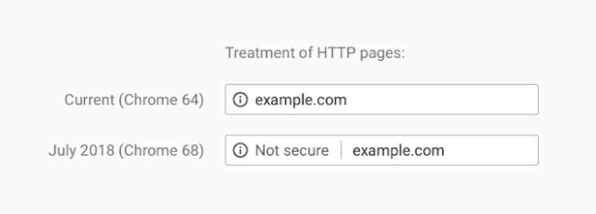
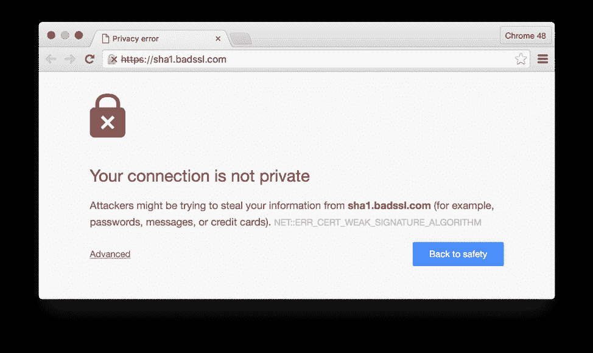
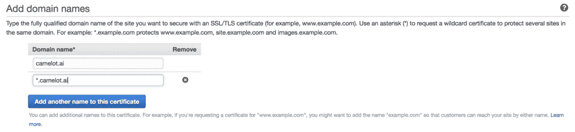
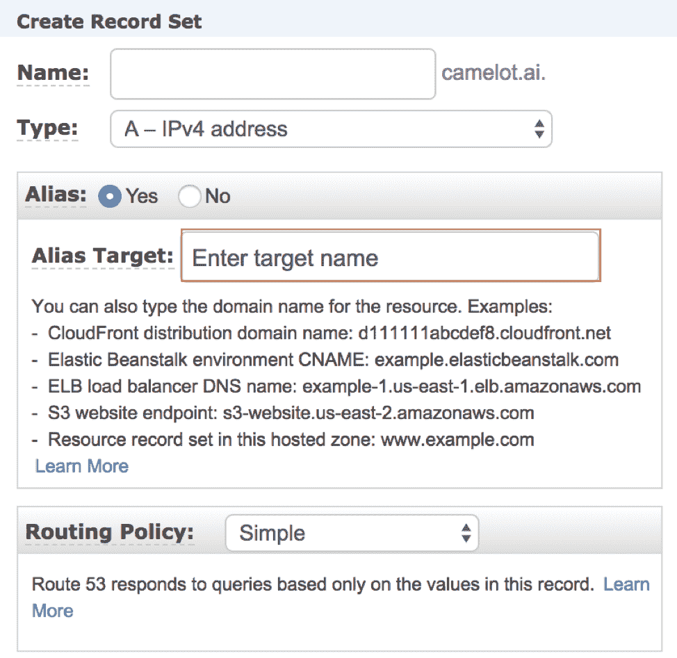

# 如何在一个小时内设置好你和 HTTPS 的 S3 桶

> 原文：<https://thenewstack.io/how-to-set-up-your-s3-bucket-with-https-in-an-hour/>

[Amazon Web Services (AWS)](https://aws.amazon.com/) 拥有大量用于颁发和使用 SSL 证书的资源，但是将现有资源迁移到 HTTPS 的过程可能会很复杂，并且还可能需要许多中间步骤。

但是正如本教程所示，你可以在一两个小时内设置好你的 S3 桶。

为什么这是必要的呢？

## 原因 1:谷歌正在强行解决这个问题

这种需求的主要驱动力是谷歌，它正在逐步淘汰谷歌 Chrome 对 HTTP 连接的支持。

目前，Chrome 在用户访问网站 HTTP 时会发出警告，但不会完全阻止。

最近推出的标签。

用不了多久，通过 HTTP 访问几乎任何网站都会提示全屏警告。

这是一个 HTTPS 很差的网站，但是它给了你一个 HTTP 在不久的将来会是什么样子的概念。

## 理由 2:这是应该做的事情

HTTP 连接至少向本地网络上的每个人透露了请求的路由**和内容**的全部信息。如果你的用户在咖啡店里访问你的站点，再多的服务器端安全措施也不能防止你在用户(和他们的路由器)和你的站点之间泄露信息。

## 第一步:获得证书

要开始，您需要一个 SSL 证书。除了 AWS，最好的选择是[让我们加密](https://letsencrypt.org/) SSL 证书，向所有人发放免费证书。

一个伟大的免费服务，但一个令人困惑的名字

在 AWS 上，有[一个包含](https://aws.amazon.com/certificate-manager/)的证书管理器，它将为 AWS 服务颁发证书。

 [托比·费

Toby 是 Stackery 的社区开发人员。她的角色和经历结合了软件工程师、作家和技术讲师的工作，用新兴工具构建有趣的项目，并与世界分享她的发现。在加入 Stackery 之前，Toby 是 NWEA、瓦卡萨和新遗迹公司的工程师。](https://www.stackery.io/) 

将域添加到证书时，您需要通过以下两种方法之一来验证所有权:

与电子邮件验证相比，DNS 验证有许多优势。最值得注意的是，对于多个子域，您只需验证一次，并且您将不必检查您的电子邮件来更新证书。通过 DNS 验证需要您向注册服务商添加一些长随机域名的 CNAME 记录(例如 _ 3639 AC 514 e 785 e 898d 2646601 fa 951d 5 . example . com)。AWS 在那个位置进行检查，被重定向回自己的服务器，并且知道一切都连接好了。

这可能需要一个小时来填充 CNAME 记录和验证 AWS，但它比电子邮件验证更持久，值得努力。

## 与 CloudFront 链接

您将希望通过将它们与 [CloudFront](https://aws.amazon.com/cloudfront/) 链接来使用您的新 SSL 证书，CloudFront 是一种内容交付网络(CDN)服务，它也可以将 HTTPS 添加到您的 S3 资源中。要激活 CloudFront，进入 [CloudFront 仪表盘](https://console.aws.amazon.com/cloudfront/home)，点击“创建发行版”，你会看到几页设置页面。这些选项中的大多数都可以保留默认值，除了:

*   原点设置—选择您的 S3 桶
*   SSL 证书—选择“自定义 SSL ”,然后选择您在上面创建的证书

## 将您的 URL 指向 CloudFront

从 Route 53 仪表板，您可以创建一个别名，从您的域指向您刚刚创建的 CloudFront 发行版。

单击“Alias Target”会加载一个下拉菜单，您可以在其中选择您的 CloudFront 发行版并创建您的记录集。

这些设置将需要 45 分钟左右的时间来公布，但之后你应该可以输入任何 S3 对象的 URL，并看到它通过 HTTPS 加载。

如上所述，Google 有一些很好的理由来证明它对 HTTPs 的影响。我们希望上面的步骤将有助于使这个过程尽可能的短和无痛。

<svg xmlns:xlink="http://www.w3.org/1999/xlink" viewBox="0 0 68 31" version="1.1"><title>Group</title> <desc>Created with Sketch.</desc></svg>