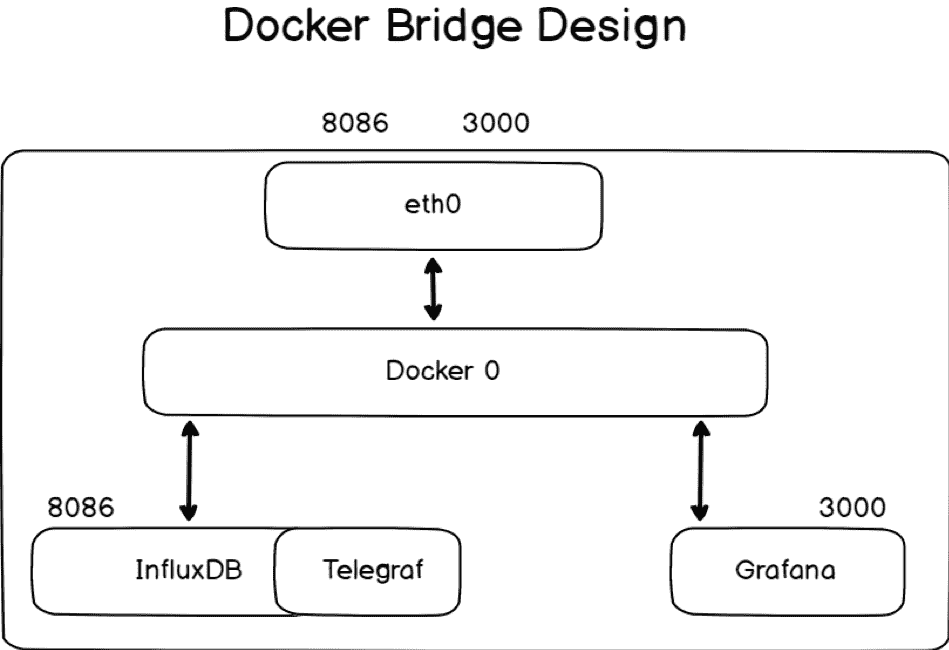
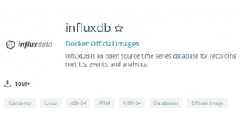
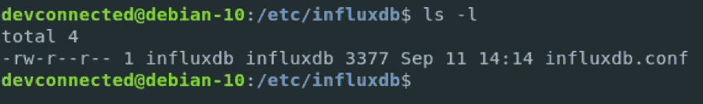
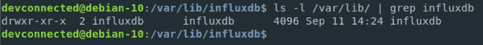
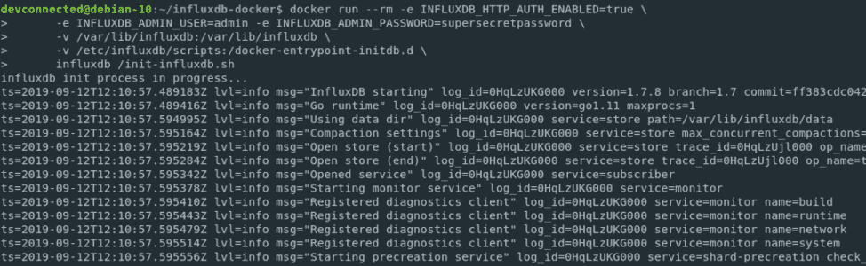
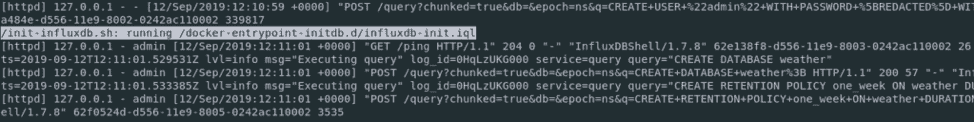
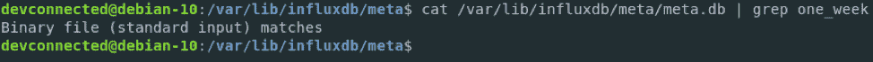
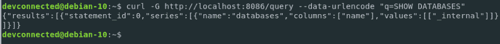
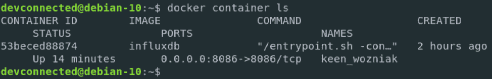
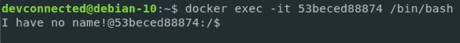

# 如何在 Docker 上设置 InfluxDB、Telegraf 和 Grafana:第 1 部分

> 原文：<https://thenewstack.io/how-to-setup-influxdb-telegraf-and-grafana-on-docker-part-1/>

[](https://www.influxdata.com/)

[Antoine Solnichkin](https://www.influxdata.com/)

[Antoine 是卢森堡一位经验丰富的软件工程师和有抱负的企业架构师。他每天都参与设计、开发和维护具有复杂需求的大型工业项目。Antoine 撰写专注于系统管理和现代开源监控解决方案的技术文章。](https://www.influxdata.com/)

[](https://www.influxdata.com/)[](https://www.influxdata.com/)

InfluxDB 于 2013 年由 InfluxData 构建，是迄今为止 DevOps 监控和仪表板使用最多的时序数据库之一。InfluxDB 被全球许多成功的公司使用，通常部署在分布式和多云中。Docker 可以作为一个虚拟化环境很好地适合许多组织，它提供了一种简单的方法来动态地创建、管理和删除容器。如果您试图构建可靠的监控架构，一个解决方案是在 Docker 上安装 InfluxDB，并使用 Kubernetes 来管理它。

在本教程系列的第 1 部分中，我们将介绍在 Docker for Linux 实例上安装 InfluxDB 1.7 的步骤。然后，我们将在第 2 部分描述如何安装用于数据收集的 Telegraf 插件以及与 InfluxDB 1.7 和 Docker 的 Grafana 接口。值得注意的是，InfluxDB 将很快成为 InfluxDB 2.0 ，它将作为一个单一的平台来管理 TICK 堆栈的所有组件。另一个关于如何安装和设置的教程将很快推出，因为 InfluxDB 2.0 即将推出。在开始之前，确保满足在 Docker 上安装 InfluxDB 的所有先决条件是很重要的。

## Sudo 特权

首先，你需要在你的 Linux 机器上拥有 [sudo 权限；否则，您将无法在您的主机上安装 InfluxDB。](https://devconnected.com/how-to-add-a-user-to-sudoers-on-debian-10-buster/)

要进行验证，请运行以下命令:

如果您的终端上没有显示错误消息，您就可以开始了。

现在，您需要确保 Docker 已正确安装在您的系统上。

教程[“如何在 Ubuntu 18.04 和 Debian 10 上安装 Docker”](https://devconnected.com/how-to-install-docker-on-ubuntu-18-04-debian-10/)提供了如何在 Linux 上正确设置 Docker 的详细信息。再次验证 Docker 是否正确安装，您可以运行以下命令:

```
$  docker  --version
Docker version  19.03.1,  build  74b1e89

```

现在 Docker 已经准备好了，让我们快速浏览一下我们将用于容器的网络策略。

## **为 InfluxDB 设计网络策略**

在开始之前，回顾一下关于网络的一些细节是很重要的。默认情况下，新创建的容器运行在桥接网络堆栈上。此外，安装 InfluxDB 后，它将暴露给网络堆栈上的有用端口(如端口 8086)。稍后，您还可以将 Telegraf 绑定到它，但 Telegraf 不必向您当前的主机堆栈公开任何端口。我们最终将在默认的桥接网络上运行 InfluxDB，并让 Telegraf 在与 InfluxDB 相同的堆栈中运行。此外，我们将把 Grafana 添加到我们的桥接网络中，以便可视化 Telegraf 收集的指标。如上所述，我们将在本系列的第 2 部分提供更多关于设置 Telegraph 的细节。



现在我们已经看到了将要使用的网络策略，让我们为 Docker 安装 InfluxDB 容器。

要在 Docker 上安装 InfluxDB，有两种方法。

您可以手动准备您的文件系统，并在没有初始化脚本的 Docker 容器上运行 InfluxDB。这是初始化 InfluxDB 最简单的方法。如果您计划在单个实例上运行 InfluxDB，并且如果您的初始 InfluxDB 配置非常简单，或者如果您希望完全控制您的容器，则应该使用此方法。

但是，有一种方法可以用脚本(bash 脚本或 InfluxQL 脚本)初始化 InfluxDB。如果您正在使用 InfluxDB(例如，使用 Chef 或 Puppet)自动化许多服务器，并且希望在所有实例上有相同的初始设置，那么您应该这样做。

## 在 Docker 上安装 InfluxDB 1.7.x

Docker 的官方 InfluxDB 镜像名为 [influxdb](https://hub.docker.com/_/influxdb) 。



这个 InfluxDB 映像是官方 Docker 映像的一部分，因此您可以放心，您正在您的系统上运行 InfluxDB 的官方版本。此外，TICK Stack 的其他工具(Telegraf、InfluxDB、Chronograf 和 Kapacitor)也是 Docker 官方图片的一部分。

InfluxDB 映像将在您的系统上安装负责存储时间序列指标的 InfluxDB 服务器。

如果您熟悉 Docker，那么您已经知道可以将卷从本地文件系统映射到容器，以便更容易地在容器中操作数据。这正是我们在本教程中要做的。

配置文件以及存储实际数据的目录将存储在我们的本地文件系统中。

### 为 Docker 准备 InfluxDB 1.7.x

如果您仔细阅读了关于在 Ubuntu 上设置 InfluxDB 的教程[，您就会知道您将为您的 InfluxDB 数据库创建一个特定的用户。](https://devconnected.com/how-to-install-influxdb-on-ubuntu-debian-in-2019/#Option_2_Adding_the_repositories_to_your_package_manager) 

```
$  sudo useradd  -rs  /bin/false influxdb

```

在您的 etc 目录中，为您的 InfluxDB 配置文件创建一个新文件夹。

```
$  sudo mkdir  -p  /etc/influxdb

```

### **为 InfluxDB 和 Docker 创建配置文件**

幸运的是，您不必自己创建 InfluxDB 配置文件。要使用 Docker 创建 InfluxDB 配置文件，请运行以下命令:

```
docker run  --rm influxdb influxd config  |  sudo tee
/etc/influxdb/influxdb.conf  &gt;  /dev/null

```

简单解释一下， **influxd config** 命令将在标准输出(默认情况下是您的 shell)上为您打印完整的 InfluxDB 配置文件。

由于设置了**–RM**选项，Docker 将运行一个容器来执行该命令，该容器一旦退出就会被删除。配置文件将被重定向到我们的 InfluxDB 配置文件，而不是打印在标准输出上。

接下来，为新创建的文件重新分配文件夹权限；否则，您的容器将无法与之正常交互。

```
$  sudo chown influxdb:influxdb  /etc/influxdb/*

```

### 
**为 InfluxDB 和 Docker 创建 Lib 文件夹**

如文档中所述，默认情况下，InfluxDB 将其数据、元数据以及 WAL(用于预写日志)存储在 **/var/lib/influxdb** 文件夹中。

因此，如果该文件夹当前不存在，您必须创建它。

```
$  sudo mkdir  -p  /var/lib/influxdb

```

同样，确保正确设置了容器写入该文件夹的权限。

```
$  sudo chown influxdb:influxdb  /var/lib/influxdb

```



现在我们的文件夹已经准备好了，让我们看看如何用自定义脚本初始化 InfluxDB。

### 在 Docker 上为 InfluxDB 准备初始化脚本(可选)

有了 InfluxDB 映像，就有了一种在容器上自动化数据库初始化的方法。例如，我们将指示 Docker 容器创建一个管理员帐户、一个常规用户帐户(用于 Telegraf)和一个通过自定义 InfluxQL 脚本进行自定义保留的数据库。

### InfluxDB 图像的剖析

在容器启动时，执行 **entrypoint.sh** 脚本，它被设置为 Docker 容器的入口点。

入口点可以用两种方式执行。

您可以执行 entrypoint 脚本，以便在您的容器上启动一个简单的 InfluxDB 实例。例如，这就是我们在上一节中所做的。我们指定了配置标志，它用于设置您的 InfluxDB 服务器初始化。

然而，还有第二种方法来执行入口点脚本:通过执行 **init-influxdb** 脚本。

**init-influxdb** 脚本由两部分组成:

*   首先，它将监视传递给 docker 命令的环境变量，并相应地执行命令。
*   接下来，如果在容器的根目录下有一个**docker-entry point-initdb . d**目录，它将执行其中的 bash 脚本或 IQL 脚本。

我们将使用这些信息来创建我们的 InfluxDB 容器。

首先，确保在/var/lib/influxdb 文件夹中没有创建任何文件夹。

```
$  ls  -l  /var/lib/influxdb
total  0

```

执行以下命令，用正确的信息更新元文件夹(在 influxdb 文件夹中)。提醒一下，我们需要一个管理员帐户和一个 Telegraf(名为 telegraf)的常规帐户。

### 在主机上创建初始化脚本

为了让初始化脚本在初始化时运行，必须将它们映射到容器中的 docker-entrypoint-initdb.d 文件夹。

首先，在您的主机上创建一个脚本文件夹。在我的例子中，它将在
中创建

```
/etc/influxdb.
$  sudo mkdir  -p  /etc/influxdb/scripts

```

在新创建的文件夹中编辑一个新的脚本文件，并确保给它一个. iql 扩展名:
$ sudo touch influxdb-init . iql

```
CREATE DATABASE weather;
CREATE RETENTION POLICY one_week ON weather DURATION  168h  REPLICATION  1  DEFAULT;

```

这是一个简单的初始化脚本，将为天气数据创建一个数据库，并为该数据库分配一周的保留策略。

太好了！

最后一步是为 InfluxDB 初始化准备我们的元文件夹。

### 创建/更新 InfluxDB 元数据库

为了更新您的元数据库，运行以下命令:

```
$  docker run  --rm  -e  INFLUXDB_HTTP_AUTH_ENABLED=true  \
 -e  INFLUXDB_ADMIN_USER=admin  \
 -e  INFLUXDB_ADMIN_PASSWORD=admin123  \
 -v  /var/lib/influxdb:/var/lib/influxdb  \
 -v  /etc/influxdb/scripts:/docker-entrypoint-initdb.d  \
 influxdb  /init-influxdb.sh

```

注意:将**INFLUXDB _ HTTP _ AUTH _ ENABLED**设置为 **true** 并不意味着在您的 INFLUXDB 服务器上启用了身份验证。

在接下来的某个部分中启用了身份验证；该参数仅用于初始化脚本。

请确保在您的终端上打印了几个日志。如果不是这样，请确保为容器指定了正确的环境变量。



如果您选择为您的容器创建初始化脚本，您也应该为它创建一个日志行。



作为最后一个验证步骤，您可以检查 meta 文件夹中的 meta.db 文件，以确保更改被正确写入。

```
$  cat  /var/lib/influxdb/meta/meta.db  |  grep one_week

```



现在您的 InfluxDB 文件已经准备好了，让我们开始一些配置验证。

### 验证 Docker 的 InfluxDB 配置

如果您使用了上一节中详细介绍的配置命令，应该会在/etc/influxdb 文件夹中看到一个简单的配置文件。打开您的文件，并验证一切都是正确的。

## HTTP 接口

转到您的配置的[http]部分，并确保它是启用的。

验证绑定地址是否默认设置为 8086。这是您将要用来向 InfluxDB 数据库发送一些命令的端口，例如创建一个数据库或添加一个用户。

默认情况下，身份验证和加密是禁用的。但是，本教程的各个部分将深入解释如何设置身份验证。

### 数据、元和 WAL 配置

默认情况下，您的配置文件应该具有我们在第一部分中创建的路径，因此您不必做任何更改。但是，您应该检查您的路径是否正确。

```
  [meta]
  dir  =  "/var/lib/influxdb/meta"

```

```
[data]
  dir  =  "/var/lib/influxdb/data"
  wal-dir  =  "/var/lib/influxdb/wal"

```

## 在 Docker 上运行 InfluxDB 容器

我们将使用官方 Docker 存储库中的 InfluxDB 映像。快速提醒一下，您需要使用 docker 容器运行命令来启动 Docker 容器。

首先，确保端口 8086 上没有运行任何东西:

```
$  sudo netstat  -tulpn  |  grep  8086

```

如果您没记错的话，我们将文件夹配置为可供 InfluxDB 用户(属于 InfluxDB 组)访问。因此，我们需要 InfluxDB 用户的用户 ID 来运行我们的容器。

要找到 InfluxDB 用户 ID，请转到主机上的 **passwd** 文件并运行:

```
$  cat  /etc/passwd  |  grep influxdb
influxdb:x:997:997::/var/lib/influxdb:/bin/false

```

如您所见，我的 InfluxDB 用户的用户 ID 是 997。

注意:用户 ID 在您的系统上肯定是不同的，您应该在运行 docker 命令时相应地修改它。

要在 Docker 上启动 InfluxDB，运行以下命令:

```
docker run  -d  -p  8086:8086  --user  997:997  --name=influxdb  \  
-v  /etc/influxdb/influxdb.conf:/etc/influxdb/influxdb.conf  \  
-v  /var/lib/influxdb:/var/lib/influxdb  \  
influxdb  \  
-config  /etc/influxdb/influxdb.conf

```

### **测试你的 InfluxDB 容器**

为了测试您的 InfluxDB 容器是否正确运行，您可以检查 HTTP API 是否被正确启用:

```
$  curl  -G  http://localhost:8086/query --data-urlencode "q=SHOW DATABASES"

```


您还可以检查您的 InfluxDB 服务器是否正确监听了您主机上的端口 8086:

```
$  netstat  -tulpn  |  grep  8086
tcp6    0    0  :::8086      :::* LISTEN -

```

牛逼！您的 InfluxDB 容器正在 Docker 上正确运行。

默认情况下，您的 InfluxDB 服务器不包含任何数据库，除了 **_internal** 之外，正如其名称所描述的，它使用关于 InfluxDB 本身的内部指标。但是，如果为 InfluxDB 数据库创建了初始化脚本，请确保正确分配了数据库和保留策略。

```
$  influx
Connected to http://localhost:8086 version 1.7.8
InfluxDB shell version:  1.7.7

&gt;  SHOW USERS

user    admin
----    -----
admin true

&gt;  SHOW DATABASES
name:  databases
name
----
weather

```

### **在 InfluxDB 上为 Docker 启用验证**

为了启用 InfluxDB 1.7.x 的身份验证，您将为您的 InfluxDB 数据库创建一个管理员帐户(如果您没有使用初始化脚本)

### 使用 Docker exec 创建一个管理员帐户

如果您在前面几节中使用环境变量初始化了 InfluxDB 映像，则不必创建管理员帐户。

只有在您选择了自己配置的完全定制的 InfluxDB 映像时，才需要这样做。

要创建一个管理员帐户，连接到容器中的 bash 进程，然后自己运行 influx 实用程序。

要实现 ths，运行以下命令:



### 为 Docker 在 InfluxDB 上启用身份验证

为了启用 InfluxDB 1.7.x 的身份验证，您将为您的 InfluxDB 数据库创建一个管理员帐户(如果您没有使用初始化脚本)

### 使用 docker exec 创建一个管理员帐户

如果您在前面几节中使用环境变量初始化了 InfluxDB 映像，则不必创建管理员帐户。

只有在您选择了自己配置的完全定制的 InfluxDB 映像时，才需要这样做。

要创建一个管理员帐户，连接到容器中的一个 bash 进程，并使用以下命令运行 intrusion 实用程序:

```
  class=""&gt;$  docker container ls

```


**注意:**如果您的容器没有出现在这里，那么运行这个带有 **-a** (代表所有)标志的命令，以确保您的容器没有崩溃。

识别您的 InfluxDB 容器的容器 ID，并运行以下命令在您的容器中进行 bash:

```
$  docker exec  -it  &lt;container_id&gt;  /bin/bash

```

提醒一下，使用 docker exec 是为了在正在运行的容器中运行命令。

下面是它指定的选项:

*   -i:对于交互式，即使没有附加，它也会保持标准输入打开
*   -t:为您当前的 shell 环境分配一个伪 TTY。

现在，您应该有一个 shell 提示符，如下所示:



在您的容器中，运行流入实用程序来创建您的管理员帐户。

```
$  influx
Connected to http://localhost:8086 version 1.7.8
InfluxDB shell version:  1.7.8
&gt;  CREATE USER admin WITH PASSWORD  'admin123'  WITH ALL PRIVILEGES
&gt;  SHOW USERS
user  admin
----  -----
admin true

```

现在您有了一个管理员帐户，您可以为您的数据库启用 HTTP 认证:

### 在配置文件中启用 HTTP 身份验证

现在，转到您为 InfluxDB:
创建的配置文件夹

```
Ctrl  +  D  (to exit your container)

```

```
$  sudo nano  /etc/influxdb/influxdb.conf

```

```
[http]
  enabled  =  true
  bind-address  =  ":8086"
  auth-enabled  =  true

```

保存您的文件并重启您的容器以应用更改:

```
$  docker container restart  

```

为了确保您的更改有效，请再次尝试查询 HTTP API。
如果不指定正确的凭证，您将无法执行查询:

```
$  curl  -G  http://localhost:8086/query --data-urlencode "q=SHOW DATABASES"
{"error":"unable to parse authentication credentials"}

```

太好了！身份验证已正确启用。
让我们尝试使用正确的凭证再次执行 InfluxQL 查询:

```
$  curl  -G  -u  admin:admin123 http://localhost:8086/query --data-urlencode "q=SHOW DATABASES"
{"results":[{"statement_id":0,"series":[{"name":"databases","columns":["name"],"values":[["_internal"]]}]}]}

```

使用这个 curl 命令，我们确保为 InfluxDB 服务器正确设置了凭证。

既然您的时间序列数据库已经启动并运行，那么是时候安装我们的指标收集代理:Telegraf 了。在第 2 部分中，我们描述了如何使用 InfluxDB 1.7 和 Docker 安装 Telegraf 插件作为数据收集接口。

<svg xmlns:xlink="http://www.w3.org/1999/xlink" viewBox="0 0 68 31" version="1.1"><title>Group</title> <desc>Created with Sketch.</desc></svg>