# 如何在 Docker 上设置 InfluxDB、Telegraf 和 Grafana:第 2 部分

> 原文：<https://thenewstack.io/how-to-setup-influxdb-telegraf-and-grafana-on-docker-part-2/>

在本教程系列的第 1 部分中，我们介绍了在 Docker for Linux 实例上安装 InfluxDB 1.7 的步骤。我们在第 2 部分描述了如何安装 Telegraf 插件作为 InfluxDB 1.7 和 Docker 的数据收集接口。

## 在 Docker 上安装 Telegraf

对于那些不熟悉 Telegraf 的人来说，它是一个插件驱动的代理，定期从各种不同的系统收集指标。这些指标被推送到 InfluxDB，以后可以在 Chronograf 或 Grafana 中进行分析。幸运的是，Telegraf 也属于 Docker 官方图片。

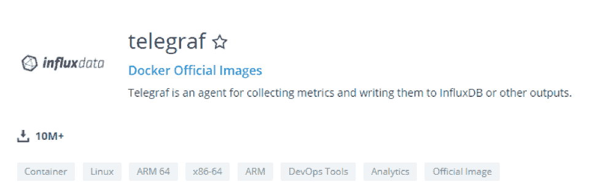

在这一节中，我们将配置 Telegraf 来收集我们的 Linux 主机上的系统指标(在这种情况下，是 Debian 10，但它对基于 Ubuntu 的主机的工作方式是相同的)。

## 为 InfluxDB 和 Docker 准备 Telegraf

与我们的 InfluxDB 设置类似，我们将为我们的主机创建一个 Telegraf 用户。它确保为我们未来的配置文件设置正确的权限。

```
$  sudo useradd  -rs  /bin/false telegraf

```

在您的 *etc* 目录下，为您的 Telegraf 配置文件创建一个新文件夹。

```
$  sudo mkdir  -p  /etc/telegraf

```

#### 为 Telegraf 和 Docker 创建配置文件

 [安托万·索尔尼金

Antoine 是卢森堡的一名经验丰富的软件工程师和有抱负的企业架构师。他每天都参与设计、开发和维护具有复杂需求的大型工业项目。Antoine 撰写专注于系统管理和现代开源监控解决方案的技术文章。](https://www.influxdata.com/) 

同样，我们不必自己创建 Telegraf 配置文件。

Telegraf Docker 映像与 InfluxDB 映像非常相似。

因此，它能够运行简单的 telegraf config 命令来动态生成配置。

Telegraf 配置文件有以下默认值:

*   间隔:10 秒。Telegraf 将每 10 秒钟收集并向 InfluxDB 发送一次指标。
*   Round_interval : true。代理将在以下时间收集指标:00、10 或:(00+n *间隔)
*   默认情况下，InfluxDB 输出插件是启用的。
*   CPU、磁盘、diskio、内核、内存、进程、交换和系统输入插件已启用。因为这些输入使用/proc 挂载点来收集指标，所以我们必须重新映射容器上的卷。

要使用 Docker 创建 Telegraf 配置文件，请运行以下命令。

```
docker run  --rm telegraf telegraf config  |  sudo tee  /etc/telegraf/telegraf.conf  &lt;  /dev/null

```

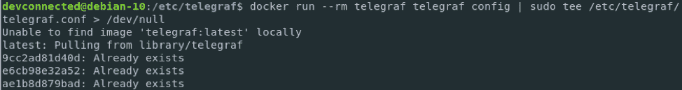

接下来，为您的 Telegraf 配置文件夹重新分配正确的权限。这将确保只有 Telegraf 本身和 root 帐户能够写入配置文件。

```
$  sudo chown telegraf:telegraf  /etc/telegraf/*

```

### **修改您的 Telegraf 配置文件**

使用 Telegraf，大多数情况下，您会希望将指标直接发送到 InfluxDB 本身。这就是为什么在您的 Telegraf 配置文件中默认启用 InfluxDB 输出。默认情况下，Telegraf 会将指标发送到 InfluxDB 上名为“telegraf”的数据库。这是一个可自定义的参数；但是，在这种情况下，我们将只指定 InfluxDB 身份验证参数。

编辑您的 Telegraf 配置文件，并找到[[outputs.influxdb]]部分。

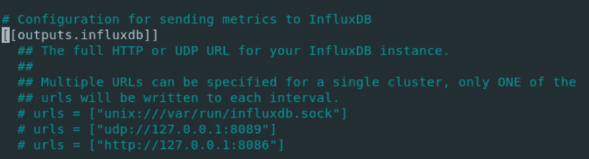

在这个配置文件中，找到“HTTP Basic Auth”部分，并相应地修改凭据。

```
## HTTP Basic Auth
username  =  "admin"
password  =  "admin123"

```

当然，您可以使用我们上面描述的方法(使用 docker exec)为 Telegraf 创建一个专用的管理员帐户。
保存并退出文件。现在是运行容器的时候了。

### 在 Docker 上运行 Telegraf 容器

如上所述，Telegraf 默认启用系统输入。因此，我们必须将/proc 主机文件夹重新映射到 Docker 映像上的/host 文件夹。

这是为了确保 Telegraf 不会从 Docker 容器本身收集指标，并且容器文件系统不会以任何方式被更改。

要实现这一点，除非您给 InfluxDB 容器起了一个名字，否则运行这个命令来获取您的 InfluxDB 容器 ID。它将用于将 Telegraf 和 InfluxDB 连接到同一个虚拟网络。

```
$  docker container ls  |  grep influxdb
1939ba611410 influxdb "/entrypoint.sh -conf..." 24  minutes ago    Up  30  minutes    0.0.0.0:8086-&lt;8086/tcp    ecstatic_moore

```

通过运行以下命令隔离您的 Telegraf 用户 ID:

```
$  getent passwd  |  grep telegraf
telegraf:x:998:998::/etc/telegraf:/bin/false

```

接下来，要运行 Telegraf Docker 映像，请运行以下命令:

```
$  docker run  -d  --user  998:998  --name=telegraf  \
      --net=container:  \
      -e  HOST_PROC=/host/proc  \
      -v  /proc:/host/proc:ro  \
      -v  /etc/telegraf/telegraf.conf:/etc/telegraf/telegraf.conf:ro  \
      telegraf

```

**注意:**如果选择用名称创建 influxdb 容器，net 选项可以替换为–net = influx db。

太好了！要确保您的 Telegraf 实例正确运行，请运行以下命令:

```
$  docker container logs  -f  --since  10m  telegraf

```

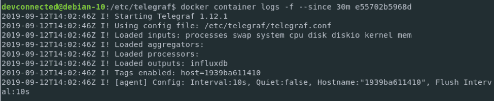

Telegraf 似乎没有给出任何错误消息，但是让我们通过检查 InfluxDB 数据库来仔细检查我们设置的正确性:

```
$  docker exec  -it  influx  -username admin  -password admin123

```

```
InfluxDB shell version  1.7.8
&lt;  SHOW DATABASES

```

```
name:  databases
name
----
weather
_internal
telegraf

```

```
&lt;  USE telegraf
&lt;  SELECT *  FROM cpu WHERE time  &gt;  now()  -  1m

```

如果你看到的是数据点，恭喜你！您的 Telegraf 实例正在向您的 InfluxDB 服务器正确发送指标:

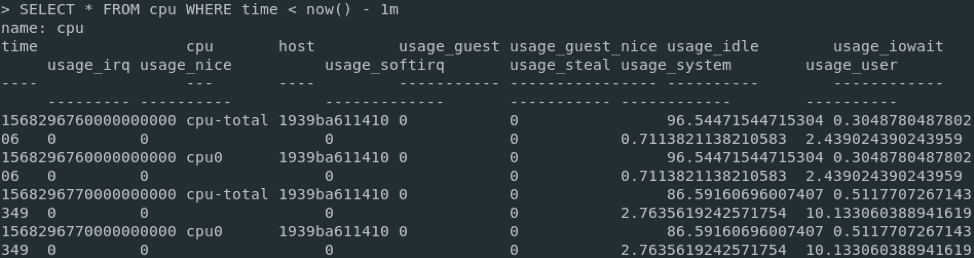

现在所有的指标都存储在 Telegraf 中，一个星期后，我们可以安装一个现代化的仪表板工具来可视化它们:Grafana。

## 在 Grafana 中可视化 Telegraf 指标

对于那些不熟悉 Grafana 的人来说，这是一个仪表板工具，它从各种不同的数据源中提取数据，以创建漂亮的图形和仪表板。它可以从传统的 SQL 数据库中提取数据，但也可以从各种时间序列数据库中提取数据，这就是我们在本节将要做的事情。

## 在 Docker 上安装 Grafana

Grafana docker 图像存储在 [Grafana 库](https://hub.docker.com/r/grafana/grafana)下:

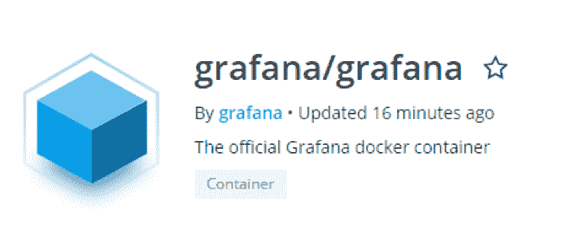

要创建 Grafana 容器，请在您的主机上运行以下命令:

```
$  docker run  -d  --name=grafana  -p  3000:3000  grafana/grafana
A  Grafana server container should now be up and running on your host.  To confirm that,  run the following command.
$  docker container ls  |  grep grafana
You can also make sure that it is correctly listening on port  3000.
$  netstat  -tulpn  |  grep  3000

```

## 为 InfluxDB 配置 Grafana

用你的网络浏览器，前往 http://localhost:3000

您将被重定向到 Grafana 主页。Grafana 的默认凭据是 admin/admin。系统会立即要求您更改密码。选择一个强密码并点击“保存”

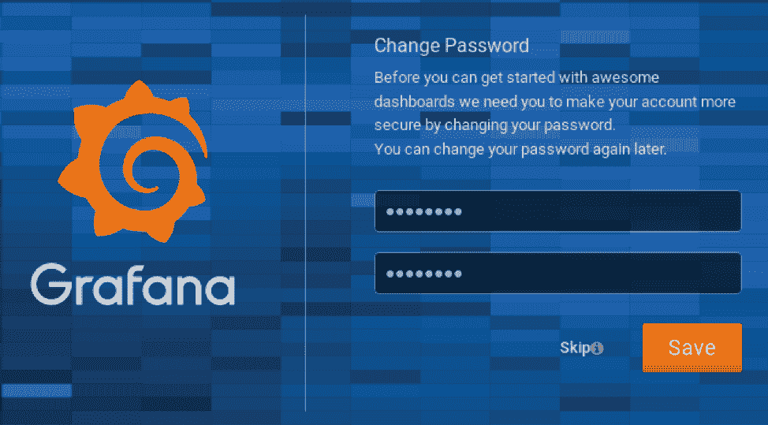

您现在应该被重定向到 Grafana 默认 Web 用户界面:

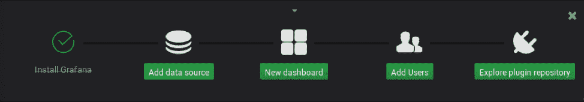

单击“添加数据源”以添加 InfluxDB 数据源:

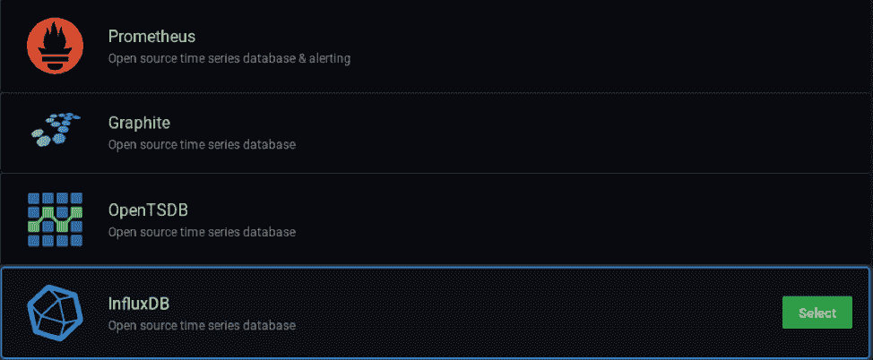

接下来，选择 InfluxDB 选项并单击“选择”

对于本教程，我们不使用 InfluxDB 映像作为 Docker 服务。因此，我们必须在桥接网络上隔离 InfluxDB 公共 IP。

为此，运行以下命令:

```
$  docker network inspect bridge  |  grep influxdb  -A  5
"Name":  "influxdb",
"EndpointID":  "7e4eb0574a346687efbb96b6b45",
"MacAddress":  "02:42:ac:11:00:04",
"IPv4Address":  "172.17.0.2/16",
"IPv6Address":  ""

```

复制 IPv4 地址并粘贴到 Grafana 的 InfluxDB 配置中。选择 Basic Auth 选项，指定您的管理员凭证，并填写有关 InfluxDB 数据库的详细信息。以下是最终配置:

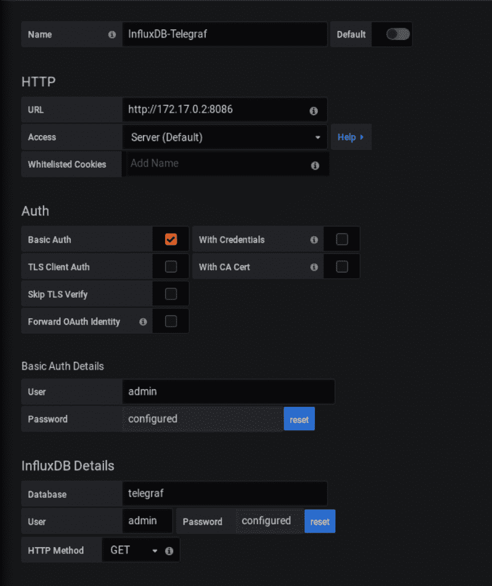

单击“保存并测试”以确保您的配置正常工作。

厉害！现在，Grafana 中的一切都已设置好，让我们导入一个为 Telegraf 主机指标设计的仪表板。

### 导入 Grafana 仪表板

要导入 Grafana 仪表板，请选择左侧菜单中的“加号”图标，然后单击“导入”:

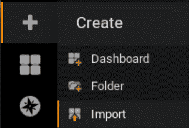

在导入文本框中，输入 1443 作为仪表板 ID:

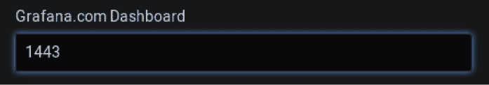

在下一个窗口中，确保信息是正确的，并将其绑定到您新创建的数据源: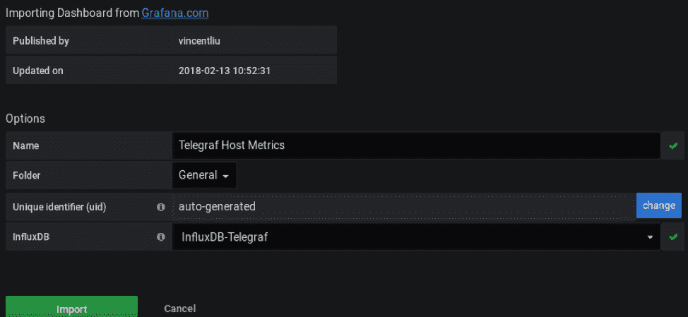

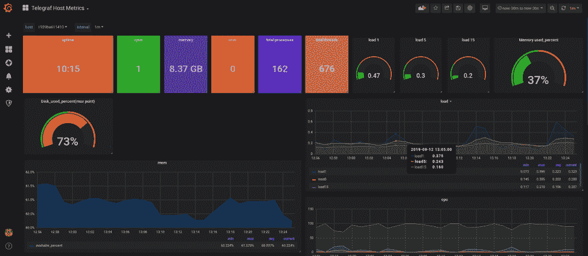

## 结论

恭喜你，你已经学会了如何使用 Docker 安装 InfluxDB 1.7.x、Telegraf 和 Grafana。正如您可能已经意识到的，本教程的重点是完全可定制的映像安装。如果您想自动化您的容器设置，使用 docker-compose 可能是个好主意。此外，请务必通读整个列表 [Telegraf 输入插件](https://docs.influxdata.com/telegraf/v1.12/)以开始了解要监控的内容。

更多的还在后面:InfluxDB 将很快成为 [InfluxDB 2.0](https://www.influxdata.com/products/influxdb-overview/influxdb-2-0/) ，它将作为一个单一的平台来管理 TICK 栈的所有组件。另一个关于如何安装和设置 InfluxDB 2.0 的教程即将推出。

在那之前，一如既往地玩得开心。

<svg xmlns:xlink="http://www.w3.org/1999/xlink" viewBox="0 0 68 31" version="1.1"><title>Group</title> <desc>Created with Sketch.</desc></svg>