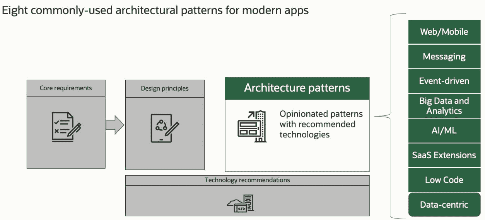
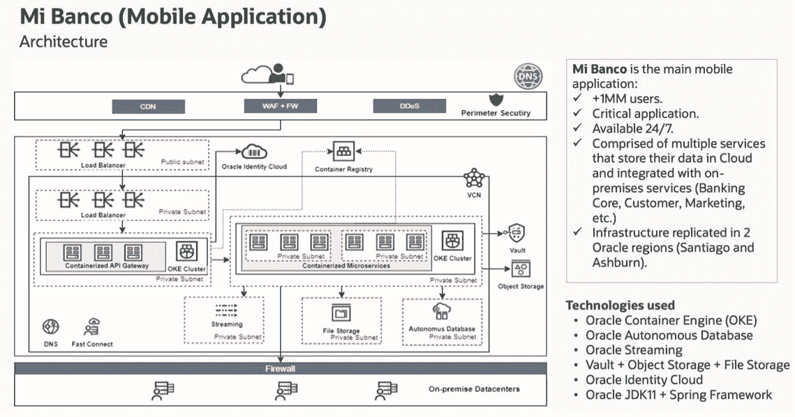

# 如何简化云原生应用的架构决策

> 原文：<https://thenewstack.io/how-to-simplify-architecture-decisions-for-cloud-native-apps/>

 [马尼什·卡普尔

马尼什是甲骨文公司的产品管理总监，专注于甲骨文的应用开发云平台，包括云原生应用开发(Kubernetes、DevOps、容器注册表、无服务器功能)、低代码开发服务和 Java 服务。](https://www.linkedin.com/in/mkapur/) 

不管它的功能是什么，每个现代应用程序都需要满足性能、成本、安全性、法规遵从性等方面的最低要求。

这说起来容易做起来难，用户期望持续创新和即时响应。当然，一种方法是采用[云原生](https://thenewstack.io/what-are-cloud-native-patterns-and-how-should-you-use-them/)开发实践和工具，充分利用云交付模型的优势。[云原生应用](https://www.oracle.com/cloud-native/?source=:ex:pw:::::TNSA&SC=:ex:pw:::::TNSA&pcode=)的开发和部署旨在利用分布式计算并利用云提供的规模、弹性、复原力和灵活性。

但即使这样也会带来挑战。这通常意味着跟踪许多快速变化的可用技术选择，遍历或创建涵盖重叠技术选择的决策树(有时来自同一供应商)，并使用不同的技术选择评估各种架构排列。

此外，构建大规模可扩展的互连应用程序，在不同数据中心的一组分布式资源上运行，是非常困难的。有时，这类应用程序中的一个故障可能会导致大规模停机。

当您定义正确的应用程序架构并确保它符合最佳实践时，这些因素会显著增加复杂性。此外，所有这些都是以牺牲时间为代价的，而这些时间本可以用来更快地满足最终客户的需求。

现代应用程序开发框架可以简化架构决策过程，帮助您构建和运行高度可用的应用程序，这些应用程序具有故障恢复能力、完全安全和合规性，并支持 [DevOps](https://www.oracle.com/devops/what-is-devops/?source=:ex:pw:::::TNSC&SC=:ex:pw:::::TNSC&pcode=) 。在 Oracle，我们将这些知识总结为 9 项核心要求和 10 项设计原则，代表了我们对构建现代应用程序的独到见解。

我们假设，无论应用程序在功能上做什么，它都需要满足可用性、安全性和合规性、成本优化、性能、弹性、敏捷性、可扩展性、可观察性和可移植性的一组最低要求。

以下是我们在甲骨文云基础设施(OCI)中使用的一组 [10 指导原则](https://www.oracle.com/cloud/architecture-center/modern-app-development/?source=:ex:pw:::::TNSD&SC=:ex:pw:::::TNSD&pcode=)，帮助我们管理和决定应用架构:

1.  使用轻量级的开源框架和成熟的编程语言。
2.  将应用构建为通过 API 进行通信的服务。
3.  将应用程序打包并作为容器运输。
4.  自动化构建、测试和部署。
5.  使用完全托管的服务来消除应用程序开发、运行时和数据管理的复杂性。
6.  保持应用程序层无状态。
7.  使用融合数据库，为所有数据提供全功能支持。
8.  仪器端到端监控和跟踪。
9.  通过自动化数据复制和故障恢复消除单点故障。
10.  实施深度防御方法来保护应用和数据。

为了让开发人员开始采用现代的应用程序开发框架，我们已经创建了固执己见的体系结构，并为通常需要的模式提供了技术建议。

## **用例:智利银行**

我们的一个企业客户，Banco de Chile，应用 OCI 的现代应用程序开发最佳实践构建了其移动银行应用程序(Mi Banco)。Mi Banco 是其主要的移动应用程序，有助于推动其数据转型战略，在两个 Oracle 云区域(圣地亚哥和阿什本)复制了超过 100 万用户，以保证高可用性。

Mi Banco 由大约 33 个使用领域驱动设计方法定义的微服务组成，为客户提供许多服务，如外币兑换、信用卡支付、账单支付、模拟和贷款推进。每个微服务都有自己的自动扩展策略和分配的资源。Oracle 身份云有助于用户访问、权限和授权。

使用这种设计，Banco de Chile 将调配时间缩短了一千倍，从几个月缩短到几分钟。通过实施持续集成和交付(CI/CD)管道将应用部署到 Oracle [Kubernetes Engine](https://www.oracle.com/cloud-native/container-engine-kubernetes/what-is-kubernetes/?source=:ex:pw:::::TNSE&SC=:ex:pw:::::TNSE&pcode=) ，it 部门将应用交付时间从几个月缩短到了几天。 [Oracle Autonomous Database 的](https://www.oracle.com/autonomous-database/?source=:ex:pw:::::TNSF&SC=:ex:pw:::::TNSF&pcode=)自动升级和修补功能将银行的管理成本降低了 80%。

要了解有关该架构的更多信息，您可以观看视频，其中智利银行的 Leonel Romero 解释了他的团队如何设计和构建该应用。

通过我们专家创建的培训和全球认可的认证计划，您可以免费学习 OCI，从而推动您的职业发展并为未来做好准备。

<svg xmlns:xlink="http://www.w3.org/1999/xlink" viewBox="0 0 68 31" version="1.1"><title>Group</title> <desc>Created with Sketch.</desc></svg>