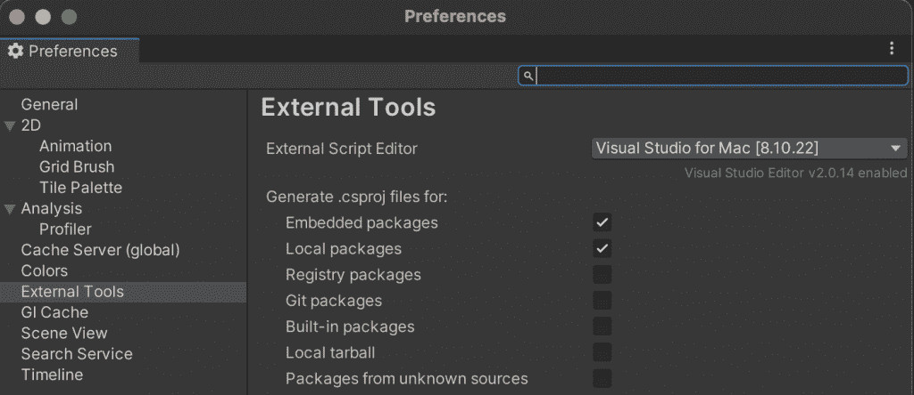
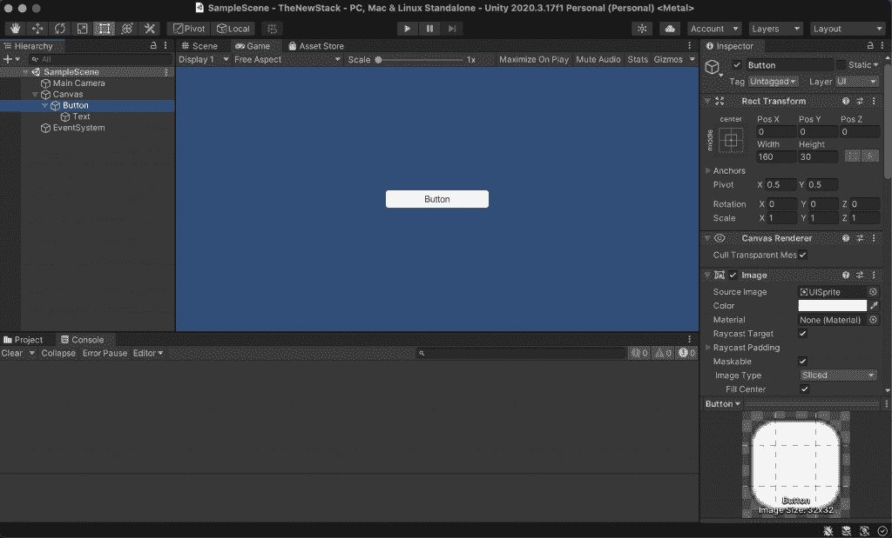
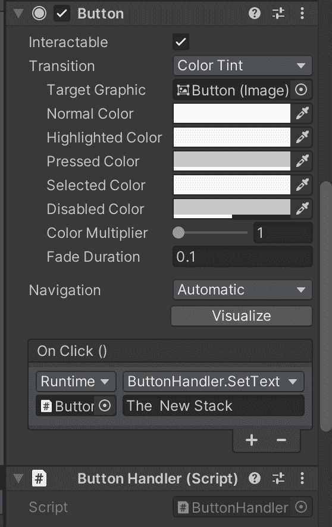
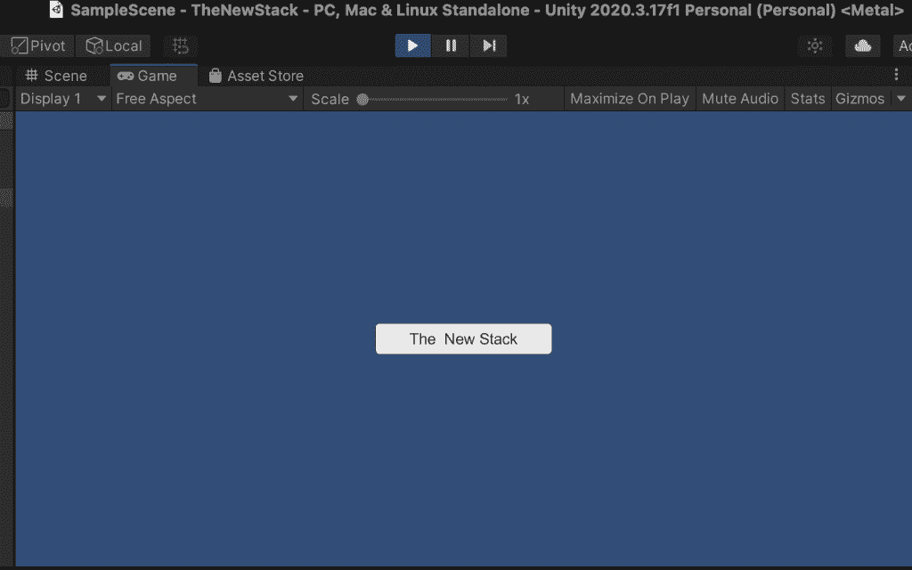

# 如何开始 Unity 开发，即使你不是游戏玩家

> 原文：<https://thenewstack.io/how-to-start-unity-development-even-if-youre-not-a-gamer/>

Unity 是游戏制作社区青睐的开发平台。它允许开发人员处理丰富的 2D 或 3D 图形和动画。随着时间的推移，它也吸收了一些成功团队合作所需的工具和实践。虽然最近发布的竞争对手平台虚幻引擎 5 专注于高端电影视觉效果，但 Unity 仍然更关注保持其不断增长的模块帝国的可控性。

你可能因为想研究游戏开发而渴望开发一个游戏平台，但是主流开发者并不重视 Unity 如何利用 C#和。网络标准配置文件。这也是一种非常明智的跨机开发方式。当然，您可能只需要创建一个具有高级视听表示和用户交互的应用程序。有了 Unity，您不必失去源代码控制、管道、集成测试或 LTM 版本。

在过去，谈论一个游戏开发平台看起来就像是破釜沉舟，因为主流开发者将游戏视为另一个国家。然而，这些年来，这两个国家越来越近了。“游戏化”这个可怕的术语现在只是暗示用户喜欢花时间在有好的用户界面和好的反馈的应用上。无论我们如何看待元宇宙的可能性，至少我们有工具来填充它。

在本文中，我将尝试向您展示，虽然 Unity 远非简单，但您应该将它视为一种有效的工作方式，即使您不是摇滚明星。在以后的文章中，我将做一些更复杂的事情，但是现在，让我们只考虑它是如何实现基本功能的。

## Unity 开发:基础

Unity 的开发永远不会结束，新的产品有时会以矛盾的方式出现冲突。然而，它有一个相当一致的方式来处理添加和预览组件，以及它的包管理系统。这个演示只使用内置包。

对于大多数刚接触该系统的开发人员来说，第一大障碍是您不能以编程方式做所有事情。你确实需要使用 Unity 前端和你的代码编辑器。一般来说，代码完成操作，但是 Unity 处理对象之间的关系。像其他固执己见的平台一样，它有一种特定的做事方式，在你了解内情之前，违背这些方式是不明智的。

那么，要在屏幕上显示一个简单的应用程序，我们实际上需要什么呢？您需要以下内容:

*   统一的一个版本。
*   Visual Studio 和对 C#的熟练掌握。
*   愿意以稍微不同的方式工作。

Unity 将一个**游戏对象**识别为其基本单位。这些是不同**组件**的容器。你可以通过游戏对象的层级来构建一个**场景**。

## 建立一个统一的程序

对于本教程，我们将坚持一些简单的东西。让我们来看一个项目，它只是在按钮被按下后将文本放到按钮上。

好吧，这显然不是炫耀 Unity 的无数功能。对于任何有 UI 的东西来说，响应按钮的按下相当于“Hello World”。但它确实让我们看到了 Unity 的设计限制。

在我们关注 Unity 应用程序的辉煌之前，让我们先注意一个偏好:



Unity 和你的 Visual Studio 有直接关系。这一点很重要，因为它可以创建正确风格的 C#解决方案，而不需要太多的干预。

总之，回到正题。Unity 应用程序:



显然，窗口面板可以重新安排，但这是一个典型的设置。左边的层次面板显示了我在这个演示场景中通过简单的菜单点击构建的东西。我们有一个 Canvas GameObject(也就是 Unity 术语中的 Canvas 对象)，它包含一个按钮 GameObject，这个按钮 GameObject 包含一个文本 GameObject。该按钮可以在屏幕中央看到。请注意，我们是在“游戏”标签。右边的检查面板显示我们的按钮游戏对象似乎有各种各样的组件。

画布代表按钮所在的背景游戏对象。Unity 对 2D 应用做了一些简化。然而，你可以看到我们也可以玩相机，或者按钮的图像和样式——这些我们现在都不想做。

让我们在组件列表中进一步查看按钮组件本身:



在底部有两件事让我们担心。首先，提到了一个叫做“ButtonHandler”的脚本。在 C#中，一个脚本映射到一个类。当我请求 Unity 创建一个脚本时，它首先在 Visual Studio 中创建适当的解决方案，然后启动一个模板，我在这个模板上写了下面的内容:

```
using System.Collections;
using System.Collections.Generic;
using UnityEngine;
using UnityEngine.UI;

public class ButtonHandler  :  MonoBehaviour
{
    public void SetText(string newText)
    {
        Text txtComponent  =  GetComponentInChildren&lt;Text&gt;();
        txtComponent.text  =  newText;
    }
}

```

这里没有什么值得思考的。首先，ButtonHandler 类扩展了 mono behavior——这是允许它参与 Unity 代码的原因。有一个方法叫做 SetText，它有一个字符串参数。我找到文本组件，然后设置文本。

注意，我使用组件的层次结构来查找文本组件。这个脚本本身被视为按钮游戏对象的一个组件。而且我们知道有一个名为“Text”的子 GameObject，它包含了一个文本组件。(检查员证实了这一点)。由于只有一个文本组件，我们成功地找到了它。

现在，回头看看 Unity 中上面的按钮组件。它为我订阅的 OnClick 事件做广告。我选择了按钮对象本身(你可以直接拖动它), Unity 问我想调用哪个方法，用什么参数。如您所见，我用字符串“新堆栈”调用了 SetText。

## 运行程序

在我们运行这个之前，让我们检查一下我们所知道的:

*   Unity 场景是我们工作的虚拟场所。
*   游戏对象是组件的通用容器。
*   我们在画布上放了一个按钮。该按钮包含文本。
*   code 类扩展了 MonoBehavior。这使得它可以与 Unity 对象一起工作。代码本身是一个脚本组件。
*   使用熟悉的监听器模式，带有 OnClick 触发器。
*   游戏对象的组织由 Unity 管理，而代码处理对按钮按压的响应。

以下是运行程序并点击按钮的激动人心的结果:



请注意，我们已经按下“播放”按钮，并留在游戏视图标签。我点击了按钮，然后捕捉到了上面的图像。

然后，我们可以继续构建应用程序并生成可执行文件，但我们的目标只是复习 Unity 的基础知识。要点是理解什么生活在 Unity 中，什么生活在代码中。有几种方法我可以达到同样的目标，但它们都涉及到类似的关系。

下一次，我将演示一个最近的 Unity UI 模块，它看起来非常像 HTML 和 CSS。同时，看看你是否能从 Unity 中找到乐趣。

<svg xmlns:xlink="http://www.w3.org/1999/xlink" viewBox="0 0 68 31" version="1.1"><title>Group</title> <desc>Created with Sketch.</desc></svg>