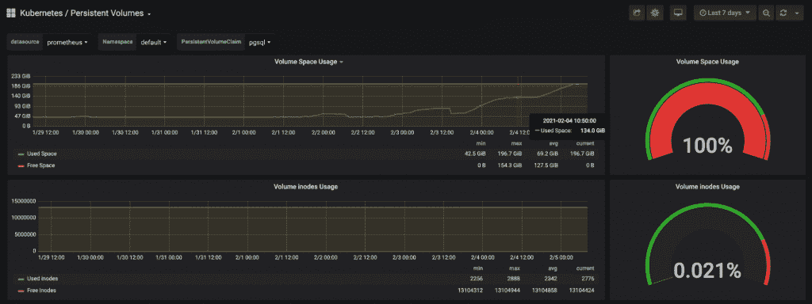

# 如何阻止 Autovacuum 吸干你的性能

> 原文：<https://thenewstack.io/how-to-stop-autovacuum-from-sucking-up-your-performance/>

[Eric Fritz](https://www.linkedin.com/in/eric-fritz-414a9411/)

[Eric 目前在 Sourcegraph 担任软件工程师，构建数据平台以支持下一代开发者生产力工具。在 Sourcegraph 之前，Eric 获得了威斯康星大学密尔沃基分校的计算机科学博士学位，在那里他发表了关于编译器构造的研究，并教授编译器和软件工程方面的课程。](https://www.linkedin.com/in/eric-fritz-414a9411/)

现代数据库很神奇，但这并不意味着它们无法理解。自 20 世纪 70 年代引入以来，构建关系数据库系统的核心概念基本上没有改变。

另一方面，我们有超过 50 年的复合实现技巧和性能改进，使这些系统的使用在不断增长的规模上更具表现力和性能。

在大部分现代应用程序代码中，关系数据库是一个无处不在的依赖项，因此并不是所有的使用模式都能得到优化。

这就产生了性能悬崖似乎突然出现的情况。但是只要稍微揭开面纱，我们就能驱散一些表演的魔力，并提出具体的建议。

## 当数据库处理并发用户时，它们会膨胀

如今，许多关系数据库系统使用一种称为 MVCC(多版本并发控制)的机制来实现事务一致性。在这种系统下，数据库中的每一行都标记有时间界限，指示可以看到特定数据行的事务集。这种标记允许事务在提交之前读取自己的修改，但更重要的是，隐藏了尚未提交给外部观察者的事务的修改。它以一种读取不会阻止写入的方式做到了这一点，反之亦然。

作为这种系统的结果，当被删除的行对现有事务仍然可见时，它们不能被移除。类似地，更新通常作为删除和插入对来实现，除了少数性能优化的情况。这确保了任何单个事务的世界观在其生命周期内不会改变。实际上，每个事务都在数据库的一个唯一且稳定的快照上操作，看起来好像它对更新有互斥的访问权。

然而，这个系统也有缺点。过时或已删除的行将保留在磁盘上，直到通过真空操作显式删除它们。我们将这种不可见的行称为膨胀，由于不相关数据的增加，膨胀会对表和索引访问的性能产生负面影响。这种类型的[碎片](https://en.wikipedia.org/wiki/Fragmentation_(computing))在更新频繁的工作流中尤其成问题。

## 一些工作负载会造成尽可能多的膨胀

在 Postgres 中，在正常操作下，自动真空后台程序会在后台定期执行真空操作。如果没有长时间运行的事务来保持旧数据可见，并且 autovacuum 守护进程得到了正确的调优，那么表和索引膨胀应该保持在最低限度，而不会消耗太多的资源来清理数据。

不幸的是，并不是所有的工作负载都是一样的，有些工作负载似乎特别适合制造尽可能多的膨胀。在 Sourcegraph，我们已经经历了这样的工作负载(并在这里写了和[这里](https://about.sourcegraph.com/blog/optimizing-a-code-intel-commit-graph-part-2/))，并开发了一些通用的批量更新习惯用法，以帮助我们更好地与努力工作(和不感谢)的 autovacuum 守护进程配合。

这种特殊的工作负载会导致磁盘使用量惊人地快速增加，而观察到的行数保持在相同的数量级。真空进程根本跟不上，最终一旦达到磁盘配额，数据库就会锁定。作为一个次要但不太重要的影响，我们的应用程序的读写性能全面下降。

## 减少膨胀和提高性能的真空友好解决方案

我们可以将这种工作负载归纳为几个共同的特征，这些特征被 [ETL 管道](https://en.wikipedia.org/wiki/Extract,_transform,_load)和高度非规范化数据模式领域中的其他用例所共享，或者只是通过将批处理计算的结果存储在您已经拥有的数据库中。

1.  对表的更新是批量完成的。要么在更新时重写整个表，要么在更新时立即重写由相同标识值键入的所有行。
2.  新数据和现有数据具有某种增量关系，因此两个数据集之间的大量行没有改变。
3.  批处理操作运行过于频繁或不可预测，以至于每晚午夜发出一个满真空不是一个有效的解决方案。

这种工作流最简单的实现是发出一条删除现有数据的语句，然后发出另一条重新插入新数据的语句。当在一个事务中执行时，这给了我们想要的行为，但是它也产生了大量的垃圾。

我们在一些性能关键型更新路径中采用的一种真空友好型解决方案采用了一种略有不同的方法。

首先，所有新数据都被插入到一个临时表中。由于整个表只对拥有它的事务可见，并且一旦事务被提交或回滚，整个表就会被删除，因此 Postgres 没有理由费心清空它。这给了我们类似于垃圾收集编程语言中的[内存竞技场](https://en.wikipedia.org/wiki/Region-based_memory_management)的东西。根据定义，这个表中的插入是无膨胀的。

接下来，我们在临时表和目标表之间执行一系列的比较和修正。存在于目标表中但不存在于临时表中的行将被删除。插入存在于临时表中但不存在于目标表中的行。根据应用程序定义的标识更改的行被更新。

同样重要的是，不需要更新的行不会被删除并重新插入到表中。这对这一招的性能增益有直接影响。如果数据集是高度增量的，并且被更新的整个数据集的一小部分实际上已经改变，那么死元组的减少将是显著的。但是，如果数据集几乎不是增量的，那么由于额外的开销，相对性能增益将会很低，甚至是负的。这基本上是天真的删除+插入实现，有很多额外的负担。

## 结论

这个技巧将受影响的元组的数量减少到这样的程度，使得这个目标表的膨胀实际上降到零。当在 Sourcegraph 上进行大批量更新操作时，我们采用这个技巧作为[的一般建议](https://docs.sourcegraph.com/dev/background-information/sql/batch_operations#updates)。

<svg xmlns:xlink="http://www.w3.org/1999/xlink" viewBox="0 0 68 31" version="1.1"><title>Group</title> <desc>Created with Sketch.</desc></svg>