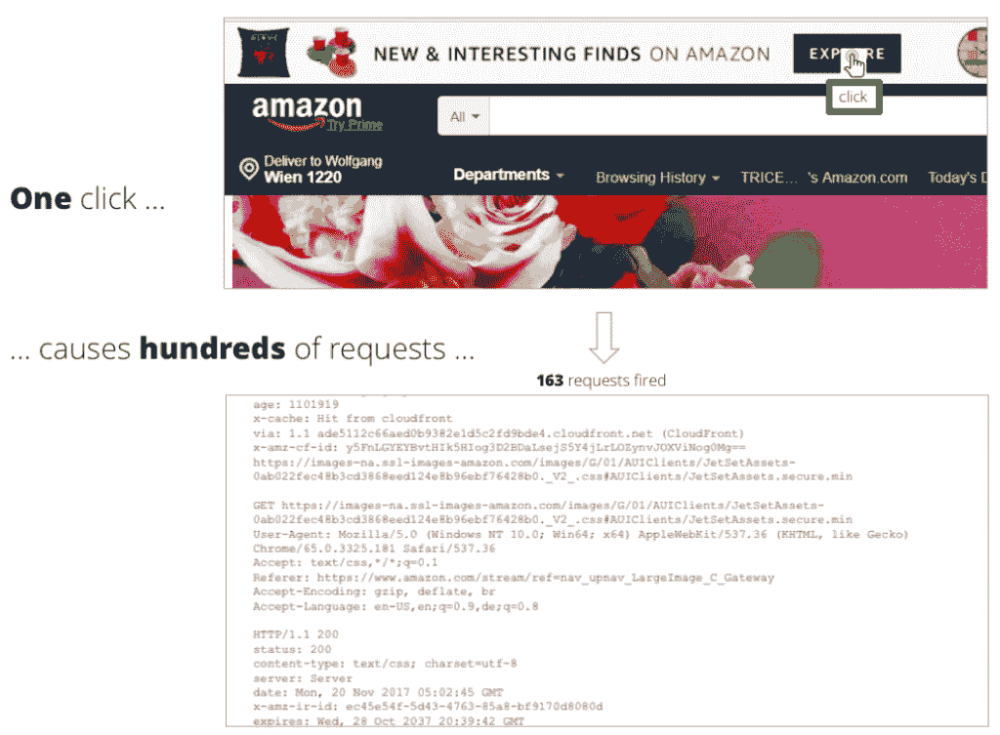

# 如何像 1999 年一样停止负载测试

> 原文：<https://thenewstack.io/how-to-stop-load-testing-like-its-1999/>

Tricentis 赞助了这篇文章。

 [沃尔夫冈广场

沃尔夫冈是 Tricentis 的创始人兼首席产品官。他是软件测试创新的幕后推手，例如基于模型的测试自动化和线性扩展测试设计方法。](https://www.tricentis.com/team/wolfgang-platz/) 

与 1999 年的生活相比，数字世界确实是一个非常不同的地方。当时，只有不到 4%的世界人口在使用互联网——而在那些可以上网的人中，绝大多数依靠拨号调制解调器上网。谷歌刚刚走出测试版，像 Ask Jeeves、Alta Vista、Lycos 和 AOL 这样的网站主宰了搜索引擎的版图，人们仍然[购买 VHS 磁带](https://arstechnica.com/civis/viewtopic.php?t=1073494)，每个人都担心[世界可能会在 2000 年 1 月 1 日](http://content.time.com/time/covers/asia/0,16641,19990118,00.html)终结。网站看起来像这样，最先进的互联网可以让你达到 1.25 Mbps。缓慢的性能就像调制解调器的嘟嘟声一样无处不在——但是如果有人想进行负载测试，他们可以使用协议级的负载测试工具，比如当时新发布的 JMeter 或 LoadRunner。

今天，网络(和世界)已经发生了很大的变化。但是负载测试呢？没有那么多。这种实践仍然由 JMeter 和 LoadRunner 的协议级测试所主导——与 1999 年使用的方法和工具相同。不幸的是，这种 1999 年风格的负载测试很难应用于当今高度复杂、组件化和大量使用 JavaScript 的 web 应用程序。现在，赌注更大了。性能问题不仅仅会延迟你公司初级网站的加载。它们会拖慢您的业务，即处理交易、吸引和留住客户以及超越竞争对手的创新能力。事实上，最近的一项研究发现[近一半(48%)的企业表示](https://www.prnewswire.com/news-releases/it-complexity-and-performance-challenges-killing-digital-transformation-initiatives-300486553.html)绩效问题直接阻碍了其数字化转型计划的成功。

在不久的将来，战略性转移的能力变得必不可少——对于不断面临中断的数字业务以及对其最终成功至关重要的负载测试工作而言。

对于负载测试来说，未来实际上是光明的…还有 BLU。

BLU 代表“浏览器级用户”为了理解它是如何显著简化负载测试的，首先认识到为什么传统的负载测试方法在今天应用起来如此麻烦是很重要的。

## **基于协议的方法脆弱且耗时**

今天的敏捷开发人员和测试人员没有时间(或愿望)去处理所有的技术细节，这些技术细节是让负载测试正确工作并让脆弱的负载测试与快速发展的应用程序保持同步所必需的。

传统的负载测试方法是在协议层编写脚本(例如 HTTP)。这包括使用 JMeter 和 Gatling 等开源工具以及 LoadRunner 等遗留商业工具进行负载测试。虽然在协议级别模拟负载具有能够从单个资源生成大量并发负载的优势，但是这种能力是有代价的。学习曲线很陡，复杂性很容易被低估。

造成这种复杂性的罪魁祸首是 JavaScript。2011 年，通常每页不到 100KB 的 JavaScript，这刺激了大约 50 个或更少的 HTTP 请求。现在，这翻了一番:我们看到平均每页 200KB 的 JavaScript，这给了我们每页 100 多个请求。

例如，只需在 Amazon.com 页面上点击一下，就会触发类似页面加载后异步处理的 163 个 HTTP 请求。您还会发现动态解析和 JavaScript 的执行，浏览器缓存中植入了静态资产和对内容交付网络的调用。下一次单击同一元素时，它可能会生成 161 个请求…或 164 个…或 165 个。每次都会有小的差异。

当您开始构建您的负载测试模拟模型时，这将很快转化为成千上万的协议级请求，您需要如实地记录这些请求，然后将它们处理成工作脚本。您必须检查请求和响应数据，执行一些清理并提取相关信息，以便在业务级别真实地模拟用户交互。不能只是像用户一样思考；你也必须像浏览器一样思考。

您需要考虑浏览器自动为您处理的所有其他功能，并弄清楚如何在您的负载测试脚本中对此进行补偿。会话处理、cookie 头管理、身份验证、缓存、动态脚本解析和执行、从响应中获取信息并在未来的请求中使用……如果您想要成功生成实际负载，所有这些都需要由您的工作负载模型和脚本来处理。基本上，你负责做任何需要的事情来填补技术和业务水平之间的差距。这既需要时间，也需要技术专业化。

## **转向 BLU**

总结一下这里的挑战:现代 web 应用程序越来越难以在协议级别进行模拟。这就提出了一个问题:为什么不从协议层转移到浏览器层——特别是如果用户通过浏览器的体验是您最终想要衡量和改善的，以便推进企业的数字化转型计划？

当您在浏览器级别工作时，一个业务操作在浏览器中可能会转化为两个自动化命令，而在协议级别则需要几十个(如果不是几百个)请求。缓存、cookie 和认证/会话管理等浏览器级功能无需干预即可工作。

有很多方法可以在浏览器级别模拟流量:Selenium 是目前最流行的，但是也有很多可用的[跨浏览器测试工具](https://en.wikipedia.org/wiki/List_of_web_testing_tools)——其中一些让你[不用进入脚本就可以测试](https://www.tricentis.com/products/automate-continuous-testing-tosca/)。

然而，从历史上看，以负载测试所需的规模运行这些工具是不可行的。在 2011 年，如果你想用 Selenium 启动 50，000 个浏览器，你将需要大约 25，000 个服务器来提供基础设施。此外，提供必要的基础设施既昂贵又耗时。

今天，随着云和容器的显著可用性，基于浏览器的负载测试的概念终于可行了。突然间，生成 50，000 个浏览器的负载变得更加容易实现——特别是当云现在可以让您访问数千个负载生成器，这些生成器可以在几分钟内启动并运行。不必等待昂贵的性能测试实验室获得批准和建立，您可以立即开始，每小时只需花费几美分。您不必为了测试一个简单的用户动作而与 163 个 HTTP 请求较劲，只需模拟一次浏览器级别的点击——这显然更容易定义和维护。考虑一下平均用户事务中的点击和操作数量，节省的时间/精力会很快增加。

对绩效的快速反馈不再只是空想。

你可以使用像 **[Flood Element](https://element.flood.io/)** 这样的开源技术，在一个简单、易于维护的脚本中捕捉动作。或者，如果你喜欢“低代码/无代码”的方法，你可以捕获你的测试场景作为[无脚本测试](https://www.tricentis.com/products/automate-continuous-testing-tosca/)，然后使用那些相同的测试来驱动负载测试和功能测试。

通过降低传统上与负载测试相关的复杂性，BLU 负载测试为开发人员和测试人员提供了一种快速、可行的方法来获得关于代码更改如何影响性能的即时反馈。它旨在帮助非专业性能测试人员快速创建可以在 CI/CD 流程中连续运行的负载测试——只需最少的维护。

使用这种新的“精益”负载测试方法，您可以现代化您的负载测试——就像您已经现代化您的开发过程、您的应用程序堆栈和[您的拨号 AOL 互联网访问](https://www.youtube.com/watch?v=MQcCnPWHlLk)。

通过 Pixabay 的特征图像。

<svg xmlns:xlink="http://www.w3.org/1999/xlink" viewBox="0 0 68 31" version="1.1"><title>Group</title> <desc>Created with Sketch.</desc></svg>