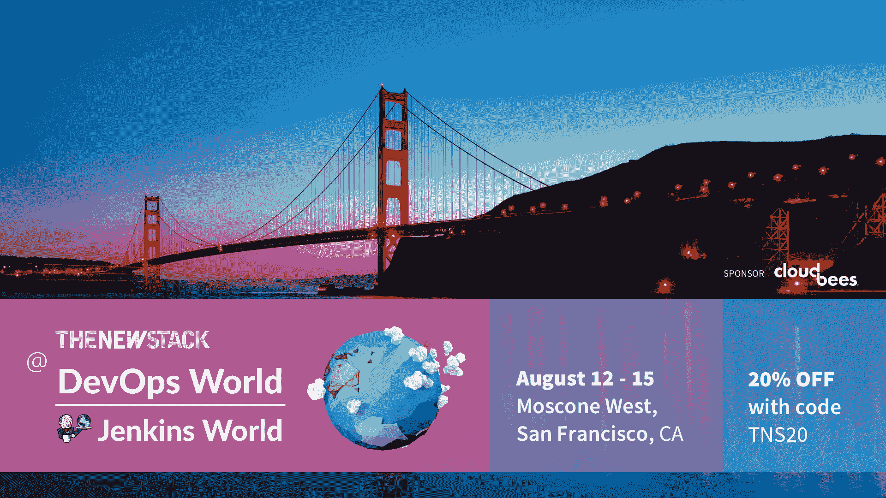

# 如何摆脱连续分娩的痛苦

> 原文：<https://thenewstack.io/how-to-take-the-pain-out-of-continuous-delivery/>

[CloudBees](https://www.cloudbees.com/) 赞助了这篇文章，它是为新堆栈独立编写的。

您的企业可能会继续努力改进 DevOps 中持续集成/持续交付(CI/CD)的持续交付(CD)部分。或者，也许您的组织只是试图采用 DevOps，而 CD 仍然是一个尚未付诸实践的概念——即使您团队的软件交付渠道在某个时候需要 CD，以便在当今快速且频繁部署的世界中保持竞争力。

如果上述任一情景描述了您组织的 CD 流程的状态，您并不孤单。CloudBees 的[第五次 DevOps 和 Jenkins 社区调查](https://www.cloudbees.com/jenkins/devops-and-jenkins-community-survey-2019)显示，在 1000 名 Jenkins 用户中，有 67%的人在 2018 年使用了 DevOps。然而，调查还显示，只有 49%的人练习 CD，而其他研究显示了类似的 CD 采用率。在调查中的“高速”CI/CD 从业者中，只有 32%的人拥有完全标准化的 CD——不是很多，但与 18%的行业平均水平相比相对较高。

成功实施的 CD 可以带来巨大的好处。它们包括更快、更一致的部署，CI/CD 和 DevOps 中更稳定的代码，以及更高效的运营和开发团队。然而，正如上面的调查数据所表明的，组织经常与 CD 作斗争，无论是在第一次尝试实现它的时候，还是在几个月或几年后成为实践者之后。

“我们谈论了很多理论上完美的 CD 管道和理论上完美的 DevOps 组织，”CloudBees 的 DevOps 传播者 [Brian Dawson](https://www.linkedin.com/in/bvdawson/) 说。“但在大多数情况下，没有人是完美的。每个人都有不同的环境，每个人都有独特的挑战。”

换句话说，采纳裁谈会带来了挑战，以至于有时被描述为 CI/CD 和 DevOps 中的“缺失环节”。好消息是，无论您的企业刚刚采用 CI/CD 还是需要进行改进，CD 都可以通过正确的流程和变更来实现。这些改进还包括进行文化转变——这可能是等式中最难的部分——与诸如[连续交付基金会(CDF)](https://cd.foundation/) (一个 Linux 基金会项目)等组织合作，并参加会议，例如即将在三藩市举行的[DevOps World | Jenkins World 2019](https://www.cloudbees.com/devops-world)，与会者可以获得并在以后应用关于 CD 以及 devo PS 的流程和工具的高级和实用信息。

## CD 文化大革命

当然，CD 需要自动化来实现，但是这也不意味着在开发团队按下按钮之后就可以设置和忘记过程。我们需要的是 DevOps 文化的根本转变来实现这种改变。

“当我与人们交谈时，我问他们在自动化他们的管道并向 CD 和 DevOps 组织转型时，他们最大的挑战是什么:答案是文化，”道森说。

同样，自动化和为您组织的特定需求找到合适的工具集对于 CD 来说是至关重要的，当然对于 DevOps 也是如此。正如 Dawson 指出的，组织最初开始采用 Jenkins 是为了取代更麻烦和容易出错的手工构建。然而，对于自动化来说，成功的 CD 需要以形成跨团队关系和改进协作的方式，与 DevOps 的其余部分交换文化。道森说，最终结果和目标还应该是所有利益相关者都为 CD 做出贡献，并始终关注最终用户或客户的需求。

对于开发人员来说，当您的团队可能利用正在进行的协作和来自操作的输入来编码和自动化 QA 过程时，CD 工作得很好——例如，与通常具有单独议程的不同团队完成的软件交付相反。

“所以，现在我不能只是在我的筒仓里解决问题，我必须走出去，解决这个叫做文化的难题，”道森说。“而且，冒着一概而论的风险，作为工程师，这不一定是我们集中精力或技能的地方。”

道森说,“失败得快，经常失败”是常用的说法，但在 CD 上惨败仍然令人担忧，而开始可能是一个挑战——这就是 CD 文化变得非常重要的地方。

“当你看到成功和失败时，你会与你的同事和其他团队分享。你让人们感兴趣，并开始激发这种创新和改进的文化，”道森说。“对于那些陷入困境的人，不要等待事情变得完美——利用你所拥有的，然后变得更好。认识到某人的理想 CD 渠道和文化可能不适合您的组织，并找出如何从架构、工具和技术上实现这一点，以[优化]您的 CD 流程实践和文化。”

## 基金会的伙伴关系

在为 CD 实施必要的文化变革和工具选择过程之间架起一座桥梁，同时不断向你的同伴学习的一个方法是加入一个工作组或基金会，比如 CDF。创建该网站的目的是帮助 DevOps 团队引入流程、标准和其他支持和管理，以便在 Jenkins 和云原生平台上部署开源工具和平台，会员可以更好地利用 [Jenkins](https://jenkins.io/) 、 [Jenkins X](https://jenkins-x.io/) 、 [Spinnaker](https://www.spinnaker.io/) 、 [Tekton](https://github.com/tektoncd) 和许多其他工具，用于他们的 CD 流程和生产管道。

然而，重要的是要记住，中国发展论坛的核心使命也是促进和强调裁谈会文化、流程和共享。“有些人可能认为综合发展框架只是一个工具基础。但是，当然，持续交付不仅仅是工具，当然也不是装在盒子里的 DevOps。“在这个受文化影响更大的地方经营，为了带来变化，你需要融入人的因素。”

在许多方面，CDF 的开发者焦点在很大程度上模仿了[云本地计算基金会](https://www.cncf.io/)(CNCF)——一个由 Linux 基金会管理的兄弟项目。例如，CDF 已经开始展示其创始成员的工具，同时大致遵循与 CNCF 创建时相似的发展时间表。

米兰达说:“我们把 CNCF 视为我们未来路线图的一种模式。”。“我们也是站在巨人的肩膀上。”

米兰达说，随着 CD 基金会不断涌现，并开始为其成员提供关于流程、工具集和文化的具体指导，其成员组织将能够“识别与你处于相同空间或处于相同旅程的人”。

## 裁谈会会议

即将到来的[devo PS World | Jenkins World 2019](https://www.cloudbees.com/devops-world)(旧金山，2019 年 8 月 12 日至 15 日)将为寻求采用或改进其 CD 流程的组织提供重要机遇。以“转型和交付”为主题，CD 将成为 DevOps 主题下的讲座和研讨会的核心焦点之一。这一想法是在研讨会上为那些在实施 CD 方面可能取得或不一定取得很大进展的组织提供高水平和实际操作的信息。

“该活动将吸引热情合作的人们，他们不仅是 Jenkins 社区的一部分，我们看到来自 Jenkins 社区成员较少的人和更多对在 DevOps 内实现 CD 感兴趣的人的出席水平相当，”Dawson 说，他将参加“[文化对话:我们的旅程](https://sched.co/SQNB)”小组讨论“所以，走出来，建立关系，参加招待会，参加社交活动，向人们介绍你自己——这是你要学习的地方。”

Miranda 说，在寻求关于 CD 的实际信息和高水平信息的同时，DevOps World 将成为“您持续交付之旅的快速黑客”，她将是“[庆祝 Jenkins 15 周年和 CI/CD](https://sched.co/SD20) 的未来”的主题演讲人之一

“DevOps World 的与会者应该意识到，每个人都认为 CD 在交付软件变更方面非常重要，无论您从事什么行业，它都将成为您组织的差异化因素，”Miranda 说。

*[了解更多 DevOps World | Jenkins World](https://www.cloudbees.com/devops-world/san-francisco) 。然后[注册并使用这个特殊代码](https://web.cvent.com/event/eac49765-9235-4b96-aaba-3bcb9cc837c3/summary?RefId=SiteButton)给 TNS 阅读器:TNS20。你会得到 20%的折扣。*

云计算原生计算基金会和 Linux 基金会是新堆栈的赞助商。

通过 Pixabay 的特征图像。

<svg xmlns:xlink="http://www.w3.org/1999/xlink" viewBox="0 0 68 31" version="1.1"><title>Group</title> <desc>Created with Sketch.</desc></svg>