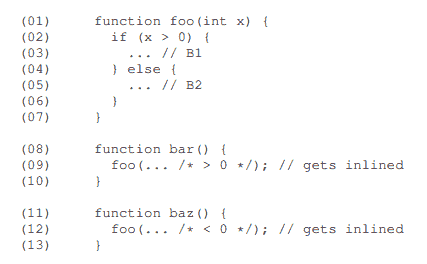
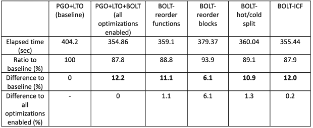
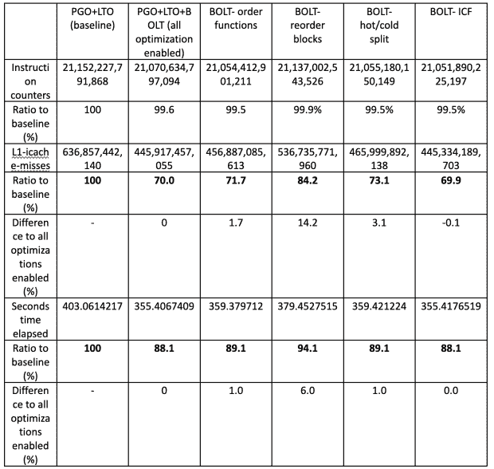
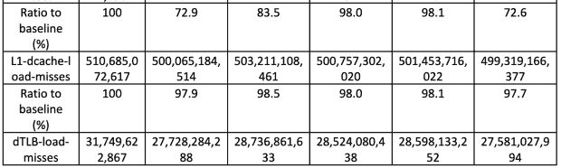
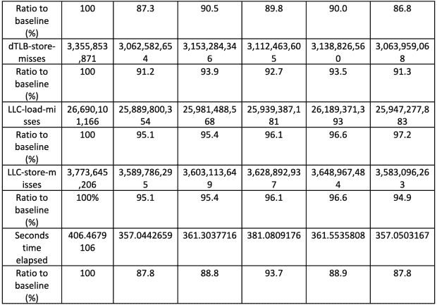

# 如何使用螺栓，二进制优化和布局工具

> 原文：<https://thenewstack.io/how-to-use-bolt-binary-optimization-and-layout-tool/>

数据中心应用程序通常非常庞大和复杂，这使得代码布局成为提高其性能的重要优化手段。这种代码布局技术被称为反馈驱动优化(FDO)或配置优化(PGO)。然而，由于它们的大尺寸，将 FDO 应用于这些应用会由于显著的存储器和计算使用和成本而导致可伸缩性问题，这使得该技术实际上是不可能的。

为了克服这个可伸缩性问题，不同的系统已经引入了基于样本的分析技术，例如 [Ispike](https://ieeexplore.ieee.org/document/1281660) 、 [AutoFDO](https://ieeexplore.ieee.org/document/7559528) 和 [HFSort](https://ieeexplore.ieee.org/document/7863743) 。其中一些应用于编译链中的多个点，例如 AutoFDO 到编译时间， [LIPO](https://dl.acm.org/doi/10.1145/1772954.1772964) 和 HFSort 到链接时间，Ispike 到后链接时间。其中，链接后优化器与编译时优化器相比相对不受欢迎，因为配置文件数据是在编译链的后期注入的。

然而， [BOLT](https://github.com/llvm/llvm-project/tree/main/bolt) 证明了后链接优化仍然是有用的，因为稍后注入配置文件数据能够更准确地使用信息来实现更好的代码布局，并且将在二进制级别收集的配置文件数据映射回二进制级别(而不是编译器的中间表示)要简单得多，从而实现高效的低级优化，如代码布局。

不要与从 Puppet 到[跨基础设施运行特别命令和脚本的开源工具](https://thenewstack.io/wp-admin/post.php?post=9140034&action=edit)混淆，后者也称为 Bolt。

## 关于 BOLT 的常见问题

**问****BOLT 代表什么？
A.** 二进制优化和布局工具

**问:博尔特是做什么的？** **A.** BOLT 对于给定的可执行二进制文件有如下重写管道:

*   功能发现
*   读取调试信息
*   读取配置文件数据
*   拆卸
*   CFG 构造(使用 LLVM 的 Tablegen 生成的反汇编程序)
*   优化管道
*   发射和链接功能
*   重写二进制文件

问:可以将任何优化技术转移到编译的早期阶段吗？这要看情况而定。

*   基于样品还是基于仪器
    *   代码效率与运行时开销
*   是否允许重新编译
    *   链接/链接后阶段的目标文件/可执行二进制文件与编译阶段的编译器 IR

**问:为什么 BOLT 运行在二进制级别，而不是源代码级别或编译器 IR 级别？**
**A.** 首先，概要分析数据通常收集二进制级别的事件，将这样的事件映射到更高级别的代码表示存在挑战。图 1 显示了这样一个挑战。



图一。将二进制级别的事件映射回高级代码表示的挑战示例

第二，用户程序(目标代码)几乎可以不费吹灰之力立即得到改进。

**问:为什么 BOLT 是作为一个单独的工具来实现的？** **A.** 有两个原因:

*   有多种开源连接器，选择其中一种用于任何特定的应用程序取决于许多情况，这些情况也可能会随着时间的推移而改变。
*   以便于工具的适应。

**问:BOLT 执行哪种优化？** **A.** 螺栓优化管道用途:

1.  `strip-rep-ret`:从用于传统 AMD 处理器的`repz retq`指令中剥离`epz`。
2.  `icf`:相同的代码折叠:没有`-ffunction-sections`标志的函数和有跳转表的函数带来的额外好处
3.  `icp`:间接调用提升:利用调用频率信息将函数调用变异成更高性能的版本
4.  `peepholes`:简单的窥视孔优化
5.  `simplify-to-loads`:在`.rodata`中取地址静态已知的常量数据，将加载突变为移动指令
6.  `icf`:相同代码折叠(第二次运行)
7.  `plt`:从`PLT`调用中移除间接
8.  `reorder-bbs`:对基本块重新排序，将热/冷块分割成单独的部分(布局优化)
9.  `peepholes`:简单窥视孔优化(第二次运行)
10.  `uce`:消除不可及的基本块
11.  `fixup-branches`:修正基本块终止符指令以匹配 CFG 和当前布局(由`reorder-bbs`重做)
12.  `reorder-functions`:应用 HFSort 重新排序功能(布局优化)
13.  `sctc`:简化条件尾调用
14.  f `rame-opts`:移除不必要的呼叫者保存的寄存器溢出
15.  `shrink-wrapping`:将被调用者保存的寄存器溢出移到更靠近需要它们的地方，如果分析数据显示这样做更好

**问:BOLT 可以用于动态加载库吗？** **答:**是的，它只是需要一个额外的动态加载库的分析步骤。

**问:BOLT 使用哪些剖析数据？** **A.** BOLT 使用 Linux perf 实用程序收集训练输入，包括:

*   CPU 周期(仅在用户模式下)
*   取样的分支(和分支类型)

请参考此处的性能事件[的详细信息。](https://perf.wiki.kernel.org/index.php/Tutorial)

**问:基准螺栓测试了哪些应用？**
**A.** 较大的应用(100MB 以上)。最好积极减少 I-cache 的占用，因为缓存是数据中心空间中最受限制的资源之一。脸书使用螺栓测试了以下内容:

*   [HHVM](https://github.com/facebook/hhvm) :为网络服务器供电的 PHP/Hack 虚拟机
*   TAO:一个高度分布式的内存数据缓存服务
*   [Proxygen](https://github.com/facebook/proxygen) :集群负载均衡器
*   多重馈送:脸书新闻馈送中显示的内容的选择
*   编程语言的编译器前端
*   GCC:GNU 项目的优化编译器

## 螺栓的当前状态

最初的研究[论文](https://research.facebook.com/publications/bolt-a-practical-binary-optimizer-for-data-centers-and-beyond/)由脸书工程师在《CGO 2019》上发表。源代码从 2015 年开始在 [GitHub](https://github.com/llvm/llvm-project/tree/main/bolt) 发布维护。BOLT 项目在 3 月份被添加到 LLVM 项目版本 14 的主流中。

BOLT 在 x86-64 和 AAarch64 ELF 二进制文件上运行。二进制文件应该有一个未条带化的符号表；为了获得最大的性能增益，它们应该与重定位(`--emit-relocs`或–`q`链接器标志)相链接。

BOLT 目前与`-freorder-blocks-and-partition`编译器选项不兼容。GCC 8 和更高版本默认启用该选项；您必须通过添加一个`-fno-reorder-blocks-and-partition`标志来显式禁用它。

最近的代码提交是在四个月前完成的，它们是非功能性的更改。

## 如何构建和测试 BOLT

本节描述如何构建 BOLT 并使用简单的可执行文件进行测试。

### 建筑螺栓

**第一步。**获取源代码。

```
git clone https://github.com/facebookincubator/BOLT llvm-bolt

```

**第二步。**造螺栓。

```
cd llvm-bolt
mkdir build
cd build
cmake  -G  Ninja  ../llvm-bolt/llvm  -DLLVM_TARGETS_TO_BUILD="X86;AArch64"  -DCMAKE_BUILD_TYPE=Release  -DLLVM_ENABLE_ASSERTIONS=ON  -DLLVM_ENABLE_PROJECTS="clang;lld;bolt"
ninja

```

注意，您可能需要修改环境中的 PATH 变量，以包含`./llvm-bolt/build/bin`。

### 使用简单的可执行文件进行测试

**步骤 1。**写 t.cc.

```
// t.cc
#include <iostream>
#include <vector>

using namespace std;

int  x[5]  =  {  0xba,  0xbb,  0xbc,  0xbd,  0xbe  };

bool  p(int  n)  {
  for  (int  i  =  2;  i*i  <=  n;  i++)  {
    if  (n  %  i  ==  0)
      return false;
  }
  return true;
}

int  f(int  i)  {
  return  x[i];
}

int main()  {
  int sum  =  0;
  for  (int  k  =  2;  k  <  1000000;  k++)  {
    if  (p(k))  {
      sum++;
    }
  }
  cout  <<  sum  <<  endl;

}

```

**第二步。编写一个 Makefile 文件。** 

```
# Makefile

t:  t.cc
  clang++  -Wl,--emit-relocs  -o  t  t.cc

clean:
  rm  t

```

**第三步。**从 t.cc.
构建一个可执行文件

**第四步。**通过运行 perf 实用程序，从可执行文件 t 中获取配置文件数据 p.data。

```
$  perf record  -e  cycles:u  -j  any,u  -o  p.data  --  ./t
78498
[  perf record:  Woken up  3  times to write data  ]
[  perf record:  Captured and wrote  0.526  MB  p.data  (1280  samples)  ]

```

**第五步。**通过执行 perf2bolt，将性能数据 p.data 转换为 BOLT 格式 p.fdata。

```
$  perf2bolt  -p  p.data  -o  p.fdata  ./t
PERF2BOLT:  Starting data aggregation job for  p.data
PERF2BOLT:  spawning perf job to read branch events
PERF2BOLT:  spawning perf job to read mem events
PERF2BOLT:  spawning perf job to read process events
PERF2BOLT:  spawning perf job to read task events
BOLT-INFO:  Target architecture:  x86_64
BOLT-INFO:  BOLT version:  88c70afe9d388ad430cc150cc158641701397f70
BOLT-INFO:  first alloc address is  0x400000
BOLT-INFO:  creating new program header table at address  0x800000,  offset  0x400000
BOLT-INFO:  enabling relocation mode
BOLT-INFO:  enabling strict relocation mode for aggregation purposes
BOLT-INFO:  pre-processing profile using perf data aggregator
BOLT-WARNING:  build-id will not be checked because we could not read one from input binary
PERF2BOLT:  waiting for perf mmap events collection to finish...
PERF2BOLT:  parsing perf-script mmap events output
PERF2BOLT:  waiting for perf task events collection to finish...
PERF2BOLT:  parsing perf-script task events output
PERF2BOLT:  input binary is associated with  1  PID(s)
PERF2BOLT:  waiting for perf events collection to finish...
PERF2BOLT:  parse branch events...
PERF2BOLT:  read  1280  samples and  20335  LBR entries
PERF2BOLT:  0  samples  (0.0%)  were ignored
PERF2BOLT:  traces mismatching disassembled function contents:  0  (0.0%)
PERF2BOLT:  out of range traces involving unknown regions:  253  (1.3%)
BOLT-WARNING:  Ignored  0  functions due to cold fragments.
PERF2BOLT:  processing branch events...
PERF2BOLT:  wrote  17  objects and  0  memory objects to  p.fdata

```

请注意，您可能需要授予用户执行 perf 的权限。

```
$  sudo sysctl kernel.perf_event_paranoid=-1
kernel.perf_event_paranoid  =  -1

```

**第六步**。从 t.
生成优化的二进制 t.bolt

```
$  llvm-bolt  ./t  -o  ./t.bolt  -data=p.fdata  -reorder-blocks=cache+  -reorder-functions=hfsort  -split-functions=2  -split-all-cold  -split-eh  -dyno-stats
BOLT-INFO:  Target architecture:  x86_64
BOLT-INFO:  BOLT version:  88c70afe9d388ad430cc150cc158641701397f70
BOLT-INFO:  first alloc address is  0x400000
BOLT-INFO:  creating new program header table at address  0x800000,  offset  0x400000
BOLT-INFO:  enabling relocation mode
BOLT-INFO:  enabling lite mode
BOLT-INFO:  pre-processing profile using branch profile reader
BOLT-WARNING:  Ignored  0  functions due to cold fragments.
BOLT-INFO:  2  out of  16  functions in the binary  (12.5%)  have non-empty execution profile
BOLT-INFO:  10  instructions were shortened
BOLT-INFO:  basic block reordering modified layout of  2  (9.09%)  functions
BOLT-INFO:  UCE removed  0  blocks and  0  bytes of code.
BOLT-INFO:  splitting separates  76  hot bytes from  51  cold bytes  (59.84%  of split functions is hot).
BOLT-INFO:  0  Functions were reordered by LoopInversionPass
BOLT-INFO:  program-wide dynostats after all optimizations before SCTC and FOP:

 13531  :  executed forward branches
                6165  :  taken forward branches
 0  :  executed backward branches
 0  :  taken backward branches
 13644  :  executed unconditional branches
 141  :  all function calls
 0  :  indirect calls
 0  :  PLT calls
 96484  :  executed instructions
 41335  :  executed load instructions
                7716  :  executed store instructions
 0  :  taken jump table branches
 0  :  taken unknown indirect branches
 27175  :  total branches
 19809  :  taken branches
                7366  :  non-taken conditional branches
                6165  :  taken conditional branches
 13531  :  all conditional branches

                7258  :  executed forward branches  (-46.4%)
                  16  :  taken forward branches  (-99.7%)
                6273  :  executed backward branches  (+627200.0%)
                6246  :  taken backward branches  (+624500.0%)
 174  :  executed unconditional branches  (-98.7%)
 141  :  all function calls  (=)
 0  :  indirect calls  (=)
 0  :  PLT calls  (=)
 82987  :  executed instructions  (-14.0%)
 41335  :  executed load instructions  (=)
                7716  :  executed store instructions  (=)
 0  :  taken jump table branches  (=)
 0  :  taken unknown indirect branches  (=)
 13705  :  total branches  (-49.6%)
                6436  :  taken branches  (-67.5%)
                7269  :  non-taken conditional branches  (-1.3%)
                6262  :  taken conditional branches  (+1.6%)
 13531  :  all conditional branches  (=)

BOLT-INFO:  SCTC:  patched  0  tail calls  (0  forward)  tail calls  (0  backward)  from  a  total of  0  while removing  0  double jumps and removing  0  basic blocks totalling  0  bytes of code.  CTCs total execution count is  0  and the number of times CTCs are taken is  0.
BOLT-INFO:  padding code to  0xc00000  to accommodate hot text
BOLT-INFO:  setting _end to  0x600df0
BOLT-INFO:  setting __hot_start to  0xa00000
BOLT-INFO:  setting __hot_end to  0xa00092

```

第七步**。**比较 t 和 t.bolt 的文件大小和执行时间。

```
$  ls  -l  t  t.bolt
-rwxrwxr-x  1  wjeon wjeon 10400  Feb  10  17:10  t
-rwxrwxrwx  1  wjeon wjeon  8394880  Feb  10  17:18  t.bolt
$  time  ./t
78498

real    0m0.309s
user    0m0.309s
sys 0m0.000s
wjeon@fw0014107  ~/maplejs/maple  $  time  ./t.bolt
78498

real    0m0.259s
user    0m0.259s
sys 0m0.000s

```

## Maple JavaScript 的简单试用

在他们的[研究论文](https://research.facebook.com/publications/bolt-a-practical-binary-optimizer-for-data-centers-and-beyond/)中，脸书团队使用两类二进制来评估 BOLT。首先是脸书数据中心上运行的实际工作负载。它们是(1)[PHP/Hack 虚拟机 HHVM](https://dl.acm.org/doi/10.1145/2660193.2660199) 、( 2) [TAO](https://www.usenix.org/system/files/conference/atc13/atc13-bronson.pdf) 、分布式内存数据缓存服务(3) [Proxygen](https://github.com/facebook/proxygen) 、构建在同一个开源库之上的集群负载均衡器(4)multi Feed News Feed 服务。第二类二进制文件是(1) Clang 和(2) GCC 编译器。

首先，我们尝试使用引擎对我们的目标二进制文件进行优化。Javascript 引擎是由 Futurewei Technologies 开发的内部 JavaScript 运行时引擎。Maple JavaScript 使用了两个工作负载:第一个是 prime.js，它查找小于一百万的质数，第二个是 3d-cube.js，它执行旋转 3d 立方体的矩阵计算。

**步骤 1** :必须更改 Cmake 构建脚本，以便在可执行文件中保留重定位。

```
diff  --git  a/maple_engine/src/CMakeLists.txt  b/maple_engine/src/CMakeLists.txt
index  8eec9d1..323f1a2  100644
---  a/maple_engine/src/CMakeLists.txt
+++  b/maple_engine/src/CMakeLists.txt
@@  -74,6  +74,8  @@  find_library(  PBjaddr2_LIB java_addr2line  "${CMAKE_CURRENT_SOURCE_DIR}/../lib/*"
  find_library(  PBmplre_LIB mplre  "${CMAKE_CURRENT_SOURCE_DIR}/../lib/*"  )
  find_library(  PBunwind_LIB unwind  "${CMAKE_CURRENT_SOURCE_DIR}/../lib/*"  )

+target_link_options(mplre-dyn PRIVATE  -Wl,--emit-relocs)
+
  target_link_libraries(  mplre-dyn  "${CMAKE_CURRENT_SOURCE_DIR}/../../../mapleall/out/ark-clang-release/lib/64/libHWSecureC.a"  "${CMAKE_CURRENT_SOURCE_DIR}/../../../mapleall/jscre/build/libjscre.a"  icuio icui18n icuuc icudata)
  #target_link_libraries( mplsh ${PBmpl_LIB} )
  #target_link_libraries( mplsh ${PBcorea_LIB} )

```

**第二步**:为 Maple JavaScript 引擎构建二进制文件。

**步骤 3** :修改运行脚本，获取配置文件数据。

```
diff  --git  a/maple_build/tools/run-js-app.sh  b/maple_build/tools/run-js-app.sh
index  0af9c8d..a4c0cae  100755
---  a/maple_build/tools/run-js-app.sh
+++  b/maple_build/tools/run-js-app.sh
@@  -46,4  +46,5  @@  $MPLCG  -O2  --quiet  --no-pie  --verbose-asm  --fpic  $file.mmpl
  /usr/bin/x86_64-linux-gnu-g++-5  -g3  -pie  -O2  -x  assembler-with-cpp  -c  $file.s  -o  $file.o
  /usr/bin/x86_64-linux-gnu-g++-5  -g3  -pie  -O2  -fPIC  -shared  -o  $file.so  $file.o  -rdynamic
  export LD_LIBRARY_PATH=$MAPLE_RUNTIME_ROOT/lib/x86_64
-$DBCMD  $MPLSH  -cp  $file.so
+#$DBCMD $MPLSH -cp $file.so
+perf record  -e  cycles:u  -j  any,u  -o  perf.data  --  $DBCMD  $MPLSH  -cp  $file.so

```

**第四步**:编写基准 JavaScript 应用，例如 prime.js.

```
if  (typeof console  ==  "object")  print  =  console.log;
if  (typeof console  ===  'undefined')  console  =  {log:print};
function  p(n)  {
for  (let  i  =  2;i  *  i  <=  n;i++)  {
if  (n  %  i  ==  0)  {
return false;
}
}
return true;
}

var sum  =  0;
for  (var  k  =  2;k  <  1000000;k++)  {
if  (p(k))  {
sum++;
}
}
print(sum);

```

**第五步**:用 Maple JavaScript 引擎运行 prime.js，获取个人资料数据。

```
$  run-js-app.sh prime.js
78498
[  perf record:  Woken up  37  times to write data  ]
[  perf record:  Captured and wrote  9.468  MB perf.data  (22989  samples)  ]

```

**第六步**:将 perf 数据输出转换为 BOLT 格式。

```
$  llvm-bolt libmplre-dyn.so    -o  libmplre-dyn.bolt.so  -data=perf.fdata  -reorder-blocks=cache+  -reorder-functions=hfsort  -split-functions=2  - split-all-cold  -split-eh  -dyno-stats
BOLT-INFO:  shared object or position-independent executable detected
BOLT-INFO:  Target architecture:  x86_64
BOLT-INFO:  BOLT version:  88c70afe9d388ad430cc150cc158641701397f70
BOLT-INFO:  first alloc address is  0x0
BOLT-INFO:  creating new program header table at address  0x400000,  offset  0x400000
BOLT-WARNING:  debug info will be stripped from the binary.  Use  -update-debug-sections to keep it.
BOLT-INFO:  enabling relocation mode
BOLT-WARNING:  disabling  -split-eh for shared object
BOLT-INFO:  enabling lite mode
BOLT-INFO:  pre-processing profile using branch profile reader
BOLT-WARNING:  Ignored  0  functions due to cold fragments.
BOLT-INFO:  forcing  -jump-tables=move as PIC jump table was detected in function _ZN5maple21InvokeInterpretMeth odERNS_12DynMFunctionE
BOLT-INFO:  14  out of  1205  functions in the binary  (1.2%)  have non-empty execution profile
BOLT-INFO:  1  function with profile could not be optimized
BOLT-INFO:  profile for  1  objects was ignored
BOLT-INFO:  the input contains  25  (dynamic count  :  1)  opportunities for macro-fusion optimization.  Will fix ins tances on  a  hot path.
BOLT-INFO:  1241  instructions were shortened
BOLT-INFO:  removed  5  empty blocks
BOLT-INFO:  basic block reordering modified layout of  10  (0.47%)  functions
BOLT-INFO:  UCE removed  0  blocks and  0  bytes of code.
BOLT-INFO:  splitting separates  3334  hot bytes from  3048  cold bytes  (52.24%  of split functions is hot).
BOLT-INFO:  0  Functions were reordered by LoopInversionPass
BOLT-INFO:  program-wide dynostats after all optimizations before SCTC and FOP:

 21327  :  executed forward branches
 10516  :  taken forward branches
 652  :  executed backward branches
 459  :  taken backward branches
 648  :  executed unconditional branches
                2085  :  all function calls
 988  :  indirect calls
 988  :  PLT calls
              327015  :  executed instructions
 81409  :  executed load instructions
 56643  :  executed store instructions
                8029  :  taken jump table branches
 0  :  taken unknown indirect branches
 22627  :  total branches
 11623  :  taken branches
 11004  :  non-taken conditional branches
 10975  :  taken conditional branches
 21979  :  all conditional branches

 21205  :  executed forward branches  (-0.6%)
 255  :  taken forward branches  (-97.6%)
 774  :  executed backward branches  (+18.7%)
 513  :  taken backward branches  (+11.8%)
 329  :  executed unconditional branches  (-49.2%)
                2085  :  all function calls  (=)
 988  :  indirect calls  (=)
 988  :  PLT calls  (=)
              326401  :  executed instructions  (-0.2%)
 81409  :  executed load instructions  (=)
 56643  :  executed store instructions  (=)
                8029  :  taken jump table branches  (=)
 0  :  taken unknown indirect branches  (=)
 22308  :  total branches  (-1.4%)
                1097  :  taken branches  (-90.6%)
 21211  :  non-taken conditional branches  (+92.8%)
 768  :  taken conditional branches  (-93.0%)
 21979  :  all conditional branches  (=)

BOLT-INFO:  SCTC:  patched  0  tail calls  (0  forward)  tail calls  (0  backward)  from  a  total of  0  while removing  0  d ouble jumps and removing  0  basic blocks totalling  0  bytes of code.  CTCs total execution count is  0  and the num ber of times CTCs are taken is  0.
BOLT-INFO:  padding code to  0x800000  to accommodate hot text
BOLT-INFO:  setting _end to  0x80e43c
BOLT-INFO:  setting _end to  0x80e43c
BOLT-INFO:  setting __hot_start to  0x600000
BOLT-INFO:  setting __hot_end to  0x6205e7

```

**第七步**:重命名 Maple JavaScript 运行时库 libmple-dyn . so .

```
$  mv libmplre-dyn.so libmplre-dyn.so~
$  mv libmplre-dyn.bolt.so libmplre-dyn.so

```

**第八步**:使用原运行脚本，用 Maple JavaScript 引擎执行 prime.js。

**第九步**:比较文件大小和执行时间。

```
$  ls  -l  libmplre-dyn*
-rwxrwxrwx  1  wjeon wjeon  8676416  Feb  10  18:22  libmplre-dyn.so
-rwxrwxr-x  1  wjeon wjeon  19387232  Feb  10  11:37  libmplre-dyn.bolt.so

// original
$  time run-js-app.sh prime.js
78498

real    0m5.743s
user    0m5.714s
sys 0m0.046s

// with BOLT
$  time run-js-app.sh prime.js
78498

real    0m5.738s
user    0m5.710s
sys 0m0.045s

// original
$  time run-js-app.sh  3d-cube.js

real    0m51.210s
user    0m51.183s
sys 0m0.040s

// with BOLT
$  time run-js-app.sh  3d-cube.js

real    0m51.425s
user    0m51.368s
sys 0m0.073s

```

然而，使用 BOLT 对 Maple JavaScript 引擎进行二进制优化的好处并不明显。我们认为主要原因是 Maple JavaScript 使用的工作负载没有本文最初作者使用的工作负载复杂。工作负载只有条件分支，所以 BOLT 可能没有什么好机会来优化 Maple JavaScript 的二进制文件。此外，与作者使用的工作负载相比，执行时间的持续时间非常短。

## Clang 的螺栓优化

因此，我们决定在我们的设置上使用本文中使用的相同基准工作负载，即 Clang 编译器。在 BOLT 的 Github [库](https://github.com/facebookincubator/BOLT/blob/main/bolt/docs/OptimizingClang.md)中记录了重现论文中呈现的结果的详细步骤。大部分步骤都是一样的，但是选择了 Clang 的后来版本 14，而不是 Clang 7。这是设置的摘要。

*   测试 app:Clang 14(GitHub 源代码的 14.x 分支)
*   测试环境:Ubuntu 18.04.4 LTS，40 核 CPU，800GB 内存
*   不同的优化
    *   PGO+LTO:没有螺栓的基线设置(由 LLVM/Clang 提供的概要引导优化+链接时间优化)
    *   PGO+LTO+BOLT:启用 BOLT 优化(由 BOLT GitHub 项目建议)
        *   函数重新排序的算法:`hfsort+`
        *   基本块重新排序的算法:`cache+`(布局优化 I-cache 行为)
        *   功能拆分级别:三级(所有功能)
        *   用相同代码折叠函数
    *   螺栓重新排序函数:螺栓优化不包括函数的重新排序
    *   螺栓重新排序块:螺栓优化，不包括基本块的重新排序
    *   螺栓热/冷分割:不包括热/冷分割的螺栓优化
    *   BOLT-ICF:排除相同代码折叠的 BOLT 优化

该测试的主要目的是确定 BOLT 的哪些优化选项带来了多大的性能优势。PGO+LTO 支持基于 LLVM 支持的 PGO 和 LTO 的基本优化，被选为性能比较的基准。

PGO+LTO+BOLT 表示所有的 BOLT 优化都是在 PGO 和 LTO 之上启用的。`No reorder functions`启用所有螺栓优化(在他们的文档中描述),除了没有重新排序的功能。类似地，`No reorder blocks`、`No hot/cold split`和`No ICF`分别启用除基本块重新排序、热/冷分割和相同代码折叠之外的所有螺栓优化。

表 1 显示了不同优化配置的执行时间。



表 1。不同优化配置下 Clang 的执行时间

从显示执行时间的表格来看，在所有 BOLT 优化选项中，以下单个优化对执行时间的影响最大:(1)重新排序块，(2)热/冷函数拆分，(3)重新排序函数，(4)相同的代码折叠，按顺序。

表 2 显示了不同优化选项对 L1 指令高速缓存未命中的不同贡献。



图二。不同螺栓优化的贡献

如图所示，对 L1-icache 未命中影响最大的每个单螺栓优化选项依次是(1)重新排序块，(2)热/冷分离，重新排序函数(tie)，以及(3)相同的代码折叠。

表 3 从其他系统参数的角度显示了不同优化选项的更多结果。

【T2




表 3。不同螺栓优化的贡献

从表 3 中可以看出，另外两个系统参数主要受不同螺栓优化选项`cpu-cycles`和`L1-icache-load-misses`的影响。CPU 周期主要受以下因素影响:(1)重新排序块，(2)热/冷分割，(2)重新排序函数(tie)和(3)相同的代码折叠，以及(1)重新排序块，(2)热/冷分割，(3)重新排序函数和(4)相同的代码折叠，按顺序。

<svg xmlns:xlink="http://www.w3.org/1999/xlink" viewBox="0 0 68 31" version="1.1"><title>Group</title> <desc>Created with Sketch.</desc></svg>