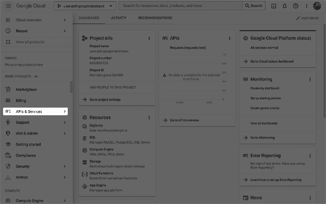

# 如何使用 Google Sheets 作为 React 和无服务器的数据库

> 原文：<https://thenewstack.io/how-to-use-google-sheets-as-a-database-with-react-and-ssr/>

在本教程中，我将解释如何使用 Google Sheets 作为数据库来存储用户投票的结果。我已经在许多营销活动中使用了这种 Google Sheets 方法。我选择这种方法而不是更传统的数据库解决方案，原因只有一个:数据检索。

当然，这完全取决于您的需求，但是能够简单地与我团队中的技术或非技术成员共享 Google Sheet 这样他们就可以很容易地看到捕获的数据——已经不止一次地被证明是非常有价值的。

Gatsby 和 Next.js 示例用户投票应用的截图，带有条形图结果。

数据从浏览器发送到一个无服务器功能，该功能安全地发布到存储数据的 Google Sheet。要在 React 中使用无服务器功能，您可以使用 [Next.js](https://nextjs.org/) 或 [Gatsby](https://www.gatsbyjs.com/) 。

在下面的链接中，您会发现使用这两种框架的完整用户投票的实时预览和 GitHub 存储库。

我不会讨论如何开始使用这两个框架，所以如果您不熟悉这些技术，请查阅文档。

## 什么是无服务器功能？

*无服务器功能使前端开发人员只需编写 JavaScript 就能为我们的应用程序添加强大的“后端”逻辑——没有开发应用程序，没有服务器，只有结果。*——[杰森·伦斯托夫](https://www.learnwithjason.dev/blog/serverless-functions/overview)

在同一个项目中，使用无服务器函数允许你从你的前端“发送”数据到你的“后端”。然后，无服务器功能可以安全地“发送”到数据库以存储数据。

因为所有的业务逻辑都在“后端”，所以建立数据库连接所需的 API 键或秘密永远不会暴露给前端/用户/(浏览器)。

实现这一点的方法在不同的框架之间略有不同，但总的想法是用一个“页面”来处理向“API”发送请求。

## Gatsby 无服务器功能示例

“页面”保存在 **src/pages/some-page.js** 中，并向保存在**src/API/some-endpoint . js .**中的“API”发送请求

您可以使用以下链接查看 Gatsby 示例的`src`。

### some-page.js

### some-端点. js

成功的“post”将显示以下内容，使用 HTML `<pre />`元素在 Jsx 中返回。

## Next.js 无服务器函数示例

“页面”保存在 **pages/some-page.js** 中，并向保存在**pages/API/some-endpoint . js**中的“API”发送请求

您可以使用以下链接查看 Next.js 示例的`src`。

两个框架的页面代码和 API 是相同的；两者的区别在于目录结构。

在这些例子中，无服务器函数使用作为查询参数接收的`name`值简单地返回一个字符串。在用户投票示例应用程序中，无服务器功能用于将数据发送到 Google Sheet 上进行保存和安全存储。稍后会有更多的介绍。

## 如何设置谷歌表单

在使用 Google Sheet 之前，你首先需要建立一个 Google 所说的服务账户。你可以在谷歌文档中了解更多关于服务账户的信息:[了解谷歌服务账户](https://cloud.google.com/iam/docs/understanding-service-accounts)

## 创建一个谷歌云项目

第一步是创建一个项目。您将配置这个项目，使它包含对 Google Sheets API 的访问，通过一个服务帐户用户/电子邮件地址，并使用它来生成将数据“发布”到 Google Sheets 所需的 API 键。

创建 Google Cloud 项目的步骤在下面的指南中概述:[通过使用 Google Cloud 控制台](https://cloud.google.com/iam/docs/grant-role-console)授予 IAM 角色。

1.  从上面的链接开始，点击**转到项目选择器**按钮。
    
2.  现在点击**创建项目**。
    
3.  给你的项目命名，然后点击**创建**。
    
4.  现在，您应该被重定向到项目仪表板。点击侧边栏中的 **API 的&服务**导航项目。
    
5.  现在您可以启用对 Google Sheets API 的访问了。点击 **+启用 API 和服务**按钮。
    
6.  搜索“工作表”并选择**谷歌工作表 API** 。
    
7.  要启用对 Google Sheets API 的访问，请单击**“启用”**按钮。
    
8.  要为 Google Sheets API 创建必要的凭证，请单击**创建凭证**按钮。
    
9.  选择 **Google Sheets API** 并检查**应用数据**单选按钮。出于本教程的目的，你可以对最后一个问题回答**否**。
    
10.  你可以跳过**你的证书**这一步，准备好了就点击**完成**按钮。
    
11.  点击侧边栏中的**服务账户**导航项目。为您的项目创建一个服务帐户，并给它一个**服务帐户 ID** 。
    
12.  将**角色**设置为**所有者**。你可以跳过最后一步。准备好后点击**完成**。
    
13.  点击侧边栏中的 **IAM** 导航项目。请检查服务帐户详细信息的权限是否正确。
    
14.  点击侧边栏中的**服务账户**导航项目。然后点击*更多点*并选择**管理密钥**。
    
15.  在**密钥**选项卡上，点击**添加密钥**按钮，然后点击**创建新密钥**。
    
16.  选择 **JSON** 作为密钥类型，然后点击 **CREATE** 按钮下载一个包含您的密钥的. JSON 文件。
    
17.  的。您刚刚下载的 json 文件看起来有点像下面的。您需要保存为环境变量的两个键是。**private _ key**和 **client_email** 。
    

在示例项目中，我创建了以下环境变量。

您可以在下面的链接中阅读关于为 Gatsby 和 Next.js 配置环境变量的更多信息。

## 创建 Google 表单

创建一个新的 Google 工作表，并在 URL 地址栏中记下 id**和**。

URL 地址栏中突出显示了工作表 Id 的 Google 工作表的屏幕截图

## 向 Google 工作表添加列标题

您可以添加任意数量的标题。值得注意的是，空格被替换为下划线。我将在后面的步骤中解释原因。

突出显示标题行的 Google 工作表的屏幕截图。

## 分享谷歌表单

创建好新表单后，将其与您的服务帐户电子邮件地址/中的 **client_email** 共享。json 文件。确保服务帐户拥有**编辑**权限。

Google Sheet“Share”模式的截图。

## 创建用户投票

创建用户投票有两个部分:页面和 API。

*   该页面包含允许用户投票的 UI 元素和显示来自 Google Sheet 的商店值的视觉效果。
*   API 接收来自页面的请求，发布到 Google Sheet，并在返回数据之前执行一些小的计算。

## 创建页面

创建一个新页面并添加以下内容。

### 页面配置和使用状态值

在这一步中，您将创建一个用于投票按钮上的文本的配置和一个`id`，稍后您将使用它来定位 Google 表单中的正确单元格。如前所述，`id`不应该包含空格。

还有许多`useState`值，它们在向 API 发出请求之前、期间和之后保存应用程序的状态。

### 添加“点击”处理函数

该函数接受一个`id`，并将其作为查询参数传递给 API 请求；又称`id`。

如果响应正常，则将结果存储在`useState`值中。`isSubmitting`和`hasVoted`的其他状态也被更新。

如果响应出错，则更新错误状态。

### 添加接口

该界面有两种状态。第一个是允许用户投票的按钮，第二个是结果。您可以使用`hasVoted`状态值来确定要呈现哪个状态。

要创建按钮，您可以迭代配置选项。名称是出现在按钮上的文本，而`id`用作`onClick`函数的参数。

要创建结果，您可以迭代来自 API 的结果，显示每个值并使用百分比缩放“条形图”。可以通过使用`isMax`值添加额外的样式，该值可以是`true`或`false`(取决于投票的数量)。

## 创建 API

### 安装谷歌电子表格依赖项

## 创建无服务器功能

*   导入(要求)谷歌电子表格的依赖。
*   创建一个名为 doc 的新 const，并使用 GoogleSpreadsheet 构造函数提供`GOOGLE_SHEET_ID`环境变量。
*   从查询参数中析构`id`并添加一个 try catch。如果请求中省略了`id`，您可能会抛出一个错误。
*   `await`使用`useServiceAccountAuth`的单据授权。与上面类似，提供所需的环境变量。
*   添加成功和错误响应。

你可以在 [google-sheet 文档](https://theoephraim.github.io/node-google-spreadsheet/#/?id=the-basics)中阅读更多关于基本配置选项的内容。

## 阅读并更新谷歌表单

*   创建一个名为 sheet 的新常量。这将从 Google 工作表中定义的第一个选项卡中读取数据。
*   创建一个名为`rows`的新常量。这将从工作表中读取可用的行。
*   创建一个名为`raw_data`的新常量。这些是工作表中第一行的值。
*   创建一个名为`header_values`的新常量。这些值来自工作表中定义的标题行。
*   创建一个名为`row_value`的新常量。这是特定单元格的值。查询参数中的`id`用于定位正确的单元格。

现在，您可以通过将单元格的值递增+1 来更新单元格中的值，然后将数据保存回工作表中。

### 计算票数

在这一步中，您将根据工作表中的值计算一些要返回的新值。

*   创建一个名为`total`的新常量。这将所有单元格中的总票数相加。该值用于计算每个单元格的百分比值。
*   创建一个名为`max`的新常量。这是工作表中最大值的单元格。这用于确定单元格值是否是工作表中的最高值。
*   创建一个名为`results`的新常量，并遍历`header_values`。您可以使用索引值“查找”`raw_data`来确定计数，然后返回计算值。

现在，您可以在响应中将结果和总数发送回浏览器。

## 完成

完成的页面 API 可以在以下两个框架的链接中找到。

从无服务器函数返回的所有值都有助于确定和填充您之前定义的应用程序状态。

如果 Google API 由于任何原因失败，应该处理所有错误以确保应用程序不会崩溃。

感谢您的阅读，如果您有任何问题，请在 Twitter 上找到我: [@PaulieScanlon](https://twitter.com/PaulieScanlon) 或查看我的网站 [paulie.dev](https://paulie.dev/) ，在那里我有更多的 React/Jamstack 教程。

## 进一步阅读

<svg xmlns:xlink="http://www.w3.org/1999/xlink" viewBox="0 0 68 31" version="1.1"><title>Group</title> <desc>Created with Sketch.</desc></svg>