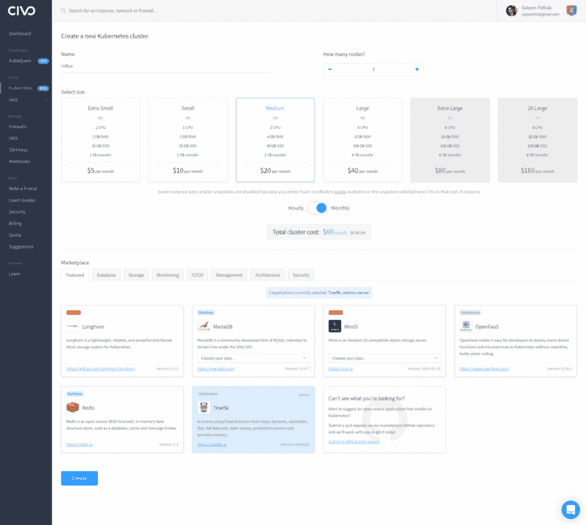
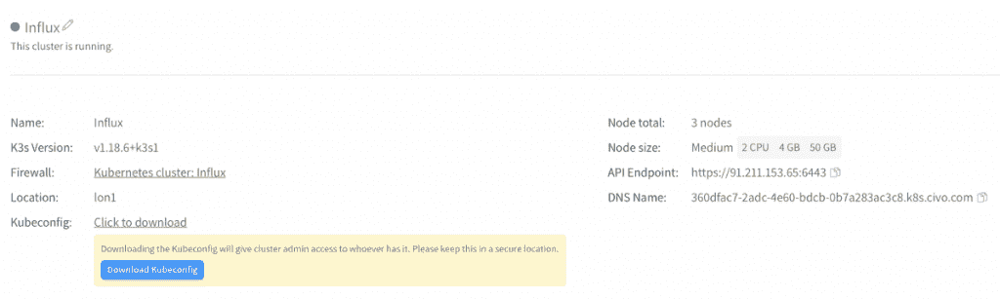
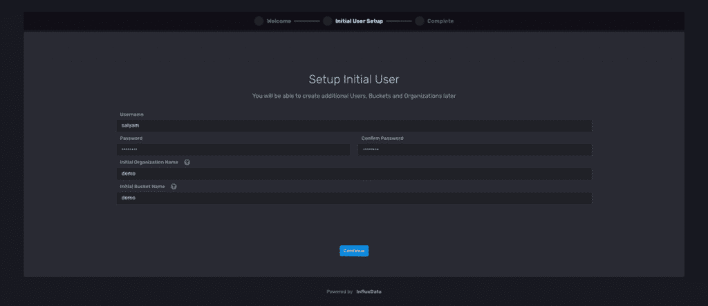
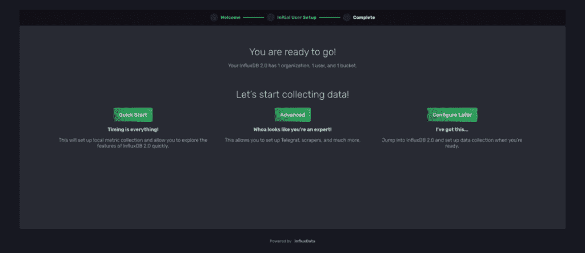
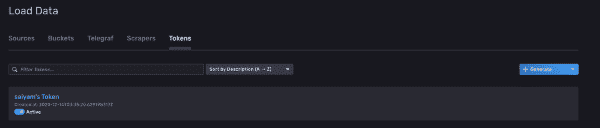
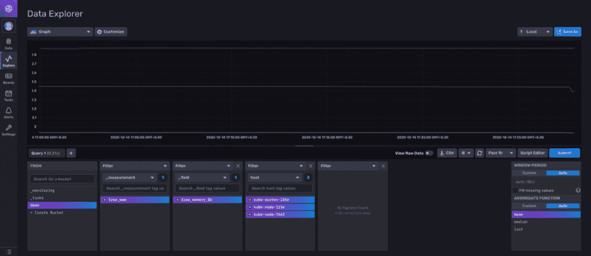

# 如何在 Kubernetes 上使用 InfluxDB 及其 Python 客户端

> 原文：<https://thenewstack.io/how-to-use-influxdb-with-its-python-client-on-kubernetes/>

[InfluxData](https://www.influxdata.com/) 赞助了这篇文章。

 [赛亚姆·帕塔克

Saiyam 是 Civo 的技术传道部主任。](https://twitter.com/SaiyamPathak) 

在本教程中，我们将讨论 InfluxDB 及其 Python 客户端。我们将在 Kubernetes 集群中部署 InfluxDB [，然后使用 InfluxDB Python 客户端向 InfluxDB 发送数据。](https://docs.influxdata.com/influxdb/v2.0/get-started/)

你会学到什么？

*   如何将 InfluxDB 部署到 Kubernetes 集群(快速入门)。
*   如何使用 InfluxDB Python 客户端？

## **先决条件**

*   你控制的一个 Kubernetes 集群。我们将利用 [Civo 的超快速托管 K3s 服务](https://www.civo.com/?ref=53e176)来快速试验这一点。如果您还没有帐户，现在就注册测试版，以利用快速部署时间和每月 70 美元的免费积分。或者，您也可以使用任何其他 Kubernetes 集群。
*   安装并设置 [kubectl](https://kubernetes.io/docs/tasks/tools/install-kubectl/) ，并下载集群的 kubeconfig 文件。



确保您可以通过运行:
连接到您的 Kubernetes 集群

```
kubectl get nodes
NAME STATUS ROLES    AGE VERSION
kube-master-18e1 Ready    master 8h    v1.18.6+k3s1
kube-node-4e70 Ready    <none> 8h    v1.18.6+k3s1
kube-node-d58a Ready    <none> 8h    v1.18.6+k3s1

```

您应该看到集群中显示的节点名称。

## **启动并运行 InfluxDB**

克隆存储库:[https://github.com/saiyam1814/pyconf.git](https://github.com/saiyam1814/pyconf.git)

```
git clone https://github.com/saiyam1814/pyconf.git
cd pyconf/deploy
# Apply the influx.yaml file
kubectl create  -f  influx.yaml
namespace/influxdb created
statefulset.apps/influxdb created
service/influxdb created

```

上面的脚本为 InfluxDB 版本 2.0.1 创建了名称空间、StatefulSet 和服务。

现在我们将创建入口，为此，我们将修改 ing.yaml 文件并输入所创建集群的 DNS 名称。您可以从仪表板获取 DNS 名称。



在 ing.yaml 的主机部分，指向流入。{DNS 名称}。

```
apiVersion:  extensions/v1beta1
kind:  Ingress
metadata:
  name:  influxdb
  namespace:  influxdb
spec:
  rules:
  -  host:  influxdb.360dfac7-2adc-4e60-bdcb-0b7a283ac3c8.k8s.civo.com
 http:
 paths:
 -  backend:
 serviceName:  influxdb
 servicePort:  8086

```

```
kubectl create  -f  ing.yml
ingress.extensions/influxdb created
kubectl get all  -n  influxdb
NAME READY STATUS    RESTARTS AGE
pod/influxdb-0 1/1 Running 0          6m45s
NAME TYPE        CLUSTER-IP        EXTERNAL-IP PORT(S)    AGE
service/influxdb ClusterIP 192.168.145.255 <none>        8086/TCP 6m45s
NAME                        READY AGE
statefulset.apps/influxdb 1/1 6m46s

kubectl get ing  -n  influxdb
'NAME CLASS    HOSTS                                                        ADDRESS PORTS AGE
influxdb <none> influxdb.360dfac7-2adc-4e60-bdcb-0b7a283ac3c8.k8s.civo.com 91.211.153.65 80      55s

```

导航到主机地址:






现在，在令牌的高级部分，选择并复制生成的令牌——因为这是通过 Python 客户端连接到 InfluxDB 所必需的。




## 后续步骤

### **从令牌中创建库本内特的秘密**

```
kubectl create secret generic influx  --from-literal=token="qWpu90WO31r02miedaP7-BXG9hmrtfBCPgncqu3PsU-PzZZ3jrg7eC9RE2yZzLurhNlk8tr_maKYE3zpk1GJ2A=="
secret/influx created

```

### **为入口主机地址创建配置映射**

```
kubectl create configmap host  --from-literal=host="influxdb.360dfac7-2adc-4e60-bdcb-0b7a283ac3c8.k8s.civo.com"
configmap/host created

```

### **从部署文件夹中创建 Daemonset】**

```
kubectl create  -f  ds.yaml
daemonset.apps/pyconf-demo created
kubectl get pods
NAME                READY STATUS    RESTARTS AGE
pyconf-demo-dq5c9 1/1 Running 0          40m
pyconf-demo-lbxww 1/1 Running 0          40m
pyconf-demo-q65ps 1/1 Running 0          86s

```

### **从 InfluxDB 界面查看**



### **了解连接并通过其 Python 客户端编写指向 InfluxDB 的点**

```
from influxdb_client import InfluxDBClient,  Point,  WritePrecision
from datetime import datetime
from influxdb_client.client.write_api import SYNCHRONOUS
import schedule
import time
import socket
import os
def influx():
 print("starting")
 org  =  "demo"
 bucket  =  "demo"
 client  =  InfluxDBClient(url="{}".format(os.environ.get('host')),  token="{}".format(os.environ.get('token')))
 meminfo  =  dict((i.split()[0].rstrip(':'),int(i.split()[1]))  for  i  in open('/proc/meminfo').readlines())
 freemem  =  meminfo['MemFree']  /  1024  /1024
 write_api  =  client.write_api(write_options=SYNCHRONOUS)
 point  =  Point("free_mem").tag("host",  socket.gethostname()).field("free_memory_Gb",  freemem  ).time(datetime.utcnow(),  WritePrecision.NS)
 write_api.write(bucket,  org,  point)
schedule.every(5).seconds.do(influx)  
while  1:
 schedule.run_pending()
 time.sleep(1)

```

*   导入 **influxdb-client** 。
*   组织:对应于需要推送数据的组织。
*   Bucket:对应于必须推送数据的存储桶。
*   客户端:通过验证主机和令牌创建的连接。
*   Freemem:以 Gb 为单位获取主机的空闲内存。
*   用于写入 InfluxDB 的 client.write_api。
*   点:将创建测量自由内存、标签主机和字段自由内存 Gb 的实际点。
*   write_api.write(bucket，org，point)用于插入到 Db 中。
*   最后一部分让它每 5 秒运行一次。

## **用例**

您可能有特定的脚本来捕获一些数据，或者进行某种程度的处理，然后创建数据，然后可以通过 Python 客户端将数据发送到 InfluxDB(对于这个特定的用例)。有许多受支持的客户端库可用于发送数据。

## **总结**

我们已经了解了如何在现有 K3s Kubernetes 集群上部署 InfluxDB。使用 Python 客户端将数据写入 InfluxDB，然后从 InfluxDB UI 查看数据。

通过 Pixabay 的特征图像。

<svg xmlns:xlink="http://www.w3.org/1999/xlink" viewBox="0 0 68 31" version="1.1"><title>Group</title> <desc>Created with Sketch.</desc></svg>