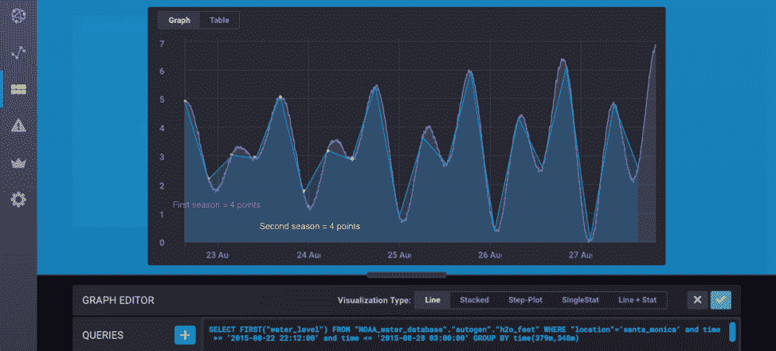

# 如何使用 InfluxDB 的 Holt-Winters 函数进行预测

> 原文：<https://thenewstack.io/how-to-use-influxdbs-holt-winters-function-for-predictions/>

[InfluxData](https://www.influxdata.com/) 赞助了这篇文章。

 [阿纳伊斯·多蒂斯-乔治乌

Anais 是 InfluxData 的开发者倡导者，热衷于通过使用数据分析、人工智能和机器学习来使数据变得美丽。她将收集到的数据进行综合研究、探索和工程设计，将其转化为具有功能、价值和美感的东西。当她不在屏幕后面时，你可以发现她在外面画画、伸展身体或追逐足球。](https://www.influxdata.com/) 

欢迎来到这个由三部分组成的博客文章系列的第三部分。要理解第三部分，我建议先读第一和第二部分。

**在 [第一部分](https://thenewstack.io/when-holt-winters-is-better-than-machine-learning/) 中，我们涵盖了:**

1.  何时使用霍尔特-温特斯
2.  单一指数平滑的工作原理
3.  单指数平滑优化的概念综述
4.  Extra:线性回归 RSS 优化的证明

**在 [第二部分](https://thenewstack.io/finding-more-hidden-gems-in-holt-winters/) 中，我们鸽入:**

1.  单指数平滑与三指数平滑/霍尔特-温特斯的关系
2.  RSS 与 RMSE(均方根误差)的关系
3.  如何使用 Nelder-Mead 方法针对霍尔特-温特斯优化 RMSE

**在第三部分，我们探索:**

1.  如何使用 InfluxDB 的内置乘法霍尔特-温特斯函数来生成对时间序列数据的预测
2.  学习资源列表

## 如何使用 InfluxDB 的内置乘法 Holt-Winters 函数生成时间序列数据的预测

出于开发者体验的考虑，我决定遵循文档中的 [霍尔特-温特斯示例](https://docs.influxdata.com/influxdb/v1.7/query_language/functions/#holt-winters) 。本例的数据集可通过以下方式下载:

`curl https://s3.amazonaws.com/noaa.water-database/NOAA_data.txt -o NOAA_data.txt`

该下载包括来自美国国家海洋和大气管理局的潮汐和海流数据。这个数据集有点过时(2015 年的)。如果你想处理最近的数据，我鼓励你使用 [合作 API](https://tidesandcurrents.noaa.gov/api/) 来检索当前数据。下载后，您可以使用以下命令将其写入 InfluxDB:

`influx -import -path=NOAA_data.txt -precision=s -database=NOAA_water_database`

我们使用这个查询来检查数据:

`SELECT "water_level" FROM "NOAA_water_database"."autogen"."h2o_feet" WHERE "location"='santa_monica' AND time >= '2015-08-17 22:12:00' AND time <= '2015-08-28 03:00:00'`

经目测，我们的数据有 348m 的偏移量(2015/08/17 20:00-2015/08/18 01:48)。从 2015 年 8 月 22 日开始，我们还会看到很强的季节性，因此我们将使用此后的数据进行预测。

`SELECT "water_level" FROM "NOAA_water_database"."autogen"."h2o_feet" WHERE "location"='santa_monica' AND time >= '2015-08-22 22:12:00' AND time <= '2015-08-28 03:00:00'`

我们还可以通过目视检查找到每个峰值之间的时间长度。

## 

## 

我们发现它大约是 3.79 亿(2015/08/25 03:18 — 2015/08/25 9:36)。

现在，我们已经准备好使用 [FIRST()](https://docs.influxdata.com/influxdb/v1.7/query_language/functions/#first) 函数来匹配原始数据的趋势，并在应用偏移后按峰值间隔时间进行分组。FIRST()函数返回与字段键关联的最早的字段值。

下一个查询的目标是用尽可能少的点表示我们的数据。如果我们有效地用几个点概括我们的数据，那么我们可以有效地使用霍尔特-温特斯。在每个季节，我们都会看到两座山，一座比一座大。每座山都有一个山峰和一个山谷。

然后，我们使用 FIRST()函数在每个波峰和波谷选择一个点。我们通过根据每个波峰和波谷之间的时间跨度进行分组来实现这一点，这样我们可以确保不会错过任何一个波峰和波谷。

`SELECT FIRST("water_level") FROM "NOAA_water_database"."autogen"."h2o_feet" WHERE "location"='santa_monica' and time >= '2015-08-22 22:12:00' and time <= '2015-08-28 03:00:00' GROUP BY time(379m,348m)`

现在我们可以清楚地看到，每个季节都有四个波峰和波谷，我们用相应的点来表示每个波峰和波谷。

我想对 FIRST()函数做最后一点评论。数据是有价值的，但多不一定好。使用像 MEAN()这样的集合而不是 FIRST()实际上会模糊我们数据的形状，并且会做出一个糟糕的、令人沮丧的预测。好了，现在我们终于准备好使用 [HOLT_WINTERS()函数了。](https://docs.influxdata.com/influxdb/v1.7/query_language/functions/#holt-winters)

如果我们想预测 10 个点，我们会写:

`SELECT HOLT_WINTERS_WITH_FIT(FIRST("water_level"),10,4) FROM "NOAA_water_database"."autogen"."h2o_feet" WHERE "location"='santa_monica' AND time >= '2015-08-22 22:12:00' AND time <= '2015-08-28 03:00:00' GROUP BY time(379m,348m)`

恭喜你！你和霍尔特·温特斯做了预测。这就是全部了。

P.S .有趣的事实:如果你设置周期= 0，那么你将 Holt-Winters 从三倍指数平滑转换为两倍指数平滑。因此，如果您的数据有趋势，但没有季节性，不要担心—您也可以使用 HOLT_WINTERS()函数来满足您的预测需求。

## 学习资源列表

我想分享我用来了解 Holt-Winters 的所有资源，以补充您的理解，并感谢作者的出色工作。谢谢你。

我希望这篇教程能帮助你开始你的预测之旅。如果您有任何问题，请发布到 [社区网站](https://community.influxdata.com/) 或发推文给我们@InfluxDB。

阿奈斯·多蒂斯-乔治乌特写。

<svg xmlns:xlink="http://www.w3.org/1999/xlink" viewBox="0 0 68 31" version="1.1"><title>Group</title> <desc>Created with Sketch.</desc></svg>