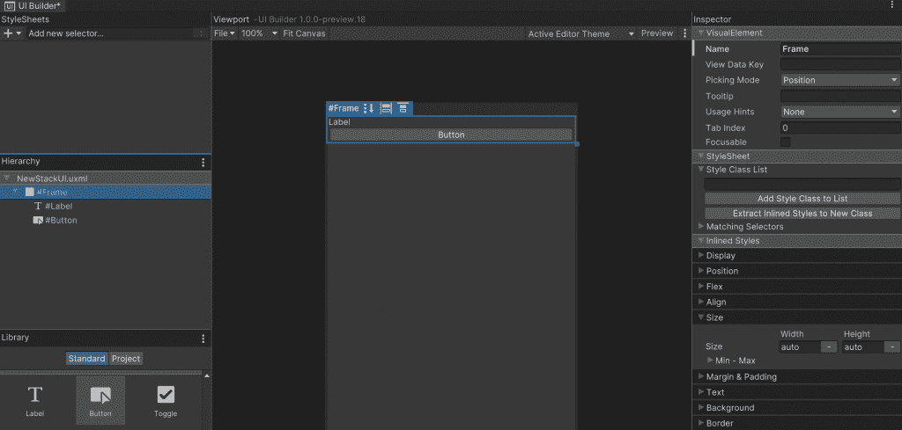

# 如何使用 UI 工具包进行 Unity 开发

> 原文：<https://thenewstack.io/how-to-use-the-ui-toolkit-to-develop-with-unity/>

Unity 的一个有趣的开发目标是创建超越游戏开发的更接近行业规范的解决方案。我的前一篇文章从一个希望以更高的表现质量进行交叉开发的应用程序开发人员的角度介绍了 Unity。或者仅仅是为了构建一个游戏，就像 Unity 通常所做的那样。

Unity Technologies 彻底改革了其 UI 层，并创建了一个更加熟悉的设置，称为 **UI 工具包**(有时仍以其旧名 UIElements) **。用它自己的话说，UI 工具包是“受标准网络技术的启发”这是相当不寻常的，因为游戏行业并不认为网络本身适合于低延迟高分辨率的任务，所以 Unity 这样做对熟悉 HTML 和 CSS 的应用程序开发人员来说是相当大的开放。这反过来又给了开发者一个实用的访问点，让他们可以访问强大的 Unity 平台。**

术语 UI 在这里特别指的是位于场景前面的层，就像你在电视上看到的一样。在场景中，这通常被解释为绘制在相机上的图形，而不是在 3D 世界中自由移动。

UI Toolkit 提供了一个布局引擎、一个 XML 样式语言(UXML)、类似 CSS 的样式表(Unity 样式表，或 USS)和一个创建 UI 的工具(UI 生成器)。这些功能为您提供了一个仍然可以通过编程方式进行交互的 UI，但是您可以在没有代码的情况下设置和调整。这使得图形设计人员和编码人员能够更加无缝地合作。

我将关注一个实际的开发过程，这样您就可以看到这个过程是多么的相似。我将从我以前使用的非常简单的项目开始，然后针对 UI 工具包对它进行修改。您可能还记得，这只是在单击按钮时改变了按钮上的文本。

首先，需要导入相对较新的 UI 工具包的包。注意:我用的是 Unity 2020.3，但是一个更新的版本可能会内置这个包。从我以前的小项目开始，我将首先允许包管理器使用项目设置中的预览包:


然后进入包管理器，点击“+”按钮并选择“从 git URL 添加包…”并输入“com.unity.ui”。

结果应该是包 **UI 构建器**和 **UI 工具包**的一个版本。


我们将只使用三个元素来重现之前的按钮和文本示例:

*   一个可视元素，实际上是一个面板或容器
*   一个标签，还有
*   一个按钮。

这一次，我们将把文本写在标签上。我们从玩视觉积木开始。首先，在我们的资产中创建一个新的 UIDocument 组件，名为 *NewStackUI.uxml:*


双击它，构建器将会打开。我已经拖动了元素，您可以在 UI Builder 屏幕的左侧层次结构窗口中看到该结构。每个元素都有名称，这就是我们以后如何以编程方式找到它们。



我没有定位任何元素，我只是定义了结构。需要记住的重要一点是，这个结构会自动保存到 UXML:

```
<ui:UXML xmlns:ui="UnityEngine.UIElements"  xmlns:uie="UnityEditor.UIElements"  xsi="[http://www.w3.org/2001/XMLSchema-instance](http://www.w3.org/2001/XMLSchema-instance)"  engine="UnityEngine.UIElements"  editor="UnityEditor.UIElements"  noNamespaceSchemaLocation="../UIElementsSchema/UIElements.xsd"  editor-extension-mode="False">  
  <ui:VisualElement name="Frame">  
    <ui:Label text="Label"  name="Label"  />  <ui:Button text="Button"  name="Button"  />  
  </ui:VisualElement>  
</ui:UXML>

```

这个类似 XML 的结构的第一行是您在任何 XML 中看到的名称空间中相同的样板自定义。但是其余部分简洁地描述了结构和名称。这个程序已经运行了，但是我们还有几件事要做。

首先，让我们将元素移动到框架内的平衡位置。这可以通过一点点的拖放来实现，但是使用检查器更系统一些。你可以看到上面的标签和它下面的按钮刚好适合可用的空间。所以我们要做一些改变:

*   用一个合适的宽高比让框架变高。
*   使按钮变窄，并放在中间。
*   在框架周围放置边框，并将标签居中。

通过在检查器中更改每个元素的值，我们可以进行调整。首先是大型机:


您可以从右侧的检查器窗口中看到，frame 元素现在将其内容居中，并使用屏幕百分比的宽度和高度。添加了红色边框和灰色背景色。

看这个按钮，我们可以看到类似的修饰性调整:


看看这个做出来的(略加编辑)UXML:

```
<ui:UXML xmlns:ui="UnityEngine.UIElements"  xmlns:uie="UnityEditor.UIElements"  xsi="http://www.w3.org/2001/XMLSchema-instance"  engine="UnityEngine.UIElements"  editor="UnityEditor.UIElements">  
  <ui:VisualElement name="Frame"  style="width: 50%; height: 20%; align-items: center; justify-content: flex-start; background-color: rgb(156, 156, 139); margin: 10px; padding: 10px; position: absolute; top: 200px; left: 200px; border-width: 2px; border-color: rgb(221, 47, 47);">  
    <ui:Label text="Label"  name="Label"  style="width: 80%; bottom: 50px; position: absolute; font-size: 20px; -unity-text-align: upper-center;"  />  
    <ui:Button text="Button"  name="Button"  style="bottom: 5px; position: absolute; width: 30%; height: 20%;"  />  
  </ui:VisualElement>  
</ui:UXML>

```

接下来，我们将上述内容与我们的场景联系起来。我们向层次结构中添加一个新的 UIDocument 游戏对象，并选择 *NewStackUI.uxml* 作为 UIDocument 组件中的源资产:


构建和运行这个应用程序除了显示框架和允许我们按下按钮之外没做什么——当然目前还没做什么。

所以我们需要写一些代码来控制按钮。我们现有的 *ButtonHandler.cs* 代码只是将文本放在一个组件中，并依靠 Unity 为我们连接按钮。这次我们将使用代码来做同样的工作:

```
using UnityEngine;
using UnityEngine.UIElements;

public class ButtonHandler  :  MonoBehavior
{
    private Label label;
    private VisualElement frame;
    private Button button;
    public string NewText;

    void OnEnable()
    {
        var uiDocument  =  GetComponent<UIDocument>();
        var rootVisualElement  =  uiDocument.rootVisualElement;

        frame  =  rootVisualElement.Q<VisualElement>("Frame");
        label  =  frame.Q<Label>("Label");
        button  =  frame.Q<Button>("Button");

        button.RegisterCallback<ClickEvent>(ev  =>  SetText());
    }

    public void SetText()
    {
        label.text  =  NewText;
    }
}

```

这个设计比我们之前做的要透明一点。当组件第一次被调用时，它会找到它的姐妹 UIDocument 组件。在其中，它找到了被设置为根元素的 *NewStackUI.uxml* 。然后，我们按名称查询视觉元素。这非常类似于 JavaScript 开发人员会做的事情。

最后，我们在 button 对象上设置了一个回调，它在一个 click 事件上调用 *SetText()* 。然后，我们只需将我们的新文本复制到标签中。

最后，我们将代码作为脚本组件添加到 UIDocument GameObject，这将确保它获得唤醒*one enable*调用:


现在按钮有反应了。注意，我们在这里可以选择定义“NewText”字符串，因为 *MonoBehavior* 子类中的一个公共变量暴露给了 Unity 前端。

所以总而言之:

*   UI 工具包为 Unity 平台提供了一个新的 UI 层和构建工具。
*   它将 UI 视为 XML 类型文档中的一堆可视元素。
*   对于任何 JavaScript 开发人员来说，这些方法都应该是可识别的。
*   为了更进一步，您可以定义一个样式表，看看它与 CSS 有多相似。


<svg xmlns:xlink="http://www.w3.org/1999/xlink" viewBox="0 0 68 31" version="1.1"><title>Group</title> <desc>Created with Sketch.</desc></svg>