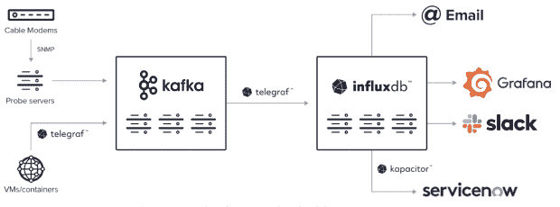

# 如何使用带时间戳的数据来减少网络停机时间

> 原文：<https://thenewstack.io/how-to-use-time-stamped-data-to-reduce-network-downtime/>

近年来，越来越多的法规和新兴技术迫使电信公司快速发展。这些组织的工程师和现场可靠性工程(SRE)团队必须使用技术来提高性能、可靠性和服务正常运行时间。了解 WideOpenWest [如何使用时序平台](https://www.influxdata.com/customer/wideopenwest/?utm_source=vendor&utm_medium=referral&utm_campaign=2023-01_spnsr-ctn_cs-wow_tns)来监控其整个服务交付网络

## **电信业趋势**

电信公司正面临着[挑战](https://www.influxdata.com/blog/how-time-series-data-empowers-telcos-stay-competitive/?utm_source=vendor&utm_medium=referral&utm_campaign=2023-01_spnsr-ctn_cs-wow_tns)，这些挑战因公司所处的生命周期阶段而异。在整个行业中，企业必须在维护传统系统的同时实现基础设施的现代化。与此同时，地方和联邦层面的新法规增加了行业内的竞争，新业务挑战了当前行业领导者设定的现状。

近年来，在家工作的人数激增，需要更可靠的互联网连接来满足他们不断增长的网络带宽需求。智能手机和其他设备的日益普及意味着需要网络连接的设备越来越多，而网络速度却丝毫没有降低。延迟问题或不良的正常运行时间会导致客户不满，进而成为逃跑的风险。除此之外，更频繁的安全漏洞要求所有企业监控其网络，以更快地检测潜在的漏洞。

## **网络现代化的挑战**

WideOpenWest 于 1996 年在科罗拉多州丹佛市成立，在美国多个市场提供互联网、视频和语音服务。多年来，WOW 收购了各种电信组织，随着网络的扩展，它需要一个更好的[网络监控](https://www.influxdata.com/solutions/network-monitoring/?utm_source=vendor&utm_medium=referral&utm_campaign=2023-01_spnsr-ctn_cs-wow_tns)工具来应对越来越多的挑战。例如，WOW 工程师希望能够分析单个客户的电缆调制解调器，确定节点的健康状况，并了解网络的整体状态。然而，几个障碍阻止了该公司这样做。WideOpenWest 已经在内部使用了多个监控平台，而购买用于监控单个节点的硬件的成本过于昂贵。它已经有了一个从特定调制解调器收集遥测数据的基本流程，但没有一个单一的来源将所有事情联系在一起。

## **利用时序数据降低网络延迟**

几年前，WideOpenWest 决定更换其遗留的时间序列数据库，在考虑了其他解决方案后，它选择了 InfluxDB，即[专门构建的时间序列数据库](https://www.influxdata.com/time-series-database/?utm_source=vendor&utm_medium=referral&utm_campaign=2023-01_spnsr-ctn_cs-wow_tns)。它现在有一个 InfluxDB Enterprise 的四节点集群用于生产，还有一个在 OpenStack 上运行的两节点集群用于测试。该团队使用 Ansible 来自动化集群设置和安装。

使用 InfluxDB 的主要动机是提高整个网络的整体可观察性，并实现更好的警报。WOW 的工程师尽可能使用 Telegraf 收集数据，因为它很容易与所有其他系统集成。一些传统硬件要求他们使用 Filebeats、定制脚本和供应商 API。

他们在数据收集过程中广泛使用[简单网络管理协议(SNMP](https://www.influxdata.com/integration/snmp/?utm_source=vendor&utm_medium=referral&utm_campaign=2023-01_spnsr-ctn_cs-wow_tns) )轮询和陷阱，因为这仍然是一个行业标准，尽管它已经过时了。具体来说，他们使用 SNMP 从电缆调制解调器收集指标，使用 Telegraf 从他们的虚拟机和容器收集带时间戳的数据。使用 InfluxDB 为团队提供了必要的灵活性，以解决供应商管理系统的限制，他们现在可以从所有需要的来源收集数据。

接下来，他们将数据传输到 Kafka，以便更好地控制数据输入和输出。Kafka 还允许他们在必要时轻松地消费数据或将数据移动到不同的区域或系统。从 Kafka 集群，他们使用 Telegraf 向其 InfluxDB 企业集群发送数据。

WOW 的团队汇总了光纤到节点网络的各种指标，例如:

*   超过 650，000 个电缆调制解调器在五分钟轮询周期内的使用情况和正常运行时间等遥测指标。
*   上游和下游所有电视频道的状态，包括音频和视频信号强度和中断。
*   平均信号、端口和功率水平。
*   信噪比(SNR) —用于确保最高水平的无线功能。
*   调制误差比(MER) —用于了解信号质量的另一种测量方法，它考虑了传输信道上发生的干扰量。

WOW 团队使用所有这些数据从实时分析中获得洞察力，以创建可视化效果，并触发警报和故障排除流程。一旦数据进入 InfluxDB，他们就使用 Grafana 进行所有的可视化。他们还利用 InfluxDB 的警报框架通过 ServiceNow、Slack 和电子邮件发送警报。采用 InfluxDB 允许 WOW 团队实现基础设施即代码(IaC)系统，因此他们可以编写配置文件来简化流程，而不是花费时间手动管理他们的基础设施。

图 1: WideOpenWest 的 InfluxDB 实现

WideOpenWest 的下一个大项目是通过自动代码升级实现完整的 CI/CD 管道。借此，他们希望改进自动化测试。WOW 还希望简化整个组织的所有监控，并提高基础设施监控的级别。

<svg xmlns:xlink="http://www.w3.org/1999/xlink" viewBox="0 0 68 31" version="1.1"><title>Group</title> <desc>Created with Sketch.</desc></svg>