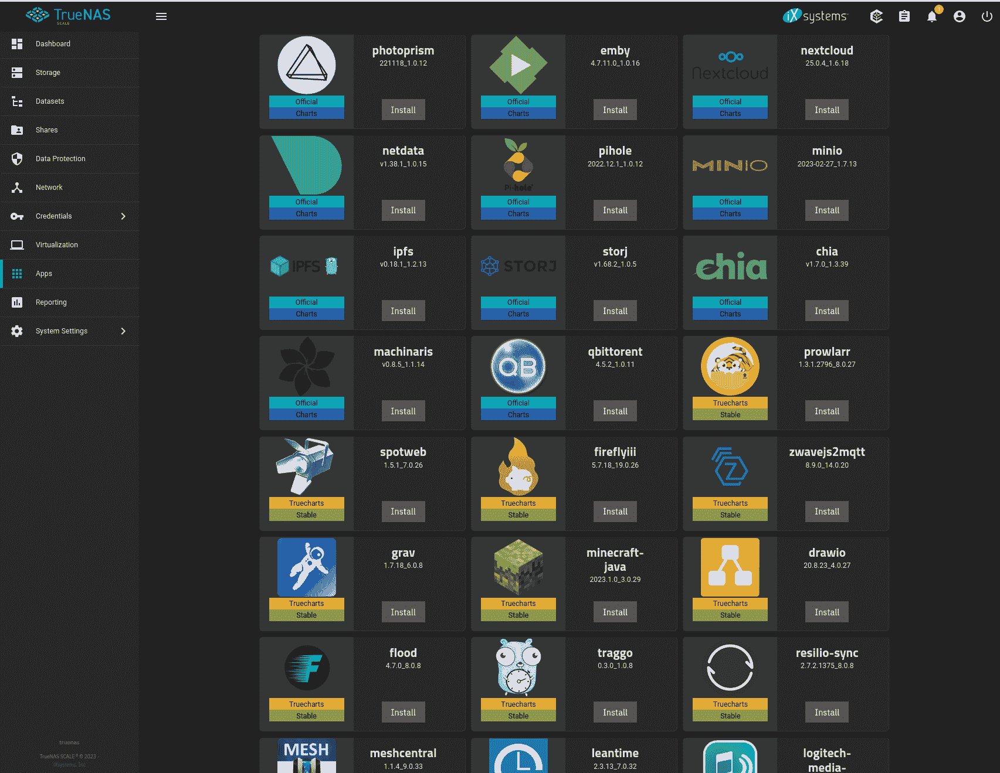

# 如何在 TrueNAS 中使用容器

> 原文：<https://thenewstack.io/containers/how-to-work-with-containers-in-truenas/>

TrueNAS 是一款[网络附加存储软件](https://thenewstack.io/truenas-scale-network-attached-storage-meets-high-demand/)，您可以将其部署到您的局域网或第三方云主机。但是不要被名称中的“NAS”部分所迷惑，因为该平台不仅仅可以做存储。事实上，还有许多其他功能可以添加到 [TrueNAS](https://www.truenas.com/truenas-scale/) 中或被其使用，比如虚拟机甚至容器。

没错，你可以在 TrueNAS 中使用 Docker 映像，并部署诸如 Colabora、 [Nextcloud](https://thenewstack.io/story-behind-nextcloud/) 等应用。更好的是，这比你想象的要容易得多。

我将向您介绍让 TrueNAS 准备好使用 Docker 图像所需的步骤。

## 你需要什么

要使用 Docker 图像和其他应用程序，您需要启动并运行 TrueNAS。您可以使用 VirtualBox 将平台部署为虚拟机，只要您在虚拟机设置的系统部分的处理器选项卡中启用了嵌套的 VT-x/ADM-V 支持。

如果不启用该功能，TrueNAS 将无法使用虚拟机或 Docker 映像。您还需要向 VirtualBox 虚拟机添加至少两个额外的驱动器，以便创建供 TrueNAS 使用的池。

## 向 VirtualBox 添加新驱动器

这实际上比您想象的要简单，因为您不必费心格式化添加的驱动器(TrueNAS 会替您处理)。

要向 VirtualBox 虚拟机添加新驱动器，请确保虚拟机已停止(而不是暂停)。从 VirtualBox 左侧边栏中选择虚拟机，然后单击设置。在设置窗口的存储部分，选择控制器:SATA，点击最右边的绿色+ ( **图 1** )。

图 1:我的虚拟机仍在运行，所以我不能添加新的驱动器。

将会打开驱动器向导。确保创建固定大小的驱动器，否则可能会导致池出现问题(或者 TrueNAS 将无法成功创建池)。

您必须向虚拟机添加两个新驱动器，以便 TrueNAS 创建池，因此重新创建相同的步骤。一旦你这样做了，关闭设置并启动虚拟机。

## 添加存储池

登录到 TrueNAS 后，单击 Storage，并在出现提示时单击 Create Pool ( **图 2** )。

图 2:存储仪表板需要一个池。

在出现的窗口(**图 3** )中，单击建议布局，您新添加的驱动器将显示在右侧窗格中。确保为该池命名，然后单击创建。

图 3:创建一个新的 TrueNAS 池。

应该可以很快创建池。一旦完成，你就可以继续前进了。

## 添加新目录

默认情况下，TrueNAS 有许多预定义的应用程序要安装。要安装不同的应用程序，您必须添加一个新的目录，其中将包括可以安装的可用的[容器化应用程序](https://thenewstack.io/containers/)的列表。为此，单击应用程序，然后单击管理目录选项卡(**图 4** )。

图 TrueNAS 的应用程序窗口中的管理目录选项卡。

点击 Add Catalog，在弹出的结果中(**图 5** ，添加如下内容:

*   目录名:truecharts
*   存储处:https://github.com/truecharts/catalog

图 5:向 TrueNAS 添加一个新目录，以便安装更多的应用程序。

单击保存保存信息。由于此目录中有许多应用，因此完成此过程需要一些时间(5-20 分钟，具体取决于您的网络速度)。当 pull 完成时，再次单击 Apps 选项卡，您应该会看到大量可以部署的容器化应用程序(**图 6** )。

图 6:现在有更多的应用程序可供安装。

找到您想要添加的应用程序，然后点按相关的“安装”按钮。这些应用程序都是容器化的，所以当您单击 Install 时，您会发现一些配置选项(**图 7** )非常熟悉(如果您以前使用过容器)。

图 7:用 TrueNAS 部署 Focalboard 应用程序。

完成整个配置后，滚动到底部并单击 Save。容器将根据图表和您的配置进行部署。部署完成后，您可以访问该应用程序。

您可以通过单击 Installed Applications 来检查部署的状态，此时您应该会看到应用程序被列为活动状态(**图 8** )。

图 8: Focalboard 成功部署。

点按“打开”,将会打开一个新标签，显示您已安装的应用程序。在 Focalboard 的情况下，你将被带到一个登录屏幕，在那里你可以点击注册一个新帐户。

这就是使用 TrueNAS 部署容器化应用程序的方式。有了这个易于使用的系统，您可以使用 TrueNAS 作为发射台，将任意数量的应用程序部署到您的 LAN，包括项目管理工具、云服务、开发工具等。与此同时，您还有一个出色的网络连接存储解决方案可供您和您的组织使用。

<svg xmlns:xlink="http://www.w3.org/1999/xlink" viewBox="0 0 68 31" version="1.1"><title>Group</title> <desc>Created with Sketch.</desc></svg>