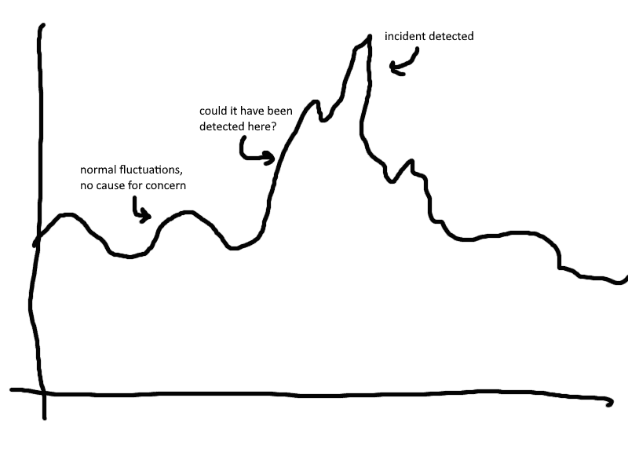
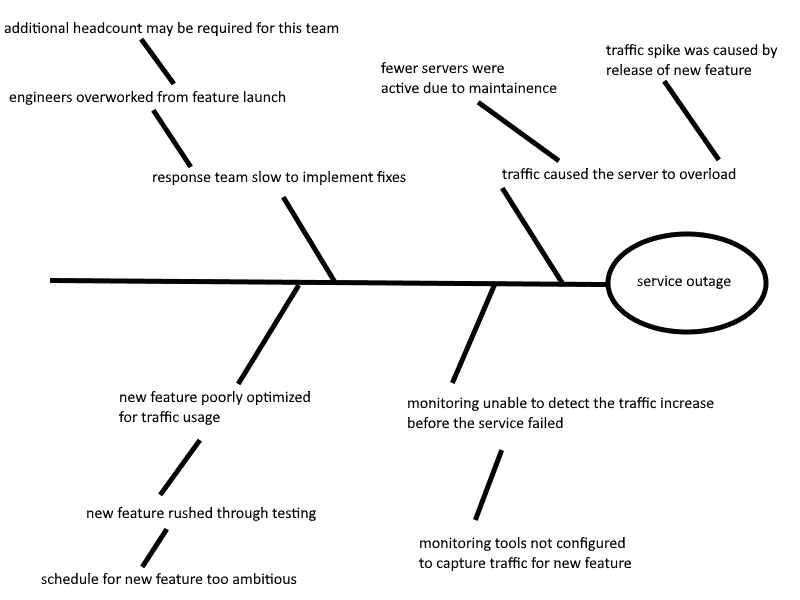

# 如何写有意义的回顾

> 原文：<https://thenewstack.io/how-to-write-meaningful-retrospectives/>

现场可靠性工程(SRE)实践中事故管理的基础之一是事故回顾。它记录了从事件中吸取的所有教训，并作为后续行动的清单。如果我们退后一步，回顾会有七个主要元素。如果处理得当，这些元素可以帮助你更好地理解一个事件，它揭示了整个系统的什么，以及如何建立持久的解决方案。在本文中，我们将分解如何提升这七个元素，以产生更有意义的回顾。

## 1.给利益相关者的信息

 [艾米莉·阿诺特

Emily 是 Blameless 的内容作者，她为学习如何实现站点可靠性工程的团队开发教育资源。她还在 SREcon 和 Conf42 会议上发表演讲，主题是“无辜作战室中的大象:责任”。](https://www.blameless.com/) 

事故回顾可能是事故后您与客户和其他利益相关方沟通的核心。我们谈论了很多，当回顾涉及到所有相关涉众的输入和反馈时，它是如何发挥最大作用的。这并不意味着不经过深思熟虑就将大量的人挤在一个会议中，或者向一大群人发送一份冗长的 PDF 文件。

最好的例子是区分客户涉众和内部团队涉众。应该让客户了解情况，并向他们保证解决方案即将出台或已经出台，但他们可能不需要知道或不应该知道细节。

[向利益相关者传达回顾](https://www.blameless.com/incident-response/how-to-communicate-incident-retrospectives-to-stakeholders)需要理解他们如何使用你的服务。在最重要的背景下描述事件。不过，也不要拐弯抹角。你不想给人留下隐藏或淡化影响的印象。简单的事实陈述，如“如果你使用服务 x 做 y，你失去了 12 小时的能力”足以传达你的理解。

一旦你建立了影响力，开始重新获得信任。向利益相关者保证相关的事情没有出错。事件发生后，利益相关者可能会担心还有其他问题没有被报告。明确声明没有任何数据丢失、私人信息公开或任何其他相关问题。

也与利益相关者分享你的行动计划。他们可能不了解您的解决方案的细节，但是您可以解释您的计划将会产生的影响。直接传达你的自信。同样，简单的陈述非常有效:“中断是由服务器带宽不足引起的。一个新的进程将自动扩展带宽以响应增加的负载。这将缓解未来类似这样的事件。”这是科学研究的语言，从散文中去掉了人称代词。这是保持陈述简单、避免指责、保持事实和理想数据驱动的好方法。

通过这种方式向利益相关者传达你的信息，他们会明白他们的痛苦已经被理解，并得到了系统和持久的解决。

## 2.监控环境

在更多的技术回顾中，通常是为了内部开发团队的研究，包括事件发生时系统捕获的任何监控数据是有用的。事故发生在交通繁忙的时候吗？这是否也导致了系统其他领域的减速？这一信息可以带来有益的启示。

你可以用这些数据走得更远。包括这些指标的长期基线测量，以提供一个标准。您可能会注意到，一些指标遵循一种模式，这种模式说明了事件期间的异常情况。不要把巧合误认为因果关系。

还要注意您的监控数据不足的地方。您能想到任何指标吗？如果您捕捉到了这些指标，可能会让您更早地了解事件。回顾的主要目标之一是推动系统的变化。寻找这些机会来改善你的监控系统。

## 3.沟通时间表

希望你有一个工具，可以很容易地从 Slack、MS 团队或任何你用来聊天的东西中建立一个沟通时间表。重要的是要知道采取了什么步骤，花了多长时间，何时取得突破。包括关于人们扮演什么角色以及他们被分配了什么任务的信息。

了解沟通不畅的地方也很重要。人们做了多余的工作吗？一些任务或步骤是否被遗忘或跳过？对期望有误解吗？无可指责地注意这些问题。如果有人忽略了什么，这不是他的错；他们在紧张的情况下尽了最大努力。这就是为什么你需要政策和程序来弥补差距。调查这些问题，以制定防止这些问题的政策。

不可避免地，你的作战室讨论将有一些喋喋不休。你可能想做一个“全业务”回顾，去掉任何不相关的东西，这可能是外部利益相关者看到的回顾的正确步骤。然而，对于内部回顾，这种额外的表达是有价值的。很高兴看到人们在事件中的感受，当他们感到压力和解脱时。它可以开启对事件响应中人的一面的思考，并使回顾会变得更有趣。

## 4.成因

回顾展的很大一部分是揭示事件发生的原因。不确定这一点，你就不能做出系统性的改变，为下一次变得更强。做出有意义和持久的改变的关键是深入挖掘。像[五个为什么](https://en.wikipedia.org/wiki/Five_whys)这样的技巧可以帮助你找到原因背后的原因。用像[石川图](https://en.wikipedia.org/wiki/Ishikawa_diagram)这样的工具来说明可以让它更容易理解。

挖掘这些因素时，要整体考虑。不要只考虑技术问题，要深入到培训、人数、压力、工程师生活中的个人因素——任何可能影响人们在你的系统中工作的方式的问题。在反思重大事故时，有必要让管理层和其他团队参与这些讨论。

当然，所有这些调查都应该无可指责。假设每个人的善意和良好意图。如果犯了错误，调查哪些信息或安全措施可以防止它。满足于惩罚一个人会阻止你做出重大的系统性改进。

## 5.技术分析

这部分主要是为你的工程团队准备的。如果这里有非工程师应该理解的因素，请确保在回顾报告的其他地方提供该信息及其影响。在这里，您应该足够详细，以便未来的工程师在解决未来类似事件时可以获得有用的信息。

正如您对监控数据所做的那样，您应该包括关于代码应该如何工作以及它通常如何工作的信息。这个上下文很重要，因为当有人审查代码时，代码的预期功能可能已经改变了。您还应该讨论未来的开发预计会如何影响生产中的代码。了解代码在生产环境中的预期运行方式，可以让您敏锐地意识到事件何时发生。

## 6.后续行动

这是回顾展最重要的部分之一。你对事件发生原因的所有了解应该转化为行动。想办法改变导致事件的因素。回顾可以作为跟踪这些项目的中心。当你回顾回顾时，检查并确保他们正在进展。

后续行动不仅仅要解决事件的直接原因。这也是一个改善您的事件响应策略、您的事件影响测量工具(如 [SLOs](https://www.blameless.com/sre/service-level-objectives) )、您的监控设置甚至您的追溯标准的机会。解决问题时，你永远不能太全面。

为了激励人们去完成这些后续任务，包括一些背景。总结为什么在事件发生后选择每个行动。还要讨论它对防止未来事故的影响。没有人愿意花时间一遍又一遍地应对相同或相似的事件。这不仅对团队来说是毁灭性的，会很快导致倦怠，而且对业务也没有好处。你应该包括足够的信息，这样人们不用重读整个回顾就能理解它的重要性。

## 7.叙述

包括对事件的叙述性总结经常被忽视。它不会包含任何新信息，但仍然有用。所有这些信息可能会让人不知所措，所以使用回顾的这一部分作为一种方式，使事件变得可接近，以便将来研究。从一个故事的角度考虑一下。你从描述事物的本来面目开始。然后你介绍这个问题，以及它是如何破坏规范的。回顾受影响客户以及负责解决问题的团队的经历。你报道他们尝试了什么，什么有效，他们学到了什么。

在这一部分，你应该把重点放在影响上，而不是细节。事件有多严重，是什么造成的？以后研究事件的时候，很多细节会和现在的制度无关。然而，理解人们在事情变得非常糟糕时的反应将永远是一个有用的教训。

回顾在记录事件及其响应的细节方面发挥着巨大的作用。不仅如此，一次有意义的回顾会有能力推动变革。如果你觉得有挑战性，把事情分成循序渐进的步骤。不要试图在一夜之间实施彻底的改变，慢慢来，一点一点地完成它。

<svg xmlns:xlink="http://www.w3.org/1999/xlink" viewBox="0 0 68 31" version="1.1"><title>Group</title> <desc>Created with Sketch.</desc></svg>