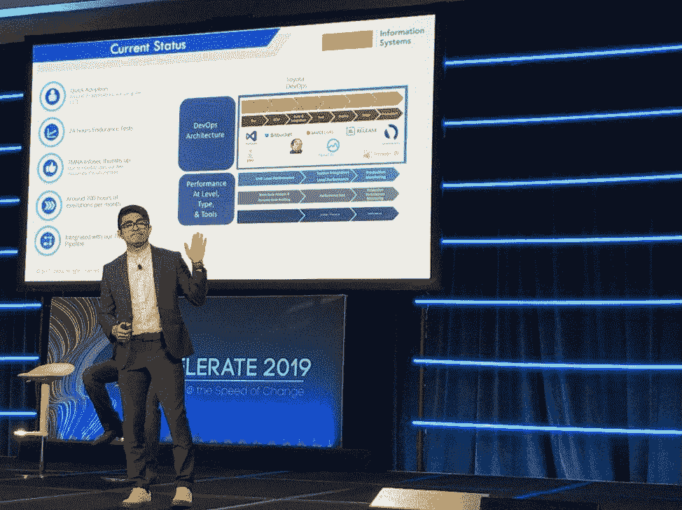

# 丰田如何将敏捷负载测试推向云端

> 原文：<https://thenewstack.io/how-toyota-drove-agile-load-testing-to-the-cloud/>

Tricentis 赞助了这篇文章。

普锐斯和敏捷的、基于云的负载测试有什么共同点？两者都证明了丰田对创新和现代化的持续承诺。

丰田汽车北美公司近日在[Accelerate San Francisco 2019](http://accelerate.tricentis.com/)与 [Tricentis Flood](https://flood.io/) 和 [AWS](https://flood.io/aws-load-testing/) 分享了其云负载测试之旅:

来自丰田公司的 Neeraj Tripathi 和 Hector Martinez 发表了主题演讲，这是大会上参与人数最多、评论最多的会议之一。

作为一个玩笑或总结，这里有一些关键点…

### **丰田为什么转向云负载测试？**

 [凯文·邓恩

Kevin Dunne 是 Tricentis Flood 的总经理，确保他的团队继续致力于创新，并为创建可扩展的软件提供工具。由于对软件开发和测试的新兴趋势有浓厚的兴趣，Kevin 致力于与这一领域的思想领袖合作。此前，Kevin 在德勤工作，负责管理大型政府和财富 500 强企业的测试，交付企业资源规划(ERP)实施和定制软件开发。作为 QASymphony 的首批员工之一，Kevin 了解了该业务的许多方面，包括销售、客户支持、市场营销和产品管理。Kevin 拥有范德比尔特大学的学士学位。](https://www.linkedin.com/in/kevindunneqa) 

丰田致力于创新，这种创新不仅体现在汽车上，还体现在交付产品的所有方式上。这包括在开发最佳实践方面保持领先地位的愿望，以及对软件开发方式不断改进的驱动力。促使丰田用更现代的基于云的方法取代其传统负载测试工具的主要因素包括:

*   **希望将测试向左转移:**越来越多的组织正在转向 [将负载测试向左转移](https://go.forrester.com/blogs/its-time-for-shift-left-performance-testing/) ，要求在开发周期的早期进行更多的负载测试，以便在更便宜、更容易修复的时候发现性能退化。
*   **内部资源的复杂维护:**管理内部负载生成器变得成本高昂且耗时。此外，仅限于在您拥有的物理服务器上运行测试会限制并行负载测试的数量，这可能是迁移到敏捷和开发运维环境时的一个主要瓶颈。
*   **以前的性能测试工具不够灵活，无法满足敏捷和 DevOps 的需求:**封闭源代码的专有脚本模型没有被开发人员很好地采用，他们无法贡献脚本来负载测试他们在每个 sprint 中添加的新功能。
*   **没有早期测试的解决方案:**测试总是发生在开发周期的后期，在需要将代码投入生产之前，通常只留下很少的时间来解决这些问题。

### **丰田在云负载测试产品中的关键标准是什么？**

在评估未来云负载测试平台的潜在解决方案时，丰田有多种选择。在评估市场上的各种工具时，其选择归结为几个关键标准:

*   **脚本**:能够支持常见的开源工具，如 [JMeter](http://jmeter.apache.org/) ，并与该工具紧密集成。
*   **管理:**在像丰田这样的企业中，对各种各样的团队进行测试时，控制各种团队、项目、云资源和所需集成的能力。
*   **DevOps 集成:**一个记录良好的 [API](https://docs.flood.io/) ，用于将负载测试集成到 CI/CD 管道中，以进行持续的负载测试。
*   **执行:**在您自己的 [AWS 或 Azure 帐户中执行加载的能力，](https://flood.io/blog/make-cloud-load-testing-secure/) 利用使用 VPC 和其他安全控制在防火墙环境后进行测试的能力。
*   **报告:**能够轻松报告测试执行情况，比较历史结果，并快速深入任何主要问题。
*   **定制:**能够扩展和定制工具，以适应丰田特定的 CI/CD 生态系统。

最后，丰田汽车北美公司评估了许多潜在的云负载测试解决方案，但最终选择了 [Flood](https://flood.io/) ，因为它在关键标准上得分最高。

### **到目前为止，丰田通过云负载测试看到了哪些好处？**

自从实施这种新的负载测试方法以来，Toyota 已经在其组织的软件交付过程中看到了巨大的好处。具体来说，采用这种新方法的主要好处包括:

*   **快速采用:**大约有 40 个独立的团队已经采用了这个基于云的负载测试解决方案，它被命名为敏捷负载测试平台(ALTP)。
*   **频繁执行:**团队每个月已经测试了 700 个小时，一些最长的测试运行了 24 个小时。
*   **集成到 CI/CD 管道中:**通过使用 Flood API，团队已经能够紧密地集成到他们的 CI/CD 管道中，并在每个构建中触发负载测试。
*   **安全团队批准:**通过使用自己的 AWS 帐户，丰田可以在公司安全部门的支持下安全地访问公共和私有托管的环境。

我们期待看到丰田在未来进一步采用这种解决方案，因为它预计将有近 100 个团队采用这种新方法。随着我们在 Flood 中增加了新的团队管理功能，丰田将能够很好地控制和管理这个平台的大量新用户。

### **如何搭建自己的云负载测试平台？**

有兴趣尝试构建自己的解决方案(如丰田的解决方案)的团队可以从这里获得各种所需组件的下载和试用版:

如果你有任何关于如何开始云负载测试的问题，请不要犹豫 [联系我们](https://flood.io/contact-flood/) —我们总是很乐意帮助你开始。

<svg xmlns:xlink="http://www.w3.org/1999/xlink" viewBox="0 0 68 31" version="1.1"><title>Group</title> <desc>Created with Sketch.</desc></svg>